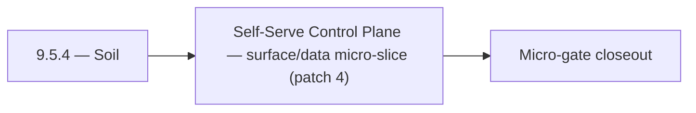

# 9.5.4 — Soil

- **Era:** `9.x` ecosystem integrations — hub [`versions.md`](../versions.md) · minors start at [`9.0 — Ecosystem Foundation`](9.0%20%E2%80%94%20Ecosystem%20Foundation.md)
- **Minor:** [9.5 — Self-Serve Control Plane](./9.5 — Self-Serve Control Plane.md)
- **Codename:** Soil
- **Status:** ✅ Completed
## Focus
Self-Serve Control Plane — surface/data micro-slice (patch 4)

## Flowchart

## Micro-gate

| Track | Gate question | Answer / Evidence (fill at patch closeout) |
| --- | --- | --- |
| **Contract** | Connector lifecycle, entitlement model — `docs/backend/apis/` + integration matrices updated? | Document at patch closeout. |
| **Service** | Multi-tenant enforcement, connector adapters, webhook delivery — parity + smoke documented? | Document smoke paths. |
| **Surface** | Integrations UI, marketplace/admin, self-serve flows — delta? | Document UX delta or N/A. |
| **Frontend** | `docs/frontend/` hooks, partner surfaces, extension/email integrations touched? | Self-serve control plane — integrations UX, workspace, onboarding. Document at closeout. |
| **Data** | Tenant lineage, `connector_id`, entitlement tables — `docs/backend/database/`? | Document lineage or N/A. |
| **Ops** | SLA runbooks, partner onboarding, `connectors-commercial.md` / integration RC evidence — delta? | Document ops delta or N/A. |

## Tasks
### Surface
- 📌 Planned: **[appointment360]** — refine duplicate task (was: ✅ completed: 📌 planned: **api**: shape v9.5 surface outcomes…) | patch `9.5.4` band `4` | reason: specialize this file vs sibling patches; see docs/codebases/appointment360-codebase-analysis.md
- 📌 Planned: **[appointment360]** — refine duplicate task (was: ✅ completed: 📌 planned: **sync**: shape v9.5 surface outcome…) | patch `9.5.4` band `4` | reason: specialize this file vs sibling patches; see docs/codebases/appointment360-codebase-analysis.md
- 📌 Planned: **[appointment360]** — refine duplicate task (was: ✅ completed: 📌 planned: **emailapis**: shape v9.5 surface ou…) | patch `9.5.4` band `4` | reason: specialize this file vs sibling patches; see docs/codebases/appointment360-codebase-analysis.md
- 📌 Planned: **[appointment360]** — refine duplicate task (was: ✅ completed: `docs/frontend/readme.md`) | patch `9.5.4` band `4` | reason: specialize this file vs sibling patches; see docs/codebases/appointment360-codebase-analysis.md

### Data
- 📌 Planned: **[appointment360]** — refine duplicate task (was: ✅ completed: 📌 planned: **api**: anchor v9.5 data outcomes f…) | patch `9.5.4` band `4` | reason: specialize this file vs sibling patches; see docs/codebases/appointment360-codebase-analysis.md
- 📌 Planned: **[appointment360]** — refine duplicate task (was: ✅ completed: 📌 planned: **sync**: anchor v9.5 data outcomes …) | patch `9.5.4` band `4` | reason: specialize this file vs sibling patches; see docs/codebases/appointment360-codebase-analysis.md
- 📌 Planned: **[appointment360]** — refine duplicate task (was: ✅ completed: 📌 planned: **emailapis**: anchor v9.5 data outc…) | patch `9.5.4` band `4` | reason: specialize this file vs sibling patches; see docs/codebases/appointment360-codebase-analysis.md
- 📌 Planned: **[appointment360]** — refine duplicate task (was: ✅ completed: 📌 planned: persist connector lineage fields: `t…) | patch `9.5.4` band `4` | reason: specialize this file vs sibling patches; see docs/codebases/appointment360-codebase-analysis.md

### Contract

- ✅ Completed: 📌 Planned: **[appointment360]** — Diff and document schema for operations like ConnectraClient, LAMBDA_AI_API_URL, LAMBDA_CONNECTRA_API_URL; align with roadmap | area: `backend-api` | files: `docs/backend/apis/*.md`, `contact360.io/api/app/graphql/schema.py` | reason: Keep GraphQL/REST contracts aligned for era 9.4 patch 9.5.4

### Service

- 📌 Planned: **[appointment360]** — refine duplicate task (was: ✅ completed: 📌 planned: **[appointment360]** — service slice…) | patch `9.5.4` band `4` | reason: specialize this file vs sibling patches; see docs/codebases/appointment360-codebase-analysis.md

### Ops

- ✅ Completed: 📌 Planned: **[platform]** — Record smoke evidence, rollback, and alerts (patch band 4: surface/data) | area: `ops` | files: `docs/commands/`, `.github/workflows/` | reason: Smoke, rollback, and observability for patch 9.5.4

## Service task slices
> Merged from era `9.x` ecosystem productization task packs (P0→`.0`–`.2`, P1→`.3`–`.6`, Ops→`.7`–`.9`).

### Connectra
- Expose tenant quota and connector health signals to integrations/admin surfaces in:
- `docs/frontend/README.md`
- `docs/frontend/components.md`
- `docs/frontend/hooks-services-contexts.md`
- Define user-facing messaging for quota blocked / degraded connector outcomes.
- Add support-facing reconciliation view requirements for created-vs-updated entity counts.
- Store tenant usage aggregates for billing, quota, and SLA reporting.
- Persist connector lineage fields: `tenant_id`, `connector_id`, `source`, `session_id`, `trace_id`.
- Define audit table expectations for UUID collisions, dedup merges, and replay attempts.
- Add per-tenant quota/throttle middleware for heavy query/export workloads.
- Enforce tenant filter injection before VQL execution in route handlers under `app/api/routes/`.
- Validate UUID5 dedup behavior and ensure connector ingestion is replay-safe under retries.
- Add fairness controls for mixed-tenant high-volume batch upsert traffic.

### emailapis / emailapigo
- Bind integrations UX to runtime diagnostics:
- `docs/frontend/emailapis-ui-bindings.md`
- `docs/frontend/components.md`
- `docs/frontend/hooks-services-contexts.md`
- Define user-facing status vocabulary for email connector outcomes (`success`, `partial_success`, `quota_blocked`, `provider_degraded`).
- Add connector health and fallback explanation copy for settings and integrations pages.
- Document loading/error/progress patterns for bulk operations and webhook-triggered runs.
- Document 9.x lineage changes for `email_finder_cache` and `email_patterns` in `docs/backend/database`.
- Record per-request provider decision lineage (`provider`, `fallback_provider`, `status`, `latency_ms`, `tenant_id`, `trace_id`).
- Add tenant-safe usage attribution fields required for commercial metering reconciliation.
- Implement entitlement-aware execution guard for finder/verifier paths (per-tenant caps before provider fanout).
- Align provider orchestration behavior between runtimes (mailvetter/icypeas/truelist fallback order and timeout windows).
- Validate auth behavior (`X-API-Key` and gateway-issued context headers) across both runtimes.
- Add deterministic idempotency key support for bulk finder/verifier requests to avoid duplicate partner billing.

### Appointment360 (gateway)
- Define FeatureOverviewQuery { featureOverview() } returning era/feature matrix
- Define tenant model: Workspace / Organization type with multi-tenant guards
- Document tenant entitlement enforcement contract in docs/governance.md
- Implement analytics service: aggregate event counts from events table
- Implement featureOverview(): return feature flags / credits matrix per plan
- Wire notifications polling in background task: dispatch on billing events, job completions
- Add plan-based entitlement guard: require_plan_feature(info, feature)
- Webhook support: outbound webhook on job completion / campaign send
- Analytics dashboard page → query analytics(...) with date range picker
- Feature overview page (pricing/plan) → query featureOverview()
- Plan upgrade modal → triggered by require_plan_feature guard response
- Create feature_flags table: feature, plan_id, enabled, credit_cost
- Create workspaces table for multi-tenant model: uuid, name, owner_uuid, plan_id
- Configure webhook secret WEBHOOK_SECRET for outbound events
- Write test: trackEvent → query analytics round-trip
- Write test: notifications() → markAllRead → notifications() = []
- Load test admin panel with 10,000 user dataset
- Document multi-tenant entitlement enforcement in ops runbook

### S3Storage
- Define UX contract for storage entitlement failures (`quota_exhausted`, `size_limit_exceeded`, `plan_restricted`).
- Document impacted pages/components/hooks in:
- `docs/frontend/s3storage-ui-bindings.md`
- `docs/frontend/components.md`
- `docs/frontend/hooks-services-contexts.md`
- Add operator workflow expectations for override and support triage paths.
- Add tenant cost attribution fields to storage lineage and usage exports.
- Add residency metadata requirements for regulated tenant storage domains.
- Define metadata.json lineage fields for entitlement decision traceability.
- Update data lineage references in `docs/backend/database` for 9.x storage changes.
- Enforce plan-aware limits and throttling in `app/services/storage_service.py`.
- Add tenant context validation for object key namespace and bucket prefix routing.
- Validate multipart upload controls for quota-aware part counts and finalization.
- Add integration-safe diagnostics around metadata worker handoff and failures.

## Evidence gate
Patch closeout includes contract diff, smoke output, data lineage delta, and ops note
