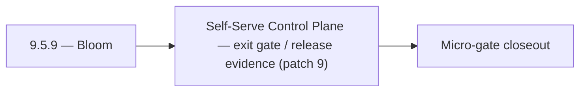

# 9.5.9 — Bloom

- **Era:** `9.x` ecosystem integrations — hub [`versions.md`](../versions.md) · minors start at [`9.0 — Ecosystem Foundation`](9.0%20%E2%80%94%20Ecosystem%20Foundation.md)
- **Minor:** [9.5 — Self-Serve Control Plane](./9.5 — Self-Serve Control Plane.md)
- **Codename:** Bloom
- **Status:** ✅ Completed
## Focus
Self-Serve Control Plane — exit gate / release evidence (patch 9)

## Flowchart

## Micro-gate

| Track | Gate question | Answer / Evidence (fill at patch closeout) |
| --- | --- | --- |
| **Contract** | Connector lifecycle, entitlement model — `docs/backend/apis/` + integration matrices updated? | Document at patch closeout. |
| **Service** | Multi-tenant enforcement, connector adapters, webhook delivery — parity + smoke documented? | Document smoke paths. |
| **Surface** | Integrations UI, marketplace/admin, self-serve flows — delta? | Document UX delta or N/A. |
| **Frontend** | `docs/frontend/` hooks, partner surfaces, extension/email integrations touched? | Self-serve control plane — integrations UX, workspace, onboarding. Document at closeout. |
| **Data** | Tenant lineage, `connector_id`, entitlement tables — `docs/backend/database/`? | Document lineage or N/A. |
| **Ops** | SLA runbooks, partner onboarding, `connectors-commercial.md` / integration RC evidence — delta? | Document ops delta or N/A. |

## Tasks
### Ops
- ✅ Completed: 📌 Planned: Connector SLA dashboard: per-tenant ingestion success rate
- ✅ Completed: 📌 Planned: Quota controls per connector type
- ✅ Completed: 📌 Planned: Alert: webhook delivery failure rate > 5% for a tenant
- ✅ Completed: 📌 Planned: Documentation: connector integration guide for partners
- ✅ Completed: `docs/codebases/salesnavigator-codebase-analysis.md`
- ✅ Completed: `docs/backend/apis/SALESNAVIGATOR_ERA_TASK_PACKS.md`

### Contract

- ✅ Completed: 📌 Planned: **[appointment360]** — Diff and document schema for operations like ConnectraClient, LAMBDA_AI_API_URL, LAMBDA_CONNECTRA_API_URL; align with roadmap | area: `backend-api` | files: `docs/backend/apis/*.md`, `contact360.io/api/app/graphql/schema.py` | reason: Keep GraphQL/REST contracts aligned for era 9.9 patch 9.5.9

### Service

- ✅ Completed: 📌 Planned: **[appointment360]** — Service slice: - [ ] 🟡 In Progress: notifications, saved searches, and connector module foundations exist. | area: `backend-api` | files: `contact360.io/api/app/graphql/modules/`, `contact360.io/api/app/clients/` | reason: Implement or verify runtime behavior for - [ ] 🟡 In Progress: notifications, saved searches, and connector module foundat

### Surface

- ✅ Completed: 📌 Planned: **[app]** — Verify UX for route `/email` and bindings (patch 9.5.9 band 9) | area: `frontend-page` | files: `contact360.io/app/...` | reason: Dashboard/extension surface for era 9 must match gateway contracts

### Data

- ✅ Completed: 📌 Planned: **[appointment360]** — Update PostgreSQL/ES/S3 lineage notes if this patch touches persistence or exports | area: `data-lineage` | files: `docs/backend/database/`, `migrations/` | reason: Migrations, indexes, and lineage evidence for this patch

## Service task slices
> Merged from era `9.x` ecosystem productization task packs (P0→`.0`–`.2`, P1→`.3`–`.6`, Ops→`.7`–`.9`).

### Connectra
- Add per-tenant SLO/error-budget dashboards for Connectra read/write paths.
- Add runbook for noisy-neighbor mitigation and quota override approvals.
- Define release gate evidence: tenant isolation report, quota enforcement tests, VQL policy conformance tests.

### emailapis / emailapigo
- Add 9.x observability checks for provider health, fallback rate, and partner webhook error rate.
- Update rollback and incident runbook for email-impacting releases with connector-specific playbooks.
- Define release evidence bundle for each minor (`9.x.y`): contract diff, load test summary, and parity proof between Python and Go runtimes.

### Appointment360 (gateway)
- Write test: notifications() → markAllRead → notifications() = []
- Load test admin panel with 10,000 user dataset
- Document multi-tenant entitlement enforcement in ops runbook

### S3Storage
- Add entitlement correctness tests for upload/download/list under multiple plan tiers.
- Add quota and cost attribution accuracy checks to release evidence.
- Define alerts for quota rejection spikes and metadata worker lag.
- Add rollback procedures for storage policy misconfiguration incidents.

## Evidence gate
Micro-gate table filled and handoff note to `9.6.0` recorded
