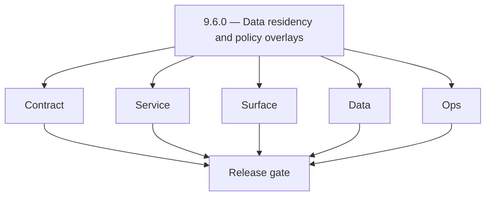
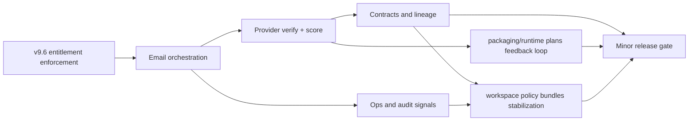
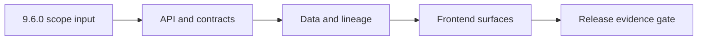

# Version 9.6 — Webhook Reliability

- **Status:** planned
- **Target window:** TBD
- **Summary:** Data residency and policy overlays. Cross-service execution pack for this minor across contract, service, surface, data, and ops.
- **Scope:** Region/policy controls per tenant.
- **Roadmap mapping:** `9.6`
- **Owner:** Security + Platform

## Scope

- Target minor: `9.6.0` aligned to current roadmap mapping in this file.
- In scope: contract, service, surface, data, and ops tasks across core Contact360 services.
- Primary owners: API, App, Jobs, Sync, Admin, and supporting platform services.
- Exclusions: work outside this minor unless required for compatibility or incident risk reduction.
- Output: actionable per-service task breakdown and execution queue for release readiness.

## Version identity

- **Name:** Webhook Reliability
- **Primary intent:** make webhook delivery contracts deterministic, observable, and replay-safe.
- **Must-land runtime controls:** event catalog standardization, `webhook_delivery_log` lineage, retry with backoff, DLQ, and replay API behavior.

## Flowchart

Delivery work for this minor follows the five-track model (contract, service, surface, data, ops) through a release gate.

### Runtime focus (unique to this minor)

See also: [`docs/flowchart.md`](../flowchart.md) for system-wide and master views.

## Task tracks

### Contract
- 📌 Planned: **api**: define v9.6 contract outcomes for entitlement enforcement; harden request/response schema boundaries in `contact360.io/api` while advancing packaging/runtime plans.
- 📌 Planned: **app**: define v9.6 contract outcomes for entitlement enforcement; align UI payload contracts with backend enums in `contact360.io/app` while advancing packaging/runtime plans.
- 📌 Planned: **jobs**: define v9.6 contract outcomes for entitlement enforcement; lock worker message schema and retry metadata in `contact360.io/jobs` while advancing workspace policy bundles.
- 📌 Planned: **sync**: define v9.6 contract outcomes for entitlement enforcement; stabilize sync payload mapping and delta semantics in `contact360.io/sync` while advancing packaging/runtime plans.
- 📌 Planned: **admin**: define v9.6 contract outcomes for entitlement enforcement; formalize control-plane request contracts and guardrails in `contact360.io/admin` while advancing entitlement enforcement.
- 📌 Planned: **mailvetter**: define v9.6 contract outcomes for entitlement enforcement; pin verifier payload expectations and score fields in `backend(dev)/mailvetter` while advancing entitlement enforcement.
- 📌 Planned: **emailapis**: define v9.6 contract outcomes for entitlement enforcement; normalize provider adapter contract and fallback keys in `lambda/emailapis` while advancing workspace policy bundles.
- 📌 Planned: **emailapigo**: define v9.6 contract outcomes for entitlement enforcement; enforce Go adapter contract parity with shared models in `lambda/emailapigo` while advancing entitlement enforcement.

### Service
- 📌 Planned: **api**: deliver v9.6 service outcomes for entitlement enforcement; implement strict handler guards and deterministic branching in `contact360.io/api` while advancing packaging/runtime plans.
- 📌 Planned: **app**: deliver v9.6 service outcomes for entitlement enforcement; wire client flows to canonical endpoints and failure states in `contact360.io/app` while advancing packaging/runtime plans.
- 📌 Planned: **jobs**: deliver v9.6 service outcomes for entitlement enforcement; tune queue worker orchestration and idempotent retries in `contact360.io/jobs` while advancing workspace policy bundles.
- 📌 Planned: **sync**: deliver v9.6 service outcomes for entitlement enforcement; tighten replication loops and conflict-resolution behavior in `contact360.io/sync` while advancing packaging/runtime plans.
- 📌 Planned: **admin**: deliver v9.6 service outcomes for entitlement enforcement; harden operator workflows and privilege-aware actions in `contact360.io/admin` while advancing entitlement enforcement.
- 📌 Planned: **mailvetter**: deliver v9.6 service outcomes for entitlement enforcement; calibrate verdict pipeline stages for stable scoring in `backend(dev)/mailvetter` while advancing entitlement enforcement.
- 📌 Planned: **emailapis**: deliver v9.6 service outcomes for entitlement enforcement; improve provider orchestration sequencing and fallback timing in `lambda/emailapis` while advancing workspace policy bundles.
- 📌 Planned: **emailapigo**: deliver v9.6 service outcomes for entitlement enforcement; optimize Go runtime execution path and error wrapping in `lambda/emailapigo` while advancing entitlement enforcement.

### Surface
- 📌 Planned: **api**: shape v9.6 surface outcomes for entitlement enforcement; publish clearer API status semantics for consumers in `contact360.io/api` while advancing packaging/runtime plans.
- 📌 Planned: **app**: shape v9.6 surface outcomes for entitlement enforcement; refine user-facing copy for outcomes and recovery paths in `contact360.io/app` while advancing packaging/runtime plans.
- 📌 Planned: **jobs**: shape v9.6 surface outcomes for entitlement enforcement; surface job lifecycle visibility for operators in `contact360.io/jobs` while advancing workspace policy bundles.
- 📌 Planned: **sync**: shape v9.6 surface outcomes for entitlement enforcement; expose sync health indicators and drift signals in `contact360.io/sync` while advancing packaging/runtime plans.
- 📌 Planned: **admin**: shape v9.6 surface outcomes for entitlement enforcement; streamline admin controls for triage and overrides in `contact360.io/admin` while advancing entitlement enforcement.
- 📌 Planned: **mailvetter**: shape v9.6 surface outcomes for entitlement enforcement; present verifier rationale fields for audit readability in `backend(dev)/mailvetter` while advancing entitlement enforcement.
- 📌 Planned: **emailapis**: shape v9.6 surface outcomes for entitlement enforcement; expose provider routing outcomes and fallback markers in `lambda/emailapis` while advancing workspace policy bundles.
- 📌 Planned: **emailapigo**: shape v9.6 surface outcomes for entitlement enforcement; clarify Go service diagnostics in integration touchpoints in `lambda/emailapigo` while advancing entitlement enforcement.

### Data
- 📌 Planned: **api**: anchor v9.6 data outcomes for entitlement enforcement; persist stable lineage keys and trace-friendly identifiers in `contact360.io/api` while advancing packaging/runtime plans.
- 📌 Planned: **app**: anchor v9.6 data outcomes for entitlement enforcement; capture UI telemetry fields mapped to backend events in `contact360.io/app` while advancing packaging/runtime plans.
- 📌 Planned: **jobs**: anchor v9.6 data outcomes for entitlement enforcement; record queue attempt history with reproducible markers in `contact360.io/jobs` while advancing workspace policy bundles.
- 📌 Planned: **sync**: anchor v9.6 data outcomes for entitlement enforcement; preserve delta lineage across index and storage writes in `contact360.io/sync` while advancing packaging/runtime plans.
- 📌 Planned: **admin**: anchor v9.6 data outcomes for entitlement enforcement; track governance events with immutable audit attributes in `contact360.io/admin` while advancing entitlement enforcement.
- 📌 Planned: **mailvetter**: anchor v9.6 data outcomes for entitlement enforcement; store verdict evidence artifacts with replay metadata in `backend(dev)/mailvetter` while advancing entitlement enforcement.
- 📌 Planned: **emailapis**: anchor v9.6 data outcomes for entitlement enforcement; retain provider decision lineage for reconciliation in `lambda/emailapis` while advancing workspace policy bundles.
- 📌 Planned: **emailapigo**: anchor v9.6 data outcomes for entitlement enforcement; maintain Go-path trace continuity across provider hops in `lambda/emailapigo` while advancing entitlement enforcement.

### Ops
- 📌 Planned: **api**: enforce v9.6 ops outcomes for entitlement enforcement; add release-gate checks and rollback-safe toggles in `contact360.io/api` while advancing packaging/runtime plans.
- 📌 Planned: **app**: enforce v9.6 ops outcomes for entitlement enforcement; ship smoke scripts for key UI-to-API journeys in `contact360.io/app` while advancing packaging/runtime plans.
- 📌 Planned: **jobs**: enforce v9.6 ops outcomes for entitlement enforcement; expand runbook coverage for backlog and retry incidents in `contact360.io/jobs` while advancing workspace policy bundles.
- 📌 Planned: **sync**: enforce v9.6 ops outcomes for entitlement enforcement; add drift-alert playbooks and resync controls in `contact360.io/sync` while advancing packaging/runtime plans.
- 📌 Planned: **admin**: enforce v9.6 ops outcomes for entitlement enforcement; codify operational checklists for high-risk actions in `contact360.io/admin` while advancing entitlement enforcement.
- 📌 Planned: **mailvetter**: enforce v9.6 ops outcomes for entitlement enforcement; define verification SLA monitors and escalation points in `backend(dev)/mailvetter` while advancing entitlement enforcement.
- 📌 Planned: **emailapis**: enforce v9.6 ops outcomes for entitlement enforcement; add provider health probes and failover thresholds in `lambda/emailapis` while advancing workspace policy bundles.
- 📌 Planned: **emailapigo**: enforce v9.6 ops outcomes for entitlement enforcement; instrument Go service KPIs and on-call diagnostics in `lambda/emailapigo` while advancing entitlement enforcement.

## Task Breakdown

### Version `9.6.0` per-service execution slices

#### api
- Contract: lock v9.6 field semantics in `contact360.io/api` and close edge-case ambiguities tied to entitlement enforcement.
- Service: execute runtime refinements that reduce fallback drift and keep packaging/runtime plans measurable.
- Surface: expose clearer operator/user cues so workspace policy bundles decisions are transparent at handoff points.
- Data: retain lineage and reconciliation markers that prove entitlement enforcement stability.
- Ops: validate runbooks, checks, and release evidence for `api` with concrete pass/fail criteria.
- Acceptance: v9.6 gate passes for api with entitlement enforcement validated end to end.

#### app
- Contract: lock v9.6 field semantics in `contact360.io/app` and close edge-case ambiguities tied to entitlement enforcement.
- Service: execute runtime refinements that reduce fallback drift and keep packaging/runtime plans measurable.
- Surface: expose clearer operator/user cues so workspace policy bundles decisions are transparent at handoff points.
- Data: retain lineage and reconciliation markers that prove entitlement enforcement stability.
- Ops: validate runbooks, checks, and release evidence for `app` with concrete pass/fail criteria.
- Acceptance: v9.6 gate passes for app with entitlement enforcement validated end to end.

#### jobs
- Contract: lock v9.6 field semantics in `contact360.io/jobs` and close edge-case ambiguities tied to entitlement enforcement.
- Service: execute runtime refinements that reduce fallback drift and keep packaging/runtime plans measurable.
- Surface: expose clearer operator/user cues so workspace policy bundles decisions are transparent at handoff points.
- Data: retain lineage and reconciliation markers that prove entitlement enforcement stability.
- Ops: validate runbooks, checks, and release evidence for `jobs` with concrete pass/fail criteria.
- Acceptance: v9.6 gate passes for jobs with entitlement enforcement validated end to end.

#### sync
- Contract: lock v9.6 field semantics in `contact360.io/sync` and close edge-case ambiguities tied to entitlement enforcement.
- Service: execute runtime refinements that reduce fallback drift and keep packaging/runtime plans measurable.
- Surface: expose clearer operator/user cues so workspace policy bundles decisions are transparent at handoff points.
- Data: retain lineage and reconciliation markers that prove entitlement enforcement stability.
- Ops: validate runbooks, checks, and release evidence for `sync` with concrete pass/fail criteria.
- Acceptance: v9.6 gate passes for sync with entitlement enforcement validated end to end.

#### admin
- Contract: lock v9.6 field semantics in `contact360.io/admin` and close edge-case ambiguities tied to entitlement enforcement.
- Service: execute runtime refinements that reduce fallback drift and keep packaging/runtime plans measurable.
- Surface: expose clearer operator/user cues so workspace policy bundles decisions are transparent at handoff points.
- Data: retain lineage and reconciliation markers that prove entitlement enforcement stability.
- Ops: validate runbooks, checks, and release evidence for `admin` with concrete pass/fail criteria.
- Acceptance: v9.6 gate passes for admin with entitlement enforcement validated end to end.

#### mailvetter
- Contract: lock v9.6 field semantics in `backend(dev)/mailvetter` and close edge-case ambiguities tied to entitlement enforcement.
- Service: execute runtime refinements that reduce fallback drift and keep packaging/runtime plans measurable.
- Surface: expose clearer operator/user cues so workspace policy bundles decisions are transparent at handoff points.
- Data: retain lineage and reconciliation markers that prove entitlement enforcement stability.
- Ops: validate runbooks, checks, and release evidence for `mailvetter` with concrete pass/fail criteria.
- Acceptance: v9.6 gate passes for mailvetter with entitlement enforcement validated end to end.

#### emailapis
- Contract: lock v9.6 field semantics in `lambda/emailapis` and close edge-case ambiguities tied to entitlement enforcement.
- Service: execute runtime refinements that reduce fallback drift and keep packaging/runtime plans measurable.
- Surface: expose clearer operator/user cues so workspace policy bundles decisions are transparent at handoff points.
- Data: retain lineage and reconciliation markers that prove entitlement enforcement stability.
- Ops: validate runbooks, checks, and release evidence for `emailapis` with concrete pass/fail criteria.
- Acceptance: v9.6 gate passes for emailapis with entitlement enforcement validated end to end.

#### emailapigo
- Contract: lock v9.6 field semantics in `lambda/emailapigo` and close edge-case ambiguities tied to entitlement enforcement.
- Service: execute runtime refinements that reduce fallback drift and keep packaging/runtime plans measurable.
- Surface: expose clearer operator/user cues so workspace policy bundles decisions are transparent at handoff points.
- Data: retain lineage and reconciliation markers that prove entitlement enforcement stability.
- Ops: validate runbooks, checks, and release evidence for `emailapigo` with concrete pass/fail criteria.
- Acceptance: v9.6 gate passes for emailapigo with entitlement enforcement validated end to end.

## Immediate next execution queue

- 📌 Planned: Freeze v9.6 status/error vocabulary across `api`, `jobs`, and `emailapis`; capture before/after schema diff evidence.
- 📌 Planned: Execute one `app -> api -> emailapigo` golden-path run for v9.6 and archive request/response traces with owner signoff.
- 📌 Planned: Isolate the highest-risk async fault in `jobs` affecting entitlement enforcement, then land a regression test that reproduces the prior failure.
- 📌 Planned: Reconcile `sync` index fields against `mailvetter` verdict outputs for v9.6 and document any residual lineage gaps.
- 📌 Planned: Update `contact360.io/admin` operational checklist entries for v9.6, including escalation thresholds and rollback triggers.
- 📌 Planned: Run a controlled retry/idempotency drill on one bulk workload and record checkpoint integrity under workspace policy bundles.
- 📌 Planned: Verify `app` messaging mirrors backend behavior for packaging/runtime plans; include screenshots tied to API payload samples.
- 📌 Planned: Publish v9.6 cut-readiness notes with clear owners, unresolved blockers, and go/no-go criteria.

## Cross-service ownership

| Service | Version delivery focus |
|---|---|
| contact360.io/api | v9.6 contract boundary control for entitlement enforcement |
| contact360.io/app | v9.6 UX-state parity for packaging/runtime plans |
| contact360.io/jobs | v9.6 async execution integrity for workspace policy bundles |
| contact360.io/sync | v9.6 lineage parity for entitlement enforcement |
| contact360.io/admin | v9.6 operator governance and release controls |
| backend(dev)/mailvetter | v9.6 verifier evidence quality and scoring trust |
| lambda/emailapis | v9.6 provider routing policy and fallback safety |
| lambda/emailapigo | v9.6 Go-path performance and contract fidelity |
| backend(dev)/contact.ai | v9.6 async AI webhook delivery with retry and failure evidence |
| backend(dev)/salesnavigator | v9.6 save completion webhook delivery and replay safety |
| lambda/s3storage | v9.6 storage workflow webhook events and delivery health metrics |
| lambda/logs.api | v9.6 webhook delivery telemetry and DLQ audit evidence |
| backend(dev)/email campaign | v9.6 campaign lifecycle webhooks with partner-safe signatures |
| extension/contact360 | v9.6 extension-triggered ingestion callback reliability signals |

## References

- [docs/versions.md](../versions.md)
- [docs/roadmap.md](../roadmap.md)
- [docs/version-policy.md](../version-policy.md)
- [docs/architecture.md](../architecture.md)
- [docs/codebase.md](../codebase.md)
- [Email system rule](../../.cursor/rules/email_system.md)
- [Email integration exploration](../../.cursor/rules/cursor_contact360_email_integration_exp.md)
- [lambda/emailapis breakdown](../../lambda/emailapis/docs/VERSION_TASK_BREAKDOWN_0.0_TO_10.10.md)
- [contact360.io/api README](../../contact360.io/api/README.md)
- [contact360.io/jobs README](../../contact360.io/jobs/README.md)
- [contact360.io/sync README](../../contact360.io/sync/README.md)
- [backend(dev)/mailvetter README](../../backend(dev)/mailvetter/README.md)

## Backend API and Endpoint Scope

- Era: `9.x`
- Logging service contract reference: `lambda/logs.api/docs/api.md`.
- Endpoint matrix reference: `docs/backend/endpoints/logsapi_endpoint_era_matrix.json`.
- Contract focus for `9.6`: logging evidence coverage for core flows in this minor.
- Public/private contract notes: enforce tenant-scoped access, authz boundaries, and API key governance for log queries/writes.

## Database and Data Lineage Scope

- PostgreSQL lineage touchpoints: correlate business entities with log `request_id` and `trace_id` where available.
- Elasticsearch index changes: include only when this minor expands analytics/search contracts that consume logs.
- S3 bucket/artifact changes: `logs/` CSV objects retained per lifecycle policy.
- MongoDB/audit/log lineage updates: canonical logs backend is S3 CSV for logs.api; update references accordingly.
- Data lineage reference: `docs/backend/database/logsapi_data_lineage.md`.

## Frontend UX Surface Scope

- Primary pages/surfaces: admin/activity/audit views and era-specific operational panels.
- Tabs/navigation changes: document concrete logs-facing tabs for this minor.
- Modal/dialog and state transitions: query/search/filter -> result/empty/error/retry states.
- Hook/service/context wiring: logging-aware services/hooks and role/tenant contexts.
- UI binding reference: `docs/frontend/logsapi-ui-bindings.md`.

## UI Elements Checklist

- Buttons (primary/secondary/link/loading): documented
- Inputs/textareas/selects: documented
- Checkboxes: documented
- Radio buttons: documented
- Progress bars: documented
- Toast/alert/error states: documented
- Loading and empty states: documented

## Flow/Graph Delta for This Minor

## Release Gate and Evidence

- 📌 Planned: API contract diff reviewed
- 📌 Planned: DB/index/storage migration evidence captured
- 📌 Planned: UI smoke path verified with screenshots or traces
- 📌 Planned: Flow diagram updated and validated
- 📌 Planned: Roadmap mapping and owner alignment confirmed
- **Patch closure:** Every codenamed patch file includes **Micro-gate** + **Service task slices**. Era hub: [`versions.md`](../versions.md).
### Micro-gate reference (apply at every `9.N.P`)

| Track | Gate question (must answer Yes or document waiver) |
| --- | --- |
| **Contract** | Connector lifecycle, entitlement model — `docs/backend/apis/` + integration matrices updated? |
| **Service** | Multi-tenant enforcement, adapters, webhook delivery — smoke + parity documented? |
| **Surface** | Integrations UI, marketplace/admin, self-serve — delta? |
| **Frontend** | `docs/frontend/` hooks, partner flows, extension/email — delta? |
| **Data** | Tenant lineage, connector fields — `docs/backend/database/` updated? |
| **Ops** | SLA runbooks, partner onboarding, `connectors-commercial.md` / integration RC — recorded? |

**Patch ladder:** Codenames per minor — see patch table below (`Void`→`Bloom` unless minor defines a custom ladder).

## Patches

| Patch | Codename | Doc |
| --- | --- | --- |
| `9.6.0` | Void | [`9.6.0` — Void](9.6.0 — Void.md) |
| `9.6.1` | Seed | [`9.6.1` — Seed](9.6.1 — Seed.md) |
| `9.6.2` | Sprout | [`9.6.2` — Sprout](9.6.2 — Sprout.md) |
| `9.6.3` | Roots | [`9.6.3` — Roots](9.6.3 — Roots.md) |
| `9.6.4` | Soil | [`9.6.4` — Soil](9.6.4 — Soil.md) |
| `9.6.5` | Rain | [`9.6.5` — Rain](9.6.5 — Rain.md) |
| `9.6.6` | Stem | [`9.6.6` — Stem](9.6.6 — Stem.md) |
| `9.6.7` | Branch | [`9.6.7` — Branch](9.6.7 — Branch.md) |
| `9.6.8` | Leaf | [`9.6.8` — Leaf](9.6.8 — Leaf.md) |
| `9.6.9` | Bloom | [`9.6.9` — Bloom](9.6.9 — Bloom.md) |

## Patch ladder (9.6.0 - 9.6.9)

### Micro-gate reference (apply at every patch)

| Track | Gate question (must answer Yes or waiver) |
| --- | --- |
| **Contract** | Contract/API change captured with diff or explicit no-change note |
| **Service** | Service health and smoke for affected paths pass |
| **Surface** | UI/admin/extension impact documented or N/A |
| **Frontend** | Routes/components/hooks affected listed or N/A |
| **Data** | Migrations/index/lineage deltas linked or N/A |
| **Ops** | Rollback/secrets/CI/runbook delta linked or N/A |

**Patch intent bands:** `.0` charter, `.1-.2` scaffold, `.3-.5` hardening, `.6-.8` integration, `.9` freeze/handoff.

| Patch | Codename | Focus | Evidence gate |
| --- | --- | --- | --- |
| `9.6.0` | Void | patch focus | charter artifact linked |
| `9.6.1` | Seed | patch focus | closeout evidence attached |
| `9.6.2` | Sprout | patch focus | closeout evidence attached |
| `9.6.3` | Roots | patch focus | closeout evidence attached |
| `9.6.4` | Soil | patch focus | closeout evidence attached |
| `9.6.5` | Rain | patch focus | closeout evidence attached |
| `9.6.6` | Stem | patch focus | closeout evidence attached |
| `9.6.7` | Branch | patch focus | closeout evidence attached |
| `9.6.8` | Leaf | patch focus | closeout evidence attached |
| `9.6.9` | Bloom | patch focus | handoff documented |
