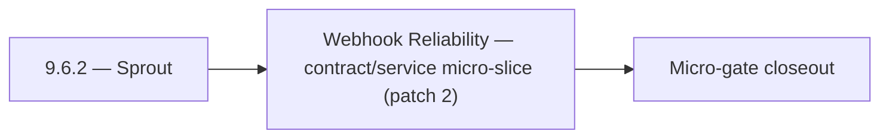

# 9.6.2 — Sprout

- **Era:** `9.x` ecosystem integrations — hub [`versions.md`](../versions.md) · minors start at [`9.0 — Ecosystem Foundation`](9.0%20%E2%80%94%20Ecosystem%20Foundation.md)
- **Minor:** [9.6 — Webhook Reliability](./9.6 — Webhook Reliability.md)
- **Codename:** Sprout
- **Status:** planned

## Focus
Webhook Reliability — contract/service micro-slice (patch 2)

## Flowchart

## Micro-gate

| Track | Gate question | Answer / Evidence (fill at patch closeout) |
| --- | --- | --- |
| **Contract** | Connector lifecycle, entitlement model — `docs/backend/apis/` + integration matrices updated? | Document at patch closeout. |
| **Service** | Multi-tenant enforcement, connector adapters, webhook delivery — parity + smoke documented? | Document smoke paths. |
| **Surface** | Integrations UI, marketplace/admin, self-serve flows — delta? | Document UX delta or N/A. |
| **Frontend** | `docs/frontend/` hooks, partner surfaces, extension/email integrations touched? | Webhook reliability — signing, replay, DLQ, partner delivery SLAs. Document at closeout. |
| **Data** | Tenant lineage, `connector_id`, entitlement tables — `docs/backend/database/`? | Document lineage or N/A. |
| **Ops** | SLA runbooks, partner onboarding, `connectors-commercial.md` / integration RC evidence — delta? | Document ops delta or N/A. |

## Tasks
### Contract
- 📌 Planned: **jobs**: define v9.6 contract outcomes for entitlement enforcement; lock worker message schema and retry metadata in `contact360.io/jobs` while advancing workspace policy bundles.
- 📌 Planned: **emailapis**: define v9.6 contract outcomes for entitlement enforcement; normalize provider adapter contract and fallback keys in `lambda/emailapis` while advancing workspace policy bundles.
- `POST /contacts/batch-upsert`
- 📌 Planned: Align endpoint era mapping in `docs/backend/endpoints/connectra_endpoint_era_matrix.json`.

### Service
- 📌 Planned: **jobs**: deliver v9.6 service outcomes for entitlement enforcement; tune queue worker orchestration and idempotent retries in `contact360.io/jobs` while advancing workspace policy bundles.
- 📌 Planned: **emailapis**: deliver v9.6 service outcomes for entitlement enforcement; improve provider orchestration sequencing and fallback timing in `lambda/emailapis` while advancing workspace policy bundles.
- 📌 Planned: Validate UUID5 dedup behavior and ensure connector ingestion is replay-safe under retries.
- 📌 Planned: Implement organization-level AI usage aggregation (for tenant billing/quota).

## Service task slices
> Merged from era `9.x` ecosystem productization task packs (P0→`.0`–`.2`, P1→`.3`–`.6`, Ops→`.7`–`.9`).

### Emailcampaign
- Org exceeding campaign send limit receives 429 with descriptive limit error.
- Suppression list import accepts CSV with 10k+ emails without timeout.
- HubSpot unsubscribe webhook adds contact to Contact360 suppression list.
- Sender domain DKIM verification status visible in settings UI.

### Jobs
- Define tenant-aware quota and entitlement scheduling contract for create/retry DAG operations.
- Freeze visibility contract for:
- `GET /api/v1/jobs/`
- `GET /api/v1/jobs/{uuid}`
- `GET /api/v1/jobs/{uuid}/timeline`
- `GET /api/v1/jobs/{uuid}/dag`
- Define connector callback payload contract for partner-facing async job completion events.
- Align endpoint references in `docs/backend/endpoints/jobs_endpoint_era_matrix.json`.
- Implement entitlement checks at create/retry boundaries in:
- `app/services/job_service.py`
- `app/workers/scheduler.py`
- Add fairness-aware tenant partitioning policy in scheduler queue dispatch.
- Add processor-level quota guard hooks in `app/processors/` registry.
- Ensure tenant context propagation across scheduler -> worker -> processor -> event timeline.
- Record `tenant_id` and entitlement snapshot in `job_node` lifecycle lineage.
- Define isolation boundary expectations for `job_events`, DAG edges, and metrics.

### Connectra
- Define entitlement-aware VQL policy contract for tenant plans in `app/services/query/*`.
- Freeze connector-facing request/response compatibility for:
- `POST /contacts/batch-upsert`
- `POST /companies/batch-upsert`
- `POST /common/jobs/create`
- Document tenant isolation guarantees for read (`/contacts`, `/companies`) and write paths.
- Align endpoint era mapping in `docs/backend/endpoints/connectra_endpoint_era_matrix.json`.
- Add per-tenant quota/throttle middleware for heavy query/export workloads.
- Enforce tenant filter injection before VQL execution in route handlers under `app/api/routes/`.
- Validate UUID5 dedup behavior and ensure connector ingestion is replay-safe under retries.
- Add fairness controls for mixed-tenant high-volume batch upsert traffic.
- Store tenant usage aggregates for billing, quota, and SLA reporting.
- Persist connector lineage fields: `tenant_id`, `connector_id`, `source`, `session_id`, `trace_id`.

### Appointment360 (gateway)
- Define NotificationQuery { notifications() }
- Define NotificationMutation { markNotificationRead(id), markAllRead }
- Define AnalyticsQuery { analytics(dateRange, granularity, metrics) }
- Define AnalyticsMutation { trackEvent(type, metadata) }
- Define AdminQuery { adminStats(), paymentSubmissions(), users() } (SuperAdmin-only)
- Define AdminMutation { creditUser, adjustCredits, approvePayment, declinePayment } (SuperAdmin-only)
- Implement notifications service: create, list, mark-read in app/services/notification.py
- Implement trackEvent mutation: write to events table with user_uuid, type, metadata
- Implement adminStats(): aggregated counts (users, contacts, jobs, revenue) for SuperAdmin
- Add require_super_admin() guard for all admin mutations
- Notification bell icon → query notifications() polling every 30s
- Notification drop-down → mutation markNotificationRead on click
- Admin panel → query adminStats() + mutation creditUser
- useNotifications hook: polling, badge count, mark-read
- useAdminPanel hook: manage user credit adjustments, approve payments
- Create notifications table: uuid, user_uuid, type, message, is_read, created_at
- Create events table: uuid, user_uuid, type, metadata JSON, created_at
- Run Alembic migration for all 9.x tables

## Evidence gate
Patch closeout includes contract diff, smoke output, data lineage delta, and ops note
