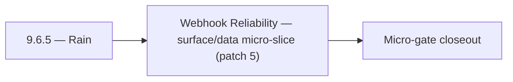

# 9.6.5 — Rain

- **Era:** `9.x` ecosystem integrations — hub [`versions.md`](../versions.md) · minors start at [`9.0 — Ecosystem Foundation`](9.0%20%E2%80%94%20Ecosystem%20Foundation.md)
- **Minor:** [9.6 — Webhook Reliability](./9.6 — Webhook Reliability.md)
- **Codename:** Rain
- **Status:** planned

## Focus
Webhook Reliability — surface/data micro-slice (patch 5)

## Flowchart

## Micro-gate

| Track | Gate question | Answer / Evidence (fill at patch closeout) |
| --- | --- | --- |
| **Contract** | Connector lifecycle, entitlement model — `docs/backend/apis/` + integration matrices updated? | Document at patch closeout. |
| **Service** | Multi-tenant enforcement, connector adapters, webhook delivery — parity + smoke documented? | Document smoke paths. |
| **Surface** | Integrations UI, marketplace/admin, self-serve flows — delta? | Document UX delta or N/A. |
| **Frontend** | `docs/frontend/` hooks, partner surfaces, extension/email integrations touched? | Webhook reliability — signing, replay, DLQ, partner delivery SLAs. Document at closeout. |
| **Data** | Tenant lineage, `connector_id`, entitlement tables — `docs/backend/database/`? | Document lineage or N/A. |
| **Ops** | SLA runbooks, partner onboarding, `connectors-commercial.md` / integration RC evidence — delta? | Document ops delta or N/A. |

## Tasks
### Surface
- 📌 Planned: **app**: shape v9.6 surface outcomes for entitlement enforcement; refine user-facing copy for outcomes and recovery paths in `contact360.io/app` while advancing packaging/runtime plans.
- 📌 Planned: **admin**: shape v9.6 surface outcomes for entitlement enforcement; streamline admin controls for triage and overrides in `contact360.io/admin` while advancing entitlement enforcement.
- 📌 Planned: **emailapigo**: shape v9.6 surface outcomes for entitlement enforcement; clarify Go service diagnostics in integration touchpoints in `lambda/emailapigo` while advancing entitlement enforcement.
- `docs/frontend/components.md`

### Data
- 📌 Planned: **app**: anchor v9.6 data outcomes for entitlement enforcement; capture UI telemetry fields mapped to backend events in `contact360.io/app` while advancing packaging/runtime plans.
- 📌 Planned: **admin**: anchor v9.6 data outcomes for entitlement enforcement; track governance events with immutable audit attributes in `contact360.io/admin` while advancing entitlement enforcement.
- 📌 Planned: **emailapigo**: anchor v9.6 data outcomes for entitlement enforcement; maintain Go-path trace continuity across provider hops in `lambda/emailapigo` while advancing entitlement enforcement.
- 📌 Planned: Define audit table expectations for UUID collisions, dedup merges, and replay attempts.

## Service task slices
> Merged from era `9.x` ecosystem productization task packs (P0→`.0`–`.2`, P1→`.3`–`.6`, Ops→`.7`–`.9`).

### Emailcampaign
- Org exceeding campaign send limit receives 429 with descriptive limit error.
- Suppression list import accepts CSV with 10k+ emails without timeout.
- HubSpot unsubscribe webhook adds contact to Contact360 suppression list.
- Sender domain DKIM verification status visible in settings UI.

### Jobs
- Document tenant quota cards, entitlement warnings, and escalation controls in jobs UI bindings.
- Define tenant-filtered jobs tables and timeline views for admin/operator users.
- Add workflow messaging for `quota_exhausted`, `tenant_blocked`, and `retry_deferred` states.
- Record `tenant_id` and entitlement snapshot in `job_node` lifecycle lineage.
- Define isolation boundary expectations for `job_events`, DAG edges, and metrics.
- Add reconciliation evidence model for quota decisions vs observed scheduler behavior.
- Implement entitlement checks at create/retry boundaries in:
- `app/services/job_service.py`
- `app/workers/scheduler.py`
- Add fairness-aware tenant partitioning policy in scheduler queue dispatch.
- Add processor-level quota guard hooks in `app/processors/` registry.
- Ensure tenant context propagation across scheduler -> worker -> processor -> event timeline.

### Connectra
- Expose tenant quota and connector health signals to integrations/admin surfaces in:
- `docs/frontend/README.md`
- `docs/frontend/components.md`
- `docs/frontend/hooks-services-contexts.md`
- Define user-facing messaging for quota blocked / degraded connector outcomes.
- Add support-facing reconciliation view requirements for created-vs-updated entity counts.
- Store tenant usage aggregates for billing, quota, and SLA reporting.
- Persist connector lineage fields: `tenant_id`, `connector_id`, `source`, `session_id`, `trace_id`.
- Define audit table expectations for UUID collisions, dedup merges, and replay attempts.
- Add per-tenant quota/throttle middleware for heavy query/export workloads.
- Enforce tenant filter injection before VQL execution in route handlers under `app/api/routes/`.
- Validate UUID5 dedup behavior and ensure connector ingestion is replay-safe under retries.
- Add fairness controls for mixed-tenant high-volume batch upsert traffic.

### Appointment360 (gateway)
- Define FeatureOverviewQuery { featureOverview() } returning era/feature matrix
- Define tenant model: Workspace / Organization type with multi-tenant guards
- Document tenant entitlement enforcement contract in docs/governance.md
- Implement analytics service: aggregate event counts from events table
- Implement featureOverview(): return feature flags / credits matrix per plan
- Wire notifications polling in background task: dispatch on billing events, job completions
- Add plan-based entitlement guard: require_plan_feature(info, feature)
- Webhook support: outbound webhook on job completion / campaign send
- Analytics dashboard page → query analytics(...) with date range picker
- Feature overview page (pricing/plan) → query featureOverview()
- Plan upgrade modal → triggered by require_plan_feature guard response
- Create feature_flags table: feature, plan_id, enabled, credit_cost
- Create workspaces table for multi-tenant model: uuid, name, owner_uuid, plan_id
- Configure webhook secret WEBHOOK_SECRET for outbound events
- Write test: trackEvent → query analytics round-trip
- Write test: notifications() → markAllRead → notifications() = []
- Load test admin panel with 10,000 user dataset
- Document multi-tenant entitlement enforcement in ops runbook

## Evidence gate
Patch closeout includes contract diff, smoke output, data lineage delta, and ops note
