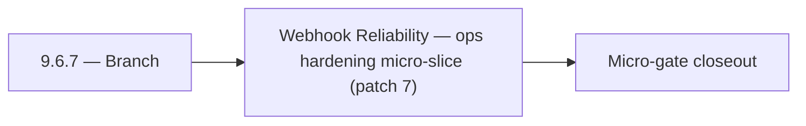

# 9.6.7 — Branch

- **Era:** `9.x` ecosystem integrations — hub [`versions.md`](../versions.md) · minors start at [`9.0 — Ecosystem Foundation`](9.0%20%E2%80%94%20Ecosystem%20Foundation.md)
- **Minor:** [9.6 — Webhook Reliability](./9.6 — Webhook Reliability.md)
- **Codename:** Branch
- **Status:** planned

## Focus
Webhook Reliability — ops hardening micro-slice (patch 7)

## Flowchart

## Micro-gate

| Track | Gate question | Answer / Evidence (fill at patch closeout) |
| --- | --- | --- |
| **Contract** | Connector lifecycle, entitlement model — `docs/backend/apis/` + integration matrices updated? | Document at patch closeout. |
| **Service** | Multi-tenant enforcement, connector adapters, webhook delivery — parity + smoke documented? | Document smoke paths. |
| **Surface** | Integrations UI, marketplace/admin, self-serve flows — delta? | Document UX delta or N/A. |
| **Frontend** | `docs/frontend/` hooks, partner surfaces, extension/email integrations touched? | Webhook reliability — signing, replay, DLQ, partner delivery SLAs. Document at closeout. |
| **Data** | Tenant lineage, `connector_id`, entitlement tables — `docs/backend/database/`? | Document lineage or N/A. |
| **Ops** | SLA runbooks, partner onboarding, `connectors-commercial.md` / integration RC evidence — delta? | Document ops delta or N/A. |

## Tasks
### Ops
- 📌 Planned: **api**: enforce v9.6 ops outcomes for entitlement enforcement; add release-gate checks and rollback-safe toggles in `contact360.io/api` while advancing packaging/runtime plans.
- 📌 Planned: **jobs**: enforce v9.6 ops outcomes for entitlement enforcement; expand runbook coverage for backlog and retry incidents in `contact360.io/jobs` while advancing workspace policy bundles.
- 📌 Planned: **admin**: enforce v9.6 ops outcomes for entitlement enforcement; codify operational checklists for high-risk actions in `contact360.io/admin` while advancing entitlement enforcement.
- 📌 Planned: **emailapis**: enforce v9.6 ops outcomes for entitlement enforcement; add provider health probes and failover thresholds in `lambda/emailapis` while advancing workspace policy bundles.

## Service task slices
> Merged from era `9.x` ecosystem productization task packs (P0→`.0`–`.2`, P1→`.3`–`.6`, Ops→`.7`–`.9`).

### Emailcampaign
- Org exceeding campaign send limit receives 429 with descriptive limit error.
- Suppression list import accepts CSV with 10k+ emails without timeout.
- HubSpot unsubscribe webhook adds contact to Contact360 suppression list.
- Sender domain DKIM verification status visible in settings UI.

### Jobs
- Add per-tenant SLA/error-budget dashboards and alert thresholds.
- Add runbook for quota exhaustion and noisy-neighbor mitigation incidents.
- Add release gate checks: timeline tenant isolation test, retry policy conformance test, processor quota test.

### Connectra
- Add per-tenant SLO/error-budget dashboards for Connectra read/write paths.
- Add runbook for noisy-neighbor mitigation and quota override approvals.
- Define release gate evidence: tenant isolation report, quota enforcement tests, VQL policy conformance tests.

### Appointment360 (gateway)
- Write test: notifications() → markAllRead → notifications() = []
- Load test admin panel with 10,000 user dataset
- Document multi-tenant entitlement enforcement in ops runbook

## Evidence gate
Patch closeout includes contract diff, smoke output, data lineage delta, and ops note
