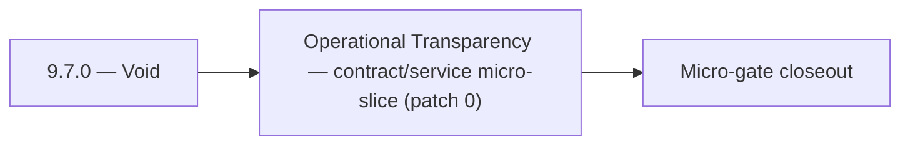

# 9.7.0 — Void

- **Era:** `9.x` ecosystem integrations — hub [`versions.md`](../versions.md) · minors start at [`9.0 — Ecosystem Foundation`](9.0%20%E2%80%94%20Ecosystem%20Foundation.md)
- **Minor:** [9.7 — Operational Transparency](./9.7 — Operational Transparency.md)
- **Codename:** Void
- **Status:** ✅ Completed
## Focus
Operational Transparency — contract/service micro-slice (patch 0)

## Flowchart

## Micro-gate

| Track | Gate question | Answer / Evidence (fill at patch closeout) |
| --- | --- | --- |
| **Contract** | Connector lifecycle, entitlement model — `docs/backend/apis/` + integration matrices updated? | Document at patch closeout. |
| **Service** | Multi-tenant enforcement, connector adapters, webhook delivery — parity + smoke documented? | Document smoke paths. |
| **Surface** | Integrations UI, marketplace/admin, self-serve flows — delta? | Document UX delta or N/A. |
| **Frontend** | `docs/frontend/` hooks, partner surfaces, extension/email integrations touched? | Operational transparency — health dashboards, audit exports, support tooling. Document at closeout. |
| **Data** | Tenant lineage, `connector_id`, entitlement tables — `docs/backend/database/`? | Document lineage or N/A. |
| **Ops** | SLA runbooks, partner onboarding, `connectors-commercial.md` / integration RC evidence — delta? | Document ops delta or N/A. |

## Tasks
### Contract
- ✅ Completed: 📌 Planned: **api**: define v9.7 contract outcomes for packaging/runtime plans; harden request/response schema boundaries in `contact360.io/api` while advancing workspace policy bundles.
- ✅ Completed: 📌 Planned: **admin**: define v9.7 contract outcomes for packaging/runtime plans; formalize control-plane request contracts and guardrails in `contact360.io/admin` while advancing packaging/runtime plans.
- ✅ Completed: 📌 Planned: Define entitlement-aware VQL policy contract for tenant plans in `app/services/query/*`.
- ✅ Completed: `POST /common/jobs/create`

### Service
- ✅ Completed: 📌 Planned: **api**: deliver v9.7 service outcomes for packaging/runtime plans; implement strict handler guards and deterministic branching in `contact360.io/api` while advancing workspace policy bundles.
- ✅ Completed: 📌 Planned: **admin**: deliver v9.7 service outcomes for packaging/runtime plans; harden operator workflows and privilege-aware actions in `contact360.io/admin` while advancing packaging/runtime plans.
- ✅ Completed: 📌 Planned: Add per-tenant quota/throttle middleware for heavy query/export workloads.
- ✅ Completed: 📌 Planned: Implement webhook delivery: on AI response completion, POST result to registered webhook URL.

### Surface

- ✅ Completed: 📌 Planned: **[app]** — Verify UX for route `/email` and bindings (patch 9.7.0 band 0) | area: `frontend-page` | files: `contact360.io/app/...` | reason: Dashboard/extension surface for era 9 must match gateway contracts

### Data

- ✅ Completed: 📌 Planned: **[appointment360]** — Update PostgreSQL/ES/S3 lineage notes if this patch touches persistence or exports | area: `data-lineage` | files: `docs/backend/database/`, `migrations/` | reason: Migrations, indexes, and lineage evidence for this patch

### Ops

- ✅ Completed: 📌 Planned: **[platform]** — Record smoke evidence, rollback, and alerts (patch band 0: charter/P0) | area: `ops` | files: `docs/commands/`, `.github/workflows/` | reason: Smoke, rollback, and observability for patch 9.7.0

## Service task slices
> Merged from era `9.x` ecosystem productization task packs (P0→`.0`–`.2`, P1→`.3`–`.6`, Ops→`.7`–`.9`).

### Salesnavigator
- Define connector adapter contract: normalized profile payload that non-SN sources (HubSpot, Salesforce, etc.) can use with this service
- Define webhook delivery contract: after `save-profiles` → POST result to configured `webhook_url`
- Define connector health endpoint: `GET /v1/connector/{id}/status`
- Define tenant-isolated ingestion lineage contract: `{tenant_id, session_id, source, profiles_count, timestamp}`
- Adapter layer: normalize partner profile payload → `SaveProfilesRequest` schema
- Webhook delivery: POST `SaveProfilesResponse` to `webhook_url` on save completion (configurable per API key)
- Webhook retry: 3 attempts, exponential backoff, dead-letter log on final failure
- Tenant-isolated ingestion: tag all Connectra writes with `tenant_id` from API key context
- Tenant-isolated lineage: `{tenant_id, source, session_id, lead_ids[], timestamp}` per session
- Connector audit trail: each connector event logged to `connector_events` table

### Mailvetter
- Define partner webhook event catalog (`completed`, `failed`, `partial_failed`).
- Define partner-grade SLA and retry guarantees.
- Add webhook dead-letter and replay API.
- Add partner connector adapters for downstream systems.
- Add tenant-aware quotas and fairness controls.
- Add `webhook_delivery_log` and `connector_events` tables.
- Add tenant usage aggregates and SLA evidence tables.

### emailapis / emailapigo
- Freeze 9.x finder/verifier/pattern endpoint contracts in:
- `lambda/emailapis/app/api/v1/router.py`
- `lambda/emailapigo/internal/api/router.go`
- Normalize error envelope for both runtimes (`status`, `message`, `provider`, `request_id`, `retryable`) and map to gateway GraphQL errors in `contact360.io/api`.
- Define partner connector compatibility contract for email workflows (input mapping and expected response cardinality).
- Update endpoint matrix in `docs/backend/endpoints/emailapis_endpoint_era_matrix.json`.
- Implement entitlement-aware execution guard for finder/verifier paths (per-tenant caps before provider fanout).
- Align provider orchestration behavior between runtimes (mailvetter/icypeas/truelist fallback order and timeout windows).
- Validate auth behavior (`X-API-Key` and gateway-issued context headers) across both runtimes.
- Add deterministic idempotency key support for bulk finder/verifier requests to avoid duplicate partner billing.
- Document 9.x lineage changes for `email_finder_cache` and `email_patterns` in `docs/backend/database`.
- Record per-request provider decision lineage (`provider`, `fallback_provider`, `status`, `latency_ms`, `tenant_id`, `trace_id`).

### Appointment360 (gateway)
- Define NotificationQuery { notifications() }
- Define NotificationMutation { markNotificationRead(id), markAllRead }
- Define AnalyticsQuery { analytics(dateRange, granularity, metrics) }
- Define AnalyticsMutation { trackEvent(type, metadata) }
- Define AdminQuery { adminStats(), paymentSubmissions(), users() } (SuperAdmin-only)
- Define AdminMutation { creditUser, adjustCredits, approvePayment, declinePayment } (SuperAdmin-only)
- Implement notifications service: create, list, mark-read in app/services/notification.py
- Implement trackEvent mutation: write to events table with user_uuid, type, metadata
- Implement adminStats(): aggregated counts (users, contacts, jobs, revenue) for SuperAdmin
- Add require_super_admin() guard for all admin mutations
- Notification bell icon → query notifications() polling every 30s
- Notification drop-down → mutation markNotificationRead on click
- Admin panel → query adminStats() + mutation creditUser
- useNotifications hook: polling, badge count, mark-read
- useAdminPanel hook: manage user credit adjustments, approve payments
- Create notifications table: uuid, user_uuid, type, message, is_read, created_at
- Create events table: uuid, user_uuid, type, metadata JSON, created_at
- Run Alembic migration for all 9.x tables

## Evidence gate
Primary charter artifact created and linked in the parent minor doc
