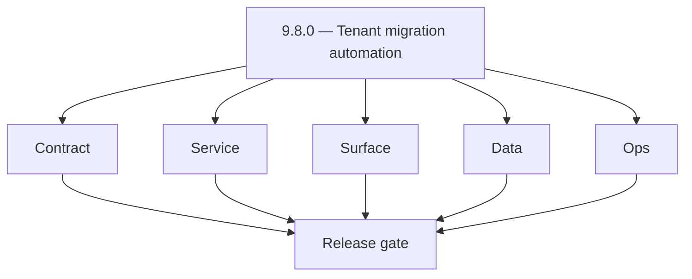
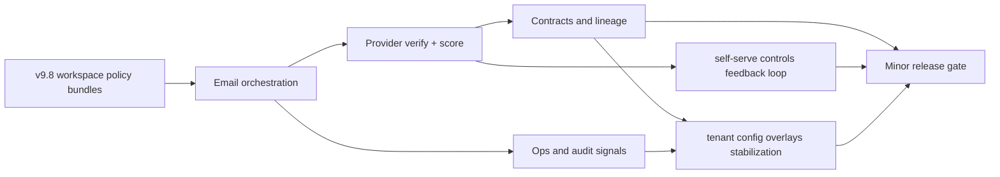
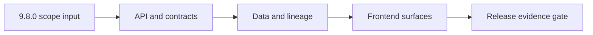

# Version 9.8 — Commercial Guardrails

- **Status:** ✅ Completed
- **Target window:** TBD
- **Summary:** Migration and lifecycle automation. Cross-service execution pack for this minor across contract, service, surface, data, and ops.
- **Scope:** Safe tenant migration and lifecycle automation.
- **Roadmap mapping:** `9.8`
- **Owner:** Platform

## Scope

- Target minor: `9.8.0` aligned to current roadmap mapping in this file.
- In scope: contract, service, surface, data, and ops tasks across core Contact360 services.
- Primary owners: API, App, Jobs, Sync, Admin, and supporting platform services.
- Exclusions: work outside this minor unless required for compatibility or incident risk reduction.
- Output: actionable per-service task breakdown and execution queue for release readiness.

## Version identity

- **Name:** Commercial Guardrails
- **Primary intent:** enforce partner-tier and tenant-tier commercial limits with reconciliable usage evidence.
- **Must-land controls:** connector rate caps, billable unit lineage, sender-domain and suppression sync guardrails, and in-product upgrade/fallback behavior.

## Flowchart

Delivery work for this minor follows the five-track model (contract, service, surface, data, ops) through a release gate.

### Runtime focus (unique to this minor)

See also: [`docs/flowchart.md`](../flowchart.md) for system-wide and master views.

## Task tracks

### Contract
- 📌 Planned: **[appointment360]** — refine duplicate task (was: 📌 planned: **[appointment360]** — refine duplicate task (was…) | patch `9.8.0` band `0` | reason: specialize this file vs sibling patches; see docs/codebases/appointment360-codebase-analysis.md
- 📌 Planned: **[appointment360]** — refine duplicate task (was: ✅ completed: 📌 planned: **app**: define v9.8 contract outcom…) | patch `9.8.0` band `0` | reason: specialize this file vs sibling patches; see docs/codebases/appointment360-codebase-analysis.md
- 📌 Planned: **[appointment360]** — refine duplicate task (was: ✅ completed: 📌 planned: **jobs**: define v9.8 contract outco…) | patch `9.8.0` band `0` | reason: specialize this file vs sibling patches; see docs/codebases/appointment360-codebase-analysis.md
- 📌 Planned: **[appointment360]** — refine duplicate task (was: ✅ completed: 📌 planned: **sync**: define v9.8 contract outco…) | patch `9.8.0` band `0` | reason: specialize this file vs sibling patches; see docs/codebases/appointment360-codebase-analysis.md
- 📌 Planned: **[appointment360]** — refine duplicate task (was: 📌 planned: **[appointment360]** — refine duplicate task (was…) | patch `9.8.0` band `0` | reason: specialize this file vs sibling patches; see docs/codebases/appointment360-codebase-analysis.md
- 📌 Planned: **[appointment360]** — refine duplicate task (was: ✅ completed: 📌 planned: **mailvetter**: define v9.8 contract…) | patch `9.8.0` band `0` | reason: specialize this file vs sibling patches; see docs/codebases/appointment360-codebase-analysis.md
- 📌 Planned: **[appointment360]** — refine duplicate task (was: ✅ completed: 📌 planned: **emailapis**: define v9.8 contract …) | patch `9.8.0` band `0` | reason: specialize this file vs sibling patches; see docs/codebases/appointment360-codebase-analysis.md
- 📌 Planned: **[appointment360]** — refine duplicate task (was: ✅ completed: 📌 planned: **emailapigo**: define v9.8 contract…) | patch `9.8.0` band `0` | reason: specialize this file vs sibling patches; see docs/codebases/appointment360-codebase-analysis.md

- 📌 Planned: **[appointment360]** — refine duplicate task (was: 📌 planned: **[architecture]** — product **graphql** remains …) | patch `9.8.0` band `0` | reason: specialize this file vs sibling patches; see docs/codebases/appointment360-codebase-analysis.md
### Service
- 📌 Planned: **[appointment360]** — refine duplicate task (was: 📌 planned: **[appointment360]** — refine duplicate task (was…) | patch `9.8.0` band `0` | reason: specialize this file vs sibling patches; see docs/codebases/appointment360-codebase-analysis.md
- 📌 Planned: **[appointment360]** — refine duplicate task (was: ✅ completed: 📌 planned: **app**: deliver v9.8 service outcom…) | patch `9.8.0` band `0` | reason: specialize this file vs sibling patches; see docs/codebases/appointment360-codebase-analysis.md
- 📌 Planned: **[appointment360]** — refine duplicate task (was: ✅ completed: 📌 planned: **jobs**: deliver v9.8 service outco…) | patch `9.8.0` band `0` | reason: specialize this file vs sibling patches; see docs/codebases/appointment360-codebase-analysis.md
- 📌 Planned: **[appointment360]** — refine duplicate task (was: ✅ completed: 📌 planned: **sync**: deliver v9.8 service outco…) | patch `9.8.0` band `0` | reason: specialize this file vs sibling patches; see docs/codebases/appointment360-codebase-analysis.md
- 📌 Planned: **[appointment360]** — refine duplicate task (was: 📌 planned: **[appointment360]** — refine duplicate task (was…) | patch `9.8.0` band `0` | reason: specialize this file vs sibling patches; see docs/codebases/appointment360-codebase-analysis.md
- 📌 Planned: **[appointment360]** — refine duplicate task (was: ✅ completed: 📌 planned: **mailvetter**: deliver v9.8 service…) | patch `9.8.0` band `0` | reason: specialize this file vs sibling patches; see docs/codebases/appointment360-codebase-analysis.md
- 📌 Planned: **[appointment360]** — refine duplicate task (was: ✅ completed: 📌 planned: **emailapis**: deliver v9.8 service …) | patch `9.8.0` band `0` | reason: specialize this file vs sibling patches; see docs/codebases/appointment360-codebase-analysis.md
- 📌 Planned: **[appointment360]** — refine duplicate task (was: ✅ completed: 📌 planned: **emailapigo**: deliver v9.8 service…) | patch `9.8.0` band `0` | reason: specialize this file vs sibling patches; see docs/codebases/appointment360-codebase-analysis.md

- 📌 Planned: **[appointment360]** — refine duplicate task (was: 📌 planned: **[architecture]** — **go/gin satellites** in sco…) | patch `9.8.0` band `0` | reason: specialize this file vs sibling patches; see docs/codebases/appointment360-codebase-analysis.md
### Surface
- 📌 Planned: **[appointment360]** — refine duplicate task (was: ✅ completed: 📌 planned: **api**: shape v9.8 surface outcomes…) | patch `9.8.0` band `0` | reason: specialize this file vs sibling patches; see docs/codebases/appointment360-codebase-analysis.md
- 📌 Planned: **[appointment360]** — refine duplicate task (was: ✅ completed: 📌 planned: **app**: shape v9.8 surface outcomes…) | patch `9.8.0` band `0` | reason: specialize this file vs sibling patches; see docs/codebases/appointment360-codebase-analysis.md
- 📌 Planned: **[appointment360]** — refine duplicate task (was: ✅ completed: 📌 planned: **jobs**: shape v9.8 surface outcome…) | patch `9.8.0` band `0` | reason: specialize this file vs sibling patches; see docs/codebases/appointment360-codebase-analysis.md
- 📌 Planned: **[appointment360]** — refine duplicate task (was: ✅ completed: 📌 planned: **sync**: shape v9.8 surface outcome…) | patch `9.8.0` band `0` | reason: specialize this file vs sibling patches; see docs/codebases/appointment360-codebase-analysis.md
- 📌 Planned: **[appointment360]** — refine duplicate task (was: ✅ completed: 📌 planned: **admin**: shape v9.8 surface outcom…) | patch `9.8.0` band `0` | reason: specialize this file vs sibling patches; see docs/codebases/appointment360-codebase-analysis.md
- 📌 Planned: **[appointment360]** — refine duplicate task (was: ✅ completed: 📌 planned: **mailvetter**: shape v9.8 surface o…) | patch `9.8.0` band `0` | reason: specialize this file vs sibling patches; see docs/codebases/appointment360-codebase-analysis.md
- 📌 Planned: **[appointment360]** — refine duplicate task (was: ✅ completed: 📌 planned: **emailapis**: shape v9.8 surface ou…) | patch `9.8.0` band `0` | reason: specialize this file vs sibling patches; see docs/codebases/appointment360-codebase-analysis.md
- 📌 Planned: **[appointment360]** — refine duplicate task (was: ✅ completed: 📌 planned: **emailapigo**: shape v9.8 surface o…) | patch `9.8.0` band `0` | reason: specialize this file vs sibling patches; see docs/codebases/appointment360-codebase-analysis.md

### Data
- 📌 Planned: **[appointment360]** — refine duplicate task (was: ✅ completed: 📌 planned: **api**: anchor v9.8 data outcomes f…) | patch `9.8.0` band `0` | reason: specialize this file vs sibling patches; see docs/codebases/appointment360-codebase-analysis.md
- 📌 Planned: **[appointment360]** — refine duplicate task (was: ✅ completed: 📌 planned: **app**: anchor v9.8 data outcomes f…) | patch `9.8.0` band `0` | reason: specialize this file vs sibling patches; see docs/codebases/appointment360-codebase-analysis.md
- 📌 Planned: **[appointment360]** — refine duplicate task (was: ✅ completed: 📌 planned: **jobs**: anchor v9.8 data outcomes …) | patch `9.8.0` band `0` | reason: specialize this file vs sibling patches; see docs/codebases/appointment360-codebase-analysis.md
- 📌 Planned: **[appointment360]** — refine duplicate task (was: ✅ completed: 📌 planned: **sync**: anchor v9.8 data outcomes …) | patch `9.8.0` band `0` | reason: specialize this file vs sibling patches; see docs/codebases/appointment360-codebase-analysis.md
- 📌 Planned: **[appointment360]** — refine duplicate task (was: ✅ completed: 📌 planned: **admin**: anchor v9.8 data outcomes…) | patch `9.8.0` band `0` | reason: specialize this file vs sibling patches; see docs/codebases/appointment360-codebase-analysis.md
- 📌 Planned: **[appointment360]** — refine duplicate task (was: ✅ completed: 📌 planned: **mailvetter**: anchor v9.8 data out…) | patch `9.8.0` band `0` | reason: specialize this file vs sibling patches; see docs/codebases/appointment360-codebase-analysis.md
- 📌 Planned: **[appointment360]** — refine duplicate task (was: ✅ completed: 📌 planned: **emailapis**: anchor v9.8 data outc…) | patch `9.8.0` band `0` | reason: specialize this file vs sibling patches; see docs/codebases/appointment360-codebase-analysis.md
- 📌 Planned: **[appointment360]** — refine duplicate task (was: ✅ completed: 📌 planned: **emailapigo**: anchor v9.8 data out…) | patch `9.8.0` band `0` | reason: specialize this file vs sibling patches; see docs/codebases/appointment360-codebase-analysis.md

- 📌 Planned: **[appointment360]** — refine duplicate task (was: 📌 planned: **[architecture]** — **postgresql-first** per `do…) | patch `9.8.0` band `0` | reason: specialize this file vs sibling patches; see docs/codebases/appointment360-codebase-analysis.md
### Ops
- 📌 Planned: **[appointment360]** — refine duplicate task (was: ✅ completed: 📌 planned: **api**: enforce v9.8 ops outcomes f…) | patch `9.8.0` band `0` | reason: specialize this file vs sibling patches; see docs/codebases/appointment360-codebase-analysis.md
- 📌 Planned: **[appointment360]** — refine duplicate task (was: ✅ completed: 📌 planned: **app**: enforce v9.8 ops outcomes f…) | patch `9.8.0` band `0` | reason: specialize this file vs sibling patches; see docs/codebases/appointment360-codebase-analysis.md
- 📌 Planned: **[appointment360]** — refine duplicate task (was: ✅ completed: 📌 planned: **jobs**: enforce v9.8 ops outcomes …) | patch `9.8.0` band `0` | reason: specialize this file vs sibling patches; see docs/codebases/appointment360-codebase-analysis.md
- 📌 Planned: **[appointment360]** — refine duplicate task (was: ✅ completed: 📌 planned: **sync**: enforce v9.8 ops outcomes …) | patch `9.8.0` band `0` | reason: specialize this file vs sibling patches; see docs/codebases/appointment360-codebase-analysis.md
- 📌 Planned: **[appointment360]** — refine duplicate task (was: ✅ completed: 📌 planned: **admin**: enforce v9.8 ops outcomes…) | patch `9.8.0` band `0` | reason: specialize this file vs sibling patches; see docs/codebases/appointment360-codebase-analysis.md
- 📌 Planned: **[appointment360]** — refine duplicate task (was: ✅ completed: 📌 planned: **mailvetter**: enforce v9.8 ops out…) | patch `9.8.0` band `0` | reason: specialize this file vs sibling patches; see docs/codebases/appointment360-codebase-analysis.md
- 📌 Planned: **[appointment360]** — refine duplicate task (was: ✅ completed: 📌 planned: **emailapis**: enforce v9.8 ops outc…) | patch `9.8.0` band `0` | reason: specialize this file vs sibling patches; see docs/codebases/appointment360-codebase-analysis.md
- 📌 Planned: **[appointment360]** — refine duplicate task (was: ✅ completed: 📌 planned: **emailapigo**: enforce v9.8 ops out…) | patch `9.8.0` band `0` | reason: specialize this file vs sibling patches; see docs/codebases/appointment360-codebase-analysis.md

- 📌 Planned: **[appointment360]** — refine duplicate task (was: 📌 planned: **[architecture]** — **observability**: correlate…) | patch `9.8.0` band `0` | reason: specialize this file vs sibling patches; see docs/codebases/appointment360-codebase-analysis.md
- 📌 Planned: **[appointment360]** — refine duplicate task (was: 📌 planned: **[architecture]** — **django docsai** (`contact3…) | patch `9.8.0` band `0` | reason: specialize this file vs sibling patches; see docs/codebases/appointment360-codebase-analysis.md
## Task Breakdown

### Version `9.8.0` per-service execution slices

#### api
- Contract: lock v9.8 field semantics in `contact360.io/api` and close edge-case ambiguities tied to workspace policy bundles.
- Service: execute runtime refinements that reduce fallback drift and keep self-serve controls measurable.
- Surface: expose clearer operator/user cues so tenant config overlays decisions are transparent at handoff points.
- Data: retain lineage and reconciliation markers that prove workspace policy bundles stability.
- Ops: validate runbooks, checks, and release evidence for `api` with concrete pass/fail criteria.
- Acceptance: v9.8 gate passes for api with workspace policy bundles validated end to end.

#### app
- Contract: lock v9.8 field semantics in `contact360.io/app` and close edge-case ambiguities tied to workspace policy bundles.
- Service: execute runtime refinements that reduce fallback drift and keep self-serve controls measurable.
- Surface: expose clearer operator/user cues so tenant config overlays decisions are transparent at handoff points.
- Data: retain lineage and reconciliation markers that prove workspace policy bundles stability.
- Ops: validate runbooks, checks, and release evidence for `app` with concrete pass/fail criteria.
- Acceptance: v9.8 gate passes for app with workspace policy bundles validated end to end.

#### jobs
- Contract: lock v9.8 field semantics in `contact360.io/jobs` and close edge-case ambiguities tied to workspace policy bundles.
- Service: execute runtime refinements that reduce fallback drift and keep self-serve controls measurable.
- Surface: expose clearer operator/user cues so tenant config overlays decisions are transparent at handoff points.
- Data: retain lineage and reconciliation markers that prove workspace policy bundles stability.
- Ops: validate runbooks, checks, and release evidence for `jobs` with concrete pass/fail criteria.
- Acceptance: v9.8 gate passes for jobs with workspace policy bundles validated end to end.

#### sync
- Contract: lock v9.8 field semantics in `contact360.io/sync` and close edge-case ambiguities tied to workspace policy bundles.
- Service: execute runtime refinements that reduce fallback drift and keep self-serve controls measurable.
- Surface: expose clearer operator/user cues so tenant config overlays decisions are transparent at handoff points.
- Data: retain lineage and reconciliation markers that prove workspace policy bundles stability.
- Ops: validate runbooks, checks, and release evidence for `sync` with concrete pass/fail criteria.
- Acceptance: v9.8 gate passes for sync with workspace policy bundles validated end to end.

#### admin
- Contract: lock v9.8 field semantics in `contact360.io/admin` and close edge-case ambiguities tied to workspace policy bundles.
- Service: execute runtime refinements that reduce fallback drift and keep self-serve controls measurable.
- Surface: expose clearer operator/user cues so tenant config overlays decisions are transparent at handoff points.
- Data: retain lineage and reconciliation markers that prove workspace policy bundles stability.
- Ops: validate runbooks, checks, and release evidence for `admin` with concrete pass/fail criteria.
- Acceptance: v9.8 gate passes for admin with workspace policy bundles validated end to end.

#### mailvetter
- Contract: lock v9.8 field semantics in `backend(dev)/mailvetter` and close edge-case ambiguities tied to workspace policy bundles.
- Service: execute runtime refinements that reduce fallback drift and keep self-serve controls measurable.
- Surface: expose clearer operator/user cues so tenant config overlays decisions are transparent at handoff points.
- Data: retain lineage and reconciliation markers that prove workspace policy bundles stability.
- Ops: validate runbooks, checks, and release evidence for `mailvetter` with concrete pass/fail criteria.
- Acceptance: v9.8 gate passes for mailvetter with workspace policy bundles validated end to end.

#### emailapis
- Contract: lock v9.8 field semantics in `lambda/emailapis` and close edge-case ambiguities tied to workspace policy bundles.
- Service: execute runtime refinements that reduce fallback drift and keep self-serve controls measurable.
- Surface: expose clearer operator/user cues so tenant config overlays decisions are transparent at handoff points.
- Data: retain lineage and reconciliation markers that prove workspace policy bundles stability.
- Ops: validate runbooks, checks, and release evidence for `emailapis` with concrete pass/fail criteria.
- Acceptance: v9.8 gate passes for emailapis with workspace policy bundles validated end to end.

#### emailapigo
- Contract: lock v9.8 field semantics in `lambda/emailapigo` and close edge-case ambiguities tied to workspace policy bundles.
- Service: execute runtime refinements that reduce fallback drift and keep self-serve controls measurable.
- Surface: expose clearer operator/user cues so tenant config overlays decisions are transparent at handoff points.
- Data: retain lineage and reconciliation markers that prove workspace policy bundles stability.
- Ops: validate runbooks, checks, and release evidence for `emailapigo` with concrete pass/fail criteria.
- Acceptance: v9.8 gate passes for emailapigo with workspace policy bundles validated end to end.

## Immediate next execution queue

- 📌 Planned: Freeze v9.8 status/error vocabulary across `api`, `jobs`, and `emailapis`; capture before/after schema diff evidence.
- 📌 Planned: Execute one `app -> api -> emailapigo` golden-path run for v9.8 and archive request/response traces with owner signoff.
- 📌 Planned: Isolate the highest-risk async fault in `jobs` affecting workspace policy bundles, then land a regression test that reproduces the prior failure.
- 📌 Planned: Reconcile `sync` index fields against `mailvetter` verdict outputs for v9.8 and document any residual lineage gaps.
- 📌 Planned: Update `contact360.io/admin` operational checklist entries for v9.8, including escalation thresholds and rollback triggers.
- 📌 Planned: Run a controlled retry/idempotency drill on one bulk workload and record checkpoint integrity under tenant config overlays.
- 📌 Planned: Verify `app` messaging mirrors backend behavior for self-serve controls; include screenshots tied to API payload samples.
- 📌 Planned: Publish v9.8 cut-readiness notes with clear owners, unresolved blockers, and go/no-go criteria.

## Cross-service ownership

| Service | Version delivery focus |
|---|---|
| contact360.io/api | v9.8 contract boundary control for workspace policy bundles |
| contact360.io/app | v9.8 UX-state parity for self-serve controls |
| contact360.io/jobs | v9.8 async execution integrity for tenant config overlays |
| contact360.io/sync | v9.8 lineage parity for workspace policy bundles |
| contact360.io/admin | v9.8 operator governance and release controls |
| backend(dev)/mailvetter | v9.8 verifier evidence quality and scoring trust |
| lambda/emailapis | v9.8 provider routing policy and fallback safety |
| lambda/emailapigo | v9.8 Go-path performance and contract fidelity |
| backend(dev)/contact.ai | v9.8 AI usage metering contract and commercial quota guardrails |
| backend(dev)/salesnavigator | v9.8 connector-tier ingestion caps and cost attribution |
| lambda/s3storage | v9.8 storage cost/per-tenant chargeback accuracy controls |
| lambda/logs.api | v9.8 commercial dispute evidence exports with trace linkage |
| backend(dev)/email campaign | v9.8 entitlement-aware campaign limits and suppression sync economics |
| extension/contact360 | v9.8 partner-tier awareness in extension-led ingestion workflows |

## References

- [docs/versions.md](../versions.md)
- [docs/roadmap.md](../roadmap.md)
- [docs/version-policy.md](../version-policy.md)
- [docs/architecture.md](../architecture.md)
- [docs/codebase.md](../codebase.md)
- [Email system rule](../../.cursor/rules/email_system.md)
- [Email integration exploration](../../.cursor/rules/cursor_contact360_email_integration_exp.md)
- [lambda/emailapis breakdown](../../lambda/emailapis/docs/VERSION_TASK_BREAKDOWN_0.0_TO_10.10.md)
- [contact360.io/api README](../../contact360.io/api/README.md)
- [contact360.io/jobs README](../../contact360.io/jobs/README.md)
- [contact360.io/sync README](../../contact360.io/sync/README.md)
- [backend(dev)/mailvetter README](../../backend(dev)/mailvetter/README.md)

## Backend API and Endpoint Scope

- Era: `9.x`
- Logging service contract reference: `lambda/logs.api/docs/api.md`.
- Endpoint matrix reference: `docs/backend/endpoints/logsapi_endpoint_era_matrix.json`.
- Contract focus for `9.8`: logging evidence coverage for core flows in this minor.
- Public/private contract notes: enforce tenant-scoped access, authz boundaries, and API key governance for log queries/writes.

## Database and Data Lineage Scope

- PostgreSQL lineage touchpoints: correlate business entities with log `request_id` and `trace_id` where available.
- Elasticsearch index changes: include only when this minor expands analytics/search contracts that consume logs.
- S3 bucket/artifact changes: `logs/` CSV objects retained per lifecycle policy.
- MongoDB/audit/log lineage updates: canonical logs backend is S3 CSV for logs.api; update references accordingly.
- Data lineage reference: `docs/backend/database/logsapi_data_lineage.md`.

## Frontend UX Surface Scope

- Primary pages/surfaces: admin/activity/audit views and era-specific operational panels.
- Tabs/navigation changes: document concrete logs-facing tabs for this minor.
- Modal/dialog and state transitions: query/search/filter -> result/empty/error/retry states.
- Hook/service/context wiring: logging-aware services/hooks and role/tenant contexts.
- UI binding reference: `docs/frontend/logsapi-ui-bindings.md`.

## UI Elements Checklist

- Buttons (primary/secondary/link/loading): documented
- Inputs/textareas/selects: documented
- Checkboxes: documented
- Radio buttons: documented
- Progress bars: documented
- Toast/alert/error states: documented
- Loading and empty states: documented

## Flow/Graph Delta for This Minor

## Release Gate and Evidence

- 📌 Planned: API contract diff reviewed
- 📌 Planned: DB/index/storage migration evidence captured
- 📌 Planned: UI smoke path verified with screenshots or traces
- 📌 Planned: Flow diagram updated and validated
- 📌 Planned: Roadmap mapping and owner alignment confirmed
- **Patch closure:** Every codenamed patch file includes **Micro-gate** + **Service task slices**. Era hub: [`versions.md`](../versions.md).
### Micro-gate reference (apply at every `9.N.P`)

| Track | Gate question (must answer Yes or document waiver) |
| --- | --- |
| **Contract** | Connector lifecycle, entitlement model — `docs/backend/apis/` + integration matrices updated? |
| **Service** | Multi-tenant enforcement, adapters, webhook delivery — smoke + parity documented? |
| **Surface** | Integrations UI, marketplace/admin, self-serve — delta? |
| **Frontend** | `docs/frontend/` hooks, partner flows, extension/email — delta? |
| **Data** | Tenant lineage, connector fields — `docs/backend/database/` updated? |
| **Ops** | SLA runbooks, partner onboarding, `connectors-commercial.md` / integration RC — recorded? |
| **Architecture** | Go/Gin satellites only via Python GraphQL gateway (`contact360.io/api`); Next.js `NEXT_PUBLIC_GRAPHQL_URL`; Postgres-first / Redis exit per `docs/docs/data-stores-postgres.md`. |

**Patch ladder:** Codenames per minor — see patch table below (`Void`→`Bloom` unless minor defines a custom ladder).

## Patches

| Patch | Codename | Doc |
| --- | --- | --- |
| `9.8.0` | Void | [`9.8.0` — Void](9.8.0 — Void.md) |
| `9.8.1` | Seed | [`9.8.1` — Seed](9.8.1 — Seed.md) |
| `9.8.2` | Sprout | [`9.8.2` — Sprout](9.8.2 — Sprout.md) |
| `9.8.3` | Roots | [`9.8.3` — Roots](9.8.3 — Roots.md) |
| `9.8.4` | Soil | [`9.8.4` — Soil](9.8.4 — Soil.md) |
| `9.8.5` | Rain | [`9.8.5` — Rain](9.8.5 — Rain.md) |
| `9.8.6` | Stem | [`9.8.6` — Stem](9.8.6 — Stem.md) |
| `9.8.7` | Branch | [`9.8.7` — Branch](9.8.7 — Branch.md) |
| `9.8.8` | Leaf | [`9.8.8` — Leaf](9.8.8 — Leaf.md) |
| `9.8.9` | Bloom | [`9.8.9` — Bloom](9.8.9 — Bloom.md) |

## Patch ladder (9.8.0 - 9.8.9)

### Micro-gate reference (apply at every patch)

| Track | Gate question (must answer Yes or waiver) |
| --- | --- |
| **Contract** | Contract/API change captured with diff or explicit no-change note |
| **Service** | Service health and smoke for affected paths pass |
| **Surface** | UI/admin/extension impact documented or N/A |
| **Frontend** | Routes/components/hooks affected listed or N/A |
| **Data** | Migrations/index/lineage deltas linked or N/A |
| **Ops** | Rollback/secrets/CI/runbook delta linked or N/A |

**Patch intent bands:** `.0` charter, `.1-.2` scaffold, `.3-.5` hardening, `.6-.8` integration, `.9` freeze/handoff.

| Patch | Codename | Focus | Evidence gate |
| --- | --- | --- | --- |
| `9.8.0` | Void | patch focus | charter artifact linked |
| `9.8.1` | Seed | patch focus | closeout evidence attached |
| `9.8.2` | Sprout | patch focus | closeout evidence attached |
| `9.8.3` | Roots | patch focus | closeout evidence attached |
| `9.8.4` | Soil | patch focus | closeout evidence attached |
| `9.8.5` | Rain | patch focus | closeout evidence attached |
| `9.8.6` | Stem | patch focus | closeout evidence attached |
| `9.8.7` | Branch | patch focus | closeout evidence attached |
| `9.8.8` | Leaf | patch focus | closeout evidence attached |
| `9.8.9` | Bloom | patch focus | handoff documented |
