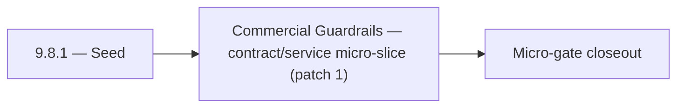

# 9.8.1 — Seed

- **Era:** `9.x` ecosystem integrations — hub [`versions.md`](../versions.md) · minors start at [`9.0 — Ecosystem Foundation`](9.0%20%E2%80%94%20Ecosystem%20Foundation.md)
- **Minor:** [9.8 — Commercial Guardrails](./9.8 — Commercial Guardrails.md)
- **Codename:** Seed
- **Status:** ✅ Completed
## Focus
Commercial Guardrails — contract/service micro-slice (patch 1)

## Flowchart

## Micro-gate

| Track | Gate question | Answer / Evidence (fill at patch closeout) |
| --- | --- | --- |
| **Contract** | Connector lifecycle, entitlement model — `docs/backend/apis/` + integration matrices updated? | Document at patch closeout. |
| **Service** | Multi-tenant enforcement, connector adapters, webhook delivery — parity + smoke documented? | Document smoke paths. |
| **Surface** | Integrations UI, marketplace/admin, self-serve flows — delta? | Document UX delta or N/A. |
| **Frontend** | `docs/frontend/` hooks, partner surfaces, extension/email integrations touched? | Commercial guardrails — usage caps, billing alignment, partner terms. Document at closeout. |
| **Data** | Tenant lineage, `connector_id`, entitlement tables — `docs/backend/database/`? | Document lineage or N/A. |
| **Ops** | SLA runbooks, partner onboarding, `connectors-commercial.md` / integration RC evidence — delta? | Document ops delta or N/A. |

## Tasks
### Contract
- 📌 Planned: **[appointment360]** — refine duplicate task (was: ✅ completed: 📌 planned: **app**: define v9.8 contract outcom…) | patch `9.8.1` band `1` | reason: specialize this file vs sibling patches; see docs/codebases/appointment360-codebase-analysis.md
- 📌 Planned: **[appointment360]** — refine duplicate task (was: ✅ completed: 📌 planned: **mailvetter**: define v9.8 contract…) | patch `9.8.1` band `1` | reason: specialize this file vs sibling patches; see docs/codebases/appointment360-codebase-analysis.md
- 📌 Planned: **[appointment360]** — refine duplicate task (was: ✅ completed: 📌 planned: freeze connector-facing request/resp…) | patch `9.8.1` band `1` | reason: specialize this file vs sibling patches; see docs/codebases/appointment360-codebase-analysis.md
- 📌 Planned: **[appointment360]** — refine duplicate task (was: ✅ completed: 📌 planned: document tenant isolation guarantees…) | patch `9.8.1` band `1` | reason: specialize this file vs sibling patches; see docs/codebases/appointment360-codebase-analysis.md

### Service
- 📌 Planned: **[appointment360]** — refine duplicate task (was: ✅ completed: 📌 planned: **app**: deliver v9.8 service outcom…) | patch `9.8.1` band `1` | reason: specialize this file vs sibling patches; see docs/codebases/appointment360-codebase-analysis.md
- 📌 Planned: **[appointment360]** — refine duplicate task (was: ✅ completed: 📌 planned: **mailvetter**: deliver v9.8 service…) | patch `9.8.1` band `1` | reason: specialize this file vs sibling patches; see docs/codebases/appointment360-codebase-analysis.md
- 📌 Planned: **[appointment360]** — refine duplicate task (was: ✅ completed: 📌 planned: enforce tenant filter injection befo…) | patch `9.8.1` band `1` | reason: specialize this file vs sibling patches; see docs/codebases/appointment360-codebase-analysis.md
- 📌 Planned: **[appointment360]** — refine duplicate task (was: ✅ completed: 📌 planned: implement connector adapter: standar…) | patch `9.8.1` band `1` | reason: specialize this file vs sibling patches; see docs/codebases/appointment360-codebase-analysis.md

### Surface

- ✅ Completed: 📌 Planned: **[app]** — Verify UX for route `/email` and bindings (patch 9.8.1 band 1) | area: `frontend-page` | files: `contact360.io/app/...` | reason: Dashboard/extension surface for era 9 must match gateway contracts

### Data

- 📌 Planned: **[appointment360]** — refine duplicate task (was: ✅ completed: 📌 planned: **[appointment360]** — update postgr…) | patch `9.8.1` band `1` | reason: specialize this file vs sibling patches; see docs/codebases/appointment360-codebase-analysis.md

### Ops

- ✅ Completed: 📌 Planned: **[platform]** — Record smoke evidence, rollback, and alerts (patch band 1: charter/P0) | area: `ops` | files: `docs/commands/`, `.github/workflows/` | reason: Smoke, rollback, and observability for patch 9.8.1

## Service task slices
> Merged from era `9.x` ecosystem productization task packs (P0→`.0`–`.2`, P1→`.3`–`.6`, Ops→`.7`–`.9`).

### logs.api
- Freeze 9.x logging schema additions and compatibility notes for partner and tenant observability.
- Define 9.x audit export contract for support and compliance bundles.
- Align endpoint references in `docs/backend/endpoints/logsapi_endpoint_era_matrix.json`.
- Define traceability field contract (`tenant_id`, `request_id`, `trace_id`, `connector_id`, `event_type`).
- Implement/validate event ingestion and query behavior in `app/services/log_service.py`.
- Add tenant-safe filtering defaults for query/search/stat endpoints.
- Verify auth and error envelope behavior for gateway and service consumers.
- Add audit-bundle export path with bounded query window and deterministic CSV formatting.
- Document tenant-prefixed S3 CSV object convention and lineage.
- Define retention policy and archive expectations per tenant tier.
- Record SLA evidence table expectations for incident and monthly reliability reports.

### Appointment360 (gateway)
- Define NotificationQuery { notifications() }
- Define NotificationMutation { markNotificationRead(id), markAllRead }
- Define AnalyticsQuery { analytics(dateRange, granularity, metrics) }
- Define AnalyticsMutation { trackEvent(type, metadata) }
- Define AdminQuery { adminStats(), paymentSubmissions(), users() } (SuperAdmin-only)
- Define AdminMutation { creditUser, adjustCredits, approvePayment, declinePayment } (SuperAdmin-only)
- Implement notifications service: create, list, mark-read in app/services/notification.py
- Implement trackEvent mutation: write to events table with user_uuid, type, metadata
- Implement adminStats(): aggregated counts (users, contacts, jobs, revenue) for SuperAdmin
- Add require_super_admin() guard for all admin mutations
- Notification bell icon → query notifications() polling every 30s
- Notification drop-down → mutation markNotificationRead on click
- Admin panel → query adminStats() + mutation creditUser
- useNotifications hook: polling, badge count, mark-read
- useAdminPanel hook: manage user credit adjustments, approve payments
- Create notifications table: uuid, user_uuid, type, message, is_read, created_at
- Create events table: uuid, user_uuid, type, metadata JSON, created_at
- Run Alembic migration for all 9.x tables

### Emailcampaign
- Org exceeding campaign send limit receives 429 with descriptive limit error.
- Suppression list import accepts CSV with 10k+ emails without timeout.
- HubSpot unsubscribe webhook adds contact to Contact360 suppression list.
- Sender domain DKIM verification status visible in settings UI.

### contact.ai
- Define Contact AI connector spec for external integration platforms (Zapier, Make, HubSpot).
- Define webhook contract for async AI results: `{event: "ai_result", chat_id, result, timestamp}`.
- Document multi-tenant isolation: each tenant's `ai_chats` data is fully isolated by `user_id`/`organization_id`.
- Define connector auth model: connector keys separate from user keys; documented in API key management.
- Implement webhook delivery: on AI response completion, POST result to registered webhook URL.
- Implement connector adapter: standardized input/output format for external platform integrations.
- Implement organization-level AI usage aggregation (for tenant billing/quota).
- Add `organization_id` to `ai_chats` if multi-tenant isolation requires org-level partitioning.
- If `organization_id` added: migration file to add column to `ai_chats`; update `contact_ai_data_lineage.md`.
- Webhook delivery log schema: `{webhook_id, chat_id, payload_hash, status_code, retries, timestamp}`.

## Evidence gate
Patch closeout includes contract diff, smoke output, data lineage delta, and ops note
