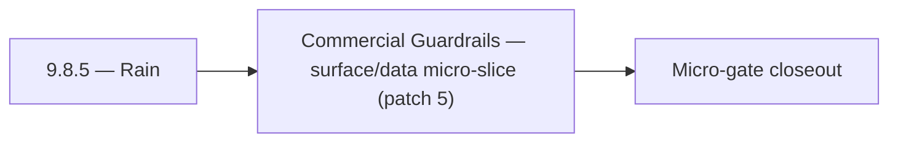

# 9.8.5 — Rain

- **Era:** `9.x` ecosystem integrations — hub [`versions.md`](../versions.md) · minors start at [`9.0 — Ecosystem Foundation`](9.0%20%E2%80%94%20Ecosystem%20Foundation.md)
- **Minor:** [9.8 — Commercial Guardrails](./9.8 — Commercial Guardrails.md)
- **Codename:** Rain
- **Status:** ✅ Completed
## Focus
Commercial Guardrails — surface/data micro-slice (patch 5)

## Flowchart

## Micro-gate

| Track | Gate question | Answer / Evidence (fill at patch closeout) |
| --- | --- | --- |
| **Contract** | Connector lifecycle, entitlement model — `docs/backend/apis/` + integration matrices updated? | Document at patch closeout. |
| **Service** | Multi-tenant enforcement, connector adapters, webhook delivery — parity + smoke documented? | Document smoke paths. |
| **Surface** | Integrations UI, marketplace/admin, self-serve flows — delta? | Document UX delta or N/A. |
| **Frontend** | `docs/frontend/` hooks, partner surfaces, extension/email integrations touched? | Commercial guardrails — usage caps, billing alignment, partner terms. Document at closeout. |
| **Data** | Tenant lineage, `connector_id`, entitlement tables — `docs/backend/database/`? | Document lineage or N/A. |
| **Ops** | SLA runbooks, partner onboarding, `connectors-commercial.md` / integration RC evidence — delta? | Document ops delta or N/A. |

## Tasks
### Surface
- ✅ Completed: 📌 Planned: **app**: shape v9.8 surface outcomes for workspace policy bundles; refine user-facing copy for outcomes and recovery paths in `contact360.io/app` while advancing self-serve controls.
- ✅ Completed: 📌 Planned: **admin**: shape v9.8 surface outcomes for workspace policy bundles; streamline admin controls for triage and overrides in `contact360.io/admin` while advancing workspace policy bundles.
- ✅ Completed: 📌 Planned: **emailapigo**: shape v9.8 surface outcomes for workspace policy bundles; clarify Go service diagnostics in integration touchpoints in `lambda/emailapigo` while advancing workspace policy bundles.
- ✅ Completed: `docs/frontend/components.md`

### Data
- ✅ Completed: 📌 Planned: **app**: anchor v9.8 data outcomes for workspace policy bundles; capture UI telemetry fields mapped to backend events in `contact360.io/app` while advancing self-serve controls.
- ✅ Completed: 📌 Planned: **admin**: anchor v9.8 data outcomes for workspace policy bundles; track governance events with immutable audit attributes in `contact360.io/admin` while advancing workspace policy bundles.
- ✅ Completed: 📌 Planned: **emailapigo**: anchor v9.8 data outcomes for workspace policy bundles; maintain Go-path trace continuity across provider hops in `lambda/emailapigo` while advancing workspace policy bundles.
- ✅ Completed: 📌 Planned: Define audit table expectations for UUID collisions, dedup merges, and replay attempts.

### Contract

- ✅ Completed: 📌 Planned: **[appointment360]** — Diff and document schema for operations like ConnectraClient, LAMBDA_AI_API_URL, LAMBDA_CONNECTRA_API_URL; align with roadmap | area: `backend-api` | files: `docs/backend/apis/*.md`, `contact360.io/api/app/graphql/schema.py` | reason: Keep GraphQL/REST contracts aligned for era 9.5 patch 9.8.5

### Service

- ✅ Completed: 📌 Planned: **[appointment360]** — Service slice: - [ ] 🟡 In Progress: notifications, saved searches, and connector module foundations exist. | area: `backend-api` | files: `contact360.io/api/app/graphql/modules/`, `contact360.io/api/app/clients/` | reason: Implement or verify runtime behavior for - [ ] 🟡 In Progress: notifications, saved searches, and connector module foundat

### Ops

- ✅ Completed: 📌 Planned: **[platform]** — Record smoke evidence, rollback, and alerts (patch band 5: surface/data) | area: `ops` | files: `docs/commands/`, `.github/workflows/` | reason: Smoke, rollback, and observability for patch 9.8.5

## Service task slices
> Merged from era `9.x` ecosystem productization task packs (P0→`.0`–`.2`, P1→`.3`–`.6`, Ops→`.7`–`.9`).

### logs.api
- Document impacted pages/tabs/components for audit and integrations evidence views.
- Document hooks/services/contexts for logs and diagnostics flows in frontend bindings.
- Define UX states for long-running evidence exports (queued, ready, failed, expired).
- Add operator-facing wording for trace correlation and redaction-safe support workflows.
- Document tenant-prefixed S3 CSV object convention and lineage.
- Define retention policy and archive expectations per tenant tier.
- Record SLA evidence table expectations for incident and monthly reliability reports.
- Update lineage reference in `docs/backend/database/logsapi_data_lineage.md`.
- Implement/validate event ingestion and query behavior in `app/services/log_service.py`.
- Add tenant-safe filtering defaults for query/search/stat endpoints.
- Verify auth and error envelope behavior for gateway and service consumers.
- Add audit-bundle export path with bounded query window and deterministic CSV formatting.

### Appointment360 (gateway)
- Define FeatureOverviewQuery { featureOverview() } returning era/feature matrix
- Define tenant model: Workspace / Organization type with multi-tenant guards
- Document tenant entitlement enforcement contract in docs/governance.md
- Implement analytics service: aggregate event counts from events table
- Implement featureOverview(): return feature flags / credits matrix per plan
- Wire notifications polling in background task: dispatch on billing events, job completions
- Add plan-based entitlement guard: require_plan_feature(info, feature)
- Webhook support: outbound webhook on job completion / campaign send
- Analytics dashboard page → query analytics(...) with date range picker
- Feature overview page (pricing/plan) → query featureOverview()
- Plan upgrade modal → triggered by require_plan_feature guard response
- Create feature_flags table: feature, plan_id, enabled, credit_cost
- Create workspaces table for multi-tenant model: uuid, name, owner_uuid, plan_id
- Configure webhook secret WEBHOOK_SECRET for outbound events
- Write test: trackEvent → query analytics round-trip
- Write test: notifications() → markAllRead → notifications() = []
- Load test admin panel with 10,000 user dataset
- Document multi-tenant entitlement enforcement in ops runbook

### Emailcampaign
- Org exceeding campaign send limit receives 429 with descriptive limit error.
- Suppression list import accepts CSV with 10k+ emails without timeout.
- HubSpot unsubscribe webhook adds contact to Contact360 suppression list.
- Sender domain DKIM verification status visible in settings UI.

### contact.ai
- Integration panel in dashboard: AI-powered connectors configuration (webhook URL, trigger events).
- Connector card: shows AI connector status (active/inactive), last delivery, error rate.
- Webhook delivery log: show recent deliveries, status codes, retry count per webhook.
- If `organization_id` added: migration file to add column to `ai_chats`; update `contact_ai_data_lineage.md`.
- Webhook delivery log schema: `{webhook_id, chat_id, payload_hash, status_code, retries, timestamp}`.
- Connector audit trail: log all connector-initiated AI calls with `source: "connector"` tag.
- Implement webhook delivery: on AI response completion, POST result to registered webhook URL.
- Implement connector adapter: standardized input/output format for external platform integrations.
- Implement organization-level AI usage aggregation (for tenant billing/quota).
- Add `organization_id` to `ai_chats` if multi-tenant isolation requires org-level partitioning.

## Evidence gate
Patch closeout includes contract diff, smoke output, data lineage delta, and ops note
