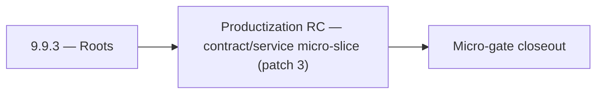

# 9.9.3 — Roots

- **Era:** `9.x` ecosystem integrations — hub [`versions.md`](../versions.md) · minors start at [`9.0 — Ecosystem Foundation`](9.0%20%E2%80%94%20Ecosystem%20Foundation.md)
- **Minor:** [9.9 — Productization RC](./9.9 — Productization RC.md)
- **Codename:** Roots
- **Status:** ✅ Completed
## Focus
Productization RC — contract/service micro-slice (patch 3)

## Flowchart

## Micro-gate

| Track | Gate question | Answer / Evidence (fill at patch closeout) |
| --- | --- | --- |
| **Contract** | Connector lifecycle, entitlement model — `docs/backend/apis/` + integration matrices updated? | Document at patch closeout. |
| **Service** | Multi-tenant enforcement, connector adapters, webhook delivery — parity + smoke documented? | Document smoke paths. |
| **Surface** | Integrations UI, marketplace/admin, self-serve flows — delta? | Document UX delta or N/A. |
| **Frontend** | `docs/frontend/` hooks, partner surfaces, extension/email integrations touched? | Productization RC — `integration-era-rc.md` / cross-service ecosystem gate. Document at closeout. |
| **Data** | Tenant lineage, `connector_id`, entitlement tables — `docs/backend/database/`? | Document lineage or N/A. |
| **Ops** | SLA runbooks, partner onboarding, `connectors-commercial.md` / integration RC evidence — delta? | Document ops delta or N/A. |

## Tasks
### Contract
- ✅ Completed: 📌 Planned: **sync**: define v9.9 contract outcomes for self-serve controls; stabilize sync payload mapping and delta semantics in `contact360.io/sync` while advancing tenant config overlays.
- ✅ Completed: 📌 Planned: **emailapigo**: define v9.9 contract outcomes for self-serve controls; enforce Go adapter contract parity with shared models in `lambda/emailapigo` while advancing self-serve controls.
- ✅ Completed: `POST /companies/batch-upsert`
- ✅ Completed: 📌 Planned: Define Contact AI connector spec for external integration platforms (Zapier, Make, HubSpot).

### Service
- ✅ Completed: 📌 Planned: **sync**: deliver v9.9 service outcomes for self-serve controls; tighten replication loops and conflict-resolution behavior in `contact360.io/sync` while advancing tenant config overlays.
- ✅ Completed: 📌 Planned: **emailapigo**: deliver v9.9 service outcomes for self-serve controls; optimize Go runtime execution path and error wrapping in `lambda/emailapigo` while advancing self-serve controls.
- ✅ Completed: 📌 Planned: Add fairness controls for mixed-tenant high-volume batch upsert traffic.
- ✅ Completed: 📌 Planned: Add `organization_id` to `ai_chats` if multi-tenant isolation requires org-level partitioning.

### Surface

- ✅ Completed: 📌 Planned: **[app]** — Verify UX for route `/email` and bindings (patch 9.9.3 band 3) | area: `frontend-page` | files: `contact360.io/app/...` | reason: Dashboard/extension surface for era 9 must match gateway contracts

### Data

- ✅ Completed: 📌 Planned: **[appointment360]** — Update PostgreSQL/ES/S3 lineage notes if this patch touches persistence or exports | area: `data-lineage` | files: `docs/backend/database/`, `migrations/` | reason: Migrations, indexes, and lineage evidence for this patch

### Ops

- ✅ Completed: 📌 Planned: **[platform]** — Record smoke evidence, rollback, and alerts (patch band 3: surface/data) | area: `ops` | files: `docs/commands/`, `.github/workflows/` | reason: Smoke, rollback, and observability for patch 9.9.3

## Service task slices
> Merged from era `9.x` ecosystem productization task packs (P0→`.0`–`.2`, P1→`.3`–`.6`, Ops→`.7`–`.9`).

### Appointment360 (gateway)
- Define FeatureOverviewQuery { featureOverview() } returning era/feature matrix
- Define tenant model: Workspace / Organization type with multi-tenant guards
- Document tenant entitlement enforcement contract in docs/governance.md
- Implement analytics service: aggregate event counts from events table
- Implement featureOverview(): return feature flags / credits matrix per plan
- Wire notifications polling in background task: dispatch on billing events, job completions
- Add plan-based entitlement guard: require_plan_feature(info, feature)
- Webhook support: outbound webhook on job completion / campaign send
- Analytics dashboard page → query analytics(...) with date range picker
- Feature overview page (pricing/plan) → query featureOverview()
- Plan upgrade modal → triggered by require_plan_feature guard response
- Create feature_flags table: feature, plan_id, enabled, credit_cost
- Create workspaces table for multi-tenant model: uuid, name, owner_uuid, plan_id
- Configure webhook secret WEBHOOK_SECRET for outbound events
- Write test: trackEvent → query analytics round-trip
- Write test: notifications() → markAllRead → notifications() = []
- Load test admin panel with 10,000 user dataset
- Document multi-tenant entitlement enforcement in ops runbook

### Connectra
- Expose tenant quota and connector health signals to integrations/admin surfaces in:
- `docs/frontend/README.md`
- `docs/frontend/components.md`
- `docs/frontend/hooks-services-contexts.md`
- Define user-facing messaging for quota blocked / degraded connector outcomes.
- Add support-facing reconciliation view requirements for created-vs-updated entity counts.
- Store tenant usage aggregates for billing, quota, and SLA reporting.
- Persist connector lineage fields: `tenant_id`, `connector_id`, `source`, `session_id`, `trace_id`.
- Define audit table expectations for UUID collisions, dedup merges, and replay attempts.
- Add per-tenant quota/throttle middleware for heavy query/export workloads.
- Enforce tenant filter injection before VQL execution in route handlers under `app/api/routes/`.
- Validate UUID5 dedup behavior and ensure connector ingestion is replay-safe under retries.
- Add fairness controls for mixed-tenant high-volume batch upsert traffic.

### contact.ai
- Integration panel in dashboard: AI-powered connectors configuration (webhook URL, trigger events).
- Connector card: shows AI connector status (active/inactive), last delivery, error rate.
- Webhook delivery log: show recent deliveries, status codes, retry count per webhook.
- If `organization_id` added: migration file to add column to `ai_chats`; update `contact_ai_data_lineage.md`.
- Webhook delivery log schema: `{webhook_id, chat_id, payload_hash, status_code, retries, timestamp}`.
- Connector audit trail: log all connector-initiated AI calls with `source: "connector"` tag.
- Implement webhook delivery: on AI response completion, POST result to registered webhook URL.
- Implement connector adapter: standardized input/output format for external platform integrations.
- Implement organization-level AI usage aggregation (for tenant billing/quota).
- Add `organization_id` to `ai_chats` if multi-tenant isolation requires org-level partitioning.

### emailapis / emailapigo
- Bind integrations UX to runtime diagnostics:
- `docs/frontend/emailapis-ui-bindings.md`
- `docs/frontend/components.md`
- `docs/frontend/hooks-services-contexts.md`
- Define user-facing status vocabulary for email connector outcomes (`success`, `partial_success`, `quota_blocked`, `provider_degraded`).
- Add connector health and fallback explanation copy for settings and integrations pages.
- Document loading/error/progress patterns for bulk operations and webhook-triggered runs.
- Document 9.x lineage changes for `email_finder_cache` and `email_patterns` in `docs/backend/database`.
- Record per-request provider decision lineage (`provider`, `fallback_provider`, `status`, `latency_ms`, `tenant_id`, `trace_id`).
- Add tenant-safe usage attribution fields required for commercial metering reconciliation.
- Implement entitlement-aware execution guard for finder/verifier paths (per-tenant caps before provider fanout).
- Align provider orchestration behavior between runtimes (mailvetter/icypeas/truelist fallback order and timeout windows).
- Validate auth behavior (`X-API-Key` and gateway-issued context headers) across both runtimes.
- Add deterministic idempotency key support for bulk finder/verifier requests to avoid duplicate partner billing.

### Emailcampaign
- Org exceeding campaign send limit receives 429 with descriptive limit error.
- Suppression list import accepts CSV with 10k+ emails without timeout.
- HubSpot unsubscribe webhook adds contact to Contact360 suppression list.
- Sender domain DKIM verification status visible in settings UI.

### Jobs
- Document tenant quota cards, entitlement warnings, and escalation controls in jobs UI bindings.
- Define tenant-filtered jobs tables and timeline views for admin/operator users.
- Add workflow messaging for `quota_exhausted`, `tenant_blocked`, and `retry_deferred` states.
- Record `tenant_id` and entitlement snapshot in `job_node` lifecycle lineage.
- Define isolation boundary expectations for `job_events`, DAG edges, and metrics.
- Add reconciliation evidence model for quota decisions vs observed scheduler behavior.
- Implement entitlement checks at create/retry boundaries in:
- `app/services/job_service.py`
- `app/workers/scheduler.py`
- Add fairness-aware tenant partitioning policy in scheduler queue dispatch.
- Add processor-level quota guard hooks in `app/processors/` registry.
- Ensure tenant context propagation across scheduler -> worker -> processor -> event timeline.

### logs.api
- Document impacted pages/tabs/components for audit and integrations evidence views.
- Document hooks/services/contexts for logs and diagnostics flows in frontend bindings.
- Define UX states for long-running evidence exports (queued, ready, failed, expired).
- Add operator-facing wording for trace correlation and redaction-safe support workflows.
- Document tenant-prefixed S3 CSV object convention and lineage.
- Define retention policy and archive expectations per tenant tier.
- Record SLA evidence table expectations for incident and monthly reliability reports.
- Update lineage reference in `docs/backend/database/logsapi_data_lineage.md`.
- Implement/validate event ingestion and query behavior in `app/services/log_service.py`.
- Add tenant-safe filtering defaults for query/search/stat endpoints.
- Verify auth and error envelope behavior for gateway and service consumers.
- Add audit-bundle export path with bounded query window and deterministic CSV formatting.

### Mailvetter
- Admin partner dashboard: webhook delivery health and failure reasons.
- Partner key management screens in product admin.
- Add `webhook_delivery_log` and `connector_events` tables.
- Add tenant usage aggregates and SLA evidence tables.
- Add webhook dead-letter and replay API.
- Add partner connector adapters for downstream systems.
- Add tenant-aware quotas and fairness controls.

### S3Storage
- Define UX contract for storage entitlement failures (`quota_exhausted`, `size_limit_exceeded`, `plan_restricted`).
- Document impacted pages/components/hooks in:
- `docs/frontend/s3storage-ui-bindings.md`
- `docs/frontend/components.md`
- `docs/frontend/hooks-services-contexts.md`
- Add operator workflow expectations for override and support triage paths.
- Add tenant cost attribution fields to storage lineage and usage exports.
- Add residency metadata requirements for regulated tenant storage domains.
- Define metadata.json lineage fields for entitlement decision traceability.
- Update data lineage references in `docs/backend/database` for 9.x storage changes.
- Enforce plan-aware limits and throttling in `app/services/storage_service.py`.
- Add tenant context validation for object key namespace and bucket prefix routing.
- Validate multipart upload controls for quota-aware part counts and finalization.
- Add integration-safe diagnostics around metadata worker handoff and failures.

### Salesnavigator
- Integrations page: `/settings/integrations`
- SN integration card: status (connected/disconnected), last sync, profiles saved
- HubSpot/Salesforce connector card (future): "Import contacts" action
- Webhook delivery log: per integration, show last 10 webhook events (success/failure)
- Connector health card: live status indicator (green/yellow/red)
- Sync history: cross-source view — SN, HubSpot, manual import in one timeline
- Tenant-isolated lineage: `{tenant_id, source, session_id, lead_ids[], timestamp}` per session
- Connector audit trail: each connector event logged to `connector_events` table
- Webhook delivery log: `{webhook_id, session_id, status, attempts, last_error, delivered_at}`
- Adapter layer: normalize partner profile payload → `SaveProfilesRequest` schema
- Webhook delivery: POST `SaveProfilesResponse` to `webhook_url` on save completion (configurable per API key)
- Webhook retry: 3 attempts, exponential backoff, dead-letter log on final failure
- Tenant-isolated ingestion: tag all Connectra writes with `tenant_id` from API key context

## Evidence gate
Patch closeout includes contract diff, smoke output, data lineage delta, and ops note
