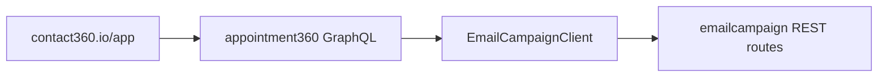

# Appointment360 Task Pack (10.x)

Codebase: `contact360.io/api`

## Core gap and required additions

| Task | File path | Patch |
| --- | --- | --- |
| Register campaigns GraphQL module | `app/graphql/schema.py` | `10.A.0` |
| Register sequences GraphQL module | `app/graphql/schema.py` | `10.A.0` |
| Register templates GraphQL module | `app/graphql/schema.py` | `10.A.0` |
| Add `EmailCampaignClient` | `app/clients/email_campaign_client.py` | `10.A.1` |
| Remove debug file writes from legacy email query path | `app/graphql/modules/email/queries.py` | `10.A.1` |

## Contract surface

- `campaigns`, `campaign`, `createCampaign`, `pauseCampaign`, `resumeCampaign`
- `sequences`, `sequence`, `createSequence`
- `campaignTemplates`, `createCampaignTemplate`

References:

- `docs/backend/apis/22_CAMPAIGNS_MODULE.md`
- `docs/backend/apis/24_SEQUENCES_MODULE.md`
- `docs/backend/apis/25_CAMPAIGN_TEMPLATES_MODULE.md`

## Routing flow

## Release checklist

- [ ] GraphQL schema exports all 3 campaign modules.
- [ ] Client retries and error mapping documented.
- [ ] Postman coverage includes campaign, sequence, template flows.
