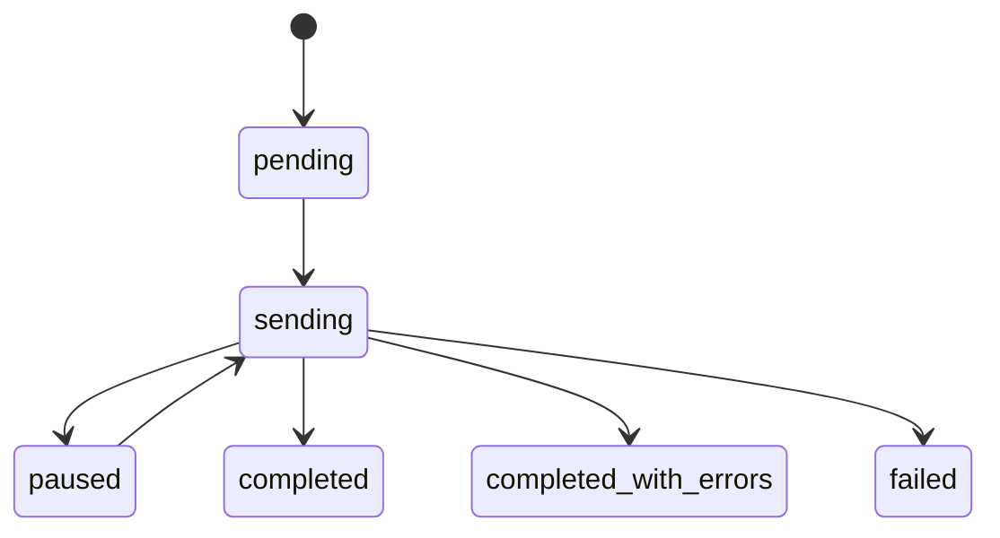

# Campaign Execution Engine (10.x)

## Asynq task contract

- Task: `campaign:send`
- Queue: `default`
- Max retry: `3`
- Timeout: `30m`
- Worker runtime: `cmd/worker/main.go`
- Fan-out model: 5 goroutines + channel + `sync.WaitGroup`

## State machine

## Idempotency and retry

- Idempotency key: `(campaign_id, recipient_email)` persisted for retry window.
- Transient error: exponential backoff retry.
- Permanent error: mark recipient failed and continue.
- Campaign terminal state:
  - `completed` when `failed = 0`
  - `completed_with_errors` when `failed > 0`

## Pause and resume checkpoints

- Pause: prevent new recipient dispatch; keep current in-flight completion bounded.
- Resume: restart from recipient checkpoint (`status = pending`) without resending `status = sent`.

## 10.x patch delivery mapping

- `10.A.4`: flow/graph orchestration.
- `10.A.6`: reliability hardening (DLQ, pause/resume, retry budget).
