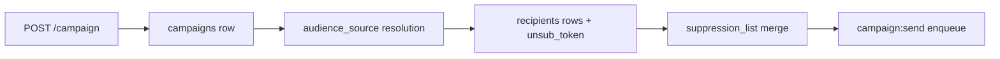

# Campaign Foundation (10.x)

## Core entities and fields

- `campaigns`: `id`, `title`, `status`, `audience_source`, `segment_id`, `vql_query`, `user_id`, `org_id`, `total`, `sent`, `failed`, `scheduled_at`, `created_at`.
- `recipients`: `id`, `campaign_id`, `email`, `name`, `status`, `error`, `unsub_token`, `sent_at`.
- `suppression_list`: `email`, `reason`, `created_at`.
- `templates`: `id`, `name`, `subject`, `s3_key`, `created_at`, `updated_at`.

## Campaign contract baseline

- Route: `POST /campaign`
- Audience sources: `csv | segment | vql | sn_batch`
- Status vocabulary: `pending | sending | completed | completed_with_errors | failed | paused`
- Required policy checks before enqueue:
  - suppression filter pass
  - consent/compliance pass
  - template render validation pass
  - sender domain readiness pass

## Policy gate checklist

- 📌 Planned: `template_id` resolves and template render succeeds.
- 📌 Planned: Audience source resolves deterministically (no partial imports).
- 📌 Planned: Suppression merge applied before recipient insert.
- 📌 Planned: `unsub_token` generated per recipient.
- 📌 Planned: JWT claims (`org_id`, `user_id`) attached for audit lineage.

## Entity flow

## 10.x patch delivery mapping

- `10.A.0`: contract + schema freeze.
- `10.A.1`: service implementation path.
- `10.A.2`: lineage and drift remediation.
- `10.A.3`: UI binding to campaign foundation entities.
