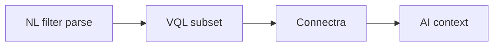

# Connectra AI task pack (`5.x`)

## Scope

Expose AI-consumable search and enrichment data from **Connectra** (`contact360.io/sync`) safely and consistently. Connectra Era `5.x` focus: **AI-readable attributes**, enrichment lookup paths, and **tenant-safe** VQL.

**Reference:** [`docs/codebases/connectra-codebase-analysis.md`](../codebases/connectra-codebase-analysis.md) (Era `5.x` row: AI workflows).

---

## Contract track

- [ ] **AI-facing field whitelist:** Document stable fields (names + types) for contacts/companies that may be embedded in prompts or tool results; exclude sensitive or volatile columns by default.
- [ ] **Confidence metadata expectations:** When enrichment or scoring produces confidence, define JSON shape and where it lives on hydrated records.
- [ ] **VQL AI-safe subset:** Allowlist operators and max row caps for filters produced by Contact AI `parse-filters` / NL → VQL (coordinate with [`version_5.2.md`](version_5.2.md) and [`version_5.10.md`](version_5.10.md)).
- [ ] **Tenant isolation:** Assert every AI-originated query path resolves through tenant-scoped API keys and cannot bypass filter predicates.

## Service track

- [ ] Ensure **Connectra query outputs** include whitelist fields and optional confidence for AI chat/assist pipelines.
- [ ] Prevent **over-fetch** on AI tool calls: default pagination and field projection for AI profile.
- [ ] Validate **two-phase read** (ES ids → PG hydrate) returns consistent shapes for AI consumers.
- [ ] Performance guardrails: rate limits compatible with AI-driven query bursts ([`version_5.3.md`](version_5.3.md)).

## Database / data track

- [ ] **Enrichment artifact lineage:** Link enrichment outputs to source entities (contact/company uuid) for audit and replay.
- [ ] **Elasticsearch mappings:** Confirm AI-dependent fields (e.g. `data_quality_score`, SN provenance) are indexed per [`version_5.5.md`](version_5.5.md).
- [ ] **PostgreSQL authority:** Document which fields are authoritative vs search-only for AI grounding.

## Surface track (downstream)

- [ ] **`contact360.io/root`:** AI workflow storytelling (accuracy, confidence positioning) referencing search-backed claims.
- [ ] **`contact360.io/admin`:** Governance views for data quality and AI eligibility where applicable.
- [ ] **`contact360.io/app`:** Contact/company rows expose only whitelist-backed data to AI side panels.

## Ops track

- [ ] **AI query regression pack:** Golden VQL snippets from `parse-filters` → expected ES + hydrated results.
- [ ] **Cost-impact analysis:** Estimate extra Connectra load from AI features; tune quotas.
- [ ] **Release gate evidence:** Field coverage report, confidence field presence where promised, tenant isolation tests.

## Flow / graph

---

## Completion pointer

Primary doc slice for delivery checklist: [`version_5.10.md`](version_5.10.md) — Connectra Intelligence.
