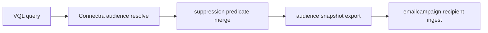

# Connectra Task Pack (10.x)

Codebase: `contact360.io/sync`

## Core implementation queue

| Task | Scope | Patch |
| --- | --- | --- |
| Stabilize VQL audience query contract | VQL parser + resolver | `10.A.0` |
| Add suppression filter as first-class audience predicate | query layer | `10.A.5` |
| Enforce export controls on campaign audience output | export API | `10.A.7` |
| Add audience snapshot lineage metadata | storage/index | `10.A.2` |

## Required outputs

- Deterministic segment resolution from VQL.
- Suppression-aware audience export (no do-not-contact leaks).
- Provenance fields attached: segment id, query hash, generation timestamp.

## Flow handoff

