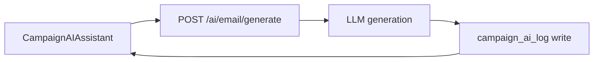

# Contact AI Task Pack (10.x)

Codebase: `backend(dev)/contact.ai`

## Core additions

| Task | Scope | Patch |
| --- | --- | --- |
| Add `POST /api/v1/ai/email/generate` | API contract | `10.A.0` |
| Implement generation service + idempotency | service path | `10.A.1` |
| Add `campaign_ai_log` table | data lineage | `10.A.2` |
| Bind `CampaignAIAssistant` in campaign builder | UI binding | `10.A.3` |

## Contract schema

- Request: `campaign_id`, `subject_hint`, `tone`, `audience_context`.
- Response: `generation_id`, `subject`, `body`, `model_version`, `prompt_template_version`.
- Compliance fields required: `prompt_hash`, `output_hash`, `created_at`.

## Flow

