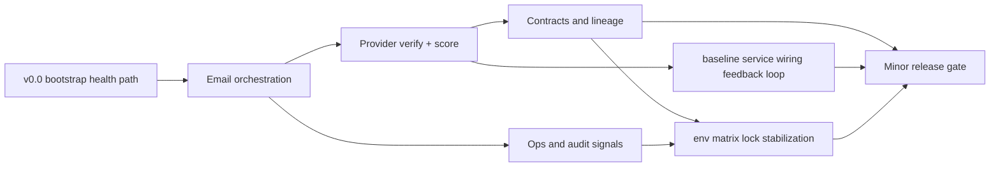
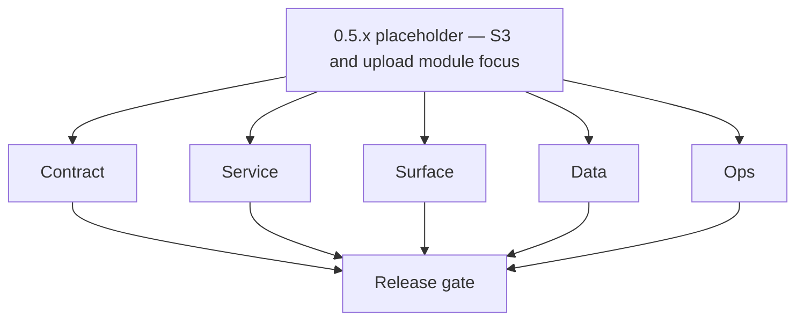
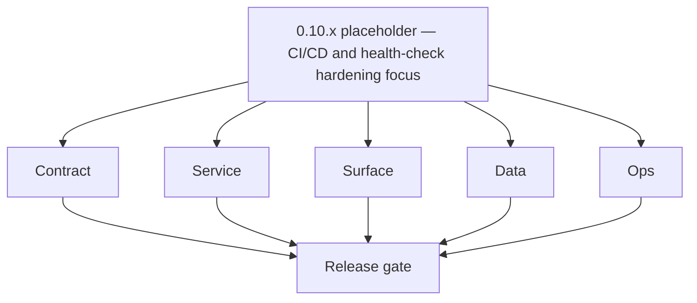
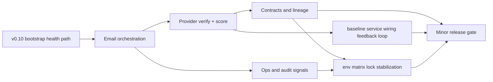

# Documentation content retrieval
_Exported on 3/25/2026 at 01:55:08 GMT+5:30 from Cursor (2.6.21)_

---

**User**

Read the following files and return their full content (or summaries if very long):
1. d:\code\ayan\contact\docs\0. Foundation and pre-product stabilization and codebase setup\0.x-master-checklist.md
2. d:\code\ayan\contact\docs\0. Foundation and pre-product stabilization and codebase setup\README.md
3. d:\code\ayan\contact\docs\0. Foundation and pre-product stabilization and codebase setup\0.0 — Pre-repo baseline.md (first 100 lines)
4. d:\code\ayan\contact\docs\0. Foundation and pre-product stabilization and codebase setup\0.5 — Object storage plane.md (first 80 lines)
5. d:\code\ayan\contact\docs\0. Foundation and pre-product stabilization and codebase setup\0.10 — Ship & ops hardening.md (first 80 lines)
6. d:\code\ayan\contact\docs\0. Foundation and pre-product stabilization and codebase setup\appointment360-foundation-task-pack.md (first 80 lines)
7. d:\code\ayan\contact\docs\0. Foundation and pre-product stabilization and codebase setup\s3storage-foundation-task-pack.md (first 80 lines)

Return the raw content for each file.

---

**Cursor**


Reading the requested files in parallel.


Here is the **raw content** from each path. Paths are absolute as requested.

---

### 1. `d:\code\ayan\contact\docs\0. Foundation and pre-product stabilization and codebase setup\0.x-master-checklist.md` (full)

```markdown
# Contact360 `0.x` foundation — shared release checklist

Use this checklist for every `0.x` minor release plan and evidence bundle. Per-minor **intent and delta** live in `0.N — <Title>.md`; **service-specific work** lives in `*-foundation-task-pack.md` files in this folder.

## Foundation minors — canonical codenames

| Minor | Codename | Notes |
| --- | --- | --- |
| `0.0` | Pre-repo baseline | Placeholder / pre-monorepo narrative only unless product approves `0.0.0` |
| `0.1` | Monorepo bootstrap | Shipped baseline — see `docs/versions.md` → `0.1.0` |
| `0.2` | Schema & migration bedrock | Alembic, DB separation, migration CI |
| `0.3` | Service mesh contracts | Gateway clients, timeouts, error shape, API keys |
| `0.4` | Identity & RBAC freeze | JWT, roles, credit hooks |
| `0.5` | Object storage plane | `s3storage`, uploads, multipart |
| `0.6` | Async job spine | `contact360.io/jobs`, Kafka, DAG baseline |
| `0.7` | Search & dual-write substrate | Connectra, ES, VQL |
| `0.8` | UX shell & docs mirror | `contact360.io/app`, DocsAI constant sync |
| `0.9` | Extension channel scaffold | Extension + Sales Navigator skeleton |
| `0.10` | Ship & ops hardening | **Foundation exit gate:** CI/CD, health probes, secrets, compose/SAM before heavy `1.x` delivery |

## Patch codename index (all 0.x minors)

> Each minor has 10 patches (`.0`–`.9`). Full checklists live in the respective `0.N — <Title>.md` file.
> Codename themes: 0.0 = plant growth · 0.1 = forge/metalwork · 0.2 = geology · 0.3 = textile · 0.4 = locksmith · 0.5 = maritime · 0.6 = industrial · 0.7 = data layers · 0.8 = architecture/glass · 0.9 = broadcasting

| Patch | `0.0` Plant | `0.1` Forge | `0.2` Geology | `0.3` Textile | `0.4` Locksmith | `0.5` Maritime | `0.6` Industrial | `0.7` Data layers | `0.8` Glass | `0.9` Broadcast |
| --- | --- | --- | --- | --- | --- | --- | --- | --- | --- | --- |
| `.0` | Void | Assembly | Quarry | Lattice | Keystone | Bucket | Queue | Shard | Shell | Manifest |
| `.1` | Seed | Scaffold | Chisel | Thread | Cipher | Upload | Worker | Query | Nav | Content |
| `.2` | Sprout | Forge | Carve | Weave | Badge | Stream | DAG | Write | Portal | Popup |
| `.3` | Roots | Ignite | Layer | Mesh | Guard | Archive | Retry | Scroll | Canvas | Session |
| `.4` | Soil | Link | Stratum | Knot | Vault | Shelf | Timer | Facet | Mirror | Inject |
| `.5` | Rain | Key | Fossil | Fiber | Token | Cache | Drain | Rank | Panel | Scrape |
| `.6` | Stem | Bridge | Bedrock | Twine | Shield | Mirror | Heartbeat | Delta | Card | Send |
| `.7` | Branch | Pulse | Mineral | Cord | Sentinel | Index | Chain | Reindex | Toast | Relay |
| `.8` | Leaf | Sync | Crystal | Net | Lock | Purge | Trace | Drift | Route | Pilot |
| `.9` | Bloom | Seal | Stone | Web | Freeze | Harbor | Spine | Substrate | Glass | Channel |

## Minor → primary task packs (orientation, not exclusive)

| Minor | Primary packs (start here) |
| --- | --- |
| `0.0`–`0.1` | All packs at skeleton level; `appointment360`, `connectra`, `emailapis`, `jobs` |
| `0.2` | `appointment360`, `jobs`, `emailcampaign`, `connectra`, `contact-ai`, `mailvetter` |
| `0.3` | `appointment360`, `emailapis`, `logsapi`, `s3storage`, `contact-ai`, `jobs` |
| `0.4` | `appointment360`, `connectra` (admin/root surfaces) |
| `0.5` | `s3storage`, `appointment360` |
| `0.6` | `jobs` |
| `0.7` | `connectra` |
| `0.8` | `appointment360`, `connectra` (marketing + DocsAI shell) |
| `0.9` | `salesnavigator`, `connectra`, `appointment360` |
| `0.10` | Cross-service ops: every pack’s ops/release gate row |

## Cross-cutting evidence (all minors)

- 🔴 Incompleted: `docs/versions.md` entry updated: status, scope, roadmap mapping, owner
- 🔴 Incompleted: `docs/roadmap.md` stage alignment confirmed (if the minor maps to a stage)
- 🔴 Incompleted: `docs/docsai-sync.md` — if `docs/architecture.md` or `docs/roadmap.md` changed, Django constants mirrored in the same change set
- 🔴 Incompleted: API contract diff or “no API change” note attached
- 🔴 Incompleted: Migration / schema / storage evidence attached (PostgreSQL, Elasticsearch, S3 as applicable)
- 🔴 Incompleted: At least one smoke path documented (request/response or CLI output)
- 🔴 Incompleted: Rollback or “safe to revert” note for this minor

## Data lineage discipline

- **logs.api:** canonical persistence is **S3 CSV** — not MongoDB. Any checklist referencing MongoDB for platform logs is outdated; use `docs/backend/database/logsapi_data_lineage.md` and `lambda/logs.api/docs/api.md`.
- **Lineage path:** document `API → datastore → UI/admin` where the minor touches user-visible behavior.

## Canonical paths (avoid legacy aliases)

- Dashboard app: `contact360.io/app/` (not `contact360/dashboard`)
- GraphQL gateway: `contact360.io/api/`
- Connectra: `contact360.io/sync/`
- Jobs: `contact360.io/jobs/`
- DocsAI: `contact360.io/admin/`
- Extension: `extension/contact360/`

## Service task-pack index

| Service | Pack file |
| --- | --- |
| Appointment360 | `appointment360-foundation-task-pack.md` |
| Connectra | `connectra-foundation-task-pack.md` |
| contact.ai | `contact-ai-foundation-task-pack.md` |
| emailapis / emailapigo | `emailapis-foundation-task-pack.md` |
| Email campaign | `emailcampaign-foundation-task-pack.md` |
| Jobs (tkdjob) | `jobs-foundation-task-pack.md` |
| logs.api | `logsapi-foundation-task-pack.md` |
| Mailvetter | `mailvetter-foundation-task-pack.md` |
| s3storage | `s3storage-foundation-task-pack.md` |
| Sales Navigator | `salesnavigator-foundation-task-pack.md` |

## Related

- Era theme and SemVer: `docs/version-policy.md`, `docs/versions.md`
- System map: `docs/architecture.md`, `docs/codebase.md`
```

---

### 2. `d:\code\ayan\contact\docs\0. Foundation and pre-product stabilization and codebase setup\README.md` (full)

```markdown
# 0. Foundation and pre-product stabilization and codebase setup

## Era theme
- See `docs/version-policy.md` and `docs/versions.md` for canonical theme and release mapping for `0.x`.
- **Minor codenames** (`0.0`–`0.10`): Pre-repo baseline, Monorepo bootstrap, Schema & migration bedrock, Service mesh contracts, Identity & RBAC freeze, Object storage plane, Async job spine, Search & dual-write substrate, UX shell & docs mirror, Extension channel scaffold, Ship & ops hardening — see table in `0.x-master-checklist.md`.

## Service task-pack files
- `appointment360-foundation-task-pack.md`
- `connectra-foundation-task-pack.md`
- `contact-ai-foundation-task-pack.md`
- `emailapis-foundation-task-pack.md`
- `emailcampaign-foundation-task-pack.md`
- `jobs-foundation-task-pack.md`
- `logsapi-foundation-task-pack.md`
- `mailvetter-foundation-task-pack.md`
- `s3storage-foundation-task-pack.md`
- `salesnavigator-foundation-task-pack.md`

## Operational and supporting docs
- `0.x-master-checklist.md` — shared release evidence, canonical paths, task-pack index.

## Version notes
- Version detail files are stored as `version_<major>.<minor>.md` in this folder and indexed from `docs/versions.md`. Use **`0.x-master-checklist.md`** for cross-minor release evidence.
```

---

### 3. `d:\code\ayan\contact\docs\0. Foundation and pre-product stabilization and codebase setup\0.0 — Pre-repo baseline.md` (lines 1–100)

The file continues for many more lines; below is the exact first 100 lines as read from disk.

```markdown
# Version 0.0 — Pre-repo baseline

- **Status:** placeholder — scope not yet approved
- **Era:** 0.x (Foundation and pre-product stabilization)
- **Summary:** Pre-monorepo baseline. Before the Contact360 repository existed, there were no canonical GraphQL modules, Lambda services, or shared data contracts. The first tracked Foundation release in `[docs/versions.md](../versions.md)` is `**0.1.0**` (`0.1 — Monorepo bootstrap.md`), which documents the monorepo bootstrap. A separate `**0.0.0**` entry would only be added if product approves documenting a pre-`0.1` milestone or external prototype work. Cross-service execution pack for this minor across contract, service, surface, data, and ops.
- Shared foundation checklist: `[0.x-master-checklist.md](0.x-master-checklist.md)`

## Scope

- Target minor: `0.0.0` is foundation-only bootstrap work before productized `0.1.0`.
- In scope: baseline contracts, service scaffolding, health checks, local startup, and smoke validation.
- Primary owners: Platform (`api`, `jobs`, `sync`), Product surfaces (`app`, `root`, `extension`), Ops/governance (`admin`, `logs.api`).
- Exclusions: feature expansion (billing maturity, advanced AI quality, enterprise governance, analytics platform).
- Definition of done: all core services start locally with required dependencies and return healthy baseline responses.
- Exit criteria to `0.1.0`: env matrix finalized, error envelope baseline frozen, and cross-service startup report completed.

## Flowchart

Delivery work for this minor follows the five-track model (contract, service, surface, data, ops) through a release gate.


### Runtime focus (unique to this minor)



See also: `[docs/flowchart.md](../flowchart.md)` for system-wide and master views.

## Task tracks

### Contract

- **api**: define v0.0 contract outcomes for bootstrap health path; harden request/response schema boundaries in `contact360.io/api` while advancing baseline service wiring.
- **app**: define v0.0 contract outcomes for bootstrap health path; align UI payload contracts with backend enums in `contact360.io/app` while advancing baseline service wiring.
- **jobs**: define v0.0 contract outcomes for bootstrap health path; lock worker message schema and retry metadata in `contact360.io/jobs` while advancing env matrix lock.
- **sync**: define v0.0 contract outcomes for bootstrap health path; stabilize sync payload mapping and delta semantics in `contact360.io/sync` while advancing baseline service wiring.
- **admin**: define v0.0 contract outcomes for bootstrap health path; formalize control-plane request contracts and guardrails in `contact360.io/admin` while advancing bootstrap health path.
- **mailvetter**: define v0.0 contract outcomes for bootstrap health path; pin verifier payload expectations and score fields in `backend(dev)/mailvetter` while advancing bootstrap health path.
- **emailapis**: define v0.0 contract outcomes for bootstrap health path; normalize provider adapter contract and fallback keys in `lambda/emailapis` while advancing env matrix lock.
- **emailapigo**: define v0.0 contract outcomes for bootstrap health path; enforce Go adapter contract parity with shared models in `lambda/emailapigo` while advancing env matrix lock.

### Service

- **api**: deliver v0.0 service outcomes for bootstrap health path; implement strict handler guards and deterministic branching in `contact360.io/api` while advancing baseline service wiring.
- **app**: deliver v0.0 service outcomes for bootstrap health path; wire client flows to canonical endpoints and failure states in `contact360.io/app` while advancing baseline service wiring.
- **jobs**: deliver v0.0 service outcomes for bootstrap health path; tune queue worker orchestration and idempotent retries in `contact360.io/jobs` while advancing env matrix lock.
- **sync**: deliver v0.0 service outcomes for bootstrap health path; tighten replication loops and conflict-resolution behavior in `contact360.io/sync` while advancing baseline service wiring.
- **admin**: deliver v0.0 service outcomes for bootstrap health path; harden operator workflows and privilege-aware actions in `contact360.io/admin` while advancing bootstrap health path.
- **mailvetter**: deliver v0.0 service outcomes for bootstrap health path; calibrate verdict pipeline stages for stable scoring in `backend(dev)/mailvetter` while advancing bootstrap health path.
- **emailapis**: deliver v0.0 service outcomes for bootstrap health path; improve provider orchestration sequencing and fallback timing in `lambda/emailapis` while advancing env matrix lock.
- **emailapigo**: deliver v0.0 service outcomes for bootstrap health path; optimize Go runtime execution path and error wrapping in `lambda/emailapigo` while advancing env matrix lock.

### Surface

- **api**: shape v0.0 surface outcomes for bootstrap health path; publish clearer API status semantics for consumers in `contact360.io/api` while advancing baseline service wiring.
- **app**: shape v0.0 surface outcomes for bootstrap health path; refine user-facing copy for outcomes and recovery paths in `contact360.io/app` while advancing baseline service wiring.
- **jobs**: shape v0.0 surface outcomes for bootstrap health path; surface job lifecycle visibility for operators in `contact360.io/jobs` while advancing env matrix lock.
- **sync**: shape v0.0 surface outcomes for bootstrap health path; expose sync health indicators and drift signals in `contact360.io/sync` while advancing baseline service wiring.
- **admin**: shape v0.0 surface outcomes for bootstrap health path; streamline admin controls for triage and overrides in `contact360.io/admin` while advancing bootstrap health path.
- **mailvetter**: shape v0.0 surface outcomes for bootstrap health path; present verifier rationale fields for audit readability in `backend(dev)/mailvetter` while advancing bootstrap health path.
- **emailapis**: shape v0.0 surface outcomes for bootstrap health path; expose provider routing outcomes and fallback markers in `lambda/emailapis` while advancing env matrix lock.
- **emailapigo**: shape v0.0 surface outcomes for bootstrap health path; clarify Go service diagnostics in integration touchpoints in `lambda/emailapigo` while advancing env matrix lock.

### Data


```

*(Line 100 in the file is a blank line before the `### Data` section; the remainder of the document is omitted here.)*

---

### 4. `d:\code\ayan\contact\docs\0. Foundation and pre-product stabilization and codebase setup\0.5 — Object storage plane.md` (lines 1–80)

```markdown
# Version 0.5 — Object storage plane

- **Status:** planned
- **Era:** 0.x (Foundation and pre-product stabilization)
- **Summary:** Sub-minor within the 0.x era. **Planning focus — storage foundations:** [`lambda/s3storage`](../../lambda/s3storage/) logical bucket maturity, multipart CSV initiate → presign → complete hardening, presigned URL TTL policy, dual S3/filesystem backend testing, and alignment with GraphQL `07_S3_MODULE` / `10_UPLOAD_MODULE`. Scope is defined when a planned stage is approved and the entry is added to `docs/versions.md`. Cross-service execution pack for this minor across contract, service, surface, data, and ops.
- Shared foundation checklist: [`0.x-master-checklist.md`](0.x-master-checklist.md)

## Scope

- Target minor: `0.5.0` aligned to current roadmap mapping in this file.
- In scope: contract, service, surface, data, and ops tasks across core Contact360 services.
- Primary owners: API, App, Jobs, Sync, Admin, and supporting platform services.
- Exclusions: work outside this minor unless required for compatibility or incident risk reduction.
- Output: actionable per-service task breakdown and execution queue for release readiness.

## Flowchart

Delivery work for this minor follows the five-track model (contract, service, surface, data, ops) through a release gate.



### Runtime focus (unique to this minor)


See also: [`docs/flowchart.md`](../flowchart.md) for system-wide and master views.

## Task tracks

### Contract

- 🔴 Incompleted: **api**: define v0.5 contract outcomes for bootstrap health path; harden request/response schema boundaries in `contact360.io/api` while advancing baseline service wiring.
- 🔴 Incompleted: **app**: define v0.5 contract outcomes for bootstrap health path; align UI payload contracts with backend enums in `contact360.io/app` while advancing baseline service wiring.
- 🔴 Incompleted: **jobs**: define v0.5 contract outcomes for bootstrap health path; lock worker message schema and retry metadata in `contact360.io/jobs` while advancing env matrix lock.
- 🔴 Incompleted: **sync**: define v0.5 contract outcomes for bootstrap health path; stabilize sync payload mapping and delta semantics in `contact360.io/sync` while advancing baseline service wiring.
- 🔴 Incompleted: **admin**: define v0.5 contract outcomes for bootstrap health path; formalize control-plane request contracts and guardrails in `contact360.io/admin` while advancing bootstrap health path.
- 🔴 Incompleted: **mailvetter**: define v0.5 contract outcomes for bootstrap health path; pin verifier payload expectations and score fields in `backend(dev)/mailvetter` while advancing bootstrap health path.
- 🔴 Incompleted: **emailapis**: define v0.5 contract outcomes for bootstrap health path; normalize provider adapter contract and fallback keys in `lambda/emailapis` while advancing env matrix lock.
- 🔴 Incompleted: **emailapigo**: define v0.5 contract outcomes for bootstrap health path; enforce Go adapter contract parity with shared models in `lambda/emailapigo` while advancing env matrix lock.

### Service

- 🔴 Incompleted: **api**: deliver v0.5 service outcomes for bootstrap health path; implement strict handler guards and deterministic branching in `contact360.io/api` while advancing baseline service wiring.
- 🔴 Incompleted: **app**: deliver v0.5 service outcomes for bootstrap health path; wire client flows to canonical endpoints and failure states in `contact360.io/app` while advancing baseline service wiring.
- 🔴 Incompleted: **jobs**: deliver v0.5 service outcomes for bootstrap health path; tune queue worker orchestration and idempotent retries in `contact360.io/jobs` while advancing env matrix lock.
```

---

### 5. `d:\code\ayan\contact\docs\0. Foundation and pre-product stabilization and codebase setup\0.10 — Ship & ops hardening.md` (lines 1–80)

```markdown
# Version 0.10 — Ship & ops hardening

- **Status:** planned
- **Era:** 0.x (Foundation and pre-product stabilization)
- **Summary:** Sub-minor within the 0.x era. **Planning focus — dev environment, CI/CD, and health-check hardening:** Docker Compose alignment across Lambdas, SAM/template parity for deployable services (e.g. [`lambda/s3storage/template.yaml`](../../lambda/s3storage/template.yaml)), consistent `/health` and `/api/v1/health` probes, secret management baseline, and release checklists before promoting work into `1.x`. Scope is defined when a planned stage is approved and the entry is added to `docs/versions.md`. Cross-service execution pack for this minor across contract, service, surface, data, and ops.
- Shared foundation checklist: [`0.x-master-checklist.md`](0.x-master-checklist.md)

## Scope

- Target minor: `0.10.0` aligned to current roadmap mapping in this file.
- In scope: contract, service, surface, data, and ops tasks across core Contact360 services.
- Primary owners: API, App, Jobs, Sync, Admin, and supporting platform services.
- Exclusions: work outside this minor unless required for compatibility or incident risk reduction.
- Output: actionable per-service task breakdown and execution queue for release readiness.

## Flowchart

Delivery work for this minor follows the five-track model (contract, service, surface, data, ops) through a release gate.



### Runtime focus (unique to this minor)



See also: [`docs/flowchart.md`](../flowchart.md) for system-wide and master views.


## Task tracks

### Contract
- 🔴 Incompleted: **api**: define v0.10 contract outcomes for bootstrap health path; harden request/response schema boundaries in `contact360.io/api` while advancing baseline service wiring.
- 🔴 Incompleted: **app**: define v0.10 contract outcomes for bootstrap health path; align UI payload contracts with backend enums in `contact360.io/app` while advancing baseline service wiring.
- 🔴 Incompleted: **jobs**: define v0.10 contract outcomes for bootstrap health path; lock worker message schema and retry metadata in `contact360.io/jobs` while advancing env matrix lock.
- 🔴 Incompleted: **sync**: define v0.10 contract outcomes for bootstrap health path; stabilize sync payload mapping and delta semantics in `contact360.io/sync` while advancing baseline service wiring.
- 🔴 Incompleted: **admin**: define v0.10 contract outcomes for bootstrap health path; formalize control-plane request contracts and guardrails in `contact360.io/admin` while advancing bootstrap health path.
- 🔴 Incompleted: **mailvetter**: define v0.10 contract outcomes for bootstrap health path; pin verifier payload expectations and score fields in `backend(dev)/mailvetter` while advancing bootstrap health path.
- 🔴 Incompleted: **emailapis**: define v0.10 contract outcomes for bootstrap health path; normalize provider adapter contract and fallback keys in `lambda/emailapis` while advancing env matrix lock.
- 🔴 Incompleted: **emailapigo**: define v0.10 contract outcomes for bootstrap health path; enforce Go adapter contract parity with shared models in `lambda/emailapigo` while advancing env matrix lock.

### Service
- 🔴 Incompleted: **api**: deliver v0.10 service outcomes for bootstrap health path; implement strict handler guards and deterministic branching in `contact360.io/api` while advancing baseline service wiring.
- 🔴 Incompleted: **app**: deliver v0.10 service outcomes for bootstrap health path; wire client flows to canonical endpoints and failure states in `contact360.io/app` while advancing baseline service wiring.
- 🔴 Incompleted: **jobs**: deliver v0.10 service outcomes for bootstrap health path; tune queue worker orchestration and idempotent retries in `contact360.io/jobs` while advancing env matrix lock.
- 🔴 Incompleted: **sync**: deliver v0.10 service outcomes for bootstrap health path; tighten replication loops and conflict-resolution behavior in `contact360.io/sync` while advancing baseline service wiring.
```

---

### 6. `d:\code\ayan\contact\docs\0. Foundation and pre-product stabilization and codebase setup\appointment360-foundation-task-pack.md` (lines 1–80)

```markdown
# Appointment360 (contact360.io/api) — Era 0.x Foundation Task Pack

## Service identity

- **Codebase**: `contact360.io/api`
- **Role**: GraphQL gateway and primary API surface for all Contact360 dashboard operations
- **Runtime**: FastAPI + Strawberry GraphQL + asyncpg + PostgreSQL
- **Era anchor**: Minimal schema, bootstrap middleware, health endpoints, DB session lifecycle

---

## Contract track

| Task | Priority |
| --- | --- |
| Define minimal GraphQL schema with `Query { health }` and `Mutation { _empty }` root | P0 |
| Register `/health`, `/health/db`, `/health/logging`, `/health/slo` HTTP endpoints | P0 |
| Establish Pydantic `Settings` model with environment variable layout (`config.py`) | P0 |
| Document schema composition pattern (`schema.py` imports each module `Query`/`Mutation` class) | P0 |
| Write OpenAPI-compatible health spec (even though API is GraphQL-only) | P1 |

---

## Service track

| Task | Priority |
| --- | --- |
| Bootstrap FastAPI app with `app = FastAPI(...)` and basic exception handlers | P0 |
| Configure `CORSMiddleware` with `CORS_ORIGINS` from settings | P0 |
| Configure `CORSFriendlyTrustedHostMiddleware` with `TRUSTED_HOSTS` | P0 |
| Register `GZipMiddleware` (optional, behind config flag) | P0 |
| Register `REDMetricsMiddleware` for rate/error/duration tracking | P0 |
| Add `RequestIdMiddleware` + `TraceIdMiddleware` for distributed tracing | P0 |
| Add `TimingMiddleware` — write `X-Process-Time` to all responses | P0 |
| Register `DatabaseCommitMiddleware` — ensure session commit/rollback on every request | P0 |
| Create async engine and session factory in `db/session.py` | P0 |
| Write `get_db()` dependency: yield `AsyncSession`, commit, rollback on error | P0 |
| Add pool monitoring event listeners (`checkout`, `checkin`, `overflow`) | P1 |
| Configure Mangum handler for AWS Lambda execution target | P1 |
| Add `uvicorn` runner for EC2 execution target | P1 |
| Add Docker `Dockerfile` with multi-stage build (deps → runtime) | P1 |

---

## Surface track

| Task | Priority |
| --- | --- |
| Create empty placeholder modules for each planned dashboard page | P1 |
| Ensure GraphiQL IDE is available at `/graphql` (Strawberry default `graphiql=True`) | P1 |
| Establish `app/graphql/context.py` with `Context` dataclass (db, request, user, user_uuid, dataloaders) | P0 |
| Implement JWT extraction in context: read `Authorization: Bearer <token>` header, decode, load user | P0 |
| Stub `DataLoaders` class in `app/graphql/dataloaders.py` | P1 |

---

## Data track

| Task | Priority |
| --- | --- |
| Create `users` table: uuid, email, password_hash, role, is_active, created_at | P0 |
| Create `token_blacklist` table: token_hash, expires_at | P0 |
| Seed Alembic migration for initial schema | P0 |
| Document all table column types and constraints in `docs/backend/database/tables/` | P1 |

---

## Ops track

| Task | Priority |
| --- | --- |
| Write `.env.example` documenting all required environment variables | P0 |
| Add `startup.sh` and `run-dev.sh` scripts for local development | P0 |
| Write `README.md` with quick-start, environment setup, and GraphQL IDE note | P0 |
| Configure logging (structlog or stdlib) with correlation ID injection | P1 |
| Add Makefile targets: `dev`, `test`, `migrate`, `lint` | P1 |

---
```

*(The file has a short continuation after line 80: `## Email app surface contributions (era sync)` and a few more lines.)*

---

### 7. `d:\code\ayan\contact\docs\0. Foundation and pre-product stabilization and codebase setup\s3storage-foundation-task-pack.md` (full — 43 lines; first 80 requested)

```markdown
# `s3storage` task pack — era `0.x` (`lambda/s3storage`)

Foundation work: service bootstrap, core REST contract, logical key taxonomy, and deployment sanity before multipart and campaign-scale usage in later eras.

| Track | Owner (default) | Priority |
| --- | --- | --- |
| Contract | Platform + arch | P0 |
| Service | Backend | P0 |
| Data / lineage | Platform | P0 |
| Ops | DevOps | P0 |

## Contract tasks

- Lock base endpoint semantics: **`health`**, **`buckets`**, **`files`**, **`uploads`**, **`analysis`** (or actual route set in code) with success/error shapes.
- Freeze **logical key prefixes** for `0.x`: e.g. `avatar`, `upload`, `photo`, `export` — and document forbidden keys.
- Document **auth**: API key header name, who may call from gateway vs internal Lambdas only.

## Service tasks

- Verify **`s3`** vs **`filesystem` backend parity** on: list, metadata read, presigned upload/download where applicable.
- Standardize errors through **`StorageError`** (or equivalent) with stable `error_code` values for clients.
- Confirm **CORS** and **payload size** limits for local vs deployed environments.

## Data / lineage tasks

- Establish **`metadata.json` v1** baseline shape (fields, required keys, versioning).
- Document bucket/prefix naming per environment (dev/stage/prod) without secrets.

## Flow / graph

- Validate **bootstrap flow**: ensure bucket (or local dir) → upload → list → download/presign works in CI or manual script.

## Ops tasks

- Capture **SAM/template** or deploy artifact version used for `0.x` smoke.
- Add **health** check to compose or deploy pipeline; record expected response body.

## Release gate evidence (`0.x`)

- 🔴 Incompleted: API smoke pass (automated or signed checklist)
- 🔴 Incompleted: Contract excerpt checked into `docs/backend` or linked from `docs/architecture.md`
- 🔴 Incompleted: No plaintext secrets in docs or committed `.env`
```

---

**Note:** In sections 3–5, fenced ` ```mermaid ` blocks appear in the source as normal triple-backtick fences; in this reply they are shown as plain text inside the outer markdown blocks so the structure stays readable. The on-disk files use standard ` ```mermaid ` … ` ``` ` wrapping.

