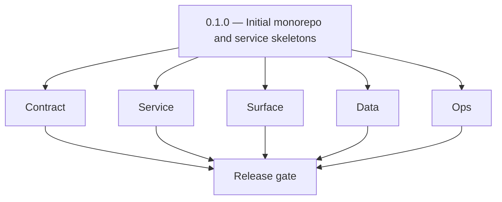
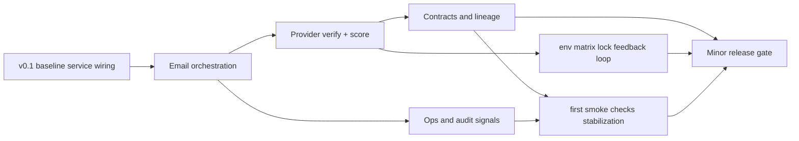
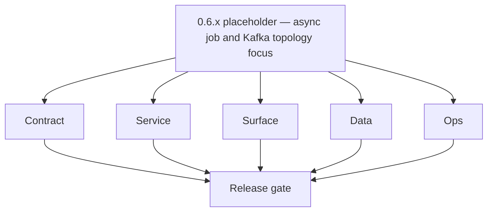
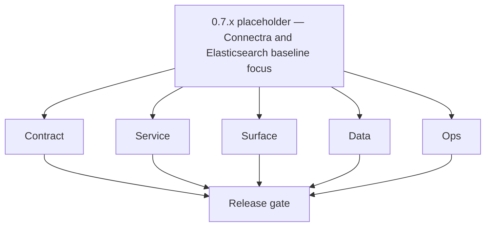
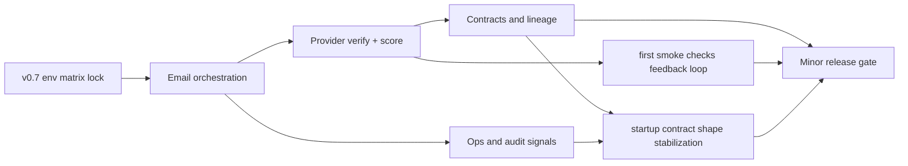
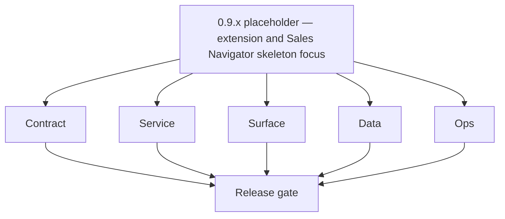
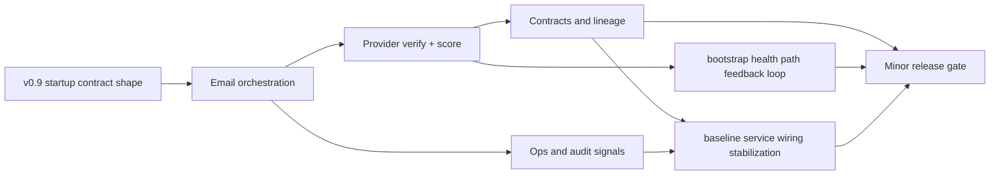

# Markdown file content retrieval
_Exported on 3/25/2026 at 01:53:04 GMT+5:30 from Cursor (2.6.21)_

---

**User**

Read the following files and return their full content or first 60 lines each:
1. d:\code\ayan\contact\docs\0. Foundation and pre-product stabilization and codebase setup\connectra-foundation-task-pack.md
2. d:\code\ayan\contact\docs\0. Foundation and pre-product stabilization and codebase setup\mailvetter-foundation-task-pack.md
3. d:\code\ayan\contact\docs\0. Foundation and pre-product stabilization and codebase setup\salesnavigator-foundation-task-pack.md
4. d:\code\ayan\contact\docs\0. Foundation and pre-product stabilization and codebase setup\emailcampaign-foundation-task-pack.md
5. d:\code\ayan\contact\docs\0. Foundation and pre-product stabilization and codebase setup\jobs-foundation-task-pack.md
6. d:\code\ayan\contact\docs\0. Foundation and pre-product stabilization and codebase setup\0.1 — Monorepo bootstrap.md (first 80 lines)
7. d:\code\ayan\contact\docs\0. Foundation and pre-product stabilization and codebase setup\0.2 — Schema & migration bedrock.md (first 80 lines)
8. d:\code\ayan\contact\docs\0. Foundation and pre-product stabilization and codebase setup\0.6 — Async job spine.md (first 80 lines)
9. d:\code\ayan\contact\docs\0. Foundation and pre-product stabilization and codebase setup\0.7 — Search & dual-write substrate.md (first 80 lines)
10. d:\code\ayan\contact\docs\0. Foundation and pre-product stabilization and codebase setup\0.9 — Extension channel scaffold.md (first 80 lines)

Return the raw content for each.

---

**Cursor**


Reading all requested files in parallel.


Below is the **raw content** from each path. Items **1–5** are short files, so the **full** file is included (each is under 60 lines). Items **6–10** are the **first 80 lines** only (the `0.N — <Title>.md` files are much longer).

---

### 1. `d:\code\ayan\contact\docs\0. Foundation and pre-product stabilization and codebase setup\connectra-foundation-task-pack.md` (full)

```markdown
# Connectra foundation task pack (`0.x`)

| Area | Owner (default) | Priority |
| --- | --- | --- |
| Contract / API | Platform backend | P0 |
| Service (`contact360.io/sync`) | Platform backend | P0 |
| DB + ES | Platform + data | P0 |
| Extension / marketing / admin (listed below) | Frontend + DocsAI | P1 |

## Scope

Bootstrap `contact360.io/sync` service contract and baseline operational readiness.

## Small tasks

- **Contract:** Freeze internal API key contract, health endpoint response envelope, and base route registry.
- **Service:** Wire Gin middleware chain (CORS, gzip, rate limit, API key auth) and bootstrap route groups.
- **Database:** Create baseline PostgreSQL tables and Elasticsearch index mappings for contacts/companies.
- **Flow:** Validate read path skeleton (`VQL -> ES IDs -> PG hydrate`) with smoke fixtures.
- **Release gate evidence:** Health checks, seed/load scripts, and contract doc links recorded in `docs/architecture.md` and `docs/versions.md`.

## Root/Admin surface contributions (era sync)

- **`contact360.io/root`**: establish marketing shell baseline (`app/layout.tsx`, `app/(marketing)/layout.tsx`), 3D primitives baseline, and public route inventory.
- **`contact360.io/admin`**: establish DocsAI base shell (`templates/base.html`), initial sidebar/navigation constants, and foundational admin auth/session views.

---

## Extension surface contributions (era sync)

### Era 0.x — Foundation

**`extension/contact360` scaffolding:**
- Extension folder created under canonical path `extension/contact360/`
- `auth/graphqlSession.js` module scaffolded with `chrome.storage.local` adapter pattern (MV3 compliant)
- `utils/lambdaClient.js` module scaffolded for Lambda REST transport
- `utils/profileMerger.js` module scaffolded for profile dedup
- No active backend calls in this era; folder structure only

**Tasks:**
- 🔴 Incompleted: Confirm `extension/contact360/` is in `.gitignore` exclusion list for minimal clones
- 🔴 Incompleted: Document MV3 `chrome.storage.local` adapter pattern in extension README
- 🔴 Incompleted: Establish Jest test scaffolding for extension utils
```

---

### 2. `d:\code\ayan\contact\docs\0. Foundation and pre-product stabilization and codebase setup\mailvetter-foundation-task-pack.md` (full)

```markdown
# Mailvetter — 0.x Foundation Task Pack

**Service:** `backend(dev)/mailvetter`  
**Era:** `0.x` — Foundation and pre-product stabilization

## Contract track

- 🔴 Incompleted: Freeze canonical API namespace: `/v1/*` (document legacy routes as deprecated compatibility only).
- 🔴 Incompleted: Define auth contract: `Authorization: Bearer <API_KEY>`.
- 🔴 Incompleted: Define baseline error envelope: `{status,error_code,message,details,timestamp}`.
- 🔴 Incompleted: Define health contract: `GET /v1/health`.

## Service track

- 🔴 Incompleted: Stabilize Gin bootstrap (`cmd/api/main.go`, `internal/api/router.go`).
- 🔴 Incompleted: Ensure API and worker binaries are independently bootable.
- 🔴 Incompleted: Verify Redis and Postgres init failure paths return clear startup errors.
- 🔴 Incompleted: Confirm graceful shutdown behavior for API and worker processes.

## Surface track

- 🔴 Incompleted: Keep `static/index.html` as legacy operator UI only; mark as non-product UI.
- 🔴 Incompleted: Add explicit “legacy UI” banner and route ownership note in docs.

## Data track

- 🔴 Incompleted: Freeze foundational tables: `jobs`, `results`.
- 🔴 Incompleted: Document migration ownership (`internal/store/db.go`) and indexes.
- 🔴 Incompleted: Add schema checksum validation for startup.

## Ops track

- 🔴 Incompleted: Lock Docker build and compose baseline (API+worker+redis+postgres).
- 🔴 Incompleted: Add smoke checks for `/v1/health`, queue push/pop, DB write/read.
- 🔴 Incompleted: Add first release gate for migration success before service ready.
```

---

### 3. `d:\code\ayan\contact\docs\0. Foundation and pre-product stabilization and codebase setup\salesnavigator-foundation-task-pack.md` (full)

```markdown
# Sales Navigator — 0.x Foundation Task Pack

**Service:** `backend(dev)/salesnavigator`  
**Era:** `0.x` — Foundation and pre-product stabilization  
**Status:** Scaffold only — no user-facing ingest in this era

---

## Contract track

- 🔴 Incompleted: Define `POST /v1/save-profiles` OpenAPI spec stub (request/response schema, auth header)
- 🔴 Incompleted: Define `POST /v1/scrape` OpenAPI spec stub
- 🔴 Incompleted: Document UUID5 generation algorithm as canonical contract: `uuid5(NAMESPACE_URL, linkedin_url + email)` and `uuid5(NAMESPACE_URL, company_name + company_url)`
- 🔴 Incompleted: Define `X-API-Key` header authentication contract
- 🔴 Incompleted: Add `GET /v1/health` health endpoint spec to service catalog

## Service track

- 🔴 Incompleted: Create FastAPI + Mangum application scaffold (`app/main.py`, `app/api/`, `app/core/`)
- 🔴 Incompleted: Wire `pydantic-settings` config with all required env vars (`API_KEY`, `CONNECTRA_API_URL`, `CONNECTRA_API_KEY`)
- 🔴 Incompleted: Implement `GET /` info endpoint and `GET /v1/health` liveness endpoint
- 🔴 Incompleted: Add exception handler stubs for `ValidationError` and `ConnectraClientError`
- 🔴 Incompleted: Create `requirements.txt` with pinned `fastapi`, `mangum`, `httpx`, `pydantic`, `beautifulsoup4`, `tenacity`

## Surface track

- 🔴 Incompleted: No user-facing UI in this era
- 🔴 Incompleted: Extension hook stub: define interface contract that extension will use in `4.x`

## Data track

- 🔴 Incompleted: Document deterministic UUID generation rules in `docs/backend/database/salesnavigator_data_lineage.md`
- 🔴 Incompleted: Define field mapping skeleton: SN profile → Connectra contact fields
- 🔴 Incompleted: Confirm `PLACEHOLDER_VALUE` sentinel behavior for unconvertible SN URLs

## Ops track

- 🔴 Incompleted: Create `template.yaml` AWS SAM skeleton with Lambda + API Gateway
- 🔴 Incompleted: Set Lambda timeout: 60s, memory: 1024 MB
- 🔴 Incompleted: Add health probe to CI pipeline
- 🔴 Incompleted: Add `pytest` baseline with one smoke test
- 🔴 Incompleted: Create `.example.env` with all required variables

---

**References:**
- `docs/codebases/salesnavigator-codebase-analysis.md`
- `docs/backend/apis/SALESNAVIGATOR_ERA_TASK_PACKS.md`
- `docs/backend/database/salesnavigator_data_lineage.md`
```

---

### 4. `d:\code\ayan\contact\docs\0. Foundation and pre-product stabilization and codebase setup\emailcampaign-foundation-task-pack.md` (full)

```markdown
# Email Campaign Service — Era 0.x Task Pack
## Foundation and pre-product stabilization

### Context
`backend(dev)/email campaign` must be initialized with a clean schema, functional health check, and Redis/Postgres/S3 connectivity before any product features can be layered on top. This era establishes the deployment baseline so the service can accept and queue campaign tasks safely.

---

## Track A — Contract

| Task | Description | Owner |
| --- | --- | --- |
| A-0.1 | Define service contract document: routes, payloads, status codes, env var requirements | Backend |
| A-0.2 | Confirm API key auth scheme vs JWT gateway pattern for internal calls | Backend + Arch |
| A-0.3 | Agree two-binary model (API + worker) as the permanent deployment topology | DevOps |

## Track B — Service (backend implementation)

| Task | Description | Owner |
| --- | --- | --- |
| B-0.1 | Fix `db/schema.sql` — add `templates` table and `recipients.unsub_token` column | Backend |
| B-0.2 | Fix `GetUnsubToken` — replace `DB.Exec` with `DB.Get` so token value is returned | Backend |
| B-0.3 | Add SMTP credentials via env vars; pass auth to `smtp.SendMail` | Backend |
| B-0.4 | Implement `/health` response to include DB ping and Redis ping (not just HTTP 200) | Backend |
| B-0.5 | Add env validation at startup (panic if required vars missing) | Backend |
| B-0.6 | Remove or gate `queue/reddis_queue.go` — confirm if legacy; add clear comment or delete | Backend |

## Track C — Surface (UI/UX frontend)

| Task | Description | Owner |
| --- | --- | --- |
| C-0.1 | No user-facing UI in era 0.x; only internal admin health page | Frontend |
| C-0.2 | Ensure campaign service base URL is wired in environment config for dashboard | Frontend |

## Track D — Data

| Task | Description | Owner |
| --- | --- | --- |
| D-0.1 | Bootstrap migration script executing `schema.sql` idempotently | Backend |
| D-0.2 | Seed test data: 1 template, 1 campaign, 2 recipients, 1 suppressed email | Backend/QA |
| D-0.3 | Confirm S3 bucket and prefix (`templates/`) exist and IAM role has `GetObject`/`PutObject` | DevOps |
| D-0.4 | Confirm Redis instance and Asynq queue namespace don't conflict with Connectra's queue | DevOps |

## Track E — Ops

| Task | Description | Owner |
| --- | --- | --- |
| E-0.1 | Write `Dockerfile` for API server binary | DevOps |
| E-0.2 | Write `Dockerfile` for worker binary | DevOps |
| E-0.3 | Write `docker-compose.yml` for local dev (API + worker + Redis + Postgres) | DevOps |
| E-0.4 | Add structured logging (JSON) to all handler/worker paths | Backend |

---

## Completion gate
- 🔴 Incompleted: `schema.sql` bootstraps cleanly on fresh Postgres; all 4 tables created.
- 🔴 Incompleted: API server starts with valid env; `/health` returns `{db: ok, redis: ok}`.
- 🔴 Incompleted: Worker process starts, connects to Redis, registers `campaign:send` handler.
- 🔴 Incompleted: SMTP test message delivered from staging credentials.
```

---

### 5. `d:\code\ayan\contact\docs\0. Foundation and pre-product stabilization and codebase setup\jobs-foundation-task-pack.md` (full)

```markdown
# jobs task pack — era `0.x` (`contact360.io/jobs`)

This pack decomposes **`contact360.io/jobs`** (TKD Job / scheduler stack) into Contract, Service, Surface, Data, and Ops tracks for foundation readiness before heavy `2.x`+ email and import workloads.

| Track | Owner (default) | Priority |
| --- | --- | --- |
| Contract | Platform backend | P0 |
| Service | Platform backend | P0 |
| Surface | Frontend + docs | P1 |
| Data | Platform backend | P0 |
| Ops | Platform / DevOps | P0 |

## Contract tasks

- Freeze baseline **scheduler HTTP API**: job `create`, `status`, `timeline` (or equivalent), `retry` — request/response shapes and error codes.
- Freeze **health contract**: `/health`, `/health/live`, `/health/ready` semantics and what “ready” means (Kafka, DB, Redis if applicable).
- Document **Kafka topic** name(s) (e.g. `JOBS_TOPIC`) and producer/consumer ownership for `0.x`.
- Capture **idempotency** expectations for `create` and retry (even if minimal in `0.x`).

## Service tasks

- Stabilize **API**, **scheduler**, **consumer**, and **worker** processes: ordered startup, config validation, graceful shutdown.
- Validate **processor registry** bootstrap: known processor types register without panic; unknown types fail fast with clear errors.
- Validate **DAG insertion** baseline: `job_node` + `edges` accepted; cycle detection or validation errors are explicit.
- Wire **stale recovery** hooks for `PROCESSING_TIMEOUT` / `JOB_EXECUTION_TIMEOUT` (or document “not yet implemented” with ticket).

## Surface tasks

- Document baseline **jobs** UI in `contact360.io/app`: list/card, status badges, polling vs subscription, empty/error states.
- Document **progress** indicators and expected refresh intervals for foundation-era flows.

## Data tasks

- Establish Alembic (or equivalent) **migration baseline** for `job_node`, `edges`, `job_events` (and any scheduler metadata tables).
- Document **status vocabulary** and allowed transitions (state machine diagram or table in `docs/backend` or codebase README).
- Note **retention**: how long `job_events` live in `0.x` (even if “unbounded — TBD”).

## Ops tasks

- Add **local and staging smoke**: create → worker picks up → terminal state → timeline readable.
- Add **scheduler liveness** check playbook (what to restart, in what order).
- Capture **stale-processing recovery** runbook one-pager: symptom → metric → mitigation.

## Release gate evidence (`0.x`)

- 🔴 Incompleted: Health endpoints pass in CI or manual smoke checklist
- 🔴 Incompleted: One end-to-end job completes with persisted `job_events`
- 🔴 Incompleted: Migration applied cleanly on empty DB
- 🔴 Incompleted: README or runbook link from `docs/codebase.md` / service README
```

---

### 6. `0.1 — Monorepo bootstrap.md` (lines 1–80)

```markdown
# Version 0.1 — Monorepo bootstrap

- **Status:** released
- **Released on:** historical
- **Summary:** Initial monorepo, service skeletons, and product foundation setup. Cross-service execution pack for this minor across contract, service, surface, data, and ops.
- **Scope:** Base app/service directories, early integration scaffolding, and bootstrapping flows.
- **Roadmap mapping:** pre-v1 foundation work
- **Owner:** Platform Engineering
- Shared foundation checklist: [`0.x-master-checklist.md`](0.x-master-checklist.md)

## Scope

- Target minor: `0.1.0` is monorepo bootstrap stabilization immediately after foundation setup.
- In scope: auth/session baseline, service skeleton hardening, first cross-service integrations, and smoke-testable run paths.
- Primary owners: Platform (`api`, `jobs`, `sync`), Product surfaces (`app`, `root`, `extension`), Service integrations (`email*`, `logs.api`, `contact.ai`, `mailvetter`).
- Exclusions: scale optimization, advanced reliability programs, and post-MVP feature expansion outside bootstrap scope.
- Definition of done: all key surfaces can complete one authenticated flow through gateway-backed services with deterministic baseline contracts.
- Exit criteria to next minor: startup, auth, and core integration evidence captured in release notes.

## Flowchart

Delivery work for this minor follows the five-track model (contract, service, surface, data, ops) through a release gate.



### Runtime focus (unique to this minor)



See also: [`docs/flowchart.md`](../flowchart.md) for system-wide and master views.

## Task tracks

### Contract

- 🔴 Incompleted: **api**: define v0.1 contract outcomes for baseline service wiring; harden request/response schema boundaries in `contact360.io/api` while advancing env matrix lock.
- 🔴 Incompleted: **app**: define v0.1 contract outcomes for baseline service wiring; align UI payload contracts with backend enums in `contact360.io/app` while advancing env matrix lock.
- 🔴 Incompleted: **jobs**: define v0.1 contract outcomes for baseline service wiring; lock worker message schema and retry metadata in `contact360.io/jobs` while advancing first smoke checks.
- 🔴 Incompleted: **sync**: define v0.1 contract outcomes for baseline service wiring; stabilize sync payload mapping and delta semantics in `contact360.io/sync` while advancing env matrix lock.
- 🔴 Incompleted: **admin**: define v0.1 contract outcomes for baseline service wiring; formalize control-plane request contracts and guardrails in `contact360.io/admin` while advancing baseline service wiring.
- 🔴 Incompleted: **mailvetter**: define v0.1 contract outcomes for baseline service wiring; pin verifier payload expectations and score fields in `backend(dev)/mailvetter` while advancing baseline service wiring.
- 🔴 Incompleted: **emailapis**: define v0.1 contract outcomes for baseline service wiring; normalize provider adapter contract and fallback keys in `lambda/emailapis` while advancing first smoke checks.
- 🔴 Incompleted: **emailapigo**: define v0.1 contract outcomes for baseline service wiring; enforce Go adapter contract parity with shared models in `lambda/emailapigo` while advancing baseline service wiring.

### Service
```

*(Line 80 in the file is the heading `### Service`; the next line in the repo continues with task bullets.)*

---

### 7. `0.2 — Schema & migration bedrock.md` (lines 1–80)

Same structure as 0.1 through the **`### Service`** heading; differences are in the title, status, summary, scope bullets, and the mermaid `stageNode` / runtime `intake` labels. Raw lines 1–80:

```markdown
# Version 0.2 — Schema & migration bedrock

- **Status:** planned
- **Era:** 0.x (Foundation and pre-product stabilization)
- **Summary:** Sub-minor within the 0.x era. **Planning focus — DB schema baseline stabilization:** Alembic branching strategy, appointment360 vs tkdjob Postgres separation, migration CI gates, and schema-freeze policy before `1.0.0` hardening. Scope is defined when a planned stage is approved and the entry is added to `docs/versions.md`. Cross-service execution pack for this minor across contract, service, surface, data, and ops.
- Shared foundation checklist: [`0.x-master-checklist.md`](0.x-master-checklist.md)

## Scope

- Target minor: `0.2.0` focuses on schema/migration baseline stability before broader 0.x hardening.
- In scope: DB contract freeze candidates, migration discipline, core service integration consistency, and queue/search persistence behaviors.
- Primary owners: Platform data paths (`api`, `jobs`, `sync`) with supporting ownership from `admin`, `logs.api`, and integration services.
- Exclusions: scale optimization and product-expansion scope that does not reduce schema/runtime bootstrap risk.
- Definition of done: migration paths are deterministic and critical cross-service write/read flows behave predictably under baseline tests.
- Exit criteria to `0.3.0`: migration CI checks pass and schema drift risks are documented with remediation owners.

## Flowchart

Delivery work for this minor follows the five-track model (contract, service, surface, data, and ops) through a release gate.


### Runtime focus (unique to this minor)


See also: [`docs/flowchart.md`](../flowchart.md) for system-wide and master views.


## Task tracks

### Contract

- 🔴 Incompleted: **api**: define v0.2 contract outcomes for env matrix lock; harden request/response schema boundaries in `contact360.io/api` while advancing first smoke checks.
- 🔴 Incompleted: **app**: define v0.2 contract outcomes for env matrix lock; align UI payload contracts with backend enums in `contact360.io/app` while advancing first smoke checks.
- 🔴 Incompleted: **jobs**: define v0.2 contract outcomes for env matrix lock; lock worker message schema and retry metadata in `contact360.io/jobs` while advancing startup contract shape.
- 🔴 Incompleted: **sync**: define v0.2 contract outcomes for env matrix lock; stabilize sync payload mapping and delta semantics in `contact360.io/sync` while advancing first smoke checks.
- 🔴 Incompleted: **admin**: define v0.2 contract outcomes for env matrix lock; formalize control-plane request contracts and guardrails in `contact360.io/admin` while advancing env matrix lock.
- 🔴 Incompleted: **mailvetter**: define v0.2 contract outcomes for env matrix lock; pin verifier payload expectations and score fields in `backend(dev)/mailvetter` while advancing env matrix lock.
- 🔴 Incompleted: **emailapis**: define v0.2 contract outcomes for env matrix lock; normalize provider adapter contract and fallback keys in `lambda/emailapis` while advancing startup contract shape.
- 🔴 Incompleted: **emailapigo**: define v0.2 contract outcomes for env matrix lock; enforce Go adapter contract parity with shared models in `lambda/emailapigo` while advancing env matrix lock.

### Service

- 🔴 Incompleted: **api**: deliver v0.2 service outcomes for env matrix lock; implement strict handler guards and deterministic branching in `contact360.io/api` while advancing first smoke checks.
```

---

### 8. `0.6 — Async job spine.md` (lines 1–80)

```markdown
# Version 0.6 — Async job spine

- **Status:** planned
- **Era:** 0.x (Foundation and pre-product stabilization)
- **Summary:** Sub-minor within the 0.x era. **Planning focus — async job infrastructure:** [`contact360.io/jobs`](../../contact360.io/jobs/) DAG model (`job_node`, `edges`, Kahn scheduling), Kafka broker and topic layout (`JOBS_TOPIC`), scheduler/consumer/worker split, `PROCESSING_TIMEOUT` / `JOB_EXECUTION_TIMEOUT` stale recovery, and processor registry contracts. Scope is defined when a planned stage is approved and the entry is added to `docs/versions.md`. Cross-service execution pack for this minor across contract, service, surface, data, and ops.
- Shared foundation checklist: [`0.x-master-checklist.md`](0.x-master-checklist.md)

## Scope

- Target minor: `0.6.0` aligned to current roadmap mapping in this file.
- In scope: contract, service, surface, data, and ops tasks across core Contact360 services.
- Primary owners: API, App, Jobs, Sync, Admin, and supporting platform services.
- Exclusions: work outside this minor unless required for compatibility or incident risk reduction.
- Output: actionable per-service task breakdown and execution queue for release readiness.

## Flowchart

Delivery work for this minor follows the five-track model (contract, service, surface, data, and ops) through a release gate.



### Runtime focus (unique to this minor)


See also: [`docs/flowchart.md`](../flowchart.md) for system-wide and master views.

## Task tracks

### Contract

- 🔴 Incompleted: **api**: define v0.6 contract outcomes for baseline service wiring; harden request/response schema boundaries in `contact360.io/api` while advancing env matrix lock.
- 🔴 Incompleted: **app**: define v0.6 contract outcomes for baseline service wiring; align UI payload contracts with backend enums in `contact360.io/app` while advancing env matrix lock.
- 🔴 Incompleted: **jobs**: define v0.6 contract outcomes for baseline service wiring; lock worker message schema and retry metadata in `contact360.io/jobs` while advancing first smoke checks.
- 🔴 Incompleted: **sync**: define v0.6 contract outcomes for baseline service wiring; stabilize sync payload mapping and delta semantics in `contact360.io/sync` while advancing env matrix lock.
- 🔴 Incompleted: **admin**: define v0.6 contract outcomes for baseline service wiring; formalize control-plane request contracts and guardrails in `contact360.io/admin` while advancing baseline service wiring.
- 🔴 Incompleted: **mailvetter**: define v0.6 contract outcomes for baseline service wiring; pin verifier payload expectations and score fields in `backend(dev)/mailvetter` while advancing baseline service wiring.
- 🔴 Incompleted: **emailapis**: define v0.6 contract outcomes for baseline service wiring; normalize provider adapter contract and fallback keys in `lambda/emailapis` while advancing first smoke checks.
- 🔴 Incompleted: **emailapigo**: define v0.6 contract outcomes for baseline service wiring; enforce Go adapter contract parity with shared models in `lambda/emailapigo` while advancing baseline service wiring.

### Service

- 🔴 Incompleted: **api**: deliver v0.6 service outcomes for baseline service wiring; implement strict handler guards and deterministic branching in `contact360.io/api` while advancing env matrix lock.
- 🔴 Incompleted: **app**: deliver v0.6 service outcomes for baseline service wiring; wire client flows to canonical endpoints and failure states in `contact360.io/app` while advancing env matrix lock.
- 🔴 Incompleted: **jobs**: deliver v0.6 service outcomes for baseline service wiring; tune queue worker orchestration and idempotent retries in `contact360.io/jobs` while advancing first smoke checks.
```

---

### 9. `0.7 — Search & dual-write substrate.md` (lines 1–80)

```markdown
# Version 0.7 — Search & dual-write substrate

- **Status:** planned
- **Era:** 0.x (Foundation and pre-product stabilization)
- **Summary:** Sub-minor within the 0.x era. **Planning focus — search and indexing foundations:** [`contact360.io/sync`](../../contact360.io/sync/) Elasticsearch index layout, VQL contract baseline, health and rate-limit middleware, and dual-write/read paths vs PostgreSQL source-of-truth rules (`03_CONTACTS_MODULE`, `04_COMPANIES_MODULE`). Scope is defined when a planned stage is approved and the entry is added to `docs/versions.md`. Cross-service execution pack for this minor across contract, service, surface, data, and ops.
- Shared foundation checklist: [`0.x-master-checklist.md`](0.x-master-checklist.md)

## Scope

- Target minor: `0.7.0` aligned to current roadmap mapping in this file.
- In scope: contract, service, surface, data, and ops tasks across core Contact360 services.
- Primary owners: API, App, Jobs, Sync, Admin, and supporting platform services.
- Exclusions: work outside this minor unless required for compatibility or incident risk reduction.
- Output: actionable per-service task breakdown and execution queue for release readiness.

## Flowchart

Delivery work for this minor follows the five-track model (contract, service, surface, data, and ops) through a release gate.



### Runtime focus (unique to this minor)



See also: [`docs/flowchart.md`](../flowchart.md) for system-wide and master views.


## Task tracks

### Contract

- 🔴 Incompleted: **api**: define v0.7 contract outcomes for env matrix lock; harden request/response schema boundaries in `contact360.io/api` while advancing first smoke checks.
- 🔴 Incompleted: **app**: define v0.7 contract outcomes for env matrix lock; align UI payload contracts with backend enums in `contact360.io/app` while advancing first smoke checks.
- 🔴 Incompleted: **jobs**: define v0.7 contract outcomes for env matrix lock; lock worker message schema and retry metadata in `contact360.io/jobs` while advancing startup contract shape.
- 🔴 Incompleted: **sync**: define v0.7 contract outcomes for env matrix lock; stabilize sync payload mapping and delta semantics in `contact360.io/sync` while advancing first smoke checks.
- 🔴 Incompleted: **admin**: define v0.7 contract outcomes for env matrix lock; formalize control-plane request contracts and guardrails in `contact360.io/admin` while advancing env matrix lock.
- 🔴 Incompleted: **mailvetter**: define v0.7 contract outcomes for env matrix lock; pin verifier payload expectations and score fields in `backend(dev)/mailvetter` while advancing env matrix lock.
- 🔴 Incompleted: **emailapis**: define v0.7 contract outcomes for env matrix lock; normalize provider adapter contract and fallback keys in `lambda/emailapis` while advancing startup contract shape.
- 🔴 Incompleted: **emailapigo**: define v0.7 contract outcomes for env matrix lock; enforce Go adapter contract parity with shared models in `lambda/emailapigo` while advancing env matrix lock.

### Service

- 🔴 Incompleted: **api**: deliver v0.7 service outcomes for env matrix lock; implement strict handler guards and deterministic branching in `contact360.io/api` while advancing first smoke checks.
- 🔴 Incompleted: **app**: deliver v0.7 service outcomes for env matrix lock; wire client flows to canonical endpoints and failure states in `contact360.io/app` while advancing first smoke checks.
```

---

### 10. `0.9 — Extension channel scaffold.md` (lines 1–80)

```markdown
# Version 0.9 — Extension channel scaffold

- **Status:** planned
- **Era:** 0.x (Foundation and pre-product stabilization)
- **Summary:** Sub-minor within the 0.x era. **Planning focus — extension and Sales Navigator integration skeleton:** [`extension/contact360`](../../extension/contact360/) packaging and session model, plus [`backend(dev)/salesnavigator`](../../backend(dev)/salesnavigator/) ingest path → [`contact360.io/api/app/clients/lambda_sales_navigator_client.py`](../../contact360.io/api/app/clients/lambda_sales_navigator_client.py) → Connectra bulk upsert (`23_SALES_NAVIGATOR_MODULE.md`). Scope is defined when a planned stage is approved and the entry is added to `docs/versions.md`. Cross-service execution pack for this minor across contract, service, surface, data, and ops.
- Shared foundation checklist: [`0.x-master-checklist.md`](0.x-master-checklist.md)

## Scope

- Target minor: `0.9.0` aligned to current roadmap mapping in this file.
- In scope: contract, service, surface, data, and ops tasks across core Contact360 services.
- Primary owners: API, App, Jobs, Sync, Admin, and supporting platform services.
- Exclusions: work outside this minor unless required for compatibility or incident risk reduction.
- Output: actionable per-service task breakdown and execution queue for release readiness.

## Flowchart

Delivery work for this minor follows the five-track model (contract, service, surface, data, and ops) through a release gate.



### Runtime focus (unique to this minor)



See also: [`docs/flowchart.md`](../flowchart.md) for system-wide and master views.

## Task tracks

### Contract

- 🔴 Incompleted: **api**: define v0.9 contract outcomes for startup contract shape; harden request/response schema boundaries in `contact360.io/api` while advancing bootstrap health path.
- 🔴 Incompleted: **app**: define v0.9 contract outcomes for startup contract shape; align UI payload contracts with backend enums in `contact360.io/app` while advancing bootstrap health path.
- 🔴 Incompleted: **jobs**: define v0.9 contract outcomes for startup contract shape; lock worker message schema and retry metadata in `contact360.io/jobs` while advancing baseline service wiring.
- 🔴 Incompleted: **sync**: define v0.9 contract outcomes for startup contract shape; stabilize sync payload mapping and delta semantics in `contact360.io/sync` while advancing bootstrap health path.
- 🔴 Incompleted: **admin**: define v0.9 contract outcomes for startup contract shape; formalize control-plane request contracts and guardrails in `contact360.io/admin` while advancing startup contract shape.
- 🔴 Incompleted: **mailvetter**: define v0.9 contract outcomes for startup contract shape; pin verifier payload expectations and score fields in `backend(dev)/mailvetter` while advancing startup contract shape.
- 🔴 Incompleted: **emailapis**: define v0.9 contract outcomes for startup contract shape; normalize provider adapter contract and fallback keys in `lambda/emailapis` while advancing baseline service wiring.
- 🔴 Incompleted: **emailapigo**: define v0.9 contract outcomes for startup contract shape; enforce Go adapter contract parity with shared models in `lambda/emailapigo` while advancing startup contract shape.

### Service

- 🔴 Incompleted: **api**: deliver v0.9 service outcomes for startup contract shape; implement strict handler guards and deterministic branching in `contact360.io/api` while advancing bootstrap health path.
- 🔴 Incompleted: **app**: deliver v0.9 service outcomes for startup contract shape; wire client flows to canonical endpoints and failure states in `contact360.io/app` while advancing bootstrap health path.
- 🔴 Incompleted: **jobs**: deliver v0.9 service outcomes for startup contract shape; tune queue worker orchestration and idempotent retries in `contact360.io/jobs` while advancing baseline service wiring.
```

---

**Note:** In sections 6–10, fenced ` ```mermaid ` blocks appear **inside** the version files exactly as stored; duplicating them here can break nested markdown fences in some viewers. For a byte-for-byte copy of lines 1–80, open the files under:

`d:\code\ayan\contact\docs\0. Foundation and pre-product stabilization and codebase setup\`

Items **1–5** above match the repository files in full (43, 35, 49, 59, and 49 lines respectively). Items **6–10** continue for **~1,200+ lines** each after line 80.

