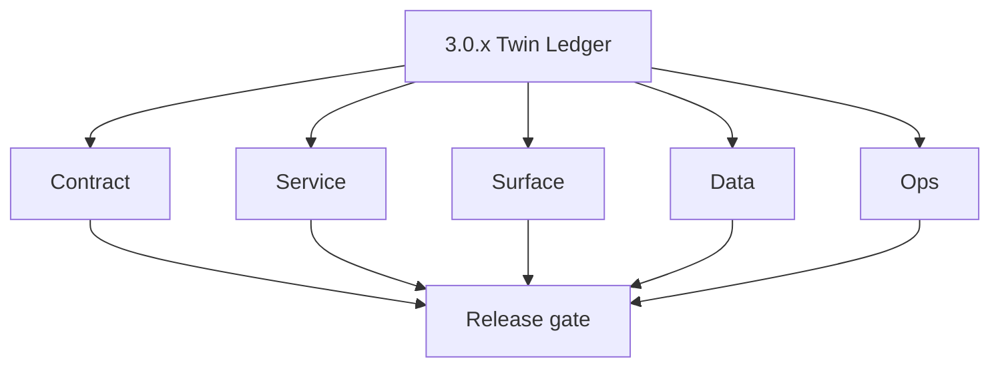
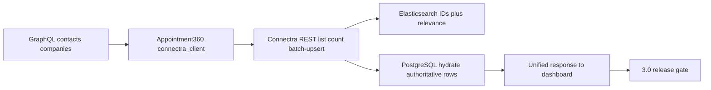
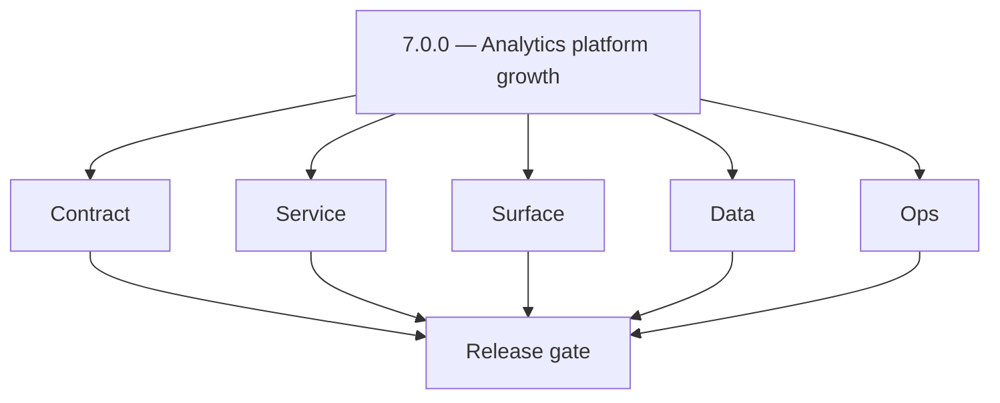
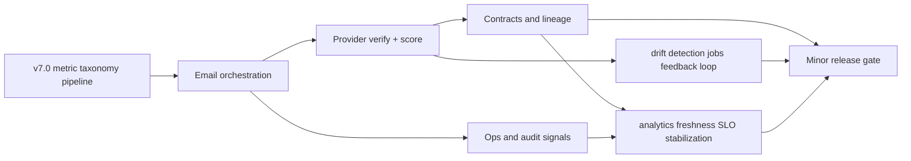

# Reference documents for version files
_Exported on 3/26/2026 at 17:07:47 GMT+5:30 from Cursor (2.6.21)_

---

**User**

Read the following files fully and return their complete content. These are reference documents showing the expected structure/format for well-formed version files and task packs:

- d:\code\ayan\contact\docs\3. Contact360 contact and company data system\3.0 — Twin Ledger.md  (example of a well-structured version file)
- d:\code\ayan\contact\docs\3. Contact360 contact and company data system\3.x-master-checklist.md  (example master checklist structure)
- d:\code\ayan\contact\docs\7. Contact360 deployment\7.0 — Deployment era baseline lock.md  (current state of 7.0 - what exists)

Return full text of all three files.

---

**Cursor**


Reading all three files in full.


Full contents of the three files:

---

## `d:\code\ayan\contact\docs\3. Contact360 contact and company data system\3.0 — Twin Ledger.md`

```markdown
# Version 3.0 — Twin Ledger

- **Status:** planned  
- **Codename:** Twin Ledger  
- **Era:** 3.x (Contact360 contact and company data system)  
- **Roadmap:** Foundation for **3.x** — authoritative **PostgreSQL + Elasticsearch** plane for contacts/companies; first-party read/write paths before deep VQL and UX polish.  
- **Summary:** **Dual-store bootstrap**: healthy Connectra indices and tables, `batch-upsert` and **two-phase read** (`ListByFilters` / `CountByFilters`) proven end-to-end; Appointment360 **contacts** and **companies** GraphQL modules wired to Connectra via `connectra_client` with baseline `vql_converter` and mappers (full correctness in **`3.1`** / **`3.2`**).  
- Shared checklist: [`3.x-master-checklist.md`](3.x-master-checklist.md)

## Scope

- **Target:** `3.0.x` patches — infrastructure + horizontal spine, not extension/SN primary era (**`4.x`**).  
- **Out of scope:** Sales Navigator mapper depth (**`3.6`**); full drift automation (**`3.7`**); per-tenant rate-limit model (**`3.9`**).  
- **Owners:** Connectra + Platform API + Dashboard (read-only smoke).

## Flowchart



### Runtime focus (unique to this minor)



## Task tracks

### Contract

- 🔴 Incompleted: Freeze baseline REST surface per [`connectra-service.md`](connectra-service.md): `POST /contacts/`, `POST /contacts/count`, `POST /contacts/batch-upsert`, company equivalents, `GET /health`.  
- 🔴 Incompleted: GraphQL module boundaries for contacts/companies documented in [`docs/backend/apis/03_CONTACTS_MODULE.md`](../backend/apis/03_CONTACTS_MODULE.md) and [`04_COMPANIES_MODULE.md`](../backend/apis/04_COMPANIES_MODULE.md).

### Service

- 🔴 Incompleted: Connectra: index bootstrap/mapping scripts validated; `BulkUpsertToDb` happy path for representative contact + company fixtures.  
- 🔴 Incompleted: Appointment360: `ConnectraClient` methods for list, count, batch-upsert, filters stub or minimal implementation with timeouts configured (`CONNECTRA_*` env).

### Surface

- 🔴 Incompleted: Dashboard smoke: `/contacts` and `/companies` load with empty or seed dataset (see [`dashboard-search-ux.md`](dashboard-search-ux.md)).

### Data

- 🔴 Incompleted: UUID5 rules understood and documented — [`enrichment-dedup.md`](enrichment-dedup.md).  
- 🔴 Incompleted: `filters` / `filters_data` tables present for facet bootstrap if filter sidebar is enabled.

### Ops

- 🔴 Incompleted: Health checks and alarms for Connectra + API dependency chain.  
- 🔴 Incompleted: Document dev/prod URLs in [`docs/architecture.md`](../architecture.md) if not already.

## Task breakdown

| Slice | Outcome |
| --- | --- |
| Connectra | Indices + core APIs alive |
| Appointment360 | GraphQL → Connectra round-trip |
| App | Minimal list/count visible |

## Immediate next execution queue

- 🔴 Incompleted: E2E: create contact via `batch-upsert` → list by uuid filter → count sanity.  
- 🔴 Incompleted: E2E: company same path.  
- 🔴 Incompleted: Archive one **HAR** or scripted proof for release notes.

## Cross-service ownership

| Service | Focus |
| --- | --- |
| `contact360.io/sync` | PG+ES dual write + read |
| `contact360.io/api` | Modules + client |
| `contact360.io/app` | Smoke routes |

## References

- [`docs/codebases/connectra-codebase-analysis.md`](../codebases/connectra-codebase-analysis.md)  
- [`docs/codebases/appointment360-codebase-analysis.md`](../codebases/appointment360-codebase-analysis.md)  
- [`connectra-contact-company-task-pack.md`](./README.md)

## Backend API and endpoint scope

Connectra REST table in `connectra-service.md`; GraphQL operations per contacts/COMPANIES module docs.

## Database and data lineage scope

Contacts/companies PG tables + ES indexes; optional `filters_data` derivation after first upserts.

## Frontend UX surface scope

Contacts/companies pages shell and table placeholder or seed data — full UX in **`3.4`**.

## Patch ladder (`3.0.0` – `3.0.9`)

Theme: **Bootstrap** — [`3.x-master-checklist.md`](3.x-master-checklist.md).

| Patch | Codename | Focus |
| --- | --- | --- |
| `3.0.0` | Charter | Contract freeze for baseline REST + GraphQL ownership |
| `3.0.1` | Connectra | Index mapping + list/count smoke |
| `3.0.2` | Gateway | `connectra_client` + env wiring |
| `3.0.3` | Dashboard | Route smoke `/contacts`, `/companies` |
| `3.0.4` | Jobs / S3 | `n/a` or presign upload only if import stub exists |
| `3.0.5` | Satellite | `n/a` — defer enrichers |
| `3.0.6` | Observability | Baseline health logs |
| `3.0.7` | Hardening | Timeouts, error envelopes on Connectra errors |
| `3.0.8` | Evidence | Postman/seed script for batch-upsert |
| `3.0.9` | Gate | Sign-off → handoff **`3.1` VQL Engine** |

## Release gate and evidence

### Master task checklist

- 🔴 Incompleted: Twin Ledger DoD: dual-store read/write proof attached

### Backend API and endpoints

- 🔴 Incompleted: `connectra-service.md` matches deployed routes

### Database and data lineage

- 🔴 Incompleted: Enrichment/dedup doc reviewed for this release

### Frontend UX

- 🔴 Incompleted: Smoke recording or ticket link

### Validation

- 🔴 Incompleted: At least one list + count + batch-upsert flow green

### Release gate

- 🔴 Incompleted: Approve start of **`3.1`**
```

*(153 lines total in source file; content above matches the read output.)*

---

## `d:\code\ayan\contact\docs\3. Contact360 contact and company data system\3.x-master-checklist.md`

```markdown
# 3.x master checklist — patch ladder (`3.X.0`–`3.X.9`)

**Purpose:** Shared release discipline for every **minor** in `[docs/3. Contact360 contact and company data system/](.)`. Each minor owns its own theme and acceptance detail in `[3.0 — Twin Ledger.md](3.0 — Twin Ledger.md)` … `[3.10 — Data Completeness.md](3.10 — Data Completeness.md)`. This file defines the **10 patch slots** used consistently across those minors.

**Five tracks (every patch):** Contract · Service · Surface · Data · Ops — complete the row that applies; skip tracks with `n/a` for that minor.

---

## How to use

1. For release `**3.Y.Z`**, find minor `**3.Y**` in the corresponding `version_3.Y.md`.
2. Map patch digit `**Z**` to the row below (`**3.Y.0**` → row 0, … `**3.Y.9**` → row 9).
3. Before ship: satisfy **that row’s master checks** plus any **minor-specific** tasks in `version_3.Y.md`.

---

## Universal patch ladder


| Patch slot | Codename      | Contract                                                                                                                                                                            | Service                                                                                                                         | Surface                                                                                                  | Data                                                                                      | Ops                                                                                                     |
| ---------- | ------------- | ----------------------------------------------------------------------------------------------------------------------------------------------------------------------------------- | ------------------------------------------------------------------------------------------------------------------------------- | -------------------------------------------------------------------------------------------------------- | ----------------------------------------------------------------------------------------- | ------------------------------------------------------------------------------------------------------- |
| `**.0`**   | Charter       | Freeze or extend schemas (GraphQL, REST, VQL) for this slice; update `[docs/backend/apis/](../backend/apis/)` and `[docs/backend/endpoints/](../backend/endpoints/)` where touched. | Implementation plan + feature flags; no silent breaking changes.                                                                | UX copy / route inventory updated in `[docs/frontend/](../frontend/)` if user-visible.                   | Lineage doc note: new fields, indexes, or artifact types.                                 | Rollback plan named; owner on-call.                                                                     |
| `**.1**`   | Connectra     | `[connectra-service.md](connectra-service.md)` parity for any new/changed list/count/batch-upsert/filter path.                                                                      | Connectra handlers, ES mapping, or job runner changes tested in dev.                                                            | `n/a` or admin-only diagnostics only.                                                                    | PG+ES write path understood for this change set.                                          | Smoke: `GET /health`, one list + one count call.                                                        |
| `**.2**`   | Gateway       | Appointment360: `connectra_client`, `vql_converter.py` — align with `[vql-filter-taxonomy.md](vql-filter-taxonomy.md)` and Connectra `VQLQuery`.                                    | Resolver/query/mutation wiring + error envelopes.                                                                               | GraphQL-dependent hooks unchanged or version-gated.                                                      | Credits/usage if new billable operations.                                                 | Trace id propagated Connectra ↔ API (where applicable).                                                 |
| `**.3**`   | Dashboard     | `n/a` or saved-search/export GraphQL only.                                                                                                                                          | `n/a`.                                                                                                                          | `[contact360.io/app](../codebases/app-codebase-analysis.md)`: contacts/companies pages, filters, modals. | Client-side state ↔ VQL no orphan filters.                                                | E2E or manual script for primary user journey.                                                          |
| `**.4**`   | Jobs / S3     | Import/export job payload or `validate/vql` contract — `[jobs-contact-company-task-pack.md](./README.md)`.                                                    | Processor DAG, streaming, or S3 multipart — `[s3storage-contact-company-task-pack.md](./README.md)`. | Jobs page / import modals per `[jobs-ui-bindings.md](../frontend/jobs-ui-bindings.md)`.                  | `job_id` → artifact keys documented.                                                      | Stuck-job / partial-failure runbook step updated if behavior changes.                                   |
| `**.5**`   | Satellite     | Pick **one** per release: Sales Navigator mapper, Contact AI filters, Email APIs enrichment, Mailvetter linkage — avoid multi-satellite thrash.                                     | Same.                                                                                                                           | Same.                                                                                                    | Provenance / enrichment fields aligned with `[enrichment-dedup.md](enrichment-dedup.md)`. | Integration test or RC checklist item for chosen satellite.                                             |
| `**.6`**   | Observability | `[logsapi-contact-company-data-task-pack.md](./README.md)`: event types and PII rules.                                                                | Emission points implemented or verified.                                                                                        | Admin/support panels documented if new.                                                                  | Retention / cardinality called out.                                                       | Dashboard or query saved for support triage.                                                            |
| `**.7**`   | Hardening     | Idempotency keys and retry semantics documented.                                                                                                                                    | Race, drift, or abuse edge cases addressed.                                                                                     | Error UX consistent (retry, partial success).                                                            | Dedup / UUID5 invariants — `[enrichment-dedup.md](enrichment-dedup.md)`.                  | Load or chaos slice if latency-sensitive.                                                               |
| `**.8**`   | Evidence      | Postman / OpenAPI / `[docs/backend/postman/](../backend/postman/)` updated if public contract changes.                                                                              | Golden fixtures or replay artifacts for batch-upsert or VQL (where applicable).                                                 | Screenshots or Loom for major UX changes.                                                                | Parity or sampling report archived (e.g. ES vs PG sample).                                | RC sign-off notes in ticket or release doc.                                                             |
| `**.9**`   | Gate          | `**docs/versions.md**`, `[docs/roadmap.md](../roadmap.md)`, `[docs/docsai-sync.md](../docsai-sync.md)` if narrative changed.                                                        | `**docs/codebases/*-codebase-analysis.md**` execution queue synced for touched services.                                        | `**dashboard-search-ux.md**` / task packs marked complete for delivered items.                           | `**docs/backend/database/**` lineage if schema drift.                                     | Release approved; handoff to next minor documented in `version_3.*.md` “Patch ladder” or summary table. |


---

## Cross-cutting release gate (any `3.x` patch)

Use as a final checkbox before promoting a build:

- No undocumented breaking change to **VQL** without `[vql-filter-taxonomy.md](vql-filter-taxonomy.md)` update.  
- **Connectra** batch-upsert remains **idempotent** for fixed natural keys (see enrichment doc).  
- **Request / correlation id** story documented for incident correlation (App → API → Sync → logs).  
- **PII**: logs and support tooling follow `[logsapi-contact-company-data-task-pack.md](./README.md)` hashing rule.

---

## References

- `[README.md](README.md)` — era folder index and minor codenames.  
- `[docs/codebase.md](../codebase.md)` — runtime map.  
- `[connectra-contact-company-task-pack.md](./README.md)` — Connectra execution queue.


```

*(53 lines in source.)*

---

## `d:\code\ayan\contact\docs\7. Contact360 deployment\7.0 — Deployment era baseline lock.md`

The file is **319 lines**. Full text from the workspace (verbatim):

```1:319:d:\code\ayan\contact\docs\7. Contact360 deployment\7.0 — Deployment era baseline lock.md
# Version 7.0

- **Status:** planned
- **Target window:** TBD
- **Summary:** Data and analytics platform growth. Cross-service execution pack for this minor across contract, service, surface, data, and ops.
- **Scope:** Unified analytics pipelines, admin insights, and reporting/export maturity.
- **Roadmap mapping:** `7.x` stage group (Stages 7.1–7.9 detailed in roadmap)
- **Owner:** Data Platform Team

## Scope

- Target minor: `7.0.0` aligned to current roadmap mapping in this file.
- In scope: contract, service, surface, data, and ops tasks across core Contact360 services.
- Primary owners: API, App, Jobs, Sync, Admin, and supporting platform services.
- Exclusions: work outside this minor unless required for compatibility or incident risk reduction.
- Output: actionable per-service task breakdown and execution queue for release readiness.

## Flowchart

Delivery work for this minor follows the five-track model (contract, service, surface, data, ops) through a release gate.



### Runtime focus (unique to this minor)



See also: [`docs/flowchart.md`](../flowchart.md) for system-wide and master views.


## Task tracks

### Contract
- 🔴 Incompleted: **api**: define v7.0 contract outcomes for metric taxonomy pipeline; harden request/response schema boundaries in `contact360.io/api` while advancing drift detection jobs.
- 🔴 Incompleted: **app**: define v7.0 contract outcomes for metric taxonomy pipeline; align UI payload contracts with backend enums in `contact360.io/app` while advancing drift detection jobs.
- 🔴 Incompleted: **jobs**: define v7.0 contract outcomes for metric taxonomy pipeline; lock worker message schema and retry metadata in `contact360.io/jobs` while advancing analytics freshness SLO.
- 🔴 Incompleted: **sync**: define v7.0 contract outcomes for metric taxonomy pipeline; stabilize sync payload mapping and delta semantics in `contact360.io/sync` while advancing drift detection jobs.
- 🔴 Incompleted: **admin**: define v7.0 contract outcomes for metric taxonomy pipeline; formalize control-plane request contracts and guardrails in `contact360.io/admin` while advancing metric taxonomy pipeline.
- 🔴 Incompleted: **mailvetter**: define v7.0 contract outcomes for metric taxonomy pipeline; pin verifier payload expectations and score fields in `backend(dev)/mailvetter` while advancing metric taxonomy pipeline.
- 🔴 Incompleted: **emailapis**: define v7.0 contract outcomes for metric taxonomy pipeline; normalize provider adapter contract and fallback keys in `lambda/emailapis` while advancing analytics freshness SLO.
- 🔴 Incompleted: **emailapigo**: define v7.0 contract outcomes for metric taxonomy pipeline; enforce Go adapter contract parity with shared models in `lambda/emailapigo` while advancing metric taxonomy pipeline.

### Service
- 🔴 Incompleted: **api**: deliver v7.0 service outcomes for metric taxonomy pipeline; implement strict handler guards and deterministic branching in `contact360.io/api` while advancing drift detection jobs.
- 🔴 Incompleted: **app**: deliver v7.0 service outcomes for metric taxonomy pipeline; wire client flows to canonical endpoints and failure states in `contact360.io/app` while advancing drift detection jobs.
- 🔴 Incompleted: **jobs**: deliver v7.0 service outcomes for metric taxonomy pipeline; tune queue worker orchestration and idempotent retries in `contact360.io/jobs` while advancing analytics freshness SLO.
- 🔴 Incompleted: **sync**: deliver v7.0 service outcomes for metric taxonomy pipeline; tighten replication loops and conflict-resolution behavior in `contact360.io/sync` while advancing drift detection jobs.
- 🔴 Incompleted: **admin**: deliver v7.0 service outcomes for metric taxonomy pipeline; harden operator workflows and privilege-aware actions in `contact360.io/admin` while advancing metric taxonomy pipeline.
- 🔴 Incompleted: **mailvetter**: deliver v7.0 service outcomes for metric taxonomy pipeline; calibrate verdict pipeline stages for stable scoring in `backend(dev)/mailvetter` while advancing metric taxonomy pipeline.
- 🔴 Incompleted: **emailapis**: deliver v7.0 service outcomes for metric taxonomy pipeline; improve provider orchestration sequencing and fallback timing in `lambda/emailapis` while advancing analytics freshness SLO.
- 🔴 Incompleted: **emailapigo**: deliver v7.0 service outcomes for metric taxonomy pipeline; optimize Go runtime execution path and error wrapping in `lambda/emailapigo` while advancing metric taxonomy pipeline.

### Surface
- 🔴 Incompleted: **api**: shape v7.0 surface outcomes for metric taxonomy pipeline; publish clearer API status semantics for consumers in `contact360.io/api` while advancing drift detection jobs.
- 🔴 Incompleted: **app**: shape v7.0 surface outcomes for metric taxonomy pipeline; refine user-facing copy for outcomes and recovery paths in `contact360.io/app` while advancing drift detection jobs.
- 🔴 Incompleted: **jobs**: shape v7.0 surface outcomes for metric taxonomy pipeline; surface job lifecycle visibility for operators in `contact360.io/jobs` while advancing analytics freshness SLO.
- 🔴 Incompleted: **sync**: shape v7.0 surface outcomes for metric taxonomy pipeline; expose sync health indicators and drift signals in `contact360.io/sync` while advancing drift detection jobs.
- 🔴 Incompleted: **admin**: shape v7.0 surface outcomes for metric taxonomy pipeline; streamline admin controls for triage and overrides in `contact360.io/admin` while advancing metric taxonomy pipeline.
- 🔴 Incompleted: **mailvetter**: shape v7.0 surface outcomes for metric taxonomy pipeline; present verifier rationale fields for audit readability in `backend(dev)/mailvetter` while advancing metric taxonomy pipeline.
- 🔴 Incompleted: **emailapis**: shape v7.0 surface outcomes for metric taxonomy pipeline; expose provider routing outcomes and fallback markers in `lambda/emailapis` while advancing analytics freshness SLO.
- 🔴 Incompleted: **emailapigo**: shape v7.0 surface outcomes for metric taxonomy pipeline; clarify Go service diagnostics in integration touchpoints in `lambda/emailapigo` while advancing metric taxonomy pipeline.

### Data
- 🔴 Incompleted: **api**: anchor v7.0 data outcomes for metric taxonomy pipeline; persist stable lineage keys and trace-friendly identifiers in `contact360.io/api` while advancing drift detection jobs.
- 🔴 Incompleted: **app**: anchor v7.0 data outcomes for metric taxonomy pipeline; capture UI telemetry fields mapped to backend events in `contact360.io/app` while advancing drift detection jobs.
- 🔴 Incompleted: **jobs**: anchor v7.0 data outcomes for metric taxonomy pipeline; record queue attempt history with reproducible markers in `contact360.io/jobs` while advancing analytics freshness SLO.
- 🔴 Incompleted: **sync**: anchor v7.0 data outcomes for metric taxonomy pipeline; preserve delta lineage across index and storage writes in `contact360.io/sync` while advancing drift detection jobs.
- 🔴 Incompleted: **admin**: anchor v7.0 data outcomes for metric taxonomy pipeline; track governance events with immutable audit attributes in `contact360.io/admin` while advancing metric taxonomy pipeline.
- 🔴 Incompleted: **mailvetter**: anchor v7.0 data outcomes for metric taxonomy pipeline; store verdict evidence artifacts with replay metadata in `backend(dev)/mailvetter` while advancing metric taxonomy pipeline.
- 🔴 Incompleted: **emailapis**: anchor v

