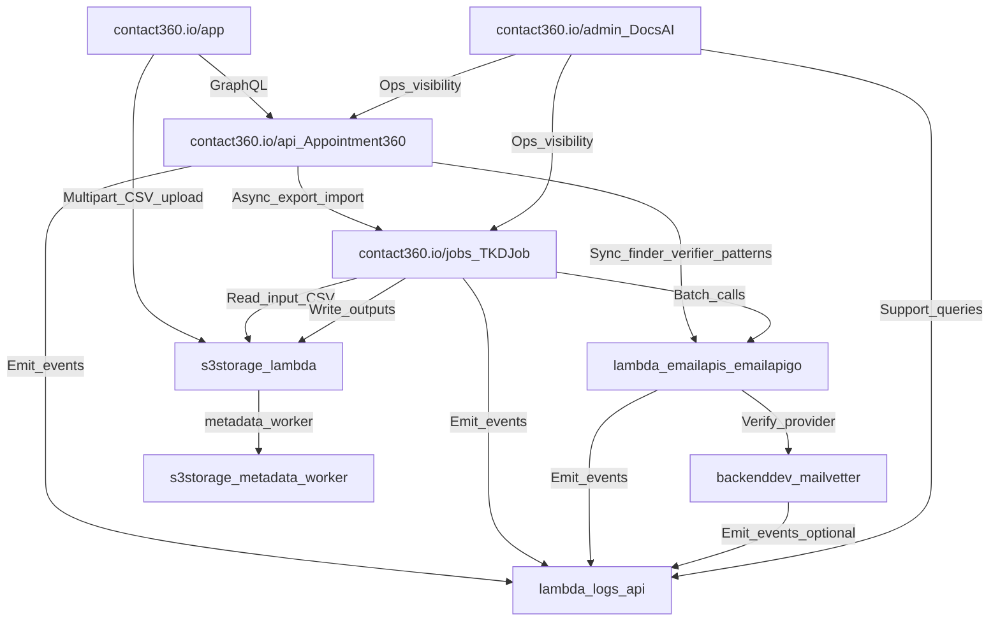

# Contact360 `2.x` Email System — unified runtime map (codebase-grounded)

This era is a **distributed email platform** spanning dashboard UX, a GraphQL gateway, Lambda runtimes, a deep verification engine, stream-job processors, and storage + telemetry control planes.

This document is the **single source of truth** for:

- the end-to-end runtime graph (sync and async)
- the **concrete code locations** (entrypoints + high-value files)
- a cross-system **risk register** (with file pointers)
- the **correlation/trace contract** used to debug and audit `2.x`

Related:

- Shared gates: per-patch **Micro-gate** + **Service task slices** in `2.N.P — *.md`; era hub [`versions.md`](../versions.md)
- Per-minor scopes: `2.0 — Email Foundation.md` … `2.10 — Email System Exit Gate.md`
- Codebase analyses: `docs/codebases/*-codebase-analysis.md`

---

## System map (runtime graph)

---

## Critical codebase file map (entrypoints + high-value files)

| Service | Codebase path | Entry points | High-value files to touch in `2.x` |
| --- | --- | --- | --- |
| Dashboard (Email Studio) | `contact360.io/app` | Next.js routes | `app/app/(dashboard)/...`, `src/lib/graphqlClient.ts`, hooks: `useEmailFinderSingle`, `useEmailVerifierSingle`, `useEmailVerifierBulk`, `useFiles`, `useJobs` (see [`docs/codebases/app-codebase-analysis.md`](../codebases/app-codebase-analysis.md)) |
| Gateway (GraphQL orchestrator) | `contact360.io/api` | `/graphql` | `app/graphql/schema.py`, `app/graphql/context.py`, `app/graphql/modules/email/*`, `app/graphql/modules/jobs/*`, `app/clients/lambda_email_client.py`, `app/clients/tkdjob_client.py`, middleware in `app/core/middleware.py` (see [`docs/codebases/appointment360-codebase-analysis.md`](../codebases/appointment360-codebase-analysis.md)) |
| Email runtime (Python) | `lambda/emailapis` | FastAPI | `lambda/emailapis/app/main.py`, `app/api/v1/router.py`, `app/services/email_finder_service.py`, `app/services/email_verification_service.py`, `app/services/email_pattern_service.py` (see [`docs/codebases/emailapis-codebase-analysis.md`](../codebases/emailapis-codebase-analysis.md)) |
| Email runtime (Go) | `lambda/emailapigo` | Gin | `lambda/emailapigo/main.go`, `internal/api/router.go`, `internal/services/email_finder_service.go`, `internal/services/email_verification_service.go`, `internal/services/email_pattern_service.go` (see [`docs/codebases/emailapis-codebase-analysis.md`](../codebases/emailapis-codebase-analysis.md)) |
| Deep verification engine | `backend(dev)/mailvetter` | Gin + worker binaries | `cmd/api/main.go`, `cmd/worker/main.go`, `internal/handlers/validate.go`, `internal/validator/logic.go`, `internal/validator/scoring.go`, `internal/store/db.go`, `internal/webhook/dispatcher.go` (see [`docs/codebases/mailvetter-codebase-analysis.md`](../codebases/mailvetter-codebase-analysis.md)) |
| Stream jobs | `contact360.io/jobs` | FastAPI + processors | `app/api/v1/routes/jobs.py`, processors in `app/processors/`, scheduler/consumer in `app/workers/*` (see [`docs/codebases/jobs-codebase-analysis.md`](../codebases/jobs-codebase-analysis.md)) |
| Storage control plane | `lambda/s3storage` | FastAPI + worker | `app/main.py`, `app/api/v1/router.py`, `app/services/storage_service.py`, worker path `app/utils/worker.py`, metadata merge `app/utils/update_bucket_metadata.py` (see [`docs/codebases/s3storage-codebase-analysis.md`](../codebases/s3storage-codebase-analysis.md)) |
| Telemetry (logs) | `lambda/logs.api` | FastAPI | `app/main.py`, `app/services/log_service.py`, `app/models/log_repository.py`, `app/clients/s3.py` (see [`docs/codebases/logsapi-codebase-analysis.md`](../codebases/logsapi-codebase-analysis.md)) |
| Mailbox app (2.5 minor) | `contact360.io/email` | Next.js routes | `components/email-list.tsx`, `components/data-table.tsx`, `context/imap-context.tsx` (see [`docs/codebases/email-codebase-analysis.md`](../codebases/email-codebase-analysis.md)) |
| Admin/docs | `contact360.io/admin` | Django views | `apps/core/navigation.py`, graph viewers under `static/js/components/*` (see [`docs/codebases/admin-codebase-analysis.md`](../codebases/admin-codebase-analysis.md)) |

---

## End-to-end flows (what actually happens)

### A) Synchronous (interactive)

`contact360.io/app` → `contact360.io/api` GraphQL → `lambda/emailapis|emailapigo` → (optional) `mailvetter` → normalized response → UI

- Finder (single): create candidates (cache/pattern/generator) → verify candidates → return best + alternates.
- Verifier (single): validate + score → return status + explainability fields.
- Patterns (add): persist `email_patterns` (and any evidence fields) through the gateway contract.

### B) Asynchronous (CSV bulk)

`contact360.io/app` upload → `lambda/s3storage` multipart complete → metadata worker → `contact360.io/api` create job → `contact360.io/jobs` stream processor → batch calls → write output to S3 → UI download

- Export processors: `email_finder_export_stream`, `email_verify_export_stream`
- Import processor: `email_pattern_import_stream`

---

## Correlation + trace contract (required for 2.x debugging)

### Headers (minimum)

- **`X-Request-Id`**: generated at the **edge** (gateway) if absent, echoed downstream.
- **`X-Trace-Id`**: optional cross-service trace token used by gateway middleware and forwarded to all internal calls.

### Propagation rules

| Hop | Rule |
| --- | --- |
| App → API | app sends `X-Request-Id` (optional); API always returns it in response headers |
| API → Lambdas / jobs / logs | API forwards `X-Request-Id` and `X-Trace-Id` to every internal client call |
| Jobs processors → downstream runtimes | processor forwards `X-Request-Id` for each batch call; logs include `job_id` + `checkpoint` |

### Logging fields (minimum)

All `2.x` email logs (gateway, jobs, lambdas, verifier) should carry:

- `request_id`, `trace_id`
- `user_uuid` (or `actor_id`)
- `job_id` + `processor` for bulk
- **never** raw CSV body or large PII blobs in high-volume telemetry (see **Service task slices** on `2.8.P` patches + [`logsapi-codebase-analysis.md`](../codebases/logsapi-codebase-analysis.md))

---

## Cross-system risk register (2.x highest leverage)

| Risk | Severity | Where it shows up | Concrete file pointers / sources | Suggested first gate |
| --- | --- | --- | --- | --- |
| Gateway debug file writes in prod paths | High | Uncontrolled local writes, leaking data, broken Lambda FS assumptions | `contact360.io/api` email/jobs modules (flagged in [`docs/codebases/appointment360-codebase-analysis.md`](../codebases/appointment360-codebase-analysis.md)) | `2.0.x` / `2.0.3` remove + CI check |
| Provider drift (`truelist` vs `mailvetter`) | High | Different verifiers/providers referenced by docs vs runtime | `lambda/emailapis` vs `lambda/emailapigo` provider preferences (flagged in [`docs/codebases/emailapis-codebase-analysis.md`](../codebases/emailapis-codebase-analysis.md)) | `2.6.x` parity + canonical provider registry |
| Status semantic drift | High | UI “valid/risky/catch_all” mismatches across layers | Gateway mappers + UI badges + Mailvetter vocabulary (see [`docs/codebases/mailvetter-codebase-analysis.md`](../codebases/mailvetter-codebase-analysis.md)) | `2.2.x` freeze vocabulary + mapping table |
| Multipart session state is in-memory | High | Bulk uploads fail on cold start / scale | `lambda/s3storage` `_MULTIPART_SESSIONS` in-process store (flagged in [`docs/codebases/s3storage-codebase-analysis.md`](../codebases/s3storage-codebase-analysis.md)) | `2.4.x` durable multipart state |
| logs.api doc drift (Mongo vs S3 CSV) | Medium | Support queries don’t match real storage | `lambda/logs.api` is S3 CSV store (flagged in [`docs/codebases/logsapi-codebase-analysis.md`](../codebases/logsapi-codebase-analysis.md)) | `2.8.x` lock event schema + docs parity |
| Mailvetter dual surface (legacy + v1) | High | Clients call old endpoints; inconsistent behavior | `backend(dev)/mailvetter` legacy routes vs `/v1/*` (flagged in [`docs/codebases/mailvetter-codebase-analysis.md`](../codebases/mailvetter-codebase-analysis.md)) | `2.7.x` deprecate legacy, keep v1 canonical |
| Mailvetter in-memory limiter | High | Multi-replica limit bypass or over-limit | `backend(dev)/mailvetter` rate limiting strategy (flagged in codebase analysis) | `2.7.x` Redis-backed limiter |
| Email mailbox IMAP secret handling | High | IMAP creds stored in localStorage + passed in headers | `contact360.io/email` `ImapContext` + fetch headers (flagged in [`docs/codebases/email-codebase-analysis.md`](../codebases/email-codebase-analysis.md)) | `2.5.x` session-token design |

---

## Small-task breakdown (execution-ready, codebase anchored)

### P0 — Contract freeze (stops drift)

- **Provider registry and naming**: one canonical list used by gateway + both Lambda runtimes.
- **Status vocabulary and mapping table**: Mailvetter ↔ Lambdas ↔ GraphQL ↔ UI badges.
- **Bulk job contract**: processors, terminal states, checkpoint/resume semantics.

### P0 — Bulk correctness and safety

- **Durable multipart state** in s3storage.
- **Idempotency keys** for bulk create (mailvetter + jobs create paths).
- **No double-charge**: credit correlation id threaded through bulk retries.

### P1 — Observability and audit

- request/trace propagation enforced
- logs.api event schema locked and queryable by `user_uuid`, `request_id`, `job_id`
- PII rules applied consistently (especially CSV artifacts and logs)

### P1 — Boundary tests (where most failures occur)

- docs/backend module parity tests for `15_EMAIL_MODULE.md` and `16_JOBS_MODULE.md`
- e2e: CSV upload → job → output download
