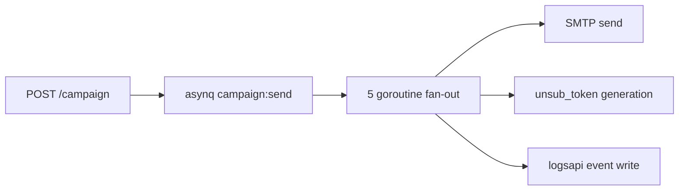

# EmailCampaign Service Task Pack (10.x)

Codebase: `backend(dev)/email campaign`

## Known gaps to close first

- `db/schema.sql` missing `templates` table.
- `db/schema.sql` missing `recipients.unsub_token`.
- `db/queries.go` unsubscribe token query uses wrong DB method.
- `worker/email_worker.go` missing SMTP auth wiring.
- `cmd/main.go` lacks route JWT enforcement.

## Immediate implementation queue

| Task | Code path | Patch |
| --- | --- | --- |
| Add `templates` DDL and `unsub_token` column | `db/schema.sql` | `10.A.2` |
| Fix token query path (`DB.Get`) | `db/queries.go` | `10.A.1` |
| Add SMTP env auth (`SMTP_*`) | `worker/email_worker.go` | `10.A.1` |
| Lock JWT middleware on non-health routes | `cmd/main.go` | `10.A.0` |
| Standardize Asynq `campaign:send` options | `cmd/worker/main.go` | `10.A.4` |
| Add idempotency + retry budget controls | worker send path | `10.A.6` |
| Emit logsapi immutable campaign events | API + worker | `10.A.7` |

## Runtime flow

## Release checklist

- [ ] Schema drift fixed and migrated.
- [ ] SMTP auth validated in non-dev environment.
- [ ] Queue retries/DLQ behavior tested.
- [ ] Logsapi event schema validated with trace fields.
