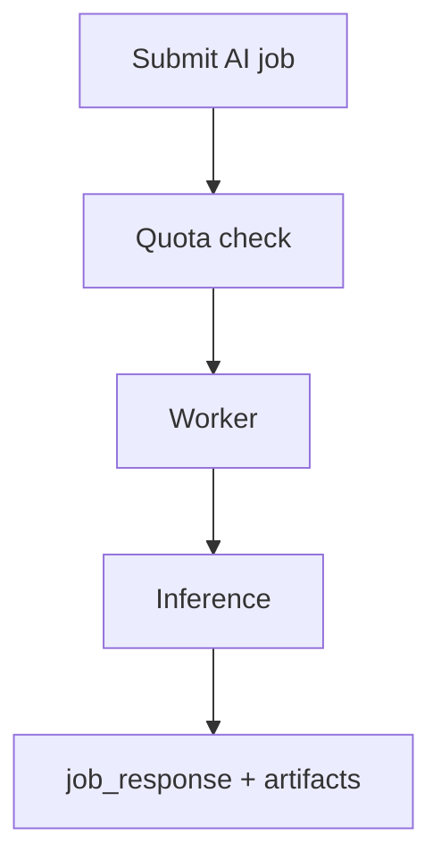

# jobs task pack — era `5.x`

This pack decomposes `contact360.io/jobs` work into Contract, Service, Surface, Data, and Ops tracks for **AI batch workflows**.

**Reference:** [`docs/codebases/jobs-codebase-analysis.md`](../codebases/jobs-codebase-analysis.md) — Era `5.x` AI workflows section.

---

## Contract tasks

- [ ] Define **AI batch processor contract extensions**: envelope fields `model` (string id), `confidence` (nullable structured summary), `cost` (estimated units or currency minor units); JSON schema version.
- [ ] Define **quota-aware scheduling contract**: enqueue rejects or defers when user/org over AI budget or daily cap; error codes align with [`version_5.3.md`](version_5.3.md).
- [ ] Document **idempotency** for AI jobs: dedupe key scope (user + input hash + processor type).
- [ ] Register allowed **AI processor kinds** in a single registry (code or config) with validation tests.

## Service tasks

- [ ] Add **AI processor stubs** and **registry validation tests** (unknown processor fails fast at enqueue).
- [ ] Enforce **quota/cost guardrails** during enqueue and execution (short-circuit before provider calls when possible).
- [ ] Share inference client patterns with `contact.ai` where feasible (single model id vocabulary).
- [ ] Tune worker concurrency for AI tasks separately from IO-bound jobs (timeouts, retries).

## Surface tasks

- [ ] Document **AI batch execution cards**: model name, confidence display, retry UX, budget warnings ([`docs/frontend/jobs-ui-bindings.md`](../frontend/jobs-ui-bindings.md)).
- [ ] Document **model selection** and **budget-warning** control behavior for operators.
- [ ] Loading/progress patterns per design system for long AI batches.

## Data tasks

- [ ] Add **`job_response` conventions** for AI model metadata, token estimates, and confidence snapshot.
- [ ] Document **lineage** from AI input batch → scored output artifacts → optional S3 pointers ([`version_5.7.md`](version_5.7.md)).
- [ ] Ensure correlation ids propagate to `logs.api` for AI job spans ([`version_5.8.md`](version_5.8.md)).

## Ops tasks

- [ ] **Cost observability**: metrics for AI job duration, spend estimates, failure rate by model.
- [ ] **Alerts**: budget threshold, stuck jobs, provider outage patterns.
- [ ] **Runbook**: model degradation — disable processor kind, drain queue, fallback behavior.

---

## Flow

## Completion pointer

Primary doc slice: [`version_5.6.md`](version_5.6.md) — Batch Intelligence.
