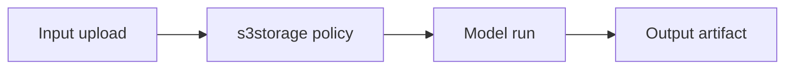

# `s3storage` task pack — Era `5.x.x`

## Scope

AI workflow **artifacts** with **policy**, **lineage**, and **audit** controls (`lambda/s3storage`).

**Reference:** [`docs/codebases/s3storage-codebase-analysis.md`](../codebases/s3storage-codebase-analysis.md) — `5.x.x` Contact360 AI workflows.

---

## Contract track

- [ ] Define **four AI artifact classes** (stable enum):
  - `prompt` — versioned system/user prompt text or hash references
  - `input` — user/upload/context payload references (redacted index)
  - `output` — model completions or structured AI results
  - `intermediate` — chain-of-thought storage **disallowed by default**; only if policy explicitly allows with extra encryption
- [ ] Define **retention and access policy** per class (TTL, legal hold, tenant tier).
- [ ] Define **signed URL** rules: short TTL, role-scoped, auditable.
- [ ] **Immutability:** compliance bundles use write-once / object lock semantics where required.

## Service track

- [ ] Enforce **object-class policy checks** for AI-related prefixes (deny wrong content-type or path).
- [ ] Implement **immutable write mode** for compliance-sensitive artifacts when `IMMUTABLE_AI_ARTIFACTS=true` (or equivalent env).
- [ ] Validate multipart upload lifecycle for large AI exports; abort stale sessions.
- [ ] Rate limit AI artifact writes per tenant to control cost.

## Data / lineage track

- [ ] **Lineage graph:** `source_upload_id` → `model_run_id` → `output_object_key`; store in `metadata.json` or sibling index row per storage design.
- [ ] Link to **prompt version** from [`version_5.4.md`](version_5.4.md) in metadata only (not always full prompt body).
- [ ] **Reconciliation job** (optional): S3 keys vs metadata DB for AI prefixes.

## Surface track

- [ ] Document **retrieval semantics** for AI consumers (dashboard vs internal tools) — [`docs/frontend/s3storage-ui-bindings.md`](../frontend/s3storage-ui-bindings.md).
- [ ] Explicit error codes: expired URL, forbidden class, policy violation.

## Ops track

- [ ] **Policy check coverage report** in CI or release checklist.
- [ ] **Lineage traceability** pass on representative workflows (upload → infer → export).
- [ ] **Audit trail** for sensitive AI artifact reads (who, when, key id).
- [ ] Cost monitoring: storage growth by artifact class.

---

## Flow / graph

## Completion pointer

Primary doc slice: [`version_5.7.md`](version_5.7.md) — Artifact Vault.
