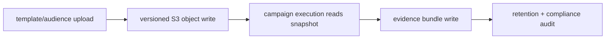

# S3Storage Task Pack (10.x)

Codebase: `lambda/s3storage`

## Artifact path contract

- `campaign/{campaign_id}/template.html`
- `campaign/{campaign_id}/audience.csv`
- `campaign/{campaign_id}/evidence/{artifact}.json|csv`

## Execution tasks

| Task | Scope | Patch |
| --- | --- | --- |
| Freeze artifact naming/versioning contract | contract | `10.A.0` |
| Enforce immutable write mode for evidence artifacts | service | `10.A.7` |
| Add metadata worker lineage fields (`campaign_id`, `artifact_hash`) | data | `10.A.2` |
| Add retention + lifecycle validation report | ops | `10.A.9` |

## Artifact lifecycle flow

