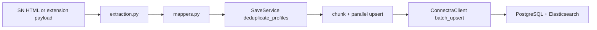

# Sales Navigator ingestion (roadmap stage 4.2)

## Python service (primary)

**Path:** `backend(dev)/salesnavigator/`

| Concern | Location |
|--------|----------|
| Deduplicate profiles (LinkedIn URL normalization, keep richest) | `app/services/save_service.py` — `deduplicate_profiles` |
| Merge enrichment into base profile | `merge_profile_data` |
| Connectra HTTP client + retries | `app/clients/connectra_client.py` |
| Tests | `tests/test_save_service.py` |

## Endpoint contract (4.2 freeze)

| Endpoint | Purpose | Key rules |
| --- | --- | --- |
| `POST /v1/scrape` | Parse Sales Navigator HTML to profile objects | Max HTML size documented and enforced |
| `POST /v1/save-profiles` | Dedup + map + upsert profiles to Connectra | Supports partial success with `errors[]` |

Error envelope contract:
- `success=false` and typed `errors[]`
- Partial success allowed (`saved_count > 0` with non-empty `errors[]`)
- `X-Request-ID` returned for traceability

## Runtime pipeline

## Extraction and dedup mechanics

- Support SN DOM variants used by extension workflows (search results, people tabs, account variants).
- Normalize Sales Navigator URLs to canonical LinkedIn profile URLs before identity matching.
- Choose best candidate per normalized profile URL using completeness scoring.
- Preserve provenance fields in outbound payload: `source`, `lead_id`, `search_id`, `data_quality_score`, `connection_degree`.

## Chunking and replay

- Save service batches requests into bounded chunks for Connectra bulk upsert.
- Replay safety relies on deterministic UUID behavior downstream and stable normalized URLs.
- Retry failed chunks only; avoid replaying successful chunks where possible.

## Extension client alignment

**Canonical client:** `extension/contact360/` — `utils/profileMerger.js` and `utils/lambdaClient.js` must align with server-side merge and retry behavior.

Legacy typo path `extention/contact360/` appears in historical docs only and should not be used for new work.

## Cross-doc references

- [`salesnavigator-extension-sn-task-pack.md`](./README.md)
- [`extension-sync-integrity.md`](extension-sync-integrity.md)
- [`docs/codebases/salesnavigator-codebase-analysis.md`](../codebases/salesnavigator-codebase-analysis.md)
- [`docs/backend/endpoints/salesnavigator_endpoint_era_matrix.json`](../backend/endpoints/salesnavigator_endpoint_era_matrix.json)
- [`docs/backend/database/salesnavigator_data_lineage.md`](../backend/database/salesnavigator_data_lineage.md)
