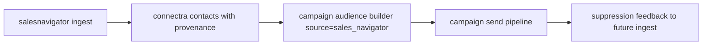

# SalesNavigator Task Pack (10.x)

Codebase: `backend(dev)/salesnavigator`

## Core requirements

| Task | Scope | Patch |
| --- | --- | --- |
| Add SN segment filter in campaign audience builder | surface | `10.A.3` |
| Carry provenance fields `lead_id`, `search_id`, `session_id` | data | `10.A.2` |
| Ensure suppression propagation on re-ingest | service | `10.A.5` |
| Add compliance audit trace for SN-sourced recipients | ops | `10.A.7` |

## Compliance behavior

- SN-sourced contacts follow same campaign suppression/compliance rules.
- Re-ingest must not clear unsubscribe or bounce-derived suppression.

## Flow

