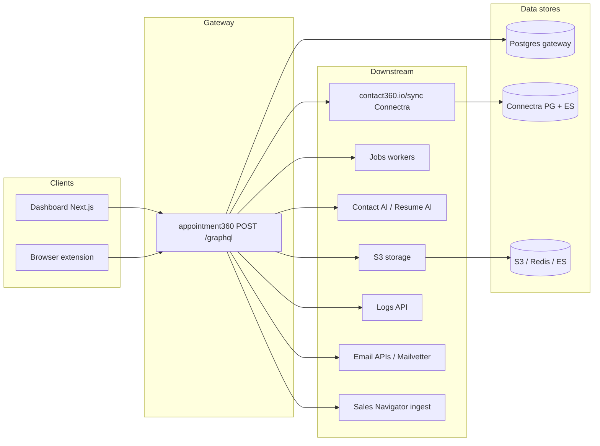

# Service topology

This hub ties together the **GraphQL gateway** (`appointment360`), **downstream HTTP/Lambda workers**, and where to find **era matrices** and **data lineage** for each surface. Endpoint specs link here under **Topology overview**.

## Service registry

| Service | Codebase / path | Runtime | Primary entry | Era matrix | Data lineage |
| --- | --- | --- | --- | --- | --- |
| **appointment360** (API gateway) | `contact360.io/api` | FastAPI + Strawberry GraphQL + asyncpg + PostgreSQL | `POST /graphql` | [appointment360_endpoint_era_matrix.md](appointment360_endpoint_era_matrix.md) | [../database/appointment360_data_lineage.md](../database/appointment360_data_lineage.md) |
| **contact360.io/sync** (Connectra) | `contact360.io/sync` | Service behind contacts/companies/VQL | `POST /contacts/*`, `POST /companies/*`, VQL | [connectra_endpoint_era_matrix.md](connectra_endpoint_era_matrix.md) | [../database/connectra_data_lineage.md](../database/connectra_data_lineage.md) |
| **S3 storage** | Lambda / storage layer | AWS S3 APIs | Presigned upload, object reads | [s3storage_endpoint_era_matrix.md](s3storage_endpoint_era_matrix.md) | [../database/s3storage_data_lineage.md](../database/s3storage_data_lineage.md) |
| **Logs API** | Logging pipeline | HTTP ingest | Log batch endpoints | [logsapi_endpoint_era_matrix.md](logsapi_endpoint_era_matrix.md) | [../database/logsapi_data_lineage.md](../database/logsapi_data_lineage.md) |
| **Email APIs** (finder/verify) | Email workers | Lambda / Go paths | Job-driven + GraphQL delegation | [emailapis_endpoint_era_matrix.md](emailapis_endpoint_era_matrix.md) | [../database/emailapis_data_lineage.md](../database/emailapis_data_lineage.md) |
| **Jobs** (tkdjob / exports) | Async jobs | Workers + DB | Job CRUD, retries | [jobs_endpoint_era_matrix.md](jobs_endpoint_era_matrix.md) | [../database/jobs_data_lineage.md](../database/jobs_data_lineage.md) |
| **Email campaign** | Campaign engine | Service + DB | Sequences, templates | [emailcampaign_endpoint_era_matrix.md](emailcampaign_endpoint_era_matrix.md) | [../database/emailcampaign_data_lineage.md](../database/emailcampaign_data_lineage.md) |
| **Mailvetter** | Verification | SMTP/DNS pipeline | Verify endpoints | [mailvetter_endpoint_era_matrix.md](mailvetter_endpoint_era_matrix.md) | [../database/mailvetter_data_lineage.md](../database/mailvetter_data_lineage.md) |
| **Contact AI** | AI orchestration | HF / Gemini utilities | AI chat & tools | [contact_ai_endpoint_era_matrix.md](contact_ai_endpoint_era_matrix.md) | [../database/contact_ai_data_lineage.md](../database/contact_ai_data_lineage.md) |
| **Sales Navigator** | LinkedIn channel | Ingest + sync | SN search / export | [salesnavigator_endpoint_era_matrix.md](salesnavigator_endpoint_era_matrix.md) | [../database/salesnavigator_data_lineage.md](../database/salesnavigator_data_lineage.md) |
| **Email app (Mailhub)** | `contact360.io/email` | Next + REST / IMAP | Folder & message APIs | [emailapp_endpoint_era_matrix.md](emailapp_endpoint_era_matrix.md) | [../database/emailapp_data_lineage.md](../database/emailapp_data_lineage.md) |
| **Admin (Django)** | `contact360.io/admin` | Django + DRF | HTML + JSON admin | [admin_endpoint_era_matrix.md](admin_endpoint_era_matrix.md) | [../database/admin_data_lineage.md](../database/admin_data_lineage.md) |

## Request flow (dashboard & extension)

## Cross-service delegation (GraphQL → downstream)

Gateway resolvers declare **`lambda_services`** / HTTP delegates in endpoint JSON. Typical patterns:

| Delegation target | Used for (examples) |
| --- | --- |
| **contact360.io/sync** | `graphql/GetContact`, `graphql/GetCompany`, VQL `contactQuery` / `companyQuery`, filters, counts — contacts & companies CRUD and search |
| **Jobs** | Export/import jobs, retries, bulk CSV |
| **S3 storage** | Multipart uploads, CSV artifacts, file metadata |
| **Logs API** | `CreateLog`, batch logging |
| **Email APIs / Mailvetter** | Finder, verifier, patterns |
| **Contact AI** | AI chat, parsing, risk analysis |
| **Sales Navigator** | Profile sync, SN search |

See each `*_graphql.md` **lambda_services** and **db_tables_read/write** for the exact chain. Naming rules for linking specs to DB snapshots are in [ENDPOINT_DATABASE_LINKS.md](ENDPOINT_DATABASE_LINKS.md).

## Era matrix index (all services)

- [appointment360_endpoint_era_matrix.md](appointment360_endpoint_era_matrix.md)
- [connectra_endpoint_era_matrix.md](connectra_endpoint_era_matrix.md)
- [s3storage_endpoint_era_matrix.md](s3storage_endpoint_era_matrix.md)
- [logsapi_endpoint_era_matrix.md](logsapi_endpoint_era_matrix.md)
- [emailapis_endpoint_era_matrix.md](emailapis_endpoint_era_matrix.md)
- [jobs_endpoint_era_matrix.md](jobs_endpoint_era_matrix.md)
- [emailcampaign_endpoint_era_matrix.md](emailcampaign_endpoint_era_matrix.md)
- [mailvetter_endpoint_era_matrix.md](mailvetter_endpoint_era_matrix.md)
- [contact_ai_endpoint_era_matrix.md](contact_ai_endpoint_era_matrix.md)
- [salesnavigator_endpoint_era_matrix.md](salesnavigator_endpoint_era_matrix.md)
- [emailapp_endpoint_era_matrix.md](emailapp_endpoint_era_matrix.md)
- [admin_endpoint_era_matrix.md](admin_endpoint_era_matrix.md)

## Data lineage index (all docs)

- [../database/appointment360_data_lineage.md](../database/appointment360_data_lineage.md)
- [../database/connectra_data_lineage.md](../database/connectra_data_lineage.md)
- [../database/s3storage_data_lineage.md](../database/s3storage_data_lineage.md)
- [../database/logsapi_data_lineage.md](../database/logsapi_data_lineage.md)
- [../database/emailapis_data_lineage.md](../database/emailapis_data_lineage.md)
- [../database/jobs_data_lineage.md](../database/jobs_data_lineage.md)
- [../database/emailcampaign_data_lineage.md](../database/emailcampaign_data_lineage.md)
- [../database/mailvetter_data_lineage.md](../database/mailvetter_data_lineage.md)
- [../database/contact_ai_data_lineage.md](../database/contact_ai_data_lineage.md)
- [../database/salesnavigator_data_lineage.md](../database/salesnavigator_data_lineage.md)
- [../database/emailapp_data_lineage.md](../database/emailapp_data_lineage.md)
- [../database/admin_data_lineage.md](../database/admin_data_lineage.md)

## Lambda & worker services (by path)

Short labels for matrices that describe **non-gateway** surfaces (Mailhub UI, admin app, workers). Use the **Service registry** table above for canonical links.

| Label | See |
| --- | --- |
| Mailhub / email frontend | [emailapp_endpoint_era_matrix.md](emailapp_endpoint_era_matrix.md), [../database/emailapp_data_lineage.md](../database/emailapp_data_lineage.md) |
| Django admin | [admin_endpoint_era_matrix.md](admin_endpoint_era_matrix.md), [../database/admin_data_lineage.md](../database/admin_data_lineage.md) |
| Connectra sync API | [connectra_endpoint_era_matrix.md](connectra_endpoint_era_matrix.md), [../database/connectra_data_lineage.md](../database/connectra_data_lineage.md) |
