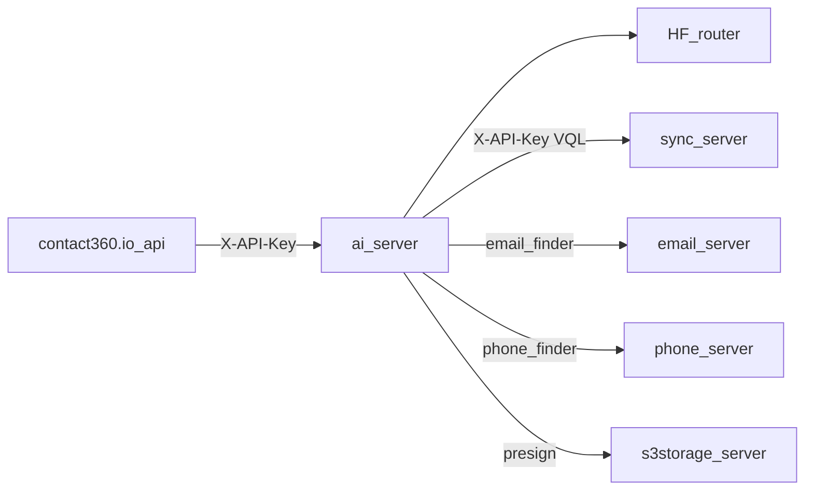

# ai.server — ecosystem boundary (Era 2)

| System | Role |
|--------|------|
| **ai.server** | NL → VQL / Apollo URL parsing; Hugging Face chat; optional Postgres chat history; orchestrates satellite HTTP calls. |
| **sync.server (Connectra)** | System of record: `POST /contacts/`, `POST /companies/` VQL search; `GET /contacts/:uuid`, `GET /companies/:uuid`. |
| **email.server** | `POST /email/finder/?first_name&last_name&domain` |
| **phone.server** | `POST /phone/finder/?first_name&last_name&domain` |
| **s3storage.server** | `GET /api/v1/objects/presign-download?key=...` |
| **contact360.io/api** | Calls ai.server via **`AIServerClient`** (`/api/v1/*`). |

Last updated: 2026-04-15.
