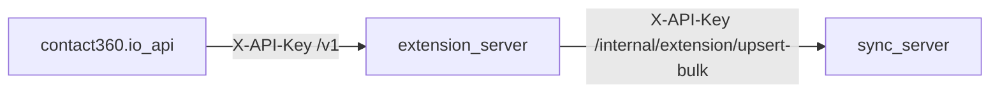

# extension.server — ecosystem boundary (Era 2)

## Roles

| Component | Role |
|-----------|------|
| **extension.server** | Accepts scraped or JSON profile batches from the gateway or browser flows; parses HTML (Sales Navigator); maps to lightweight DTOs; calls Connectra bulk upsert. |
| **sync.server (Connectra)** | System of record for contacts/companies (Postgres + OpenSearch). Exposes **`POST /internal/extension/upsert-bulk`** for the satellite payload shape. |
| **contact360.io/api** | Calls extension via **`SalesNavigatorServerClient`** (`/v1/save-profiles`, `/v1/scrape`). |
| **s3storage.server** | Not used by extension today. Future: optional raw HTML or asset uploads (Phase 2). |

## Data flow

1. Profiles arrive as JSON (`save-profiles`) or HTML (`scrape` + optional `save`).
2. Extension dedupes and chunks; **in-process workers** fan out HTTP POSTs to Connectra.
3. Connectra resolves companies (synthetic stable `linkedin_url` under `https://extension.sync.local/company/...`) then upserts contacts by **email** and/or **`linkedin_url`** identity.

Last updated: 2026-04-15.
