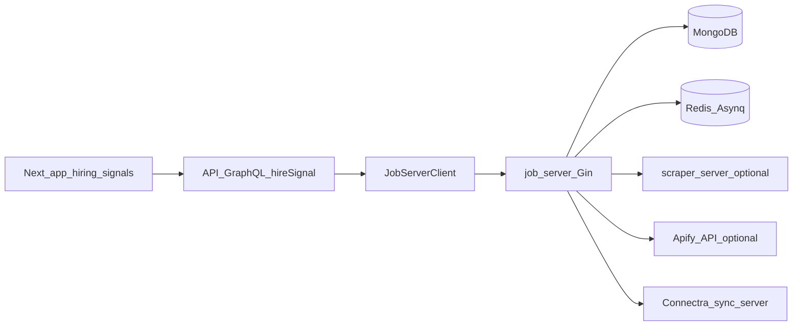

# Hiring signals — full contract (job.server ↔ gateway ↔ app)

Single reference for HTTP routes, GraphQL `hireSignal` fields, auth, request/response envelopes, and typical status codes.  
See also: [ROUTE-CLIENT-MATRIX.md](ROUTE-CLIENT-MATRIX.md), [AUTH-ENV.md](AUTH-ENV.md), [EVENTS-BOUNDARY.md](EVENTS-BOUNDARY.md), [job.server-schema.md](../../database/job.server-schema.md).

## Architecture

## Auth

| Layer | Rule |
| ----- | ---- |
| **job.server** `GET /health` | No API key. |
| **job.server** `/api/v1/*` | Header `X-API-Key` must match `API_KEY` when `API_KEY` is non-empty. If `API_KEY` is empty, middleware allows all requests (local only). **`APP_ENV=production` requires `API_KEY`** (process exits on startup if missing). |
| **Gateway** `POST /graphql` | User JWT (Bearer). |
| **Gateway → job.server** | `JOB_SERVER_API_KEY` as `X-API-Key`. |

## job.server REST — success envelope

Most JSON responses use:

- `success` (bool)
- `data` (object or array, when applicable)
- `detail` (string, on error responses)

List endpoints may include `total`, `limit`, `offset` where supported.

## job.server routes (summary)

| Method | Path | Auth | Success | Notes |
| ------ | ---- | ---- | ------- | ----- |
| GET | `/health` | No | `status`, `mongo`, `redis` | 503 if backends unhealthy (see health handler). |
| GET | `/api/v1/jobs` | Yes | `success`, `data`, `total`, `limit`, `offset` | Query filters: **`title`**, **`company`**, **`location`** may be repeated (OR within each field; **literal substring** case-insensitive Mongo `$regex` via `regexp.QuoteMeta`). **`employment_type`** may be repeated. **`workplace_type`** repeated → `workplace_types` `$in`. **`industry`**, **`excluded_*`** facets, **`salary_min`**, **`experience_bucket`**, **`role_track`**, **`education_level_min`**, **`clearance_mode`**, **`h1b_only`**, **`skill`** (repeat, `$all` on ingested `skill_tags`), **`exclude_linkedin_job_id`**. Also `seniority`, `function`, `posted_after`, `posted_before`, **`run_id`** → Mongo `apify_run_id`. |
| GET | `/api/v1/jobs/filter-options` | Yes | `success`, `data` (array of `{ value, count }`), `field` | `field` = `title` \| `company` \| `location`; `q` optional prefix search; `limit` max options (default 50). Same filter query params as `/jobs` to scope the aggregation; the facet field’s own filters are excluded so lists stay usable. **Register this route before `/api/v1/jobs/:id`.** |
| GET | `/api/v1/jobs/stats` | Yes | `success`, `total_jobs`, `jobs_with_company` | |
| GET | `/api/v1/jobs/:linkedinJobId` | Yes | `success`, `data` | 404 if not found. |
| GET | `/api/v1/runs` | Yes | `success`, `data`, **`total`**, `limit`, `offset` | `client_scrape_job_id` optional filter. |
| GET | `/api/v1/runs/metrics` | Yes | `success`, `data` (`total`, `by_status`, `broker_queue_depth`) | Mongo aggregate on `apify_runs.status`. |
| GET | `/api/v1/runs/:id` | Yes | `success`, `data` | 404 if not found. |
| GET | `/api/v1/runs/:id/refresh` | Yes | `success`, `data`, `apify_status`, `apify_dataset` | Polls **Apify**. **502** if upstream HTTP fails. |
| POST | `/api/v1/runs` | Yes | **202** `success`, `message`, `task_id`, `queue` | Body: `StartScrapePayload`. **400** if invalid JSON, empty body, or validation fails (keywords/geo may synthesize URLs; Apify: URLs unless `trigger=cron`). |
| GET | `/api/v1/companies` | Yes | companies list | |
| GET | `/api/v1/companies/:uuid/jobs` | Yes | jobs for company | |
| GET | `/api/v1/jobs/:id/company` | Yes | job + Connectra company | **409** if job has no `company_uuid`; **503** if Connectra not configured. |
| GET | `/api/v1/jobs/:id/contacts` | Yes | VQL contacts | **409** / **503** per handler. |
| GET | `/api/v1/companies/:uuid/contacts` | Yes | VQL contacts | **503** if Connectra not configured. |
| GET | `/api/v1/companies/:uuid/record` | Yes | Connectra company record | |

Export / Connectra batch routes: see [router.go](../../../../EC2/job.server/internal/api/router.go).

## GraphQL `hireSignal` (gateway)

All fields require an authenticated user unless noted. Satellite calls use `JobServerClient`; tracked scrapes use Postgres `scrape_jobs`.

| GraphQL field | job.server / source | HTTP / behavior |
| ------------- | ------------------- | --------------- |
| `jobs(...)` | `GET /api/v1/jobs` | Args include `titles`, `companies`, `locations` (lists), `runId` → `run_id`, **`extendedJobFilters`** (JSON camelCase → job.server extended params), **`hideApplied`** (gateway merges applied-job exclusions). |
| `jobFilterOptions(...)` | `GET /api/v1/jobs/filter-options` | Same scoping args as `jobs` (including `extendedJobFilters`); facet field excluded from its own match. |
| `job(linkedinJobId)` | `GET /api/v1/jobs/{id}` | |
| `stats` | `GET /api/v1/jobs/stats` | |
| `runs(limit, offset)` | `GET /api/v1/runs` | |
| `hireSignalRunMetrics` | `GET /api/v1/runs/metrics` | |
| `run(runId)` | `GET /api/v1/runs/{id}` | |
| `refreshHireSignalRun(runId)` | `GET /api/v1/runs/{id}/refresh` | |
| `companies` | `GET /api/v1/companies` | |
| `companyJobs(companyUuid)` | `GET /api/v1/companies/{uuid}/jobs` | |
| `jobConnectraCompany` | `GET /api/v1/jobs/{id}/company` | |
| `jobConnectraContacts` | `GET /api/v1/jobs/{id}/contacts` | |
| `connectraCompany` | `GET /api/v1/companies/{uuid}/record` | |
| `connectraContactsForCompany` | `GET /api/v1/companies/{uuid}/contacts` | |
| `triggerScrape(body)` | `POST /api/v1/runs` | |
| `triggerScrapeAndTrack(body)` | Creates `scrape_jobs` row, then `POST /api/v1/runs` with `clientScrapeJobId` | |
| `deleteScrapeJob(scrapeJobId)` | Deletes `scrape_jobs` row; cancels linked job.server run when status is queued/running | |
| `listScrapeJobs` | Postgres only | |
| `getScrapeJob` / `scrapeJobJobs` | Postgres + job.server | |
| `suggestHireSignalFiltersFromResumeUpload` | resume.ai via gateway | Multipart resume parse → suggested titles/locations + `extendedJobFilters` JSON (user reviews in UI before search). |
| `addHireSignalHiddenCompany` / `removeHireSignalHiddenCompany` | Postgres prefs | Merged into job list exclusions server-side. |
| `recordHireSignalJobApplied` | Postgres prefs | When `hideApplied` is true, excluded via `exclude_linkedin_job_id` merge. |

## Gateway error mapping (job.server HTTP → GraphQL)

Upstream errors are raised as `JobServerClientError` / `BaseHTTPClientAPIError` with `status_code` and optional `response_data.detail`.  
`handle_graphql_error` maps:

| HTTP | GraphQL-style code | Notes |
| ---- | ------------------ | ----- |
| 400 | `BAD_REQUEST` / `VALIDATION_ERROR` | |
| 401 | `UNAUTHORIZED` | |
| 403 | `FORBIDDEN` | |
| 404 | `NOT_FOUND` | Message preserved. |
| 409 | `CONFLICT` | |
| 422 | `VALIDATION_ERROR` | |
| 502 | `BAD_GATEWAY` | e.g. Apify failure from satellite. |
| 503 | `SERVICE_UNAVAILABLE` | e.g. Connectra / scraper / Apify unavailable. |
| other | `HTTP_ERROR` | |

## App (`contact360.io/app`)

- Operations: [`hiringSignalService.ts`](../../../../contact360.io/app/src/services/graphql/hiringSignalService.ts).
- Hiring signals UI: `/hiring-signals` — hooks `useHiringSignals`, `useHireSignalRuns`, filter context, runs tables, scrape modal. **Runs (satellite)** tab uses **server-side** `runs(limit, offset)` pagination with API **`total`** (not client-only slicing).
- GraphQL client: `graphqlQuery(..., { showToastOnError: false })` for hiring-signal operations so hooks/components avoid **duplicate toasts**.

## Filter algebra (canonical)

- **Within a multi-value facet** (e.g. several `title` params): **OR**.
- **Across dimensions** (title vs company vs location vs structured filters): **AND**.
- **Exclude lists** (`excluded_title`, `excluded_company`, …): job must **not** match any token in that dimension (same literal-substring semantics as includes).
- **Date range:** `posted_after` / `posted_before` inclusive range on `posted_at` (ISO date or RFC3339).
- **`run_id`:** exact match on `apify_run_id` (not substring).
- **User text:** treated as **literal substrings** (not user-controlled regex); see `DECISIONS.md`.

## Mongo filter reference (`GET /api/v1/jobs`)

| Query param | Mongo field / behavior |
| ----------- | ---------------------- |
| `title` (repeat) | **OR** of literal substring `$regex` on `title` (i) |
| `company` (repeat) | **OR** of literal substring on `company_name` (i) |
| `location` (repeat) | **OR** of literal substring on `location` (i) |
| `excluded_title` / `excluded_company` / `excluded_location` / `excluded_industry` (repeat) | **None** shall match (literal substring, i) |
| `employment_type` (repeat) | **OR** — each term literal substring on `employment_type` (i) |
| `workplace_type` (repeat) | `workplace_types` array **`$in`** |
| `industry` (repeat) | **OR** literal substring on free-text industries field |
| `seniority` | `seniority_level` literal substring (i) |
| `function` | `function_category_v2` literal substring (i) |
| `posted_after` / `posted_before` | `posted_at` range |
| **`run_id`** | **exact `apify_run_id`** |
| `salary_min` | `salary_min_usd >=` (ingest-normalized) |
| `experience_bucket` (repeat) | `experience_bucket` **`$in`** |
| `role_track` (repeat) | `role_track` **`$in`** |
| `education_level_min` (repeat) | `education_level_min` **`$in`** |
| `clearance_mode` | `hide` → exclude `requires_clearance`; `only` → must be true |
| `h1b_only` | `mention_h1b` / similar ingest flag must be true |
| `skill` (repeat) | **`$all`** on ingested `skill_tags` |
| `exclude_linkedin_job_id` (repeat) | `_id` / linkedin id exclusion (bounded list) |

**Derived fields** (salary, buckets, clearance, H1B, skills, etc.) are populated at **ingest** in job.server (`ApplyDerivedFieldsToJob`); older Mongo docs may lack them until re-ingested.

**Last reviewed:** 2026-04-29.
