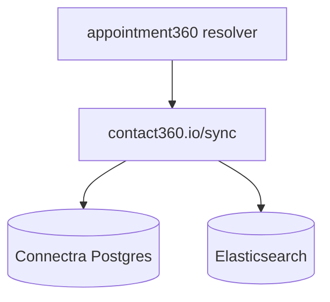

# Connectra sync API (`contact360.io/sync`)

Contact and company VQL, search, counts, and bulk upsert paths used by the GraphQL gateway and by services such as Sales Navigator when persisting profiles.

## Documentation map

| Doc | Purpose |
| --- | --- |
| [SERVICE_TOPOLOGY.md](../endpoints/SERVICE_TOPOLOGY.md) | Where Connectra sits relative to the gateway |
| [ENDPOINT_DATABASE_LINKS.md](../endpoints/ENDPOINT_DATABASE_LINKS.md) | Why `contacts` / `companies` / index tables are not under `docs/backend/database/tables/*.sql` |
| [connectra_endpoint_era_matrix.md](../endpoints/connectra_endpoint_era_matrix.md) | HTTP route inventory by era |
| [connectra_data_lineage.md](../database/connectra_data_lineage.md) | Authoritative schema/lineage for Connectra PostgreSQL + Elasticsearch |

### Also in `docs/backend/endpoints/`

- **[README.md](../endpoints/README.md)** — metadata layout and parity rules for this folder.
- **[endpoints_index.md](../endpoints/endpoints_index.md)** — lists [connectra_endpoint_era_matrix.md](../endpoints/connectra_endpoint_era_matrix.md) under supplemental indexes; use with gateway [index.md](../endpoints/index.md) to find GraphQL ops whose `lambda_services` include `contact360.io/sync`.
- **REST route inventory** — detailed tables live in [connectra_endpoint_era_matrix.md](../endpoints/connectra_endpoint_era_matrix.md) (generated from JSON).

## Role

- Owns contact/company intelligence stores (dual-write PG + ES) and VQL query semantics.
- Gateway GraphQL operations list logical table names in endpoint specs; physical DDL is tracked in **Connectra lineage**, not the gateway `tables/` snapshot folder.

## GraphQL bridge

Dashboard operations such as `graphql/GetContact`, `graphql/ContactQuery` (field-level naming in modules), and company analogs are implemented in **appointment360** resolvers that call this service. Resolve exact operations via [index.md](../endpoints/index.md).

## Data flow (simplified)

## Related

- Sales Navigator save/scrape flows: [salesnavigator.api.md](salesnavigator.api.md) (HTTP to Connectra for bulk upsert).
