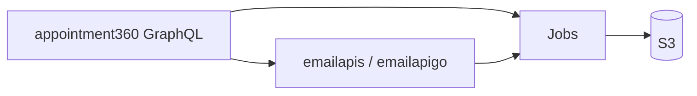

# Email APIs (`lambda/emailapis` + `lambda/emailapigo`)

High-throughput email **finder** and **verifier** pipelines (Python and Go paths), usually driven by GraphQL **email** module operations and **jobs** for bulk work.

## Documentation map

| Doc | Purpose |
| --- | --- |
| [SERVICE_TOPOLOGY.md](../endpoints/SERVICE_TOPOLOGY.md) | Email workers in the delegation map |
| [emailapis_endpoint_era_matrix.md](../endpoints/emailapis_endpoint_era_matrix.md) | Endpoint inventory |
| [emailapis_data_lineage.md](../database/emailapis_data_lineage.md) | Data paths and dependencies |
| [mailvetter_endpoint_era_matrix.md](../endpoints/mailvetter_endpoint_era_matrix.md) | Related verifier stack; see [mailvetter.api.md](mailvetter.api.md) |
| [ENDPOINT_DATABASE_LINKS.md](../endpoints/ENDPOINT_DATABASE_LINKS.md) | Operation naming and delegation fields |

### Also in `docs/backend/endpoints/`

- **[README.md](../endpoints/README.md)** — registry table maps `emailapis_endpoint_era_matrix.json` → codebase analysis.
- **[endpoints_index.md](../endpoints/endpoints_index.md)** — [emailapis_endpoint_era_matrix.md](../endpoints/emailapis_endpoint_era_matrix.md) covers **both** `lambda/emailapis` and **`lambda/emailapigo`** contract surfaces until a separate matrix exists; GraphQL bridge: [index.md](../endpoints/index.md) (`graphql/FindEmails`, `graphql/VerifyBulkEmails`, export jobs).
- **Per-operation specs** — search `docs/backend/endpoints/` for `emailapis` / finder / verifier in `lambda_services` on each `*_graphql.md`.

## Split: `emailapis` vs `emailapigo`

- **`lambda/emailapis`** — Primary Python/Lambda contract surface referenced in matrices and gateway delegation.
- **`lambda/emailapigo`** — Go-oriented hot paths and bulk semantics; keep behavior aligned with finder/verifier **job** contracts and Postman collections under `docs/backend/postman/` when present.

Document implementation-specific routes in `docs/codebases/*email*` analysis files; this file is the **cross-links hub**.

## GraphQL bridge

Finder/verify operations appear as `graphql/FindEmails`, `graphql/VerifyBulkEmails`, job-creating exports, etc.—see [index.md](../endpoints/index.md).

## Peer services

- **Jobs** — async bulk runs ([jobs.api.md](jobs.api.md)).
- **S3** — input/output CSV ([s3storage.api.md](s3storage.api.md)).
- **Mailvetter** — SMTP/DNS verification depth ([mailvetter.api.md](mailvetter.api.md)).

