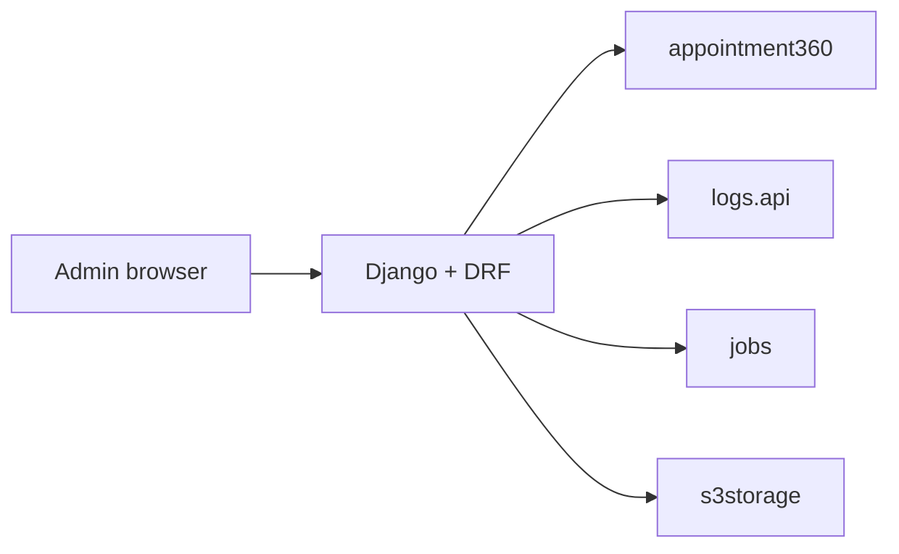

# Admin Service API Surface (`contact360.io/admin`)

Django web app + DRF for operator workflows (HTML + JSON). Not the Next.js dashboard; pairs with DocsAI and internal tooling.

## Documentation map

| Doc | Purpose |
| --- | --- |
| [SERVICE_TOPOLOGY.md](../endpoints/SERVICE_TOPOLOGY.md) | Admin row in the service registry |
| [admin_endpoint_era_matrix.md](../endpoints/admin_endpoint_era_matrix.md) | Route groups, auth, era |
| [admin_data_lineage.md](../database/admin_data_lineage.md) | Admin-owned data and integrations |
| [ENDPOINT_DATABASE_LINKS.md](../endpoints/ENDPOINT_DATABASE_LINKS.md) | When admin actions mirror gateway resources |

### Also in `docs/backend/endpoints/`

- **[README.md](../endpoints/README.md)** — folder scope and parity with `docs/codebases/`.
- **[endpoints_index.md](../endpoints/endpoints_index.md)** — [admin_endpoint_era_matrix.md](../endpoints/admin_endpoint_era_matrix.md) under supplemental indexes (Django routes, not GraphQL `index.md` catalog).
- **Gateway overlap** — when admin mirrors product behavior, trace the GraphQL contract in [index.md](../endpoints/index.md) and [appointment360_endpoint_era_matrix.md](../endpoints/appointment360_endpoint_era_matrix.md).

## Runtime

- Django web app + DRF API gateway for operator workflows.

## Core route categories

- Web auth/session routes (`/`, `/login`, `/logout`).
- Role-gated admin routes (billing, users, logs, jobs, storage, settings).
- API v1 health/status routes (`/api/v1/health*`).

## Integration clients

| Client | Purpose | More detail |
| --- | --- | --- |
| Appointment360 GraphQL | Operator actions that mirror product API | [appointment360.api.md](appointment360.api.md) |
| logs.api | Log search / audit | [logsapi.api.md](logsapi.api.md) |
| tkdjob / jobs | Job control and visibility | [jobs.api.md](jobs.api.md) |
| s3storage | Object and storage ops | [s3storage.api.md](s3storage.api.md) |

## Operator flow (simplified)

## Governance notes

- Super-admin and admin role boundaries must be enforced at middleware + decorator levels.
- Destructive operations require idempotency and immutable audit trails.
