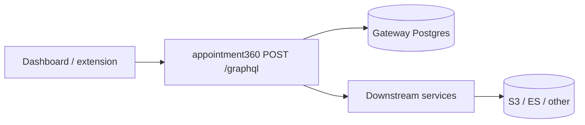

# Appointment360 API gateway (`contact360.io/api`)

FastAPI + Strawberry GraphQL. All dashboard and extension traffic that uses GraphQL enters here via **`POST /graphql`** (JWT / API key per era matrix).

## Documentation map

| Doc | Purpose |
| --- | --- |
| [SERVICE_TOPOLOGY.md](../endpoints/SERVICE_TOPOLOGY.md) | Gateway position in the full service graph |
| [ENDPOINT_DATABASE_LINKS.md](../endpoints/ENDPOINT_DATABASE_LINKS.md) | `graphql/OperationName` → spec file; gateway vs Connectra table scope |
| [appointment360_endpoint_era_matrix.md](../endpoints/appointment360_endpoint_era_matrix.md) | Modules, health routes, auth modes |
| [appointment360_data_lineage.md](../database/appointment360_data_lineage.md) | Gateway Postgres and cross-service data flows |
| [index.md](../endpoints/index.md) | Generated catalog of `*_graphql.md` specs |

### Also in `docs/backend/endpoints/`

- **[README.md](../endpoints/README.md)** — folder layout, `endpoints_index.json`, JSON→Markdown generation.
- **[endpoints_index.md](../endpoints/endpoints_index.md)** — aggregated inventory: every GraphQL op + links to `*_graphql.md`, plus supplemental service matrices.
- **Per-operation specs** — thousands of `*_graphql.md` (and REST JSON) files; resolve **`graphql/OperationName`** via [index.md](../endpoints/index.md) or [ENDPOINT_DATABASE_LINKS.md](../endpoints/ENDPOINT_DATABASE_LINKS.md).

## Role

- Single GraphQL surface for the Next.js app and extension.
- Resolvers orchestrate downstream HTTP/Lambda workers (Connectra, jobs, S3, logs, email pipelines, Contact AI, Sales Navigator) per operation—see **`lambda_services`** on each [endpoint spec](../endpoints/).

## Typical request flow

## Peer services (delegation)

Delegation is operation-specific; the hub table is in [SERVICE_TOPOLOGY.md](../endpoints/SERVICE_TOPOLOGY.md#cross-service-delegation-graphql--downstream). Common targets include `contact360.io/sync` (contacts/companies/VQL), async **jobs**, **s3storage**, **logs.api**, **emailapis** / Mailvetter, **contact.ai**, **salesnavigator**.

## Deep dives

- Strawberry modules and era mapping: `docs/backend/apis/` (e.g. module READMEs referenced from the era matrix).
- Codebase analysis: `docs/codebases/appointment360-codebase-analysis.md` (if present).
