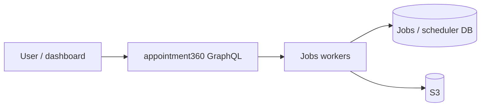

# Jobs service (`contact360.io/jobs` / tkdjob)

Async export/import and long-running work: job records, retries, and integration with email pipelines, CSV, and Connectra-backed Contact360 jobs.

## Documentation map

| Doc | Purpose |
| --- | --- |
| [SERVICE_TOPOLOGY.md](../endpoints/SERVICE_TOPOLOGY.md) | Jobs in the platform graph |
| [jobs_endpoint_era_matrix.md](../endpoints/jobs_endpoint_era_matrix.md) | Route and era ownership |
| [jobs_data_lineage.md](../database/jobs_data_lineage.md) | Scheduler DB, queues, and job artifacts |
| [ENDPOINT_DATABASE_LINKS.md](../endpoints/ENDPOINT_DATABASE_LINKS.md) | How gateway ops reference job-related tables |

### Also in `docs/backend/endpoints/`

- **[README.md](../endpoints/README.md)** — how matrices and operation JSON stay in sync with code.
- **[endpoints_index.md](../endpoints/endpoints_index.md)** — supplemental entry for [jobs_endpoint_era_matrix.md](../endpoints/jobs_endpoint_era_matrix.md); pair with [index.md](../endpoints/index.md) for `graphql/CreateJob`, export/import job mutations, and `lambda_services` pointing at jobs workers.

## Role

- Workers and APIs create/update job rows; dashboard surfaces job status via GraphQL **jobs** module and related mutations (see [index.md](../endpoints/index.md) for `graphql/CreateJob`, exports, imports).

## Peer services

- **S3** — artifact storage for imports/exports ([s3storage.api.md](s3storage.api.md)).
- **Email APIs** — finder/verifier bulk paths often emit jobs ([emailapis.api.md](emailapis.api.md)).
- **Gateway** — user-facing job CRUD and polling through appointment360.

