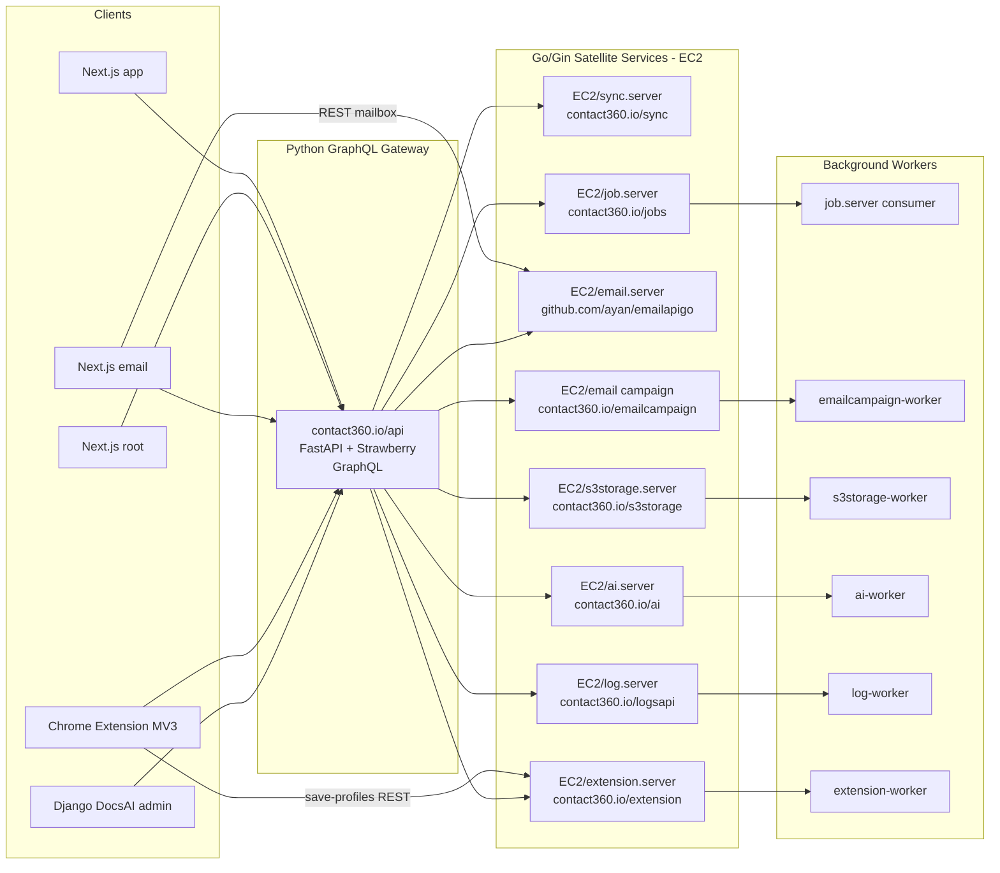

# Contact360 Architecture

## Overview

**Contact360** is a B2B SaaS platform focused on email discovery and verification. The system uses a Next.js dashboard, a Django DocsAI admin/docs surface, a **Python** FastAPI GraphQL gateway (`appointment360` at `contact360.io/api`) — the **main backend** — and multiple satellite services for search, verification, AI, scheduling, logging, and file storage. **Satellite HTTP backends target Go + Gin**; the gateway itself remains Python unless a future program explicitly migrates it. See **`docs/docs/backend-language-strategy.md`**.

### Production Docker layout (EC2)

The repository root ships **`docker-compose.prod.yml`**, which places all application containers on a single bridge network (`contact360`) with stable DNS names matching **`contact360.io/api/app/core/config.py`** defaults (`sync:8000`, `jobs:8000`, `emailapigo:8081`, `s3storage:8082`, `logs:8083`, `salesnavigator:8084`, `contact_ai:8085`, `emailcampaign:8086`, `mailvetter:8087`). **`nginx/nginx.prod.conf`** routes public hostnames (`contact360.io`, `app.contact360.io`, `api.contact360.io`, `email.contact360.io`, `admin.contact360.io`) to those containers. TLS is expected at **ALB/ACM** in front of Nginx.

The compose file also runs **`joblevel`** (Next.js Joblevel app at `joblevel.contact360.io` via Nginx), **`redis`** (only for **Go** services: Asynq in the email campaign service and Mailvetter queues — not used by `contact360.io/api`), and an **`emailcampaign-worker`** container. RDS, MSK, and OpenSearch remain **managed AWS** services; populate `deploy/env/jobs.env` and root `.env` (`DATABASE_URL` for the GraphQL API) before bringing the stack up. AWS provisioning steps: **`deploy/aws/PHASE5_RUNBOOK.md`**.

**Data stores (PostgreSQL-first, Redis scope):** **`docs/docs/data-stores-postgres.md`**.

**Stack reference library:** Framework checklists and “why / best practices” notes for **Go/Gin, Next.js, Django, browser extension** live under **`docs/tech/`** (canonical filenames `tech-*-why-practices.md`, `tech-*-checklist-100.md`). Use them for era task planning; they are not release artifacts.

**AWS system design (Route 53 → ALB/ACM → EC2 → Docker, plus RDS, OpenSearch, S3, optional MSK):** see **`deploy/aws/SYSTEM_DESIGN.md`**.

### Request paths (target)

High-level traffic flow: browsers and the Chrome extension call the **Python GraphQL gateway**; the gateway orchestrates **Go/Gin satellite services** on EC2 (sync, jobs, email, campaign, storage, AI, logs, extension). Email web app may call mailbox **REST** directly where documented.

---

## Repository layout (this monorepo)

Product UI, the GraphQL gateway, Connectra, and the job scheduler live under **`contact360.io/`**. Shared email/log/storage microservices often live under **`lambda/`**. Additional backend checkouts in this workspace use **`backend(dev)/`** (AI, Mailvetter, Sales Navigator, Resume AI). **`docs/`** holds markdown source of truth; **DocsAI** Django constants are under **`contact360.io/admin/`** (not a separate `contact360/docsai/` tree in this layout).

| Path | Purpose |
| --- | --- |
| `contact360.io/app/` | Authenticated dashboard (Next.js; package name `contact360-dashboard`). |
| `contact360.io/root/` | Marketing / public site (Next.js; package name `contact360-marketing`). |
| `contact360.io/admin/` | Django DocsAI — roadmap/architecture mirrors, documentation CRUD, AI assistant, and operational admin surfaces (users, logs, jobs, billing, storage). |
| `contact360.io/email/` | Email web app (Mailhub-style mailbox UI) with auth/account/mailbox routes over REST. |
| `contact360.io/api/` | **Appointment360** — FastAPI GraphQL gateway (`/graphql`), `sql/apis/*.md`, `app/graphql/modules/*`. |
| `contact360.io/sync/` | **Connectra** — Go search / VQL / Elasticsearch (see service `README.md`). |
| `contact360.io/jobs/` | **TKD Job** — Python scheduler, Kafka consumers, DAG processors (`README.md`). |
| `lambda/` | Deployable email/log/storage services (subset in minimal clones: `emailapis/`, `emailapigo/`, `logs.api/`, `s3storage/`). |
| `backend(dev)/` | Extra service trees when present: `contact.ai/`, `mailvetter/`, `salesnavigator/`, `resumeai/`. |
| `frontend(dev)/joblevel-next/` | **Joblevel** recruiting UI on Next.js App Router (bridge: `legacy-src/` from former Vite `joblevel/`). |
| `extension/` | Browser extension packages (optional checkout). |
| `docs/` | Product documentation (architecture, roadmap, versioning). |

**Legacy / alternate names (full monorepo or older docs):**

| Older / logical path | Typical role | This workspace |
| --- | --- | --- |
| `contact360/dashboard/` | Dashboard app | `contact360.io/app/` |
| `contact360/marketing/` | Marketing site | `contact360.io/root/` |
| `contact360/docsai/` | Django DocsAI | `contact360.io/admin/` |
| `lambda/appointment360/` | GraphQL gateway | `contact360.io/api/` |
| `lambda/connectra/` | Connectra | `contact360.io/sync/` |
| `lambda/tkdjob/` | Job scheduler | `contact360.io/jobs/` |
| `lambda/mailvetter/` | Verifier | Often `backend(dev)/mailvetter/` here, or `lambda/mailvetter/` in other checkouts |

**Naming note:** historical docs used `extention/contact360` and `extension/contact360`. Current canonical extension package folder is **`extension/contact360/`**.

### `extension/` detail

- `contact360/` — Extension logic/transport package for Sales Navigator workflows.
- Current code in this package provides auth/session (`graphqlSession.js`), Lambda client (`lambdaClient.js`), and profile merge/dedup (`profileMerger.js`).
- Chrome shell files (`manifest.json`, popup UI, background/content scripts) are tracked as remaining 4.x delivery work.

**Checkout note:** Some clones omit the `extension/` tree (e.g. backend-only worktrees). The **canonical** package path remains `extension/contact360/`; do not introduce new paths under the historical `extention/` spelling.

---

## Dashboard routes (product)

The authenticated dashboard uses the Next.js App Router under `contact360.io/app/app/(dashboard)/`.

| Route | Source | Notes |
| --- | --- | --- |
| `/admin` | `app/(dashboard)/admin/page.tsx` | **Canonical** admin entry (statistics / control surface). Admin-related links may also appear from Billing or Profile; treat `/admin` as the dedicated route when documenting or linking. |

---

## Service register (canonical)

Use this table to resolve **what exists in-repo** vs **historical aliases**. Update when folders are added, renamed, or retired.

| Service | Path (this workspace) | Status | Notes |
| --- | --- | --- | --- |
| Appointment360 | `contact360.io/api/` | active | Primary GraphQL gateway; older docs reference `lambda/appointment360/` |
| Connectra | `contact360.io/sync/` | active | Search on Elasticsearch; older docs reference `lambda/connectra/` |
| Email APIs | `lambda/emailapis/` | active | Finder/verifier orchestration (Python) |
| Email API Go | `lambda/emailapigo/` | active | High-throughput finder (Go); used when orchestration routes to Go workers |
| Mailvetter | `backend(dev)/mailvetter/` (or `lambda/mailvetter/` in full monorepo) | active | Deliverability verification (DNS/SMTP/disposable) |
| Logs API | `lambda/logs.api/`; **Go target:** `EC2/log.server/` (`contact360.io/logsapi`) | active | Centralized logs/audit (S3 CSV with cache) |
| S3 Storage | `lambda/s3storage/`; **Go target:** `EC2/s3storage.server/` (`contact360.io/s3storage`) | active | Uploads, exports, artifacts |
| Sales Navigator | `backend(dev)/salesnavigator/` (or `lambda/salesnavigator/`); **Go target:** `EC2/extension.server/` (`contact360.io/extension`) for save-profiles / Connectra | active | SN ingestion workflows |
| Contact AI | `backend(dev)/contact.ai/` (or `lambda/contact.ai/`); **Go target:** `EC2/ai.server/` (`contact360.io/ai`) | active | AI workflows (e.g. Gemini) |
| Resume AI | `backend(dev)/resumeai/` | active | Resume-related AI workflows (when checkout present) |
| TKD Job | `contact360.io/jobs/` (Python); **Go implementation:** `EC2/job.server/` (`contact360.io/jobs`) | active | Async jobs, Kafka, DAGs; older docs reference `lambda/tkdjob/` |
| Extension (Chrome) | `extension/contact360/` | active (optional checkout) | Sales Navigator extension surface; folder may be absent in minimal clones — path is still canonical |
| Extension Auth | `extension/contact360/auth/graphqlSession.js` | active | JWT decode+expiry check, proactive token refresh via Appointment360 `auth.refreshToken`; `chrome.storage.local` adapter (MV3 compliant) |
| Extension Lambda Client | `extension/contact360/utils/lambdaClient.js` | active | Batched REST client for `POST /v1/save-profiles`; retry+jitter, adaptive timeouts, payload compression, chunked batching |
| Extension Profile Merger | `extension/contact360/utils/profileMerger.js` | active | Profile dedup and merge; `profile_url` as dedup key; completeness scoring; supports HTML and deep-scrape variants |

**Legacy / alias paths (do not use in new work; document only for migrations):**

- `extention/` — old folder spelling; canonical is `extension/`.
- `extention/contact360` — old extension package path; canonical is `extension/contact360/`.
- `lambda/1/` — may appear as a **nested bundle** (older copies or experiments of services under a numeric folder). **Canonical services live directly under `lambda/<service>/`** (for example `lambda/emailapis/`, `lambda/tkdjob/`). Do not treat `lambda/1/*` as the primary deployment root without an explicit integration note.

---

## Canonical service ownership

| Service | Path (this workspace) | Language | Owns |
| --- | --- | --- | --- |
| Appointment360 | `contact360.io/api/` | Python | GraphQL gateway contract, orchestration rules |
| Connectra | `contact360.io/sync/` | Go | Search query execution on Elasticsearch |
| Email APIs | `lambda/emailapis/` | Python | Finder/verifier workflow orchestration |
| Email API Go | `lambda/emailapigo/` | Go | High-throughput finder workers |
| Mailvetter | `backend(dev)/mailvetter/` | Go | Deliverability verification logic |
| Logs API | `lambda/logs.api/` | Python → **Go** `EC2/log.server/` | Operational and audit log ingestion |
| S3 Storage | `lambda/s3storage/` | Python → **Go** `EC2/s3storage.server/` | File artifact lifecycle on S3 |
| Sales Navigator | `backend(dev)/salesnavigator/` | Python → **Go** `EC2/extension.server/` (ingestion façade) | Sales Navigator ingestion workflows |
| Contact AI | `backend(dev)/contact.ai/` | Python → **Go** `EC2/ai.server/` | AI pipeline logic and model integration |
| Resume AI | `backend(dev)/resumeai/` | Python → **Go** `EC2/ai.server/` worker tasks | Resume AI features (when present) |
| TKD Job | `contact360.io/jobs/` / `EC2/job.server/` | Python (monorepo) + **Go** (EC2 satellite) | Job orchestration, queue consumers, DAG execution |

---

## Data ownership

| Data store | Primary owners | Notes |
| --- | --- | --- |
| PostgreSQL | Appointment360 (and service-local relational modules) | Core transactional business entities |
| Elasticsearch | Connectra | Contacts/companies search indexes and VQL query targets |
| MongoDB | Logs API | Legacy reference only in some docs; primary logs.api runtime storage is S3 CSV |
| S3 | S3 Storage, TKD Job | CSV uploads, export artifacts, large object payloads |
| Jobs scheduler Postgres (`DATABASE_URL`) | TKD Job | Scheduler-owned state (`job_node`, `edges`, `job_events`) |
| Connectra filter metadata (`filters`, `filters_data`) | Connectra + Appointment360 | Filter taxonomy, facet hydration, and saved-search query compatibility |

---

## Data flow (conceptual)

1. `contact360.io/app` (dashboard) and `extension/contact360` send authenticated requests to **Appointment360** GraphQL (`contact360.io/api`).
2. Appointment360 orchestrates downstream REST calls to `emailapis`, `emailapigo` (when used), `mailvetter`, Connectra (`contact360.io/sync`), the job service (`contact360.io/jobs`), `s3storage`, `salesnavigator`, and `contact.ai`.
3. Connectra serves search from Elasticsearch.
4. `mailvetter` and email services execute DNS/SMTP/external verification checks.
5. The job scheduler (`contact360.io/jobs`, TKD Job) runs asynchronous batch DAG workflows with API create/retry, scheduler enqueue, Kafka dispatch, consumer pull, worker pool execution, processor dispatch (`email_*_stream`, `contact360_*_stream`), and timeline events in `job_events`.
6. `logs.api` and `s3storage` capture telemetry and file artifacts.

**Simplified chain:**
`Dashboard/Extension -> Appointment360 GraphQL -> Internal services -> PostgreSQL/Elasticsearch/S3 (+ jobs scheduler Postgres)`

---

## Authentication and access model

- User authentication: JWT-based sessions for dashboard and extension users.
- Authorization: RBAC and feature gates at product/API boundaries.
- Service security: trusted internal auth (API key or equivalent) for service-to-service routes.

---

## External dependencies

- **Hugging Face Inference Providers** (chat completions + JSON tasks) for `contact.ai` primary LLM inference.
- **Google Gemini** (fallback LLM) for `contact.ai` when HF inference is unavailable.
- External email verification signals (DNS, SMTP, third-party verification providers).
- Kafka for asynchronous queue-based job execution in `tkdjob`.
- AWS S3 object storage for file lifecycle.

## `contact.ai` data and service notes

- **Contact AI** (`backend(dev)/contact.ai`) is a FastAPI service deployed on AWS Lambda via Mangum.
- **Data store:** PostgreSQL `ai_chats` table (shared with appointment360); `user_id` FK references `users.uuid`.
- **Inference:** Hugging Face Inference Providers for chat completions and JSON-mode tasks; Gemini as fallback.
- **Auth:** `X-API-Key` (service-to-service) + `X-User-ID` (user-scoped chat ownership).
- **Streaming:** Server-Sent Events (SSE) via `POST /api/v1/ai-chats/{id}/message/stream`.
- **Utility endpoints:** `analyzeEmailRisk`, `generateCompanySummary`, `parseContactFilters` — all stateless (no DB write).
- **Era:** Operational baseline `0.x`; primary AI workflows `5.x`; full public API surface `8.x`.
- **Cross-service dependency:** appointment360 calls contact.ai via `LambdaAIClient` (HTTP client); `LAMBDA_AI_API_URL` config key.
- **Model selection:** `ModelSelection` enum in GraphQL maps to HF model IDs; `LambdaAIClient` must maintain the mapping shim.

---

## `appointment360` (contact360.io/api) data and service notes

- **Gateway identity:** `contact360.io/api` is the **sole GraphQL entry point** for all dashboard and extension requests. No REST feature routes exist — only `/graphql` + health probes.
- **Stack:** FastAPI 0.11x + Strawberry GraphQL (code-first) + asyncpg + async SQLAlchemy.
- **Schema composition:** `app/graphql/schema.py` assembles 28 nested `Query` + `Mutation` module classes. Each module is independently owned and versioned.
- **Context lifecycle:** Per-request `Context` carries: `db` (AsyncSession), `user` (JWT-decoded `User | None`), `user_uuid`, `dataloaders`. `DatabaseCommitMiddleware` ensures the session commits after every successful request.
- **Auth model:** HS256 JWT — `Authorization: Bearer <token>`. Token blacklist in PostgreSQL `token_blacklist` table. Optional in-process TTL user cache (`ENABLE_USER_CACHE`); **no Redis** in appointment360.
- **Orchestration pattern:** Appointment360 does NOT own contact/company data — it proxies all search/filter/export calls to Connectra via `ConnectraClient`. It owns user, billing, credits, activities, saved searches, notifications, and API key data in its PostgreSQL DB.
- **Downstream clients:** `ConnectraClient` (contact data), `TkdjobClient` (job scheduler), `LambdaEmailClient` (email finder/verifier), `LambdaAIClient` (AI chats), `ResumeAIClient` (resume), `LambdaS3StorageClient` (files), `LambdaLogsClient` (audit), `DocsAIClient` (pages content).
- **Middleware chain (8 layers):** GZip → REDMetrics → Timing → RequestId → TraceId → GraphQLBodySize → GraphQLIdempotency → GraphQLMutationAbuseGuard → GraphQLRateLimit → DatabaseCommit.
- **Extensions:** `QueryComplexityExtension` (limit 100) + `QueryTimeoutExtension` (30s).
- **Lambda:** Mangum handler for AWS Lambda execution; uvicorn for EC2. Both targets supported via same codebase.
- **Era:** Bootstrap `0.x`; user/billing `1.x`; email system `2.x`; contacts/companies `3.x`; SN/extension `4.x`; AI workflows `5.x`; reliability guards `6.x`; deployment hardening `7.x`; public API surface + pages `8.x`; ecosystem/notifications `9.x`; campaigns/sequences/templates `10.x`.
- **Known gaps:** Inline debug file writes in `email/queries.py` and `jobs/mutations.py` must be removed. No `campaigns`/`sequences`/`templates` GraphQL modules yet (10.x work). Rate limit disabled by default. SQL schema files missing from local checkout.
- **Cross-service dependency chain:** `appointment360 → connectra → elasticsearch/postgres | appointment360 → tkdjob → kafka/workers | appointment360 → lambda email/AI/S3/logs → AWS Lambda`.

### Appointment360 execution spine (era-aligned)

| Era | Contract concern | Service concern | Data concern | Ops concern |
| --- | --- | --- | --- | --- |
| `0.x` | Schema root, health endpoints, settings model | FastAPI app, middleware stack bootstrap, DB session lifecycle, Mangum | `users`, `token_blacklist` tables | `.env.example`, Docker, logging baseline |
| `1.x` | Auth mutations (login/register/refresh/logout), billing/usage queries, credit model | JWT auth, credit deduction, billing service, abuse guard wiring for billing | `credits`, `plans`, `subscriptions`, `payment_submissions`, `activities` | Token TTL config, idempotency for billing mutations |
| `2.x` | Email module (finder/verifier), jobs module (create/list/status) | `LambdaEmailClient`, `TkdjobClient` wiring, remove debug writes | `scheduler_jobs` activity entries | Lambda email + tkdjob env vars, Postman tests |
| `3.x` | Contacts/companies module, VQL input type | `ConnectraClient` wiring, `vql_converter.py`, `connectra_mappers.py`, DataLoaders | Contacts/companies in Connectra only; `saved_searches` in appointment360 DB | Connectra env vars, contract tests |
| `4.x` | LinkedIn/SN module, extension session auth | `sales_navigator_client.py`, `upsertByLinkedinUrl`, extension token guard | SN results → Connectra; `sessions` table | SN env config, abuse guard for `upsertByLinkedinUrl` |
| `5.x` | AI chats module, resume module, Gemini routing | `LambdaAIClient`, `ResumeAIClient`, AI credit deduction | `ai_chats`, `ai_chat_messages`, `resumes` | AI API env vars, credit cost config |
| `6.x` | SLO/complexity/timeout/rate limit/idempotency/abuse guard contracts | Enable all middleware guards for production; PostgreSQL-backed idempotency | `graphql_idempotency_replays` / idempotency tables, slow-query logging | Rate limit env vars, load tests, SLO alerts |
| `7.x` | Deployment targets, health readiness, RBAC | Mangum cold-start < 3s, lifespan handler, CI/CD pipeline | Alembic migration hygiene | Dockerfile, docker-compose, GitHub Actions |
| `8.x` | Pages/DocsAI module, saved searches, profile/API keys, public API auth | `DocsAIClient`, `apiKeys` CRUD, 2FA TOTP, `X-API-Key` guard | `api_keys`, `sessions`, `saved_searches` | DocsAI env vars, public API Postman collection |
| `9.x` | Notifications, analytics, admin panel, tenant model | Notification service, analytics event tracking, plan-entitlement guard | `notifications`, `events`, `feature_flags`, `workspaces` | Webhook secret, admin tests |
| `10.x` | Campaigns/sequences/templates GraphQL modules, campaign wizard orchestration | `CampaignServiceClient`, proxy to email campaign service, credit deduction per recipient | Campaign data in campaign service DB; activities in appointment360 DB | Campaign service env vars, contract tests |

---

## Deployment overview

- Frontend apps (`contact360.io/app`, `contact360.io/root`): SSR/static deployment target.
- DocsAI (`contact360.io/admin`): Django app with reverse-proxy deployment.
- GraphQL gateway (`contact360.io/api`), Connectra (`contact360.io/sync`), jobs (`contact360.io/jobs`), and `lambda/*` / `backend(dev)/*` services: per-service deployment pipelines.
- Datastores: environment-scoped **PostgreSQL** (appointment360, Connectra, jobs, mailvetter, campaign DBs), **OpenSearch/Elasticsearch**, **S3**, and **Redis only in Go worker paths** (email campaign Asynq, Mailvetter — see **`docs/docs/data-stores-postgres.md`**). (MongoDB references in older docs are legacy — canonical logs.api storage is S3 CSV; see data ownership table.)

---

## Docs governance and sync rules

- Source-of-truth docs are maintained in `docs/`.
- Any architecture content change in `docs/architecture.md` must be mirrored in `contact360.io/admin/apps/architecture/constants.py`.
- Any roadmap content change in `docs/roadmap.md` must be mirrored in `contact360.io/admin/apps/roadmap/constants.py`.
- Suggested update trigger: every feature release (`X.Y.0`) and every major architecture change.

---

## Planning horizon (near-term vs strategic runway)

| Horizon | Typical versions | Where it lives | How to use it |
| --- | --- | --- | --- |
| **Near-term execution** | `1.x`–`6.x` | `docs/versions.md`, `docs/roadmap.md` (stages `1.x`–`6.x`) | Sprint planning, release cuts, acceptance criteria |
| **Strategic platform runway** | `7.x`–`10.x` | `docs/roadmap.md` (era sections), `docs/versions.md`, optional `docs/versions/version_*.md` | Architecture prep, contract design, phased activation |

Planning note: `2.x` release promotion requires closing the email-app credential security gap (plaintext IMAP credential persistence and direct credential headers).

**Era summary (canonical):**
- `0.x` Foundation · `1.x` User/billing/credit · `2.x` Email system · `3.x` Contact/company data
- `4.x` Extension/SN · `5.x` AI workflows · `6.x` Reliability and Scaling · `7.x` Deployment
- `8.x` Public and private APIs · `9.x` Ecosystem + Productization · `10.x` Email campaign

See `docs/version-policy.md` for full per-era theme definitions.

Strategic eras do **not** block near-term releases. Promote a `7.x`+ era into active execution when `docs/versions.md` marks the corresponding major/minor as `in_progress` and roadmap dependencies are satisfied.

**Version scheme alignment:** See `docs/version-policy.md` — themes `0.x`–`10.x` match the roadmap version headers in `docs/roadmap.md` exactly.

---

## Execution architecture by era (all eras)

| Era | Theme | Core architectural concern | Primary services | Contract boundary |
| --- | --- | --- | --- | --- |
| `0.x` | Foundation | Repo setup, CI, service skeletons | All services (setup) | Repo and CI baseline |
| `1.x` | User, billing, credit | Auth, session, credit lifecycle, billing | `contact360.io/api`, `logs.api` | User/credit/billing GraphQL contracts |
| `2.x` | Email system | Finder, verifier, results, bulk processing | `emailapis`, `emailapigo`, `mailvetter`, `contact360.io/api` | Finder/verifier API contract |
| `3.x` | Contact/company data | VQL, enrichment, deduplication, search | `contact360.io/sync` (Connectra), `contact360.io/api` | VQL filter and search contracts |
| `4.x` | Extension and Sales Navigator | Extension auth, SN ingestion, sync, telemetry | `salesnavigator`, `contact360.io/api`, `extension/contact360` | Extension auth and sync contracts |
| `5.x` | AI workflows | HF streaming, Gemini, confidence, cost governance | `contact.ai`, `contact360.io/api` | AI chat/utility API and cost contracts |
| `6.x` | Reliability and Scaling | SLO, idempotency, queue resilience, observability | All core services, `contact360.io/api`, `tkdjob`, `logs.api` | SLO, idempotency, and observability contracts |
| `7.x` | Deployment | RBAC, audit, governance, security posture | `contact360.io/api`, `docsai`, all services | RBAC, audit, and governance contracts |
| `8.x` | Public and private APIs | Analytics instrumentation, API surface, webhooks | `contact360.io/api`, `tkdjob`, `logs.api` | External API/webhook/analytics contracts |
| `9.x` | Ecosystem + Productization | Connectors, tenant model, entitlements, SLA ops | All services + integration adapters, `docsai` | Tenant, entitlement, and connector contracts |
| `10.x` | Email campaign | Campaign execution, deliverability, compliance | `contact360.io/api`, `tkdjob`, `emailapis`, `logs.api` | Campaign execution and compliance contracts |

### Small-task architecture checklist per minor

- Define one contract artifact to version (`schema`, `policy`, or `event`) before implementation starts.
- Assign one primary service owner and one reviewer service owner for each contract change.
- Add one validation checkpoint in DocsAI docs before marking a stage complete.
- Track one measurable risk control per stage (for example idempotency, authz, or lineage coverage).

## Documentation package ownership

| Document | Purpose | Primary owner | Update trigger |
| --- | --- | --- | --- |
| `docs/architecture.md` | System boundaries and ownership | Platform architecture | Service boundary or data ownership change |
| `docs/backend.md` | Lambda/service index, datastores, gateway-to-service map | Platform engineering | New backend service, health/ops notes, or orchestration change |
| `docs/frontend.md` | Frontend product map (dashboard, marketing, DocsAI, extension) | Platform + frontend | New app route, client env model, or surface ownership change |
| `docs/codebase.md` | Practical codebase map and entry points | Platform engineering | New app/service/module introduction |
| `docs/flowchart.md` | Cross-service flow diagrams | Product + platform | New workflow or API contract changes |
| `docs/roadmap.md` | Stage-by-stage execution | Product engineering | Stage planning/replanning |
| `docs/versions.md` | Release history and planned minor cuts | Product ops | Minor/major release planning |
| `docs/version-policy.md` | Versioning policy and planning standard | Product leadership | Policy or rubric updates |
| `docs/docsai-sync.md` | Markdown-to-DocsAI mirror process | DocsAI maintainers | Any constants mirror workflow change |
| `docs/governance.md` | Monorepo/service governance, CI checks, release hygiene | Platform engineering | New service, CI policy, or release process change |
| `docs/audit-compliance.md` | Per-era, per-service compliance requirements and RBAC matrix | Security + platform | New service, era gate, or compliance control added |
| `docs/versions/version_*.md` | Optional per-minor stubs (alongside `docs/versions.md`) | Product ops | Adding or renaming planned minors |

---

*This file is intended to stay aligned with the hardcoded DocsAI architecture view.*

### Era 6.x–10.x backend additions

The sections below (Era-aligned service register, execution spines per service) document how each backend service evolves across the later eras. This is the navigation summary:

| Era | Backend addition theme | Primary new tables/contracts | Key operational docs |
| --- | --- | --- | --- |
| `6.x` | Reliability hardening | `idempotency_keys`, SLO/error-budget schemas | `docs/6. Contact360 Reliability and Scaling/slo-idempotency.md`, `queue-observability.md`, `reliability-rc-hardening.md`, `performance-storage-abuse.md` |
| `7.x` | RBAC, audit, governance | `api_keys`, `feature_flags`, `activities` (audit trail) | `docs/7. Contact360 deployment/rbac-authz.md`, `analytics-era-rc.md` |
| `8.x` | Public/private APIs, webhooks | `webhooks`, `api_keys` (scoped), analytics schemas | `docs/8. Contact360 public and private apis and endpoints/webhooks-replay.md`, `analytics-platform.md` |
| `9.x` | Ecosystem, connectors, productization | `notifications`, `events`, `workspaces`, `feature_flags` | `docs/9. Contact360 Ecosystem integrations and Platform productization/connectors-commercial.md` |
| `10.x` | Email campaign execution | `campaigns`, `sequences`, `sequence_steps`, `campaign_events`, `suppression_list`, `campaign_ai_log` | `docs/10. Contact360 email campaign/` task-packs |

Deep per-service execution details are in the service-specific sections that follow, and in `docs/backend.md`. Audit/compliance requirements for these eras are in `docs/audit-compliance.md`.

## Era-aligned service register extension

Use this normalization when documenting services:

| Service family | Era introduced | Primary docs anchor |
| --- | --- | --- |
| Auth/Billing/Usage | `1.x` | `docs/backend/apis/01_AUTH_MODULE.md`, `14_BILLING_MODULE.md`, `09_USAGE_MODULE.md` |
| Email Finder/Verifier | `2.x` | `docs/backend/apis/15_EMAIL_MODULE.md` |
| Contacts/Companies/Search | `3.x` | `docs/backend/apis/03_CONTACTS_MODULE.md`, `04_COMPANIES_MODULE.md` |
| Extension/Sales Navigator | `4.x` | `docs/backend/apis/21_LINKEDIN_MODULE.md`, `23_SALES_NAVIGATOR_MODULE.md` |
| AI workflows | `5.x` | `docs/backend/apis/17_AI_CHATS_MODULE.md` |
| Reliability/Analytics | `6.x` | `docs/backend/apis/18_ANALYTICS_MODULE.md`, `11_ACTIVITIES_MODULE.md` |
| Deployment/Governance | `7.x` | `docs/backend/apis/13_ADMIN_MODULE.md` |
| Public APIs/Integrations | `8.x` | `docs/backend/apis/06_WEBHOOKS_MODULE.md`, `20_INTEGRATIONS_MODULE.md` |
| Ecosystem/Productization | `9.x` | `docs/backend/apis/26_SAVED_SEARCHES_MODULE.md`, `28_PROFILE_MODULE.md` |
| Campaign platform | `10.x` | `docs/backend/apis/22_CAMPAIGNS_MODULE.md`, `24_SEQUENCES_MODULE.md`, `25_CAMPAIGN_TEMPLATES_MODULE.md` |

## s3storage canonical storage control plane

All services (appointment360, contact.ai, jobs, email campaign, mailvetter, connectra, salesnavigator, resumeai, admin) must route file/artifact storage operations through `lambda/s3storage` and must not perform direct `boto3`/`aioboto3` S3 calls in service code.

| Service | Status |
| --- | --- |
| appointment360 | ✅ uses S3StorageClient |
| contact360.io/jobs | 📌 Planned migrate direct S3 paths |
| backend(dev)/contact.ai | 📌 Planned audit/migrate |
| backend(dev)/email campaign | 📌 Planned migrate direct S3 paths |
| backend(dev)/mailvetter | 📌 Planned audit/migrate |
| backend(dev)/resumeai | 📌 Planned confirm/migrate |
| contact360.io/admin | 📌 Planned confirm/migrate |

## `logs.api` execution spine by era

| Era | Contract tasks | Service tasks | Data/Ops tasks |
| --- | --- | --- | --- |
| `0.x` | Baseline health and write/read envelope | S3 CSV persistence baseline | Smoke checks and startup reliability |
| `1.x` | User/billing/credit event schema | Gateway event write integration | Abuse and auth/billing audit evidence |
| `2.x` | Finder/verifier job event contract | Batch ingestion and query filters | Throughput, latency, and retention checks |
| `3.x` | Contact/company operation schema | Enrichment/dedupe event logging | Data lineage and support diagnostics |
| `4.x` | Extension sync telemetry contract | Source-tagged extension logging | Provenance and replay diagnostics |
| `5.x` | AI telemetry and policy contract | Sensitive-aware AI event logging | Cost/error anomaly evidence |
| `6.x` | SLO/error-budget evidence contract | Query/caching/streaming hardening | Reliability runbooks and SLO gates |
| `7.x` | Deployment/audit evidence contract | Release and environment event capture | Retention/compliance gate evidence |
| `8.x` | Public/private API audit contract | Partner/API key scoped observability | Compatibility and incident triage signals |
| `9.x` | Tenant/integration governance contract | Connector and entitlement event capture | SLA/tenant incident evidence |
| `10.x` | Campaign compliance log contract | Immutable campaign lifecycle logging | Compliance retention and RC evidence |

## `connectra` execution spine by era

| Era | Contract tasks | Service tasks | Data/Ops tasks |
| --- | --- | --- | --- |
| `0.x` | API key and health envelope baseline | Bootstrap routes and middleware chain | PG/ES bootstrap and smoke checks |
| `1.x` | Credit-aware query/export policy | Enforce usage-aware search/write guards | Billing/usage event linkage |
| `2.x` | CSV batch ingest contract | Stream-safe import/export runners | Job queue reliability and retries |
| `3.x` | VQL taxonomy and search contract freeze | Two-phase read and dual-write hardening | ES/PG parity and dedup evidence |
| `4.x` | SN payload and provenance contract | Idempotent batch-upsert for extension ingest | Conflict/replay diagnostics |
| `5.x` | AI-readable field exposure contract | AI enrichment query paths | Confidence metadata lineage |
| `6.x` | Search/export SLO and idempotency contract | Retry, failure, and worker resilience | Error budgets and drift detection |
| `7.x` | RBAC and privileged endpoint policy | Authz checks for write/export paths | Audit evidence and tenant isolation |
| `8.x` | Endpoint versioning/deprecation contract | Partner-scoped keys and lifecycle events | Compatibility gates and API observability |
| `9.x` | Entitlement and quota contract | Tenant-aware throttling and connector safety | SLA and capacity evidence |
| `10.x` | Audience/suppression query contract | Campaign export and suppression enforcement | Compliance and reproducibility evidence |

## `email campaign` execution spine by era

`backend(dev)/email campaign` is the `10.x` campaign delivery engine. It starts as a raw Go SMTP service in the foundation era and evolves into a full campaign platform with sequences, A/B testing, analytics, and compliance controls.

| Era | Contract tasks | Service tasks | Data/Ops tasks |
| --- | --- | --- | --- |
| `0.x` | Schema baseline, service contract, health envelope | Fix schema drift, SMTP auth, env validation | Bootstrap Postgres/Redis/S3; Dockerize API + worker |
| `1.x` | User/billing attribution, credit-per-send contract | Auth middleware; JWT validation; credit pre-check | Add user_id/org_id to campaigns; credit log |
| `2.x` | SMTP provider contract, retry/bounce/DLQ contract | SMTP auth hardened; bounce webhooks; rate-limiter | Provider credential rotation; DLQ monitoring |
| `3.x` | Audience source contract (segment/VQL/CSV) | Connectra audience resolver integration | Recipient lineage from Connectra contact UUIDs |
| `4.x` | SN audience source contract | SN batch→Connectra→recipient pipeline | Enrichment-gated recipient resolution |
| `5.x` | AI template generation contract, personalization fields | AI generate endpoint, extend TemplateData | AI template metadata in DB; model/prompt lineage |
| `6.x` | SLO/DLQ/idempotency/resume contract | Graceful shutdown; resume-from-checkpoint; circuit-breaker | HPA worker scaling; Prometheus campaign metrics |
| `7.x` | RBAC, audit log, governance contract | Role checks on routes; audit events to logs.api | Secrets in vault; deployment pipeline |
| `8.x` | GraphQL module, public REST v1, webhook contract | Campaign/template GraphQL resolvers; webhook dispatcher | Webhook delivery log; API usage metrics |
| `9.x` | Entitlement, suppression import, partner send contract | Entitlement middleware; suppression import endpoint | Sender domain table; integration suppression sync |
| `10.x` | Sequence engine, A/B, analytics, compliance contract | Full sequence/A/B/tracking/scheduler implementation | Analytics aggregation cron; tracking pixel CDN |

Data ownership note: `backend(dev)/email campaign` owns `campaigns`, `recipients`, `suppression_list`, `templates`, `sequences`, `sequence_steps`, `campaign_events` in its own Postgres instance. It reads contact/segment data from Connectra via REST, and logs lifecycle events to `logs.api`.

Reference deep-dive and small-task decomposition: `docs/codebases/emailcampaign-codebase-analysis.md`.

## `salesnavigator` execution spine by era

`backend(dev)/salesnavigator` is the `4.x` Sales Navigator ingestion service. It is stateless (no local DB), forwarding all data to Connectra. It starts as a scaffold in `0.x` and evolves with auth governance, rate limiting, and campaign audience provenance in later eras.

| Era | Contract tasks | Service tasks | Data/Ops tasks |
| --- | --- | --- | --- |
| `0.x` | UUID5 deterministic contract; health endpoint spec | FastAPI+Mangum scaffold; SAM template | UUID generation rules documented |
| `1.x` | Actor context headers contract | `X-User-ID`/`X-Org-ID` pass-through; billing stub | `actor_id` in Connectra contact metadata |
| `2.x` | Email field handoff contract | Email/phone field validation; enrichment queue stub | `email`, `email_status` field presence validated |
| `3.x` | Full field mapping contract; provenance tags | Mapper functions locked; `lead_id`, `search_id` tags | `source=sales_navigator` provenance in Connectra |
| `4.x` | API semantics locked; docs drift fixed | HTML extraction hardened; extension UX delivered | `data_quality_score`, `recently_hired`, `is_premium` |
| `5.x` | AI field requirements contract | `seniority`, `departments`, `about` quality gated | `data_quality_score` indexed for AI context |
| `6.x` | SLO contract; partial success semantics | Rate limiter; chunk idempotency; CORS hardened | Load tests; error budget dashboards |
| `7.x` | RBAC and scoped key contract; GDPR cascade | Per-tenant keys; audit event per save | Immutable audit events; GDPR erasure |
| `8.x` | Rate-limit headers; versioned path | `X-RateLimit-*` headers; usage counters | `api_usage` table; quota enforcement |
| `9.x` | Connector adapter contract; webhook delivery | Adapter layer; webhook retry | Connector audit trail; tenant lineage |
| `10.x` | Campaign provenance contract; suppression guard | Suppression non-overwrite; `lead_id` → campaign | Campaign audience traceability |

Data ownership note: `backend(dev)/salesnavigator` has no local database. All contact/company data persists in Connectra (PostgreSQL + Elasticsearch). Provenance metadata (`lead_id`, `search_id`, `data_quality_score`, `source`) is embedded in Connectra contact records.

Reference deep-dive and small-task decomposition: `docs/codebases/salesnavigator-codebase-analysis.md`.

---

## Email app surface register — `contact360.io/email`

| Surface | Path | Status | Notes |
| --- | --- | --- | --- |
| Email Frontend App | `contact360.io/email/` | active | Next.js 16 mailbox UI surface with auth, account, and folder routes |
| Email Context Layer | `contact360.io/email/src/context/imap-context.tsx` | active | Active mailbox account context + localStorage persistence |
| Email UI table layer | `contact360.io/email/src/components/data-table.tsx` | active | Folder tabs, checkbox row selection, pagination, row actions |

### Canonical ownership additions

| Service | Path (this workspace) | Language | Owns |
| --- | --- | --- | --- |
| Email Frontend | `contact360.io/email/` | TypeScript/React | Mailbox UX, auth entry UI, IMAP account management UI, REST API consumption |

## `mailvetter` execution spine by era

`backend(dev)/mailvetter` is the deep verifier service for Contact360 email validation flows. It runs as two binaries (API + worker), uses Redis queueing, and persists jobs/results in PostgreSQL.

| Era | Contract tasks | Service tasks | Data/Ops tasks |
| --- | --- | --- | --- |
| `0.x` | Canonicalize `/v1` contract and auth envelope | API/worker split baseline, startup checks | `jobs`/`results` tables and indexes baseline |
| `1.x` | Plan/credit and API key ownership contract | Key scope + owner attribution | Usage/credit logs for billing reconciliation |
| `2.x` | Verify/bulk/job/results contract freeze | SMTP+DNS+OSINT scoring and queue/worker hardening | Job lifecycle accuracy and result lineage |
| `3.x` | Contact/company linkage contract | Optional `contact_uuid`/`company_uuid` verification links | Cross-service lineage to Connectra |
| `4.x` | Extension/SN provenance contract | Source-tagged verification and anti-abuse controls | Provenance and dedupe evidence |
| `5.x` | AI explainability schema contract | Reason-code summarization for AI workflows | AI-safe PII handling and factor lineage |
| `6.x` | SLO/idempotency/distributed limiter contract | Redis-backed limiter + retry/DLQ | Queue lag/error budget observability |
| `7.x` | Versioning/deprecation + release gate contract | Migration pipeline split from startup | Backup/restore and rollback evidence |
| `8.x` | Public/private API scoped key contract | OpenAPI + scoped key enforcement | API audit logs and rotation evidence |
| `9.x` | Ecosystem webhook and connector contract | Webhook replay/DLQ and partner adapters | Partner SLA and delivery logs |
| `10.x` | Campaign preflight verification contract | Campaign recipient verification snapshots | Compliance traceability for send decisions |

Data ownership note: `backend(dev)/mailvetter` owns verifier operational state in local Postgres (`jobs`, `results`) and does not own Contact360 canonical contact/company entities.

Reference deep-dive and small-task decomposition: `docs/codebases/mailvetter-codebase-analysis.md`.

## 2026 Documentation Overhaul Addendum

### Service topology corrections

- `contact360.io/admin` is a first-class service boundary (Django + DRF + Django-Q) and must be treated as part of the runtime control plane, not docs-only tooling.
- `lambda/logs.api` canonical storage is S3 CSV (+ in-memory query/cache helpers). Any MongoDB mention is historical drift and non-canonical.
- `lambda/emailapigo` and `lambda/emailapis` are both active in the email stack; documentation must reflect dual-runtime orchestration and provider fallback responsibilities.

### Critical architecture risks now tracked

- `lambda/s3storage` keeps multipart session state in process memory (`_MULTIPART_SESSIONS`), which is non-durable for Lambda horizontal scale and retries.
- `lambda/s3storage` currently has route-level capability without a fully enforced API auth boundary on all non-health paths.
- `backend(dev)/email campaign` has correctness blockers in unsubscribe/query and schema parity paths (`EC-0.1`, `EC-0.2`).
- `lambda/emailapigo` includes hardcoded logging credential patterns in prior implementation paths (`EGO-0.4`) and must be env-only.

### Control-plane boundary note

`contact360.io/api` remains the GraphQL gateway, while `contact360.io/admin` is the operational control surface that orchestrates privileged actions through clients to `appointment360`, `logs.api`, `tkdjob`, and `s3storage`.

## Operations & Runbooks
- [Appointment360 Runbook](ops/runbooks/appointment360.md)
- [Connectra Runbook](ops/runbooks/connectra.md)
- [Contact AI Runbook](ops/runbooks/contact-ai.md)
- [Email API (Go) Runbook](ops/runbooks/emailapigo.md)
- [Email APIs Runbook](ops/runbooks/emailapis.md)
- [Jobs Runbook](ops/runbooks/jobs.md)
- [Logs API Runbook](ops/runbooks/logs-api.md)
- [Resume AI Runbook](ops/runbooks/resumeai.md)
- [S3 Storage Runbook](ops/runbooks/s3storage.md)
