# Contact360 Flowcharts

**Implementation note:** The GraphQL hub is **`contact360.io/api` (Python)**; downstream services may be Go/Gin or Python per **`docs/docs/backend-language-strategy.md`**. Diagrams below describe logical flows, not a single runtime language.

## Core request flow

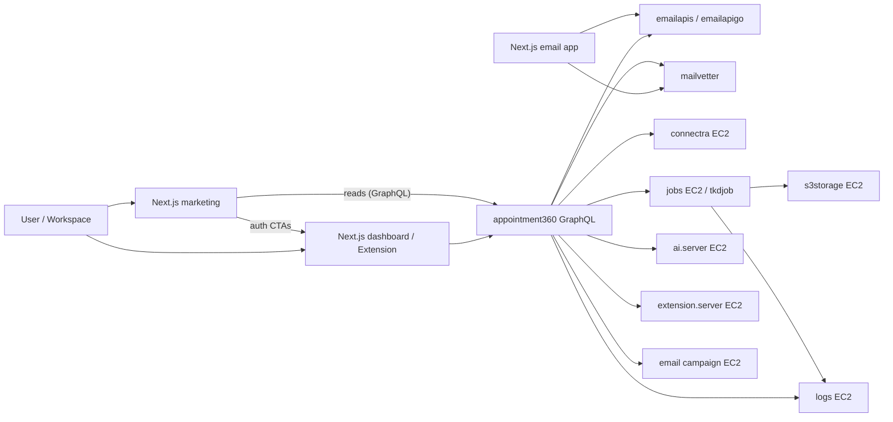

Marketing is unauthenticated: it may call GraphQL for **read-only** product data where configured, and routes **sign-in / sign-up** flows to the dashboard for authenticated actions.

**Code paths (this monorepo):** GraphQL gateway → `contact360.io/api/`; Connectra → `contact360.io/sync/`; TKD Job → `contact360.io/jobs/`; dashboard → `contact360.io/app/`; marketing → `contact360.io/root/`. Shared email/log/storage **source** still lives under `lambda/*` (built as Docker images in production); Mailvetter and several integrations may live under `backend(dev)/` depending on checkout. **Deployment topology (EC2, subdomains, RDS/OpenSearch/S3):** `deploy/aws/SYSTEM_DESIGN.md`.

## Stage execution decomposition flow (per minor)

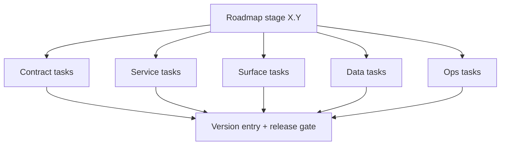

## Era transition flow (`7.x` -> `10.x`)

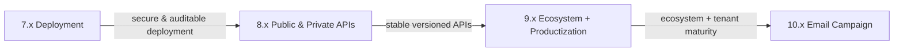

## Contact360 master view

This section ties together three layers already documented above:

- **Runtime:** [Core request flow](#core-request-flow) — authenticated and marketing paths through Appointment360 GraphQL to finder, verifier, Connectra, jobs, AI, and storage.
- **Delivery:** [Stage execution decomposition flow](#stage-execution-decomposition-flow-per-minor) — contract / service / surface / data / ops tracks feeding a version entry and release gate (see [`docs/version-policy.md`](version-policy.md)).
- **Era roadmap:** Long-horizon majors from Foundation through Email Campaign (see [`docs/version-policy.md`](version-policy.md) for full theme definitions).

**Per-minor drill-down:** Each optional stub under [`docs/versions/`](versions/) includes a **Flowchart** section with (1) the five-track delivery diagram labeled for that minor and (2) an era-appropriate runtime diagram. Use those files for release planning detail; use this page for the full system picture.

### Era progression strip (`0.x` → `10.x`)

```mermaid
flowchart LR
    era0["0.x Foundation"]
    era1["1.x User/Billing/Credit"]
    era2["2.x Email System"]
    era3["3.x Contact & Company Data"]
    era4["4.x Extension & SN"]
    era5["5.x AI Workflows"]
    era6["6.x Reliability & Scaling"]
    era7["7.x Deployment"]
    era8["8.x Public & Private APIs"]
    era9["9.x Ecosystem & Productization"]
    era10["10.x Email Campaign"]

    era0 --> era1 --> era2 --> era3 --> era4 --> era5 --> era6 --> era7 --> era8 --> era9 --> era10
```

Themes align with [`docs/version-policy.md`](version-policy.md) (*Major themes*) and [`docs/versions.md`](versions.md).

## Frontend surfaces by product era (UI track)

Maps Contact360 **version eras** to **where users interact** (dashboard, marketing, extension). Detailed page lists: [`docs/frontend/README.md`](frontend/README.md) and [`docs/frontend/pages/README.md`](frontend/pages/README.md).

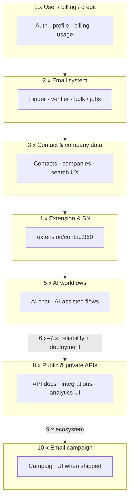

**Canonical UI paths:** [`docs/frontend.md`](frontend.md) (`contact360.io/app`, `root`, `admin`, `extension/contact360`).

---

## UI user journey flows

### Auth and onboarding flow (`1.x`)

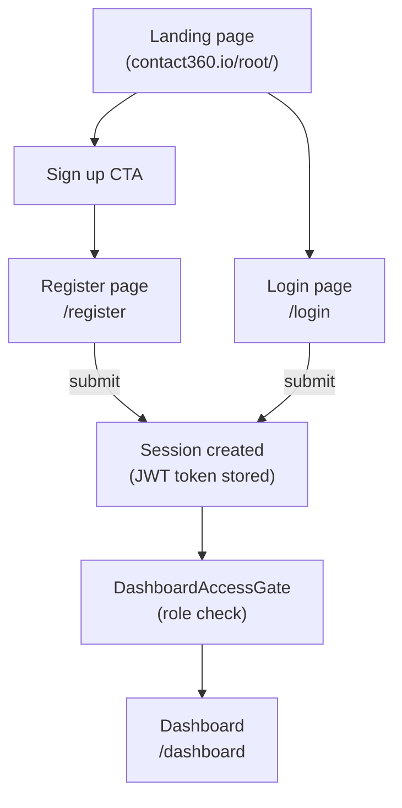

**Components:** `AuthErrorBanner`, register/login form fields, `useLoginForm`, `useRegisterForm`, `AuthContext`, `RoleContext`

---

### Email finder flow (`2.x`)

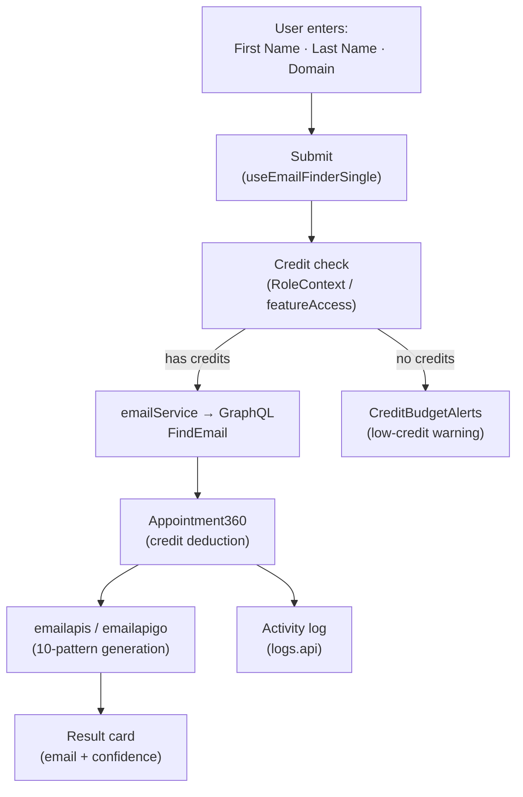

**Components:** Email input row, `EmailVerifierResult`, `CreditBudgetAlerts`
**Hooks:** `useEmailFinderSingle`
**Services:** `emailService`

---

### Email verifier flow (`2.x`)

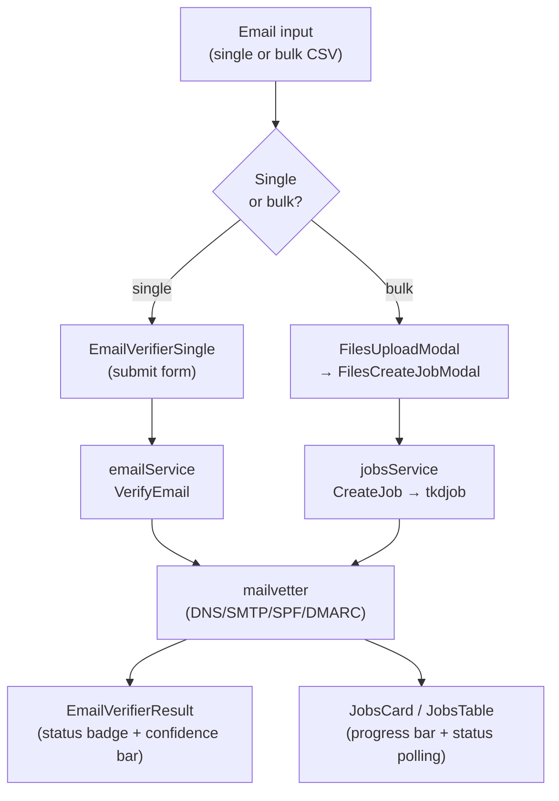

**UI elements:** Progress bar (bulk), confidence bar (single), status badge
**Hooks:** `useEmailVerifierSingle`, `useEmailVerifierBulk`, `useNewExport`

---

### Contacts search and filter flow (`3.x`)

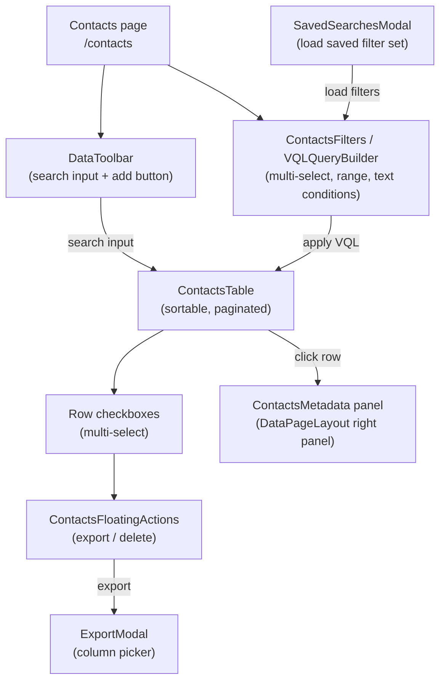

**Components:** `VQLQueryBuilder`, `ContactsFilters`, `FloatingActionBar`, `ExportModal`, `TablePagination`
**Hooks:** `useContactsPage`, `useContactsFilters`, `useSavedSearches`, `useContactExport`

---

### Bulk CSV job flow (`2.x` / jobs)

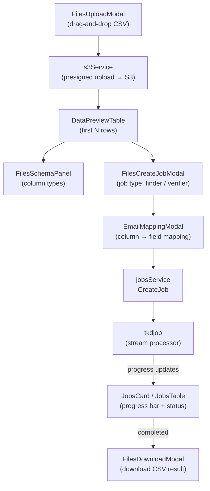

**UI elements:** File drag-and-drop, progress bar, radio buttons (job type), column mapping dropdowns, download button
**Hooks:** `useNewExport`, `useCsvUpload`, `useFilePreview`, `useJobs`

---

### Billing and credit purchase flow (`1.x`)

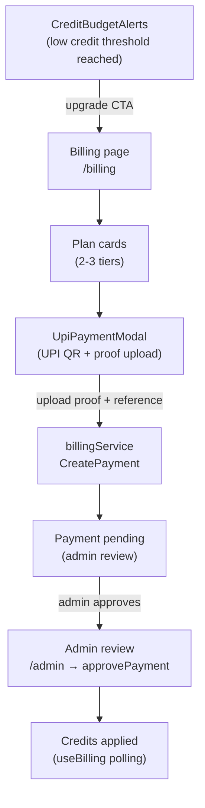

**Components:** `UpiPaymentModal`, plan cards
**UI elements:** File input, text input, submit button, progress indicator
**Hooks:** `useBilling`, `useAdmin`

---

### AI chat flow (`5.x`)

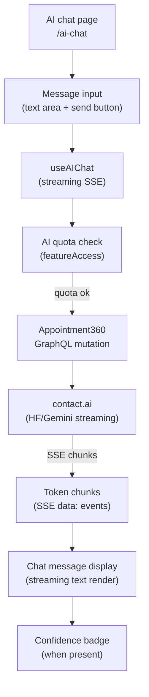

**UI elements:** Streaming text display, AI confidence badge, typing indicator, stop button
**Components:** Chat message components, `EmailAssistantPanel`

---

### Profile and settings flow (`1.x`)

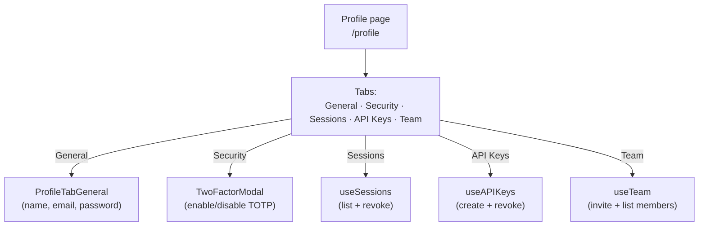

**UI elements:** Tabs, text inputs, toggle buttons, table rows with revoke buttons

---

### Admin control flow (`1.x` / `7.x`)

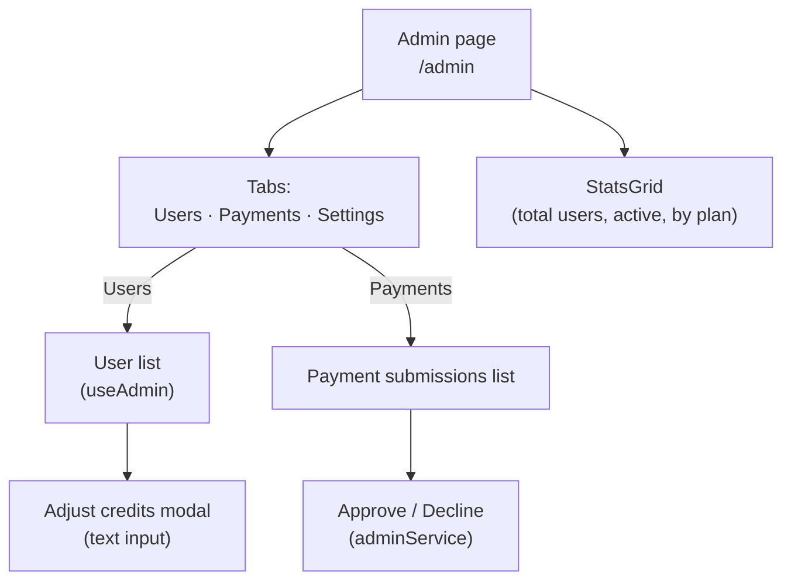

---

### Dashboard overview flow (`1.x` / `8.x`)

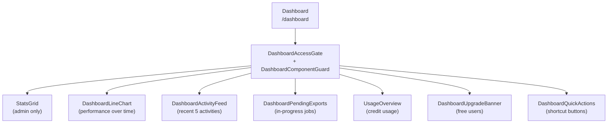

---

## Component interaction map (key patterns)

### Modal lifecycle

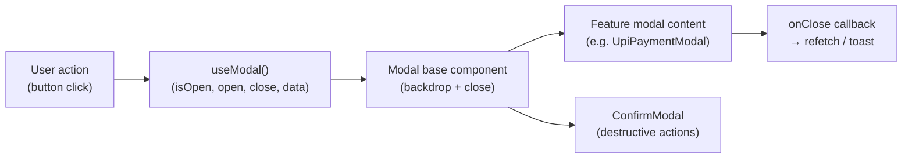

### Data table with filters

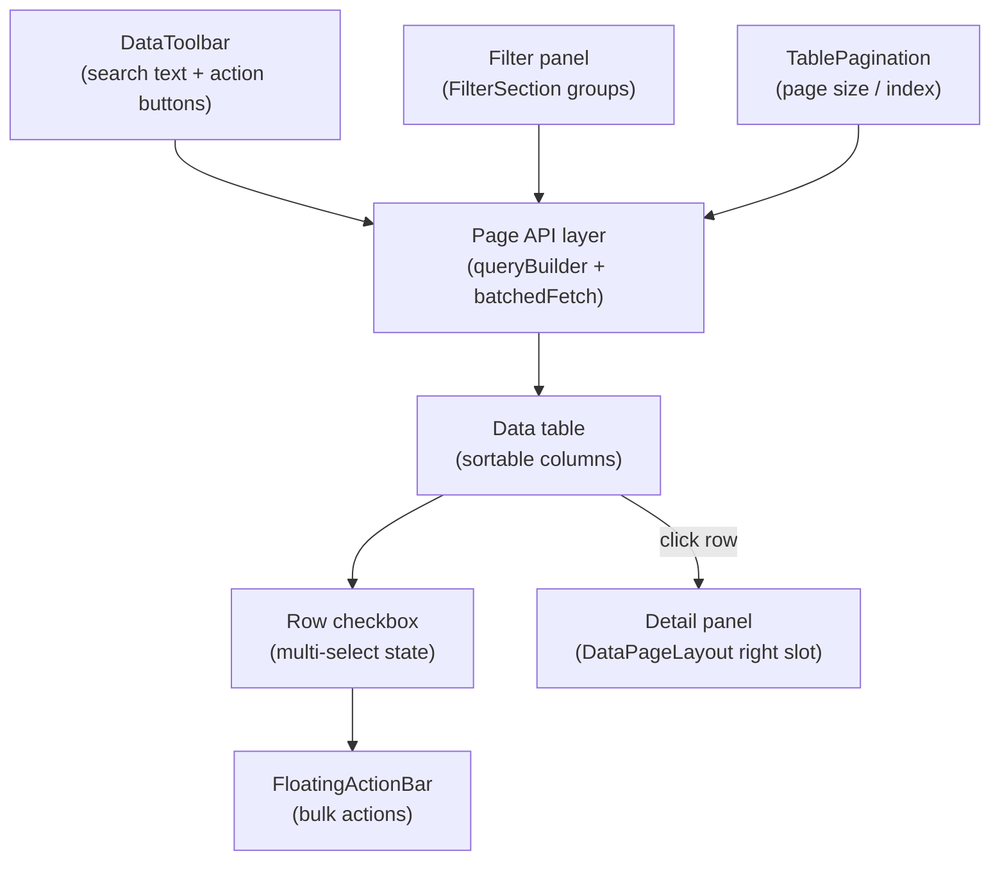

### Progress bar types

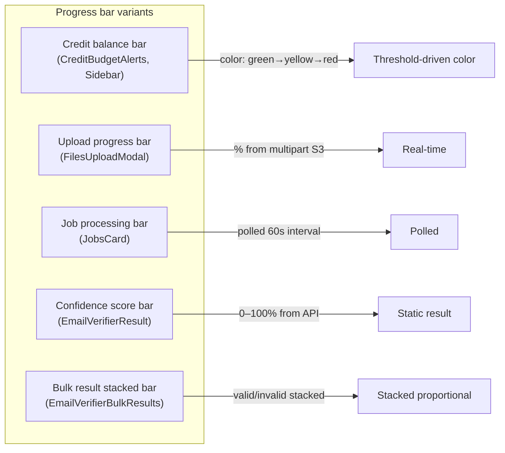

---

## Deep small-task breakdown checklist

- Define stage objective and contract boundary.
- Split work into contract/service/surface/data/ops packets.
- Attach owner, KPI, and acceptance check per packet.
- Mirror docs updates in roadmap + versions + docsai sync artifacts.
- Run release-candidate checks before next major transition.

---

## Related documentation

- `docs/architecture.md` — service register and data flow (complements diagrams above).
- `docs/backend.md` / `docs/frontend.md` — which code paths implement each arrow.
- `docs/frontend/README.md` — page inventory folder, era-to-surface table, links to JSON/CSV.
- `docs/frontend/components.md` — detailed per-era component catalog with UI element breakdowns.
- `docs/frontend/design-system.md` — design tokens, form elements, pattern library.
- `docs/frontend/hooks-services-contexts.md` — full hook/service/context/lib catalog.
- `docs/roadmap.md` / `docs/versions.md` — stage and release mapping; optional `docs/versions/version_*.md` per-minor stubs (each may include a **Flowchart** section).


## Backend API sequence diagrams (by era)

### `1.x` Login + credit deduction

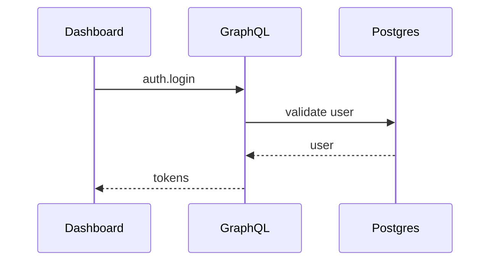

### `10.x` Campaign execution

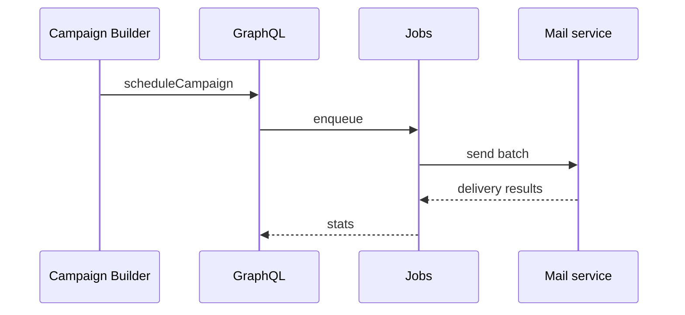

## Era flow coverage checklist

Ensure flow diagrams include at minimum one dedicated path for each era:
`1.x` auth-billing-credit, `2.x` finder-verifier, `3.x` contact-company search, `4.x` extension-sync, `5.x` AI flow, `6.x` reliability/queue, `7.x` governance, `8.x` API/webhook, `9.x` integration platform, `10.x` campaigns.

## `s3storage` multipart and metadata flow

```mermaid
sequenceDiagram
    participant UI as Dashboard/Client
    participant G as Appointment360
    participant S as s3storage API
    participant B as S3 Bucket
    participant W as Metadata Worker

    UI->>G: initiate upload intent
    G->>S: POST /api/v1/uploads/initiate-csv
    S-->>G: uploadId + fileKey + part config
    G-->>UI: multipart session contract

    loop per chunk
        UI->>S: GET /uploads/{uploadId}/parts/{n}
        S-->>UI: presigned part URL
        UI->>B: PUT chunk
        B-->>UI: ETag
        UI->>S: POST /uploads/{uploadId}/parts/{n} (etag)
    end

    UI->>S: POST /uploads/{uploadId}/complete
    S->>B: complete_multipart_upload
    S->>W: async invoke metadata job
    W->>B: read file + update metadata.json
    S-->>UI: upload completed
```

## `s3storage` era task strip (`0.x` -> `10.x`)

```mermaid
flowchart LR
    a0["0.x bootstrap contract"]
    a1["1.x user/billing artifacts"]
    a2["2.x multipart durability"]
    a3["3.x ingestion lineage"]
    a4["4.x extension provenance"]
    a5["5.x AI artifact governance"]
    a6["6.x reliability/SLO/idempotency"]
    a7["7.x authz/retention controls"]
    a8["8.x versioned storage APIs"]
    a9["9.x entitlement and quota model"]
    a10["10.x campaign compliance artifacts"]

    a0 --> a1 --> a2 --> a3 --> a4 --> a5 --> a6 --> a7 --> a8 --> a9 --> a10
```

## `jobs` execution flow

```mermaid
flowchart LR
    api["jobs API"]
    sched["Scheduler"]
    kafka["Kafka topic"]
    cons["Consumer"]
    pool["Worker pool"]
    proc["Processor"]
    db["jobs Postgres"]
    art["S3/PG/OpenSearch artifacts"]

    api --> db
    sched --> db
    sched --> kafka
    kafka --> cons --> pool --> proc
    proc --> db
    proc --> art
```

## `jobs` state machine

```mermaid
flowchart LR
    open["open"] --> inq["in_queue"] --> processing["processing"]
    processing --> completed["completed"]
    processing --> failed["failed"]
    failed --> retry["retry"]
    retry --> inq
```

## `jobs` processor flow stubs

```mermaid
flowchart TD
    input1["S3 CSV"] --> finder["email_finder_export_stream"] --> out1["S3 result CSV"]
    input2["S3 CSV"] --> verify["email_verify_export_stream"] --> out2["S3 result CSV + status"]
    input3["S3 CSV"] --> imp["contact360_import_prepare"] --> pg1["Contact360 PG"] --> es1["OpenSearch"]
    vql["VQL query"] --> exp["contact360_export_stream"] --> out3["S3 export CSV"]
```

## `jobs` era strip (`0.x` -> `10.x`)

```mermaid
flowchart LR
    j0["0.x baseline scheduler"]
    j1["1.x billing-aware jobs"]
    j2["2.x email stream jobs"]
    j3["3.x contact import/export jobs"]
    j4["4.x extension/SN jobs"]
    j5["5.x AI batch jobs"]
    j6["6.x reliability hardening"]
    j7["7.x authz/audit governance"]
    j8["8.x versioned API + callbacks"]
    j9["9.x tenant quotas/isolation"]
    j10["10.x campaign compliance jobs"]

    j0 --> j1 --> j2 --> j3 --> j4 --> j5 --> j6 --> j7 --> j8 --> j9 --> j10
```

## `logs.api` write and query flow

```mermaid
flowchart LR
    producer["Gateway and workers"] --> endpoint["logs.api endpoints"]
    endpoint --> service["log_service"] --> repo["log_repository"]
    repo --> s3["S3 CSV objects"]
    repo --> cache["Query cache"]
    reader["Admin/API/campaign surfaces"] --> endpoint
```

```mermaid
flowchart TD
    queryReq["Query request"] --> cacheCheck["Cache lookup"]
    cacheCheck -->|"hit"| cachedResp["Return cached response"]
    cacheCheck -->|"miss"| scanPath["S3 CSV scan/filter/sort"]
    scanPath --> streamPath["CSV streaming for large sets"]
    streamPath --> cacheWrite["Cache result"] --> responseOut["Return response"]
```

## Connectra VQL two-phase read flow

```mermaid
flowchart LR
    vqlInput["VQL query"] --> compiler["ToElasticsearchQuery"]
    compiler --> esQuery["Elasticsearch bool query"]
    esQuery --> esHits["ES hit IDs + cursors"]
    esHits --> pgFetch["PG batch fetch by UUID"]
    esHits --> companyFetch["PG company fetch (if populate)"]
    pgFetch --> join["In-memory O(n) hash join"]
    companyFetch --> join
    join --> response["ContactResponse array"]
```

## Connectra parallel write flow (5 stores)

```mermaid
flowchart TD
    batchUpsert["BulkUpsert request"] --> wg["WaitGroup add(5)"]
    wg --> pgContacts["goroutine: PG contacts"]
    wg --> esContacts["goroutine: ES contacts"]
    wg --> pgCompanies["goroutine: PG companies"]
    wg --> esCompanies["goroutine: ES companies"]
    wg --> filtersData["goroutine: filters_data"]
    pgContacts --> wait["WaitGroup.Wait()"]
    esContacts --> wait
    pgCompanies --> wait
    esCompanies --> wait
    filtersData --> wait
    wait --> result["[]string UUIDs or error"]
```

## Connectra job state machine

```mermaid
flowchart LR
    openStatus["OPEN"] -->|"poll first_time"| inQueue["IN_QUEUE"]
    inQueue -->|"channel dispatch"| processing["PROCESSING"]
    processing -->|"success"| completed["COMPLETED"]
    processing -->|"failure"| failed["FAILED"]
    failed -->|"run_after passed"| retryQueue["RETRY_IN_QUEUED"]
    retryQueue -->|"retry runner"| processing
```

## Marketing auth and content flow (`contact360.io/root`)

```mermaid
flowchart TD
    publicUser["PublicUser"] --> marketingLayout["MarketingLayout(useForceLightTheme)"]
    marketingLayout --> landingSections["LandingSections(Hero,Features,Pricing,AIWriter)"]
    landingSections --> marketingHooks["MarketingHooks(useLandingContent,useMarketingPage,usePricing)"]
    marketingHooks --> marketingGql["MarketingGraphQLServices"]
    marketingGql --> appointmentGraphql["Appointment360GraphQL"]
    landingSections --> authCta["AuthCTAButtons"]
    authCta --> dashboardAuth["DashboardLoginOrRegister"]
```

## DocsAI documentation dashboard data flow (`contact360.io/admin`)

```mermaid
flowchart TD
    adminUser["AdminUser"] --> docsDashboardView["DocumentationDashboardView"]
    docsDashboardView --> parallelFetch["ParallelFetch(pages,endpoints,relationships)"]
    parallelFetch --> redisCheck["RedisCacheCheck"]
    parallelFetch --> s3IndexRead["S3IndexRead"]
    redisCheck --> graphPayload["RelationshipGraphPayload"]
    s3IndexRead --> graphPayload
    graphPayload --> d3Viewer["RelationshipGraphViewer(D3)"]
    graphPayload --> cyViewer["GraphViewer(Cytoscape)"]
    d3Viewer --> dashboardUi["DashboardTabsFiltersProgress"]
    cyViewer --> dashboardUi
```

## DocsAI admin access-control chain

```mermaid
flowchart LR
    requestNode["IncomingRequest"] --> decoratorGate["DecoratorGate(require_super_admin_or_admin)"]
    decoratorGate --> djangoView["DjangoViewHandler"]
    djangoView --> graphqlClientNode["GraphQLClient(httpx,retry,backoff)"]
    graphqlClientNode --> appointmentApi["Appointment360GraphQL"]
    djangoView --> localStore["DjangoLocalStore(SQLite)"]
    djangoView --> auditOutput["AdminAuditOutput"]
```

## Email Campaign — campaign send flow (`backend(dev)/email campaign`)

```mermaid
flowchart TD
    dashUser["DashboardUser"] --> wizardUI["CampaignWizardUI"]
    wizardUI --> gatewayGql["Appointment360GraphQL(createCampaign)"]
    gatewayGql --> campaignApi["EmailCampaignAPI(POST /campaign)"]
    campaignApi --> pgCampaign["PostgreSQL(campaigns row)"]
    campaignApi --> asynqEnqueue["Asynq(enqueue campaign:send task)"]
    asynqEnqueue --> redis["Redis(task queue)"]
    redis --> campaignWorker["CampaignWorker(HandleCampaignTask)"]
    campaignWorker --> audienceResolve["AudienceResolve(CSV|Connectra|SN)"]
    audienceResolve --> connectra["Connectra REST(/contacts/search)"]
    audienceResolve --> pgRecipients["PostgreSQL(recipients rows insert)"]
    campaignWorker --> fanout["FanOut(5 EmailWorker goroutines)"]
    fanout --> suppressCheck["SuppressionCheck(suppression_list)"]
    suppressCheck -->|"suppressed"| skipSend["SkipSend(status=skipped)"]
    suppressCheck -->|"not suppressed"| templateFetch["TemplateFetch(S3 GetObject + cache)"]
    templateFetch --> render["GoTemplateRender(TemplateData{Name,Email,UnsubURL})"]
    render --> smtpSend["smtp.SendMail(SMTP provider)"]
    smtpSend -->|"success"| incSent["IncrementSent + recipients.status=sent"]
    smtpSend -->|"failure"| incFailed["IncrementFailed + recipients.status=failed"]
    incSent --> campaignComplete["Campaign status → completed"]
    incFailed --> campaignComplete
    campaignComplete --> logsApi["logs.api(campaign lifecycle event)"]
```

## Email Campaign — unsubscribe flow

```mermaid
flowchart LR
    emailRecipient["EmailRecipient"] --> unsubLink["UnsubscribeLink(JWT token in email footer)"]
    unsubLink --> unsubEndpoint["GET /unsub?token=..."]
    unsubEndpoint --> jwtValidate["JWT Validate(HS256, 30d expiry)"]
    jwtValidate -->|"invalid"| errorResp["401 Bad Token"]
    jwtValidate -->|"valid"| extractClaims["Extract(email, campaign_id)"]
    extractClaims --> suppressInsert["INSERT suppression_list(email, reason=unsubscribe)"]
    extractClaims --> updateRecipient["UPDATE recipients SET status=unsubscribed"]
    suppressInsert --> confirmPage["UnsubscribeConfirmationPage"]
    updateRecipient --> confirmPage
```

## Email Campaign — template lifecycle flow

```mermaid
flowchart TD
    designer["CampaignDesigner"] --> templateBuilderUI["TemplateBuilderUI(HTML editor + preview)"]
    templateBuilderUI --> createTemplate["POST /templates(title,subject,html_body)"]
    createTemplate --> s3Upload["S3 PutObject(templates/{id}.html)"]
    createTemplate --> pgTemplate["PostgreSQL templates row(id,name,subject,s3_key)"]
    pgTemplate --> cacheInvalidate["InMemoryCache invalidate"]
    templateBuilderUI --> previewTemplate["POST /templates/:id/preview"]
    previewTemplate --> s3Fetch["S3 GetObject(or cache hit)"]
    s3Fetch --> goRender["GoTemplateRender(sample TemplateData)"]
    goRender --> htmlPreview["HTML Preview Response"]
    templateBuilderUI --> aiGenerate["POST /templates/generate(AI prompt)"]
    aiGenerate --> aiService["AIService(generate HTML body)"]
    aiService --> s3Upload
    aiService --> pgTemplate
```

## Contact AI — chat message flow (`backend(dev)/contact.ai`)

```mermaid
flowchart TD
    dashUser["DashboardUser"] --> chatInput["ChatInput(textarea, model selector)"]
    chatInput --> gqlMutation["sendMessage GraphQL Mutation"]
    gqlMutation --> lambdaClient["LambdaAIClient(appointment360)"]
    lambdaClient --> contactAiMsg["POST /api/v1/ai-chats/{id}/message"]
    contactAiMsg --> ownerCheck["OwnershipCheck(user_id match)"]
    ownerCheck -->|"forbidden"| forbiddenErr["403 ForbiddenError"]
    ownerCheck -->|"ok"| appendUser["Append user message to ai_chats.messages"]
    appendUser --> hfInference["HFService.chat_completion(model, messages)"]
    hfInference -->|"HF success"| aiReply["AI reply token"]
    hfInference -->|"HF failure"| geminifall["Gemini API fallback"]
    geminifall --> aiReply
    aiReply --> appendAi["Append AI reply to ai_chats.messages"]
    appendAi --> pgWrite["PostgreSQL WRITE ai_chats"]
    pgWrite --> returnChat["Return updated AIChat"]
    returnChat --> chatThread["ChatThread re-renders messages"]
    chatThread --> contactsInMsg["ContactsInMessage renders embedded contacts"]
```

## Contact AI — SSE streaming flow (`backend(dev)/contact.ai`)

```mermaid
flowchart TD
    dashUser2["DashboardUser"] --> chatInput2["ChatInput"]
    chatInput2 --> useStream["useStreamMessage() hook"]
    useStream --> sseConn["SSE connection: POST /api/v1/ai-chats/{id}/message/stream"]
    sseConn --> contactAiStream["contact.ai SSE endpoint"]
    contactAiStream --> hfStream["HFService.stream_chat(messages, model)"]
    hfStream -->|"token chunk"| sseEvent["data: token\\n\\n"]
    sseEvent --> streamText["StreamingText: append token"]
    hfStream -->|"stream done"| doneEvent["data: [DONE]\\n\\n"]
    doneEvent --> streamEnd["StreamingText done; AILoadingSpinner hidden"]
    hfStream -->|"timeout/error"| errEvent["data: error_json\\n\\n"]
    errEvent --> aiErrorState["AIErrorState: show retry button"]
    aiErrorState --> retryBtn["User clicks retry → useStreamMessage() reconnect"]
```

## Contact AI — utility AI flows (stateless)

```mermaid
flowchart LR
    emailField["Contact email field hover"] --> emailRiskHook["useEmailRisk(email)"]
    emailRiskHook --> analyzeGql["analyzeEmailRisk GraphQL mutation"]
    analyzeGql --> lambdaClientUtil["LambdaAIClient"]
    lambdaClientUtil --> emailAnalyzeEndpoint["POST /api/v1/ai/email/analyze"]
    emailAnalyzeEndpoint --> hfJsonTask["HFService.json_task(email risk prompt)"]
    hfJsonTask --> riskResult["EmailRiskAnalysisResponse"]
    riskResult --> emailRiskBadge["EmailRiskBadge(score, isRoleBased, isDisposable)"]

    companyTab["Company detail tab click"] --> companySummaryHook["useCompanySummary(name,industry)"]
    companySummaryHook --> summaryGql["generateCompanySummary GraphQL mutation"]
    summaryGql --> lambdaClientUtil
    lambdaClientUtil --> summaryEndpoint["POST /api/v1/ai/company/summary"]
    summaryEndpoint --> hfJsonTask2["HFService.json_task(summary prompt)"]
    hfJsonTask2 --> summaryResult["CompanySummaryResponse"]
    summaryResult --> companySummaryTab["CompanySummaryTab renders text"]

    nlInput["AI filter input (NL query)"] --> parseHook["useParseFilters(query)"]
    parseHook --> parseGql["parseContactFilters GraphQL mutation"]
    parseGql --> lambdaClientUtil
    lambdaClientUtil --> parseEndpoint["POST /api/v1/ai/parse-filters"]
    parseEndpoint --> hfJsonTask3["HFService.json_task(filter extract prompt)"]
    hfJsonTask3 --> filterResult["ParseFiltersResponse(jobTitles,location,seniority,...)"]
    filterResult --> filterChips["AIFilterInput: render filter chips → apply to Connectra VQL"]
```

## Contact AI — era strip

```mermaid
flowchart LR
    era0x["0.x: skeleton + DDL"] --> era1x["1.x: user_id FK + IAM"]
    era1x --> era2x["2.x: analyzeEmailRisk stub"]
    era2x --> era3x["3.x: parseFilters + companySummary stubs"]
    era3x --> era4x["4.x: SN contact JSONB compat"]
    era4x --> era5x["5.x ★ ALL live: chat+stream+utilities"]
    era5x --> era6x["6.x: SLO + SSE reliability + TTL"]
    era6x --> era7x["7.x: RBAC + audit + retention"]
    era7x --> era8x["8.x: scoped keys + rate limit headers"]
    era8x --> era9x["9.x: webhook + connector"]
    era9x --> era10x["10.x: campaign AI generation"]
```

---

## Sales Navigator — Save flow

```mermaid
flowchart TD
    ExtOrDash["Extension Popup or Dashboard\nSN Save Button / Sync CTA"]
    ExtOrDash -->|"Profile array or raw HTML"| GQL["Appointment360\nGraphQL Gateway\nsaveSalesNavigatorProfiles"]
    GQL -->|"POST /v1/save-profiles"| SNSVC["Sales Navigator Service\n(FastAPI Lambda)"]
    SNSVC --> Dedup["SaveService\nDeduplicate by profile_url\n(keep best completeness)"]
    Dedup --> Map["mappers.py\nSN fields → Contact/Company\nUUID5 generation\nseniority/departments inference"]
    Map --> Chunk["Chunker\n500 profiles/chunk\nmax 3 parallel chunks"]
    Chunk -->|"POST /companies/bulk"| Connectra["Connectra\nBulk upsert companies\n(PostgreSQL + Elasticsearch)"]
    Chunk -->|"POST /contacts/bulk"| Connectra
    Connectra --> Result["Aggregate results\nsaved_count, created, updated, errors"]
    Result --> GQL
    GQL --> UI["Extension / Dashboard UI\nProgress bar complete\nSaveSummaryCard\nErrorDrawer if errors"]
```

## Sales Navigator — HTML scrape flow (POST /v1/scrape)

```mermaid
flowchart TD
    Extension["Browser Extension\nSN Search Page HTML"]
    Extension -->|"POST /v1/scrape {html, save:true}"| SNSVC["Sales Navigator Service"]
    SNSVC --> Extract["extraction.py\nBeautifulSoup parse\nLead cards → profile objects\ndata_quality_score computed"]
    Extract --> Profiles["Profile array\n(name, title, company, location,\nprofile_url, lead_id, connection_degree...)"]
    Profiles -->|"if save=true"| SavePath["SaveService\n(same as save-profiles flow)"]
    Profiles -->|"if save=false"| ReturnOnly["Return profiles\nto extension\n(preview mode)"]
    SavePath --> Connectra["Connectra bulk upsert"]
    Connectra --> Response["ScrapeHtmlResponse\n{success, profiles, page_metadata,\nsave_summary, errors}"]
    ReturnOnly --> Response
```

## Sales Navigator — Era evolution flow

```mermaid
flowchart LR
    era0["0.x: Scaffold\nHealth only"]
    era1["1.x: Actor context\nBilling stub"]
    era2["2.x: Email field\nvalidation"]
    era3["3.x: Full field\nmapping + provenance"]
    era4["4.x ★ PRIMARY\nFull extension UX\nHTML extraction hardened"]
    era5["5.x: AI-ready\nfields quality gate"]
    era6["6.x: Rate limit\nIdempotency CORS"]
    era7["7.x: RBAC\nAudit events GDPR"]
    era8["8.x: Versioned\nRate-limit headers"]
    era9["9.x: Connectors\nWebhook delivery"]
    era10["10.x: Campaign\nAudience provenance"]

    era0 --> era1 --> era2 --> era3 --> era4 --> era5 --> era6 --> era7 --> era8 --> era9 --> era10
```

---

## Appointment360 — GraphQL request lifecycle flow

```mermaid
flowchart TD
    Client["Dashboard / Extension"]
    Client -->|"POST /graphql Bearer JWT"| MW["Middleware Stack\n(CORS → TrustedHost → GZip → REDMetrics\n→ Timing → RequestId → TraceId\n→ BodySize → Idempotency → AbuseGuard → RateLimit)"]
    MW --> Router["GraphQL Router (Strawberry)"]
    Router --> Context["get_context()\nJWT decode → load User from DB\nopen AsyncSession\ninit DataLoaders"]
    Context --> Extensions["QueryComplexityExtension\nQueryTimeoutExtension"]
    Extensions --> Resolver["Resolver execution\n(module query / mutation)"]
    Resolver -->|contacts / companies| Connectra["ConnectraClient\nGET /contacts/query\nGET /companies/query"]
    Resolver -->|jobs create / status| TKDJob["TkdjobClient\nPOST /jobs/create\nGET /jobs/:id"]
    Resolver -->|email finder/verifier| LambdaEmail["LambdaEmailClient\nPOST /find-email\nPOST /verify-email"]
    Resolver -->|AI chats| LambdaAI["LambdaAIClient\nPOST /ai-chats\nPOST /message/stream"]
    Resolver -->|files / exports| S3Storage["LambdaS3StorageClient\nGET /files\nPOST /upload"]
    Resolver -->|pages / help content| DocsAI["DocsAIClient\nGET /pages"]
    Resolver -->|user/billing/credits| DB["PostgreSQL\n(appointment360 DB)"]
    Resolver --> DBCommit["DatabaseCommitMiddleware\nSession commit / rollback"]
    DBCommit --> Response["GraphQL response\n+ X-Process-Time + X-Trace-Id headers"]
```

---

## Appointment360 — Authentication and token lifecycle flow

```mermaid
flowchart TD
    Register["mutation register(email, password)"]
    Register --> HashPW["bcrypt password hash"]
    HashPW --> CreateUser["INSERT INTO users"]
    CreateUser --> IssueTokens["Issue: access_token (30m HS256)\n+ refresh_token (7d HS256)"]
    IssueTokens --> ClientStores["Client stores tokens\n(cookie / localStorage)"]

    Login["mutation login(email, password)"]
    Login --> VerifyPW["verify bcrypt hash"]
    VerifyPW --> IssueTokens

    Request["Subsequent GraphQL request\nAuthorization: Bearer access_token"]
    Request --> DecodeJWT["get_context():\ndecode JWT → user_uuid"]
    DecodeJWT --> CheckBlacklist["SELECT token_blacklist WHERE token_hash = ?"]
    CheckBlacklist -->|not blacklisted| LoadUser["SELECT users WHERE uuid = user_uuid\n(TTLCache hit → skip DB)"]
    LoadUser --> ContextReady["Context.user populated\nResolver proceeds"]
    CheckBlacklist -->|blacklisted| Reject["Return UNAUTHENTICATED error"]

    Logout["mutation logout"]
    Logout --> InsertBlacklist["INSERT INTO token_blacklist\n(token_hash, expires_at)"]

    Refresh["mutation refresh_token(refresh_token)"]
    Refresh --> ValidateRefresh["Decode refresh JWT\nVerify not blacklisted"]
    ValidateRefresh --> NewAccess["Issue new access_token (30m)"]
```

---

## Appointment360 — Era activation spine

```mermaid
flowchart LR
    era0["0.x: App + middleware bootstrap\nDB session lifecycle\nHealth endpoints"]
    era0 --> era1["1.x: Auth + billing + credits\nJWT issue/blacklist\nCredit deduction"]
    era1 --> era2["2.x: Email module\nJobs module\nLambdaEmailClient + TkdjobClient"]
    era2 --> era3["3.x: Contacts + companies\nConnectraClient + VQL converter\nDataLoaders"]
    era3 --> era4["4.x: LinkedIn + Sales Navigator\nExtension session auth\nSN credit deduction"]
    era4 --> era5["5.x: AI chats + resume\nLambdaAIClient + ResumeAIClient"]
    era5 --> era6["6.x: Rate limit + abuse guard\nIdempotency + complexity/timeout\nRedis state sharing"]
    era6 --> era7["7.x: Deployment hardening\nCI/CD + Dockerfile\nSuperAdmin RBAC guards"]
    era7 --> era8["8.x: Pages + saved searches\nAPI keys + 2FA\nPublic X-API-Key auth"]
    era8 --> era9["9.x: Notifications + analytics\nTenant model\nAdmin panel"]
    era9 --> era10["10.x: Campaigns module\nSequences + templates\nCampaign wizard"]
```

---

## Mailvetter — bulk verification flow

```mermaid
flowchart TD
    A["Client / Gateway"] -->|"POST /v1/emails/validate-bulk"| B["ValidateBulkHandler"]
    B --> C["Normalize + dedupe emails"]
    C --> D["Plan checks\nbulk limit + concurrent jobs"]
    D --> E["Create jobs row\nstatus=pending"]
    E --> F["Enqueue tasks to Redis\nqueue: tasks:verify"]
    F --> G["Worker pool BLPOP consumers"]
    G --> H["VerifyEmailWithOptions\nDNS + SMTP + OSINT + scoring"]
    H --> I["Insert result row"]
    I --> J["Update jobs counters\nprocessed/valid/invalid"]
    J --> K{"processed >= total?"}
    K -->|No| G
    K -->|Yes| L["Set status=completed\ncompleted_at=now()"]
    L --> M["Dispatch webhook\nX-Webhook-Signature"]
```

---

## Mailvetter — single verification scoring flow

```mermaid
flowchart LR
    Req["POST /v1/emails/validate"] --> Parse["Parse + validate email"]
    Parse --> DNS["CheckDNS + IdentifyProvider"]
    Parse --> SMTP["CheckSMTP + VRFY + ghost probe"]
    Parse --> Signals["Signals: SPF/DMARC/domain age\nTeams/SharePoint/Calendar\nGitHub/Adobe/Gravatar/HIBP"]
    DNS --> Score["CalculateRobustScore"]
    SMTP --> Score
    Signals --> Score
    Score --> Status["status: valid/catch_all/risky/invalid/unknown"]
    Status --> Reach["reachability: safe/risky/bad"]
    Reach --> Resp["JSON response\nscore + score_details + analysis"]
```

---

## Mailvetter — era activation spine

```mermaid
flowchart LR
    e0["0.x: API/worker foundation\nv1 contract baseline"] --> e1["1.x: key ownership\nplan limits + credits"]
    e1 --> e2["2.x: core verifier GA\nbulk jobs + results"]
    e2 --> e3["3.x: contact/company linkage\nverification lineage"]
    e3 --> e4["4.x: extension/SN provenance\nanti-abuse controls"]
    e4 --> e5["5.x: AI explainability\nreason codes"]
    e5 --> e6["6.x: reliability hardening\ndistributed limiter + idempotency"]
    e6 --> e7["7.x: deployment governance\nmigration discipline"]
    e7 --> e8["8.x: public/private API\nscoped keys + OpenAPI"]
    e8 --> e9["9.x: ecosystem webhooks\nconnector reliability"]
    e9 --> e10["10.x: campaign preflight\ncompliance traceability"]
```


---

## Extension runtime flow

### Extension token refresh and profile save flow

```mermaid
flowchart TD
    A[Extension popup / content script] --> B{getValidAccessToken}
    B -->|token valid| C[Return accessToken]
    B -->|token expired / near expiry| D[refreshAccessToken via GraphQL]
    D --> E[POST /graphql mutation auth.refreshToken]
    E --> F[Appointment360 validates refreshToken]
    F -->|ok| G[Return new accessToken + refreshToken]
    G --> H[storeTokens to chrome.storage.local]
    H --> C
    F -->|fail| I[Redirect to login]
    C --> J[deduplicateProfiles on scraped list]
    J --> K[lambdaClient.saveProfiles batched array]
    K --> L[POST /v1/save-profiles with Bearer token]
    L --> M[Lambda SN API]
    M --> N[POST /contacts/bulk to Connectra]
    M --> O[POST /companies/bulk to Connectra]
    N --> P[Elasticsearch contact index updated]
    O --> Q[Elasticsearch company index updated]
    L -->|error| R[Retry with back-off + jitter]
    R -->|max retries exceeded| S[Return error list to popup]
    S --> T[Extension popup shows error toast]
    K --> U[Extension popup updates progress bar]
    P --> V[Contacts available in Contact360 dashboard]
    Q --> V
```

### Extension shell implementation delta

```mermaid
flowchart LR
    extensionUI["Extension popup (missing)"] -->|"planned"| contentScript["Content script (planned)"]
    contentScript -->|"planned"| bgWorker["Background service worker (planned)"]
    bgWorker --> lambdaClient["lambdaClient.js (implemented)"]
    lambdaClient --> salesnavAPI["Sales Navigator Lambda (implemented)"]
```

### Extension access control chain

```mermaid
flowchart LR
    CS[Content script scrapes SN page] --> GM[profileMerger.deduplicateProfiles]
    GM --> GV[getValidAccessToken]
    GV -->|chrome.storage.local hit| LC[lambdaClient.saveProfiles]
    GV -->|token expired| RT[GraphQL auth.refreshToken]
    RT -->|success| LC
    RT -->|failure| ER[Show login required banner]
    LC -->|success| PB[Update progress bar + count badge]
    LC -->|failure| ET[Show error toast + retry]
```
---

## Email app runtime flow

```mermaid
flowchart TD
  A[User opens /inbox] --> B{activeAccount in ImapContext}
  B -->|missing| C[Prompt connect account in /account/{userId}]
  B -->|present| D[GET /api/emails/{folder}]
  D --> E[Render DataTable]
  E --> F[User clicks row]
  F --> G[Route /email/{mailId}?folder=...]
  G --> H[GET /api/emails/{mailId}?folder=...]
  H --> I[DOMPurify sanitize HTML]
  I --> J[Render sanitized email body]
```

```mermaid
flowchart LR
  U[Account settings page] --> P[POST /api/user/imap/{userId}]
  P --> R[GET /api/user/{userId}]
  R --> S[Update connectedAccounts list]
  S --> T[setActiveAccount in ImapContext]
  T --> V[Persist mailhub_active_account in localStorage]
```

## Admin runtime flow

```mermaid
flowchart TD
  Req[Admin Request] --> AuthMW[Appointment360AuthMiddleware]
  AuthMW --> RoleMW[SuperAdminMiddleware]
  RoleMW --> View[Admin View Handler]
  View --> GQL[Appointment360 GraphQL Client]
  View --> Logs[logs.api Client]
  View --> Jobs[tkdjob Client]
  View --> Storage[s3storage Client]
  GQL --> Resp[HTTP Response]
  Logs --> Resp
  Jobs --> Resp
  Storage --> Resp
```

## s3storage upload flow (current + risk)

```mermaid
flowchart TD
  Init[Initiate Upload] --> Sess[_MULTIPART_SESSIONS in-memory]
  Sess --> Part[Register Part URLs]
  Part --> Complete[Complete Upload]
  Complete --> Worker[s3storage-metadata-worker invoke]
  Worker --> Meta[metadata.json update]
  Sess --> Risk[Risk: non-durable session state]
```

## logs.api ingest flow

```mermaid
flowchart TD
  LReq[POST /logs or /logs/batch] --> Normalize[Normalize and validate payload]
  Normalize --> S3Write[Append rows to S3 CSV]
  S3Write --> CacheInv[Invalidate/query cache windows]
  CacheInv --> Query[Search/query/statistics paths]
```

## emailapigo finder fallback flow

```mermaid
flowchart LR
  Start[Finder request] --> Ctra[Connectra source]
  Ctra --> Pattern[Pattern table lookup]
  Pattern --> Gen[Generator expansion]
  Gen --> Web[Web search fallback]
  Web --> Icy[IcyPeas provider fallback]
  Icy --> Final[Candidate set + verification path]
```
