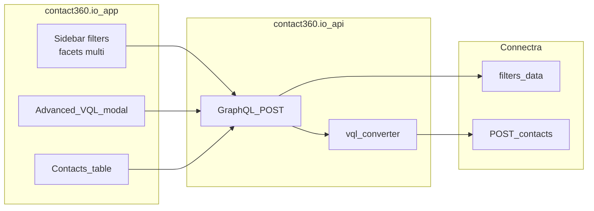

# Flow sketch — Contacts list query (dashboard)

Text-only flow for alignment with `docs/docs/flowchart.json` diagrams.

**Reference:** [`../docs/contacts-filter-vql-ui.md`](../docs/contacts-filter-vql-ui.md).
