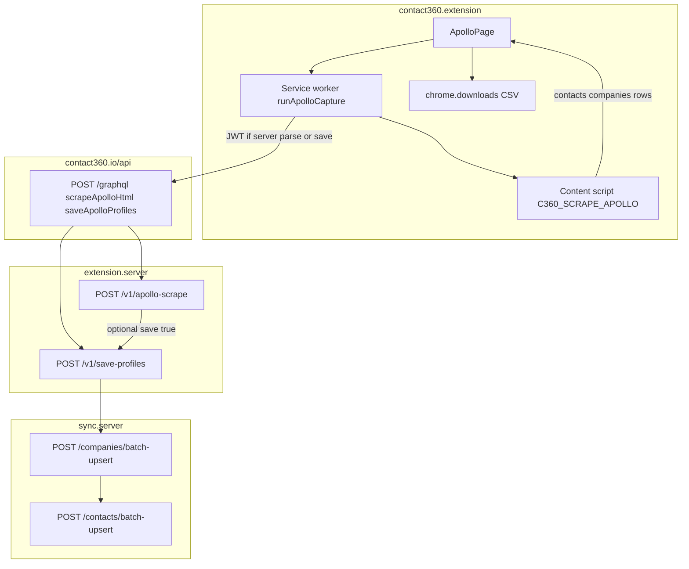

# Extension Apollo capture flow

End-to-end path for the **Apollo** side panel tab: optional client-side DOM parse, optional server HTML parse, CSV download, optional CRM save.

- **Offline reference:** [`docs/scripts/apollo_html/main.py`](../scripts/apollo_html/main.py) — same CSV field lists and UUID5 rules.
- **Contracts:** [`DECISIONS.md`](../DECISIONS.md) § Sales Navigator / extension satellite.

See also: [`extension-capture.md`](extension-capture.md).
