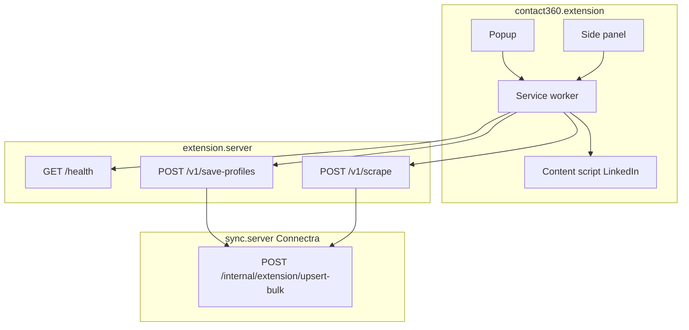

# Extension capture flow (Contact360)

End-to-end path from the browser extension to Connectra via extension.server.

- **Default path:** content script returns profile/company URL rows → `save-profiles` (client chunks large arrays).
- **Optional path:** user enables server HTML parse → capped `outerHTML` → `POST /v1/scrape` with `save: true` → parser extracts entities → same Connectra bulk upsert.

See also: [`docs/docs/architecture.json`](../docs/architecture.json) (`user_extension`), [`docs/backend/endpoints/extension.server/ROUTES.md`](../backend/endpoints/extension.server/ROUTES.md).
