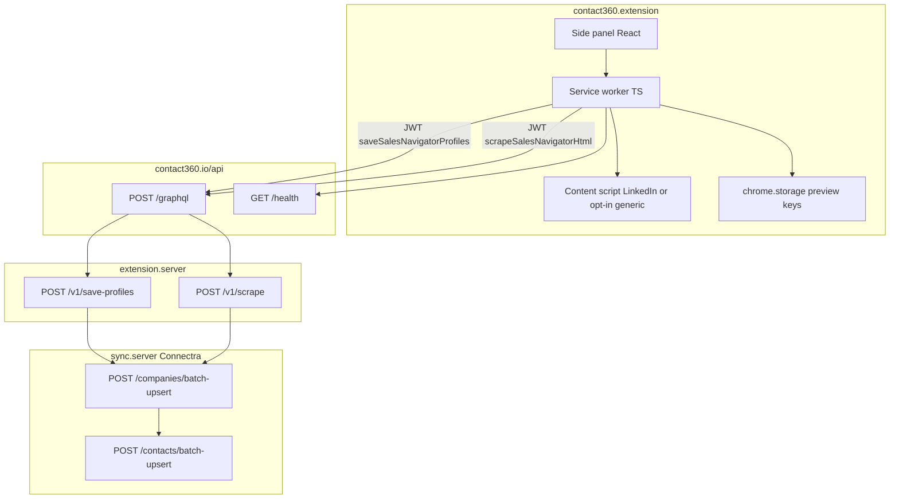

# Extension capture flow (Contact360)

End-to-end path from the browser extension to Connectra: **GraphQL gateway** → **extension.server** → **sync.server**.

**Implementation (2.0+):** React/Vite side panel (`src/sidebar/`), TypeScript service worker (`src/background/service-worker.ts`), content scripts on **`<all_urls>`** with LinkedIn + **opt-in** generic capture — see [`extension-generic-capture.md`](extension-generic-capture.md).

- **Response fields (preview merge):** GraphQL `SaveProfilesResponse` exposes **`contactUuids`**, **`companyUuids`**, **`savedContacts`**, **`savedCompanies`** — merge into UI state and optional **`c360_last_capture_preview`** in `chrome.storage` (see Phase 4 doc `63-sales-navigator/00-pipeline-gateway-connectra.md`).
- **Default path:** content script collects profile/company **links** from the DOM → GraphQL **`saveSalesNavigatorProfiles`** → gateway → **`save-profiles`** → Connectra **`/companies/batch-upsert`** then **`/contacts/batch-upsert`** (chunked per limits).
- **Optional path (Sales Navigator pages only):** user enables server HTML parse → capped `outerHTML` → GraphQL **`scrapeSalesNavigatorHtml`** → gateway → **`POST /v1/scrape`** with `save: true` → SN-oriented parser → same batch-upsert chain. Public `linkedin.com/search/` and `/in/` use link extraction + save mutation only (not the SN HTML parser).
- **Internal bulk:** `POST /internal/extension/upsert-bulk` is a **different** JSON shape for internal/extension fast paths — do not confuse with public `batch-upsert` arrays ([`DECISIONS.md`](../../DECISIONS.md)).

See also: [`docs/backend/endpoints/extension.server/ROUTES.md`](../backend/endpoints/extension.server/ROUTES.md) · Apollo.io path: [`extension-apollo.md`](extension-apollo.md).
