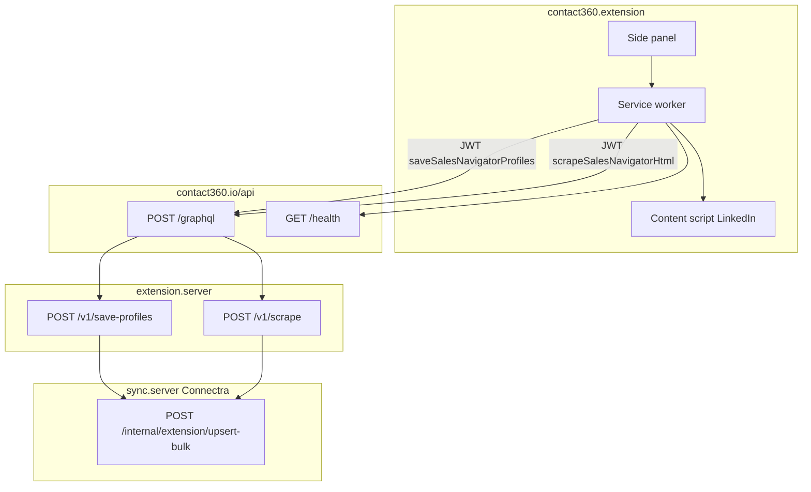

# Extension capture flow (Contact360)

End-to-end path from the browser extension to Connectra: **GraphQL gateway** → **extension.server** → **sync.server**.

- **Default path:** content script collects profile/company **links** from the DOM → GraphQL `saveSalesNavigatorProfiles` → gateway → `save-profiles` (chunks up to 1000 profiles).
- **Optional path (Sales Navigator pages only):** user enables server HTML parse → capped `outerHTML` → GraphQL `scrapeSalesNavigatorHtml` → gateway → `POST /v1/scrape` with `save: true` → SN-oriented parser → same Connectra bulk upsert. Public `linkedin.com/search/` and `/in/` use link extraction + save mutation only (not the SN HTML parser).

See also: [`docs/backend/endpoints/extension.server/ROUTES.md`](../backend/endpoints/extension.server/ROUTES.md).
