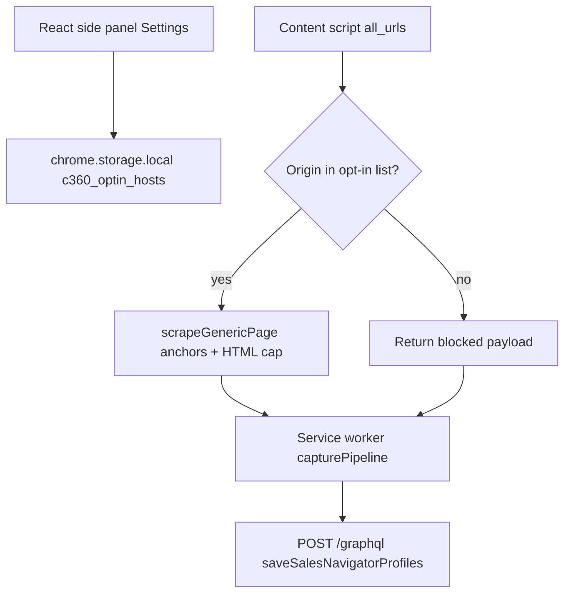

# Extension generic-site capture (opt-in)

For origins that are **not** LinkedIn, the content script returns profile/company link candidates from generic anchors **only** when the page **origin** is listed in `chrome.storage.local` under **`c360_optin_hosts`** (managed from **Settings → Host scope opt-in** in the side panel).

**Note:** Generic capture still uses the same GraphQL **save** mutation with `profile_url` / `company_url` rows; quality depends on the target site’s DOM. LinkedIn remains the supported production path for Sales Navigator workflows.

See also: [`extension-capture.md`](extension-capture.md), [`docs/frontend/extension/registry.json`](../frontend/extension/registry.json).
