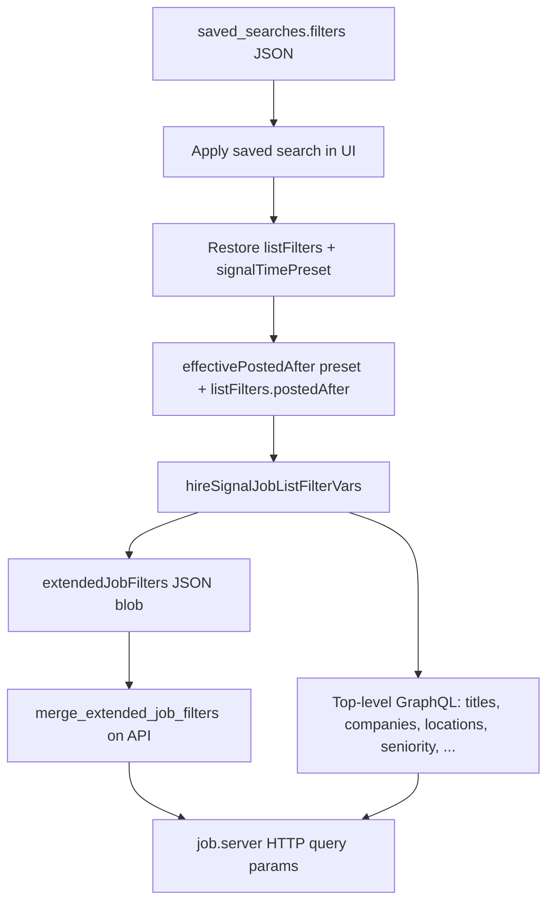

Here is a focused deep-dive on **hire signal** filter JSON in `saved_searches`.

---

## Step 1 — Where it lives in the database

For hiring-signal saved views, PostgreSQL stores:

| Column | Value for `type = 'hire_signal'` |
|---|---|
| `type` | `"hire_signal"` |
| `filters` | **The entire hire-signal payload** (see below) |
| `search_term` | Usually `NULL` (not used for hire signal) |
| `sort_field` / `sort_direction` | Usually `NULL` (sort lives inside `filters.listFilters`) |
| `page_size` | Usually `NULL` (pagination lives inside `filters.listFilters.limit`) |

The API still treats `filters` as untyped JSON — no server-side schema check. The **frontend defines and validates** the shape.

---

## Step 2 — Root envelope (what is actually stored)

When a user saves a hiring-signals view, the frontend builds this payload:

```62:66:e:\ayan\contact360\contact360.io\app\src\lib\savedSearchPayload.ts
export type HireSignalSavedSearchPayload = {
  version: typeof HIRE_SIGNAL_SAVED_SEARCH_VERSION;
  listFilters: JobListFilters;
  signalTimePreset: "all" | "new_7d";
};
```

`HIRE_SIGNAL_SAVED_SEARCH_VERSION = 1`.

Save flow:

```190:197:e:\ayan\contact360\contact360.io\app\src\components\feature\hiring-signals\HiringSignalsPageClient.tsx
  const getHireSignalSavedPayload =
    useCallback((): HireSignalSavedSearchPayload => {
      return {
        version: HIRE_SIGNAL_SAVED_SEARCH_VERSION,
        listFilters: structuredClone(filters),
        signalTimePreset,
      };
    }, [filters, signalTimePreset]);
```

That object is written directly into `saved_searches.filters`:

```334:338:e:\ayan\contact360\contact360.io\app\src\components\feature\saved-searches\SavedSearchesMenu.tsx
      const created = await savedSearchesService.create({
        name,
        type: typeFilter,
        filters: filters as unknown as Record<string, unknown>,
      });
```

(`typeFilter` is `"hire_signal"` on the hiring-signals page.)

### Root JSON structure

```json
{
  "version": 1,
  "signalTimePreset": "all",
  "listFilters": { /* JobListFilters — see Step 3 */ }
}
```

| Field | Type | Meaning |
|---|---|---|
| `version` | `1` | Payload schema version (only `1` exists today) |
| `signalTimePreset` | `"all"` \| `"new_7d"` | UI time scope; affects `postedAfter` at **replay** time |
| `listFilters` | object | Full applied job-list filter state |

Validation when reading:

```140:151:e:\ayan\contact360\contact360.io\app\src\lib\savedSearchPayload.ts
export function isHireSignalSavedSearchPayload(
  v: unknown,
): v is HireSignalSavedSearchPayload {
  if (!isRecord(v)) return false;
  if (v.version !== HIRE_SIGNAL_SAVED_SEARCH_VERSION) return false;
  if (!isRecord(v.listFilters)) return false;
  const lf = v.listFilters;
  if (typeof lf.limit !== "number" || typeof lf.offset !== "number")
    return false;
  const preset = v.signalTimePreset;
  return preset === "all" || preset === "new_7d";
}
```

Only `version`, `listFilters.limit`, `listFilters.offset`, and `signalTimePreset` are strictly validated. Other filter fields are optional.

---

## Step 3 — Deep breakdown of `listFilters`

`listFilters` is a snapshot of `JobListFilters` — the **applied** filter state (not the raw sidebar draft).

```457:522:e:\ayan\contact360\contact360.io\app\src\services\graphql\hiringSignalService.ts
export interface JobListFilters {
  titles?: string[];
  companies?: string[];
  locations?: string[];
  employmentType?: string;
  employmentTypes?: string[];
  seniority?: string;
  functionCategory?: string;
  postedAfter?: string;
  postedBefore?: string;
  runId?: string;
  globalSearchTokens?: string[];
  workplaceTypes?: string[];
  industries?: string[];
  excludedIndustries?: string[];
  excludedTitles?: string[];
  excludedCompanies?: string[];
  excludedLocations?: string[];
  salaryMin?: number;
  salaryMax?: number;
  experienceBuckets?: string[];
  roleTracks?: string[];
  educationLevelMins?: string[];
  clearanceMode?: "" | "allow" | "hide" | "only";
  h1bOnly?: boolean;
  skillsAll?: string[];
  hideApplied?: boolean;
  countries?: string[];
  applyMethod?: string;
  sortKey?: JobListSortKey;
  sortOrder?: JobListSortOrder;
  companyUuids?: string[];
  excludedCompanyUuids?: string[];
  companyEmployeeSizes?: string[];
  excludedCompanyEmployeeSizes?: string[];
  companyFunding?: string[];
  excludedCompanyFunding?: string[];
  companyRevenue?: string[];
  excludedCompanyRevenue?: string[];
  companyCountries?: string[];
  excludedCompanyCountries?: string[];
  companyIndustries?: string[];
  excludedCompanyIndustries?: string[];
  companyMissingWebsite?: boolean;
  companyMissingRevenue?: boolean;
  companyCsuiteContactMinCount?: number;
  companyHrContactMinCount?: number;
  limit: number;
  offset: number;
}
```

### 3A — Job text / identity filters (top-level GraphQL args)

These become direct `hireSignal.jobs(...)` parameters when replayed:

| Field | Type | Semantics |
|---|---|---|
| `titles` | `string[]` | Job title tokens — OR within field |
| `companies` | `string[]` | Company name tokens — OR |
| `locations` | `string[]` | Location tokens — OR |
| `employmentType` | `string` | Legacy single value (used if `employmentTypes` empty) |
| `employmentTypes` | `string[]` | Multi employment type — OR |
| `seniority` | `string` | Seniority level |
| `functionCategory` | `string` | Job function category |
| `postedAfter` | `string` | ISO date (`YYYY-MM-DD`) or RFC3339 |
| `postedBefore` | `string` | Upper date bound |
| `runId` | `string` | Scraper run ID scope |
| `globalSearchTokens` | `string[]` | Toolbar search — each token matches title OR company OR location (AND across tokens) |
| `hideApplied` | `boolean` | Hide jobs user marked as applied |
| `companyUuids` | `string[]` | Explicit company UUID allow-list (small lists only, ≤80 on backend) |
| `limit` | `number` | **Required** — page size |
| `offset` | `number` | **Required** — pagination offset |

### 3B — Extended job filters (nested into `extendedJobFilters`)

These live inside `listFilters` but are sent to the API as the `extendedJobFilters` JSON blob via `buildExtendedJobFilters()`:

| Field | Type | Maps to job.server param |
|---|---|---|
| `workplaceTypes` | `string[]` | `workplace_type[]` — Remote / Hybrid / On-site |
| `industries` | `string[]` | `industry[]` |
| `excludedIndustries` | `string[]` | `excluded_industry[]` |
| `excludedTitles` | `string[]` | `excluded_title[]` |
| `excludedCompanies` | `string[]` | `excluded_company[]` |
| `excludedLocations` | `string[]` | `excluded_location[]` |
| `salaryMin` / `salaryMax` | `number` | `salary_min` / `salary_max` (USD/year) |
| `experienceBuckets` | `string[]` | `experience_bucket[]` |
| `roleTracks` | `string[]` | `role_track[]` — IC vs manager |
| `educationLevelMins` | `string[]` | `education_level_min[]` — e.g. `"bachelors"`, `"masters"`, `"phd"` |
| `clearanceMode` | `"hide"` \| `"only"` | `clearance_mode` (omit if `"allow"` or empty) |
| `h1bOnly` | `boolean` | `h1b_only=true` |
| `skillsAll` | `string[]` | `skill[]` — all must match |
| `countries` | `string[]` | `country[]` — job country codes/substrings |
| `applyMethod` | `string` | `apply_method` — LinkedIn apply method token |
| `sortKey` | `"posted_at"` \| `"title"` \| `"company_name"` \| `"location"` \| `"employment_type"` | `sort_field` |
| `sortOrder` | `"asc"` \| `"desc"` | `sort_order` |
| `excludedCompanyUuids` | `string[]` | `excluded_company_uuid[]` (≤80) |

### 3C — Company firmographic cohort filters (inside `extendedJobFilters`)

These scope jobs to companies matching firmographic buckets (resolved via job.server OpenSearch, not long UUID lists):

| Field | Type | Example values |
|---|---|---|
| `companyEmployeeSizes` | `string[]` | `"1-10"`, `"10-100"`, `"100-500"`, `"10000+"` |
| `excludedCompanyEmployeeSizes` | `string[]` | Same bucket IDs |
| `companyFunding` | `string[]` | Funding bucket tokens, e.g. `"1000000-10000000"`, `"1000000000+"` |
| `excludedCompanyFunding` | `string[]` | Same |
| `companyRevenue` | `string[]` | Revenue bucket tokens |
| `excludedCompanyRevenue` | `string[]` | Same |
| `companyCountries` | `string[]` | Connectra country tokens |
| `excludedCompanyCountries` | `string[]` | Same |
| `companyIndustries` | `string[]` | Connectra industry tokens |
| `excludedCompanyIndustries` | `string[]` | Same |

Employee-size bucket IDs (from UI constants):

```11:18:e:\ayan\contact360\contact360.io\app\src\lib\hireSignalCompanyEmployeeSizeBuckets.ts
export const HIRE_SIGNAL_COMPANY_EMPLOYEE_SIZE_BUCKETS = [
  { id: "1-10", label: "1 – 10", gte: 1, lte: 10 },
  { id: "10-100", label: "10 – 100", gte: 10, lte: 100 },
  { id: "100-500", label: "100-500", gte: 100, lte: 500 },
  { id: "500-1000", label: "500-1000", gte: 500, lte: 1000 },
  { id: "1000-5000", label: "1000-5000", gte: 1000, lte: 5000 },
  { id: "5000-10000", label: "5000-10000", gte: 5000, lte: 10000 },
  { id: "10000+", label: "10000+", gte: 10000, lte: null as number | null },
] as const;
```

### 3D — Data-quality filters (SuperAdmin-only in UI; still storable)

| Field | Type | Meaning |
|---|---|---|
| `companyMissingWebsite` | `boolean` | Companies with no website |
| `companyMissingRevenue` | `boolean` | Companies with null/zero revenue |
| `companyCsuiteContactMinCount` | `number` | C-suite contact count threshold (`0` = none) |
| `companyHrContactMinCount` | `number` | HR contact count threshold |

---

## Step 4 — `signalTimePreset` (separate from `listFilters.postedAfter`)

This is **not** a VQL filter. It is a UI preset stored alongside `listFilters`:

| Value | Behavior at replay |
|---|---|
| `"all"` | Uses `listFilters.postedAfter` as-is (if set) |
| `"new_7d"` | If `listFilters.postedAfter` is empty, injects a rolling 7-day window |

```318:330:e:\ayan\contact360\contact360.io\app\src\lib\jobs\hiringSignalJobRows.ts
export function effectivePostedAfter(
  preset: "all" | "new_7d",
  explicitPostedAfter: string | undefined,
): string | undefined {
  const trimmed = explicitPostedAfter?.trim();
  if (preset !== "new_7d") {
    return trimmed || undefined;
  }
  if (trimmed) return trimmed;
  const d = new Date();
  d.setUTCDate(d.getUTCDate() - 7);
  return d.toISOString().slice(0, 10);
}
```

So `"new_7d"` is **relative** — re-applying the same saved search always means “last 7 days from today”, not a fixed calendar date.

---

## Step 5 — Full realistic example in `saved_searches.filters`

```json
{
  "version": 1,
  "signalTimePreset": "new_7d",
  "listFilters": {
    "limit": 50,
    "offset": 0,
    "titles": ["VP Engineering", "Director of Engineering"],
    "locations": ["San Francisco", "Remote"],
    "employmentTypes": ["Full-time"],
    "workplaceTypes": ["Remote", "Hybrid"],
    "seniority": "Director",
    "salaryMin": 150000,
    "salaryMax": 300000,
    "skillsAll": ["python", "kubernetes"],
    "educationLevelMins": ["bachelors"],
    "h1bOnly": true,
    "hideApplied": false,
    "globalSearchTokens": ["fintech"],
    "companyIndustries": ["Software", "Financial Services"],
    "companyEmployeeSizes": ["100-500", "500-1000"],
    "companyCountries": ["United States"],
    "companyFunding": ["10000000-100000000"],
    "sortKey": "posted_at",
    "sortOrder": "desc"
  }
}
```

Minimal valid payload (no filters, just pagination):

```json
{
  "version": 1,
  "signalTimePreset": "all",
  "listFilters": {
    "limit": 50,
    "offset": 0
  }
}
```

---

## Step 6 — How stored JSON becomes a live query



Split at replay time (`hireSignalJobListFilterVars`):

- **Top-level GraphQL args:** `titles`, `companies`, `locations`, `employmentType`, `seniority`, `functionCategory`, `postedAfter`, `postedBefore`, `runId`, `hideApplied`, `companyUuids`, `searchTokens`
- **`extendedJobFilters` JSON:** everything from `buildExtendedJobFilters()` — workplace, salary, firmographics, sort, skills, etc.

Backend merge logic (camelCase keys in stored JSON → snake_case HTTP params):

```8:176:e:\ayan\contact360\contact360.io\api\app\clients\job_server_job_filters.py
def merge_extended_job_filters(
    params: dict[str, Any],
    raw: dict[str, Any] | None,
    ...
) -> None:
    """Mutates ``params`` with job.server query keys. Values are str or list[str]."""
    ...
    _list("workplace_type", "workplaceTypes", "workplace_types")
    _list("employment_type", "employmentTypes", "employment_types")
    ...
    inc_es = _cohort_list(
        "companyEmployeeSizes", "company_employee_sizes", "includeEmployeeSizeBuckets"
    )
    ...
    inc_ind = _cohort_list(
        "companyIndustries", "company_industries", "includeCohortIndustries"
    )
```

---

## Step 7 — What is NOT stored in `filters`

| Not stored | Where it lives instead |
|---|---|
| Sidebar draft UI state (`HiringSignalFilterDraft`) | Only **applied** `JobListFilters` is saved |
| `search_term` column | Unused for hire signal |
| `sort_field` / `sort_direction` columns | Sort is in `listFilters.sortKey` / `sortOrder` |
| `page_size` column | Page size is in `listFilters.limit` |
| User prefs (hidden companies, applied job IDs) | `hire_signal_prefs` table — applied at query time, not in saved search |
| Scraper session state | Separate `scrape_jobs` table |

The UI draft (`hiringSignalFilterDraft.ts`) has extra fields like `salaryPreset`, `datePostedPreset`, `companyNames` — those are **converted into `JobListFilters` on Apply** before save, so the DB only sees the normalized `listFilters`.

---

## Step 8 — Apply / count behavior

**Apply saved search:**

```199:210:e:\ayan\contact360\contact360.io\app\src\components\feature\hiring-signals\HiringSignalsPageClient.tsx
  const handleApplyHireSignalSaved = useCallback(
    (p: HireSignalSavedSearchPayload) => {
      setSignalTimePreset(p.signalTimePreset);
      const lf = p.listFilters as JobListFilters & {
        listSort?: "recent" | "oldest";
      };
      setFilters({
        ...lf,
        ...coerceJobListSortFields(lf),
        offset: 0,
      });
    },
```

**Job count in saved-search panel:** uses `listFilters` + `signalTimePreset` → `fetchHiringSignalJobs` with `effectivePostedAfter`.

---

## Step 9 — Key differences vs contact/company saved searches

| Aspect | Contact / Company | Hire Signal |
|---|---|---|
| `filters` shape | VQL + sidebar state (`version: 2`) | `HireSignalSavedSearchPayload` (`version: 1`) |
| Filter model | `VQLFilterInput` tree | Flat `JobListFilters` object |
| Query target | Connectra contacts/companies | job.server LinkedIn jobs |
| Time preset | N/A | `signalTimePreset: "all" \| "new_7d"` |
| Firmographics | VQL `company_*` fields | Bucket IDs in `extendedJobFilters` |

---

## Summary

For `type = 'hire_signal'`, the `filters` column stores:

```typescript
{
  version: 1,
  signalTimePreset: "all" | "new_7d",
  listFilters: JobListFilters  // required: limit + offset; everything else optional
}
```

This is **not** VQL. It is a versioned envelope wrapping the full hiring-signals list filter state, which the frontend replays into `hireSignal.jobs` GraphQL calls (split across top-level args + `extendedJobFilters`).

If you paste a real row from your DB (`SELECT filters FROM saved_searches WHERE type = 'hire_signal' LIMIT 1`), I can decode that specific JSON field-by-field and show the exact GraphQL query it would produce.