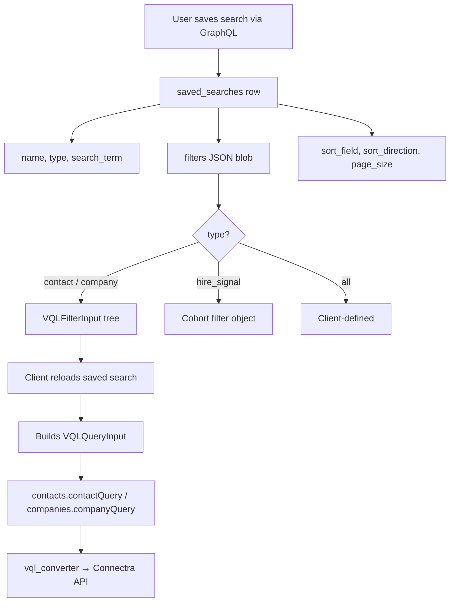

Here is a deep breakdown of how filter JSON works in the `saved_searches` table, based on the API codebase.

---

## 1. Table name and full row shape

The table is **`saved_searches`** (plural), not `saved_search`.

```4:20:e:\ayan\contact360\contact360.io\api\sql\saved_searches.sql
CREATE TABLE IF NOT EXISTS saved_searches (
    id BIGSERIAL PRIMARY KEY,
    user_id TEXT NOT NULL,
    name VARCHAR(255) NOT NULL,
    description TEXT,
    type saved_search_type NOT NULL,
    search_term TEXT,
    filters JSON,
    sort_field VARCHAR(100),
    sort_direction VARCHAR(10),
    page_size INTEGER,
    created_at TIMESTAMP WITH TIME ZONE NOT NULL DEFAULT NOW(),
    updated_at TIMESTAMP WITH TIME ZONE,
    last_used_at TIMESTAMP WITH TIME ZONE,
    use_count INTEGER NOT NULL DEFAULT 0,
    CONSTRAINT fk_saved_searches_user_id FOREIGN KEY (user_id) REFERENCES users(uuid) ON DELETE CASCADE
);
```

SQLAlchemy model:

```44:57:e:\ayan\contact360\contact360.io\api\app\models\saved_search.py
    id: Mapped[int] = mapped_column(BigInteger, primary_key=True, autoincrement=True)
    user_id: Mapped[str] = mapped_column(
        Text, ForeignKey("users.uuid", ondelete="CASCADE"), nullable=False
    )
    name: Mapped[str] = mapped_column(String(255), nullable=False)
    description: Mapped[str | None] = mapped_column(Text, default=None)
    type: Mapped[str] = mapped_column(
        EnumValue(SavedSearchType, "saved_search_type"), nullable=False
    )
    search_term: Mapped[str | None] = mapped_column(Text, default=None)
    filters: Mapped[dict | None] = mapped_column(JSON, default=None)
    sort_field: Mapped[str | None] = mapped_column(String(100), default=None)
    sort_direction: Mapped[str | None] = mapped_column(String(10), default=None)
    page_size: Mapped[int | None] = mapped_column(Integer, default=None)
```

---

## 2. What `filters` actually is

| Property | Detail |
|---|---|
| **DB type** | PostgreSQL `JSON` (nullable) |
| **GraphQL type** | `JSON` scalar (untyped) |
| **Validation** | **None** on create/update — stored as-is |
| **Intended format** | **VQL filter tree** (same shape as `VQLFilterInput` used by contacts/companies) |
| **What it is NOT** | Sort, pagination, and free-text search live in **separate columns** |

Important: the API **does not parse, validate, or transform** `filters` when saving. It is a pass-through JSON blob:

```75:86:e:\ayan\contact360\contact360.io\api\app\graphql\modules\saved_searches\mutations.py
                search = await repo.insert(
                    info.context.db,
                    user_id=user.uuid,
                    name=input.name,
                    type=search_type.value,
                    search_term=input.search_term,
                    filters=cast(dict[str, Any] | None, input.filters),
                    sort_field=input.sort_field,
                    sort_direction=input.sort_direction,
                    page_size=input.page_size,
                    description=input.description,
                )
```

The API also **does not load** `saved_searches.filters` when running queries or exports. Exports only store `saved_search_id` for audit; the actual VQL comes from the client’s `vql` input.

---

## 3. Full saved-search row (logical JSON view)

A complete saved search is split across columns:

```json
{
  "id": 42,
  "user_id": "550e8400-e29b-41d4-a716-446655440000",
  "name": "VP Engineering in SF Tech",
  "description": "Senior eng leaders at tech companies in SF",
  "type": "contact",
  "search_term": "engineering",
  "filters": { /* VQL filter tree — see below */ },
  "sort_field": "created_at",
  "sort_direction": "desc",
  "page_size": 50,
  "created_at": "2024-01-15T10:30:00Z",
  "updated_at": "2024-01-16T14:20:00Z",
  "last_used_at": "2024-01-20T09:15:00Z",
  "use_count": 12
}
```

### Column responsibilities

| Column | Purpose |
|---|---|
| `type` | `"contact"`, `"company"`, `"hire_signal"`, or `"all"` |
| `search_term` | Free-text search (not inside `filters`) |
| `filters` | Structured filter tree (VQL-style for contact/company) |
| `sort_field` / `sort_direction` | Sort preference (`"asc"` or `"desc"`) |
| `page_size` | Preferred page size |

---

## 4. Deep breakdown of `filters` JSON format

The canonical format matches GraphQL **`VQLFilterInput`** — a recursive filter tree:

```2942:2946:e:\ayan\contact360\contact360.io\api\tests\schema_snapshot.graphql
input VQLFilterInput {
  allOf: [VQLFilterInput!] = null
  anyOf: [VQLFilterInput!] = null
  conditions: [VQLConditionInput!] = null
}
```

Each condition:

```2931:2940:e:\ayan\contact360\contact360.io\api\tests\schema_snapshot.graphql
input VQLConditionInput {
  field: String!
  operator: String!
  value: JSON!
  searchType: String = null
  slop: Int = null
  fuzzy: Boolean = null
  matchOperator: String = null
}
```

### 4.1 Top-level structure

```json
{
  "allOf": [ /* nested filter groups — AND logic */ ],
  "anyOf": [ /* nested filter groups — OR logic (limited support) */ ],
  "conditions": [ /* leaf filter rules */ ]
}
```

All three keys are optional. A typical saved search uses **`conditions`** at the root, or **`allOf`** for grouped AND logic.

In the DB, keys are usually **camelCase** (`allOf`, `anyOf`) because GraphQL clients send camelCase and the `JSON` scalar preserves them.

### 4.2 Leaf condition (`conditions[]`)

Each item is one rule:

```json
{
  "field": "seniority",
  "operator": "eq",
  "value": "VP"
}
```

| Field | Type | Description |
|---|---|---|
| `field` | string | Filter key (snake_case index field names) |
| `operator` | string | Comparison operator |
| `value` | any | String, number, boolean, array, etc. |
| `searchType` | string? | Text search mode: `"exact"`, `"shuffle"`, `"substring"` |
| `slop` | int? | Text match slop |
| `fuzzy` | boolean? | Fuzzy text matching |
| `matchOperator` | string? | `"and"` or `"or"` inside text match |

### 4.3 Supported operators

From the codebase:

```20:22:e:\ayan\contact360\contact360.io\api\app\graphql\modules\contacts\inputs.py
    operator: (
        str  # eq, ne, gt, gte, lt, lte, in, nin, contains, ncontains, exists, nexists
    )
```

Aliases also accepted at conversion time:

```229:240:e:\ayan\contact360\contact360.io\api\app\utils\vql_converter.py
OPERATOR_ALIASES: dict[str, str] = {
    "neq": "ne",
    "not_contains": "ncontains",
    "notContains": "ncontains",
    "equals": "eq",
    "not_equals": "ne",
    "notEquals": "ne",
    "greater_than": "gt",
    "greater_than_or_equal": "gte",
    "less_than": "lt",
    "less_than_or_equal": "lte",
}
```

| Operator | Meaning | Typical field types |
|---|---|---|
| `eq` | equals | keyword |
| `ne` | not equals | keyword |
| `in` | in list | keyword (array value) |
| `nin` | not in list | keyword |
| `contains` | text contains | text |
| `ncontains` | text does not contain | text |
| `gt`, `gte`, `lt`, `lte` | numeric/date ranges | range |
| `exists`, `nexists` | field present/absent | any |

### 4.4 Nested logic

**AND example** — verified VP contacts in Engineering:

```json
{
  "allOf": [
    {
      "conditions": [
        { "field": "email_status", "operator": "eq", "value": "verified" }
      ]
    }
  ],
  "conditions": [
    { "field": "seniority", "operator": "eq", "value": "VP" },
    { "field": "departments", "operator": "eq", "value": "engineering" }
  ]
}
```

**OR example** (note: backend merges `anyOf` as AND with a warning — not true OR at Connectra level):

```json
{
  "anyOf": [
    {
      "conditions": [
        { "field": "seniority", "operator": "eq", "value": "VP" }
      ]
    },
    {
      "conditions": [
        { "field": "seniority", "operator": "eq", "value": "Director" }
      ]
    }
  ]
}
```

### 4.5 Valid `field` keys by `type`

#### Contact saved searches (`type = "contact"`)

From `contact_filters_config.py`:

| Category | Fields |
|---|---|
| **Person** | `first_name`, `last_name`, `title`, `email`, `departments`, `mobile_phone`, `email_status`, `seniority`, `city`, `state`, `country`, `linkedin_url`, `stage`, `ai_score`, `lead_score` |
| **Company (denormalized on contact index)** | `company_name`, `company_address`, `company_city`, `company_state`, `company_country`, `company_industries`, `company_keywords`, `company_technologies`, `company_employees_count`, `company_annual_revenue`, `company_total_funding`, `company_linkedin_url`, `company_normalized_domain`, `company_website` |

Field types:
- **keyword** → exact match (`eq`, `in`)
- **text** → `contains` / text search
- **range** → `gte`/`lte` on numeric fields like `company_employees_count`

#### Company saved searches (`type = "company"`)

| Field | Type |
|---|---|
| `uuid` (company name facet) | keyword |
| `address`, `city`, `state`, `country` | keyword |
| `industries`, `keywords`, `technologies` | keyword |
| `linkedin_url`, `website`, `normalized_domain` | keyword |
| `employees_count`, `annual_revenue`, `total_funding` | range |

---

## 5. Real-world examples stored in `filters`

### Example A — Simple contact filter

```json
{
  "conditions": [
    { "field": "seniority", "operator": "eq", "value": "VP" },
    { "field": "company_country", "operator": "eq", "value": "United States" },
    { "field": "company_industries", "operator": "eq", "value": "Technology" }
  ]
}
```

### Example B — Company employee count range

```json
{
  "conditions": [
    { "field": "employees_count", "operator": "gte", "value": 100 },
    { "field": "employees_count", "operator": "lte", "value": 500 },
    { "field": "industries", "operator": "in", "value": ["Software", "SaaS"] }
  ]
}
```

### Example C — Text search on title

```json
{
  "conditions": [
    {
      "field": "title",
      "operator": "contains",
      "value": "Chief Technology Officer",
      "searchType": "substring"
    }
  ]
}
```

### Example D — Empty / null

- `filters` column can be `NULL` or `{}`
- CRUD SQL example uses `'{}'::json`

---

## 6. How `filters` connects to query execution

When a saved search is **used**, the client should rebuild a `VQLQueryInput`:

```json
{
  "filters": { /* contents of saved_searches.filters */ },
  "limit": 50,
  "offset": 0,
  "sortBy": "created_at",
  "sortDirection": "desc"
}
```

The API then converts that to Connectra VQL via `build_where_clause()` → `convert_to_vql()`:

```
saved_searches.filters (JSON in DB)
        ↓  (client loads + passes as VQLQueryInput.filters)
VQLFilterInput
        ↓  build_where_clause()
Connectra where clause:
{
  "keyword_match": { "must": { ... } },
  "text_matches": { "must": [ ... ] },
  "range_query": { "must": { ... } }
}
        ↓  convert_to_vql()
Full VQL sent to Connectra/sync.server
```

Example conversion (contact, `email_status = verified`):

```json
// Stored in saved_searches.filters:
{ "conditions": [{ "field": "email_status", "operator": "eq", "value": "verified" }] }

// Becomes Connectra where:
{
  "keyword_match": {
    "must": { "email_status": "verified" }
  }
}
```

---

## 7. `type = "hire_signal"` — different filter shape

There is a `hire_signal` saved search type. For hire-signal flows, `filters` may store **cohort/scope filters** (camelCase UI keys), not VQL conditions:

```38:56:e:\ayan\contact360\contact360.io\api\app\graphql\modules\hire_signal\resolve_company_cohort.py
def cohort_filters_from_json(
    cohort_filters: dict[str, Any] | None,
) -> dict[str, Any]:
    """Map frontend draft keys to job.server company-cohort query params."""
    cf = cohort_filters if isinstance(cohort_filters, dict) else {}
    out: dict[str, Any] = {
        "include_employee_size_buckets": _trim_list(cf.get("companyEmployeeSizes")),
        "exclude_employee_size_buckets": _trim_list(
            cf.get("excludedCompanyEmployeeSizes")
        ),
        "include_funding_buckets": _trim_list(cf.get("companyFunding")),
        ...
        "include_industries": _trim_list(cf.get("companyIndustries")),
        "exclude_industries": _trim_list(cf.get("excludedCompanyIndustries")),
    }
```

Example hire-signal `filters` in DB:

```json
{
  "companyIndustries": ["Software", "Healthcare"],
  "companyCountries": ["United States"],
  "companyEmployeeSizes": ["51-200", "201-500"],
  "companyFunding": ["Series B"],
  "companyMissingWebsite": false,
  "companyCsuiteContactMinCount": 1
}
```

The saved-search module itself does **not** enforce this shape — it depends on `type`.

---

## 8. What the docs show vs reality

Docs sometimes show simplified flat filters:

```json
{
  "location": "San Francisco",
  "industry": "Technology"
}
```

That is **not** the real runtime format used by contacts/companies queries. The endpoint docs explicitly say filters should be **VQL filter structure**. The flat example is illustrative/legacy; production data should use the **`conditions` / `allOf` / `anyOf`** tree.

---

## 9. Mental model (summary)



---

## 10. Key takeaways

1. **Table:** `saved_searches`, column **`filters`** (`JSON`, nullable).
2. **For contact/company searches:** store a **`VQLFilterInput`-shaped tree** with `conditions`, `allOf`, `anyOf`.
3. **Each condition** has `field`, `operator`, `value` (+ optional text-search options).
4. **Search term, sort, page size** are **separate columns**, not inside `filters`.
5. **No server validation** — whatever JSON the client sends is stored.
6. **No server-side replay** — the API returns the blob; the client must reconstruct `VQLQueryInput` to run the search.
7. **`hire_signal` type** may use a **different JSON shape** (cohort filters with camelCase keys).

If you want, I can next map a specific saved search row from your DB (paste the JSON) into the exact GraphQL query to replay it, or trace how the frontend `savedSearchesService` builds the `filters` payload.