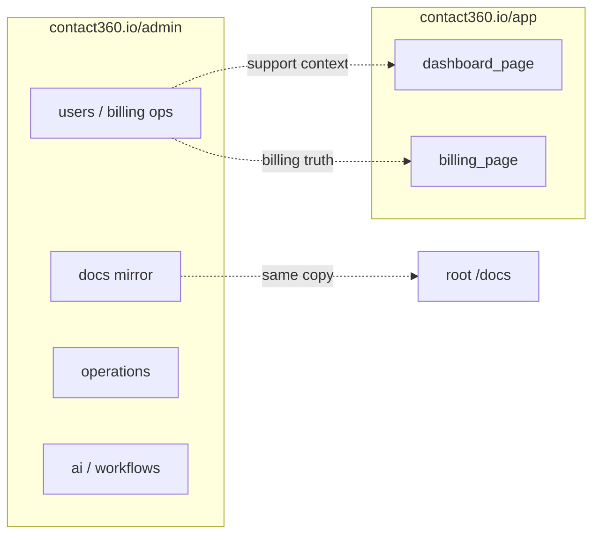

# Admin surface (`contact360.io/admin`)

Django **DocsAI** + operational super-admin — **not** Next.js `page.tsx`. Specs for individual Django URLs can be split into `admin_*_page.md` later; this file is the hub for **design symbols**, **era coverage**, and **connections** to the Next apps.

### UI components (metadata)

- **base.html** — `admin/templates/base.html`
- **_page_header.html** — `admin/templates/admin/_page_header.html`
- **sidebar.html** — `admin/templates/layouts/sidebar.html`
- **header.html** — `admin/templates/layouts/header.html`
- **footer.html** — `admin/templates/layouts/footer.html`
- **command_palette.html** — `admin/templates/components/command_palette.html`
- **app-fab-chat** — (Floating AI chat button in base.html)
- **main.css** — `admin/static/css/main.css`

## Era coverage (0.x–10.x)

| Era | Admin relevance | Typical UI symbols |
| --- | --- | --- |
| **0.x** | Foundation — app bootstrap, static/media, template shell | `[Ad]`, `[H]`, `[Q]` |
| **1.x** | Users, billing ops, payment approval | `[Ad]`, `[F]`, `(btn)`, `(tbl)` |
| **5.x** | AI assistant / agent tooling | `[Ad]`, `[F]`, `{REST}` / forms to AI |
| **6.x** | Operations, analytics, logs views | `[Ad]`, `[K]`, `[Q]` |
| **7.x** | RBAC, governance, audit-sensitive actions | `[Ad]`, `[F]`, role gates |
| **8.x** | API testing / developer tooling in admin | `[Ad]`, `[F]` |
| **9.x** | Workflows (e.g. LiteGraph), page builder shell, integrations | `[Ad]`, `[G]`, `[W]` |
| **10.x** | Campaign management (when wired) | `[Ad]`, `[Q]`, `(pb)` |

Full policy: [../../version-policy.md](../../version-policy.md).

## Page design (symbols)

Notation: [DESIGN_SYMBOLS.md](DESIGN_SYMBOLS.md).

**Composite layout:** [L:AdminShell] > [S:Menu] + [Q:AdminContent]

## Navigation (connections)

- **Master graphs & handoffs:** [index.md#how-pages-connect-cross-host-navigation](index.md#how-pages-connect-cross-host-navigation)
- **Registry row:** [index.md#all-pages](index.md#all-pages)
- **Django admin / DocsAI:** This file (hub for `contact360.io/admin`)

**Route (registry):** `/admin` (Django prefix)

**Codebase:** `contact360.io/admin` (Django, Postgres).

**Typical inbound:** Auth gateway; direct access (Superadmin).

**Typical outbound:** [dashboard_page.md](dashboard_page.md) (Support/Mirror); [index.md](index.md) (Full registry audit).

**Cross-host:** Admin surface manages secrets and configurations consumed by **app** (Next.js), **email** (Mailhub), and extension telemetry/log pipelines (logs API base/key via env or admin-managed secret sync).
**Backend:** Django ORM; direct Postgres access; DocsAI knowledge extraction service.

### hooks

| file_path | name | purpose | era |
| --- | --- | --- | --- |
| static/js/theme.js | ThemeMgr | Dark/Light mode persistent preference | 0.x |
| static/js/base.js | BaseController | Shell initialization and event registration | 0.x |
| static/js/components/unified-dashboard-controller.js | DashCtrl | Master state management for data grids | 0.x |
| static/js/components/sidebar-keyboard.js | SidebarKbd | Keyboard shortcuts for navigation | 7.x |
| apps/operations/views.py | operations_view probes | Real-time service health probes (S3/Lambda/GraphQL/DB/logs), including live scheduler API check, for operations hub | 6.x |
| config/settings/base.py | validate_startup_config | Startup validation enforces URL/API-key pairing for logs, scheduler, storage, and Lambda AI service dependencies | 0.x |
| apps/admin/tests/test_admin_guards.py | admin RBAC parity tests | Verifies `/admin/*` route inventory parity and required role scopes via decorator metadata | 0.x |
| apps/admin/tests/test_privileged_route_scopes.py | cross-surface RBAC tests | Verifies critical non-admin routes (`operations`, `roadmap`, `architecture`, `page-builder`, `ai`) require super-admin scope | 0.x |
| apps/admin/tests/test_trace_propagation.py | trace propagation tests | Verifies `X-Request-ID` propagation across GraphQL and logs/storage/job REST clients | 6.x |
| apps/admin/tests/test_billing_settings_validation.py | billing settings validation tests | Verifies billing settings reject invalid inputs and only submit valid payloads | 1.x |
| apps/core/tests/test_navigation_integrity.py | sidebar navigation drift guard | Verifies all sidebar `app_name:url_name` entries resolve to live URL patterns | 0.x |
| apps/operations/tests/test_operations_resilience.py | operations outage resilience tests | Verifies dependency probe degradation/down behavior and dashboard render safety under full probe failure | 6.x |
| apps/documentation/tests/test_operations_runtime_job_persistence.py | restart persistence tests | Verifies docs analyze/generate/upload progress APIs recover state from persisted `OperationLog.metadata` after memory loss/restart | 6.x |
| apps/operations/views.py | release gate policy | Computes pass/block release gate from live dependency probes and weighted uptime threshold policy | 6.x |
| apps/admin/views.py | _is_idempotent_noop_error | Shared idempotency/noop classifier used by delete, billing approve/decline, and job retry actions | 0.x |
| apps/admin/views.py | billing settings validation/audit | Enforces UPI/phone/email/QR key validation and emits structured admin settings audit events on update | 1.x |
| apps/admin/views.py | billing review audit timeline | Emits structured approve/decline audit events with actor, reason, status transition, request-id, and timestamp evidence | 1.x |
| .env.example / .env.prod.example / env.example | env secret hygiene templates | Removes secret-like defaults and documents URL/API-key pair contracts for admin dependencies | 0.x |
| templates/admin/settings.html | runtime settings surface | Replaces fake editable placeholders with runtime snapshot and links to validated workflows | 0.x |
| apps/documentation/views/operations.py | runtime job persistence | Persists analyze/generate/upload background job state in `OperationLog` for restart-safe progress/result polling | 0.x |
| templates/operations/dashboard.html | System health cards | Renders operational/degraded/down badges for probe outputs in Operations hub | 6.x |
| templates/operations/dashboard.html | release gate card | Renders pass/block gate state, weighted uptime, and policy summary for deployment decision support | 6.x |

### URL prefixes (examples)

Align with [index.md — Admin](index.md#admin-contact360ioadmin--template-surface):

- `/docs/` — documentation CRUD mirror
- `/ai/` — AI tooling
- `/operations/` — status / ops
- `/admin/users/` — user admin
- `/analytics/` — analytics panels
- `/durgasflow/` — workflow graph
- `/durgasman/` — API testing
- `/page-builder/` — builder shell

### Peer documentation

- [index.md](index.md) — full page registry (Next + Mailhub)
- [../../docsai-sync.md](../../docsai-sync.md) — roadmap/architecture mirrors
- [../../governance.md](../../governance.md) — release rules for admin

---

*Hub spec only — add `admin_users_page.md` etc. when a route needs the same depth as dashboard `*_page.md`.*
