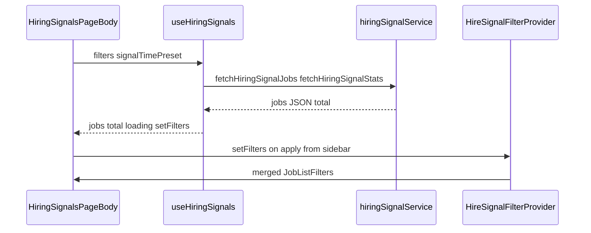
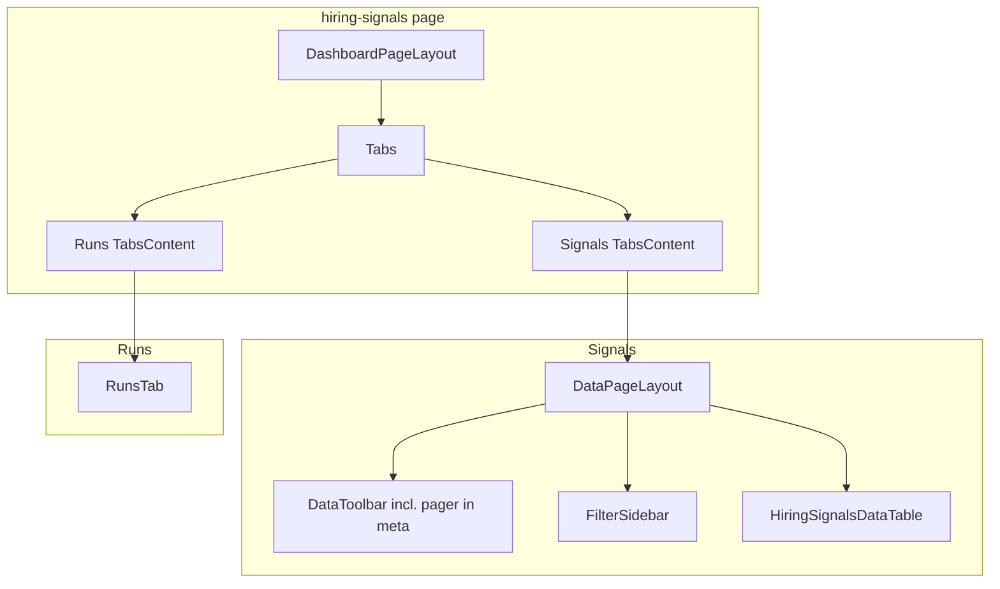

# Hiring signals page anatomy

Short map of the **Signals** tab layout, [`DataPageLayout`](contact360.io/app/src/components/layouts/DataPageLayout.tsx) slots, and how data moves from hooks/services into UI. Complements [`ideas/mydesigns/table.md`](ideas/mydesigns/table.md) (MUI grid recipe) and the app-wide table list in [`data-tables-inventory.md`](data-tables-inventory.md).

## Stack decision (production)

The **Signals** job list uses **`@mui/x-data-grid`** (`DataGrid`) inside [`C360DataTableShell`](contact360.io/app/src/components/ui/C360DataTableShell.tsx), wrapped by [`C360MuiThemeProvider`](contact360.io/app/src/components/ui/C360MuiThemeProvider.tsx) so the grid follows Contact360 light/dark (`data-theme`). **`c360-*` tokens** still apply to cell content (buttons, badges, typography). List behavior (paging, sort, selection, column visibility) is implemented in [`HiringSignalsDataTable`](contact360.io/app/src/components/feature/hiring-signals/HiringSignalsDataTable.tsx) with **server-driven** sort and filters via [`hiringSignalService`](contact360.io/app/src/services/graphql/hiringSignalService.ts). The recipe in [`ideas/mydesigns/table.md`](ideas/mydesigns/table.md) aligns with this implementation.

Other dashboard lists may still use semantic `<table>` without MUI; each surface can choose independently.

## Example user path (toolbar → table → export)

One traced flow for debugging or onboarding:

1. **Scope preset** — User switches `DataToolbar` tabs (e.g. “New (7 days)”) → `setSignalTimePreset` on the page; `effectiveJobListFilters` merges `effectivePostedAfter(signalTimePreset, …)` before fetch and export.
2. **Filters** — User edits the sidebar draft and clicks **Apply** → [`HireSignalFilterContext`](contact360.io/app/src/context/HireSignalFilterContext.tsx) `applyFilters` → parent `setFilters` from [`useHiringSignals`](contact360.io/app/src/hooks/useHiringSignals.ts) with `offset: 0`.
3. **List load** — `useHiringSignals` calls [`hiringSignalService`](contact360.io/app/src/services/graphql/hiringSignalService.ts) `fetchHiringSignalJobs` / stats with `JobListFilters` (limit, offset, sort, facets).
4. **Sort** — User sorts via DataGrid column headers or column menu → `setFilters` updates `sortKey` / `sortOrder` (`HS_DT_COLUMN_SORT_MAP` → `JobListSortKey`).
5. **Grid filters** — Column menu filters (when used) update `titles` / `companies` / `locations` / `employmentType` through `setFilters`; sidebar Apply remains the primary facet workflow.
6. **Selection** — Row / select-all checkboxes update `selectedKeys` (`Set`) in `page.tsx`.
7. **Export** — **Export XLSX** opens [`HiringSignalsExportModal`](contact360.io/app/src/components/feature/hiring-signals/HiringSignalsExportModal.tsx); chosen scope (radio) → `handleExportIntent` → GraphQL export helpers and optional Jobs drawer follow-up.

## Route entry

- **File:** [`contact360.io/app/app/(dashboard)/hiring-signals/page.tsx`](contact360.io/app/app/(dashboard)/hiring-signals/page.tsx)
- **Shell:** `DashboardPageLayout`
- **Tabs:** `Tabs` / `TabsList` / `TabsContent` — **Signals** (default) and **Runs** (admin). Runs is gated by `useRole()` (`showRunsTab`).

## Signals tab: `DataPageLayout` slots

| Slot / prop | Hiring-specific content |
|-------------|-------------------------|
| `toolbar` | `DataToolbar` — scope tabs (All / New 7d), **`meta`** = `Pagination` when `total > filters.limit` (between tabs and actions), filter button (mobile), `actionPrefix` = [`HiringSignalsToolbarTableExtras`](contact360.io/app/src/components/feature/hiring-signals/HiringSignalsDataTable.tsx) (Columns + per-page `Select`), primary actions (Export, Refresh, Run scrape). |
| `metadata` | Not used on Hiring Signals (scope counts on tabs; paging in toolbar). |
| `filters` | [`HiringSignalsFilterSidebar`](contact360.io/app/src/components/feature/hiring-signals/HiringSignalsFilterSidebar.tsx) (+ saved searches on mobile/desktop peek rail). |
| `filtersPeekRail` / `filtersPeekScope` | Desktop peek rail + pin state (`DataFiltersPeekContext`). |
| `filtersPinExtra` | `SavedSearchesMenu` for hire-signal saved searches. |
| **children** | Export banner `Alert` (when present), then [`HiringSignalsDataTable`](contact360.io/app/src/components/feature/hiring-signals/HiringSignalsDataTable.tsx). |

## Runs tab (same route)

- **Component:** [`RunsTab`](contact360.io/app/src/components/feature/hiring-signals/RunsTab.tsx)
- **Not** using `DataPageLayout`; self-contained: metrics bar, tracked scrape **cards** + empty copy, accordion with satellite **`Table`** + `Pagination`.

## Data flow (Signals)

- **List data:** [`useHiringSignals`](contact360.io/app/src/hooks/useHiringSignals.ts) — `filters` (`limit`, `offset`, `sortKey`, `sortOrder`, facets…), `setPage`, `setPageSize`, `refetch`.
- **Filter draft:** [`HireSignalFilterContext`](contact360.io/app/src/context/HireSignalFilterContext.tsx) — draft vs applied, `activeDraftCount` for toolbar badge.
- **GraphQL:** [`hiringSignalService.ts`](contact360.io/app/src/services/graphql/hiringSignalService.ts) — queries/mutations for jobs, stats, export, runs JSON.
- **Role / jobs drawer:** [`RoleContext`](contact360.io/app/src/context/RoleContext.tsx), [`JobsDrawerContext`](contact360.io/app/src/context/JobsDrawerContext.tsx).

## Table surface (Signals)

- **Component:** `HiringSignalsDataTable` — **`@mui/x-data-grid`** `DataGrid`, server-driven sort (`HS_DT_COLUMN_SORT_MAP` → `JobListSortKey`), server-driven filters via column menu where mapped to list filters, selection `Set`, optional `visibleColumns` from page state + `localStorage` (toolbar Columns popover + grid column menu / panels stay in sync via `onColumnVisibilityResolved`).
- **Table shell:** [`C360DataTableShell`](contact360.io/app/src/components/ui/C360DataTableShell.tsx) + [`27-data-table-shell.css`](contact360.io/app/app/css/components/27-data-table-shell.css) — shared card-like surface and scroll region.
- **MUI theme bridge:** [`C360MuiThemeProvider`](contact360.io/app/src/components/ui/C360MuiThemeProvider.tsx) — aligns grid chrome with app light/dark.

## Page-level flowchart

## Modals / overlays (same page)

`JobDescriptionModal`, `CompanyContactsModal`, `JobConnectraModal`, `CompanyDrawerPanel`, `HiringSignalsExportModal`, `RunScrapeModal` (superadmin) — opened from table actions or toolbar, not part of `DataPageLayout` slots.

## Related docs

- [Runs vs Signals table UX](hiring-signals-runs-vs-signals-table-ux.md)
- [Radio vs Select patterns](radio-vs-select-patterns.md)
