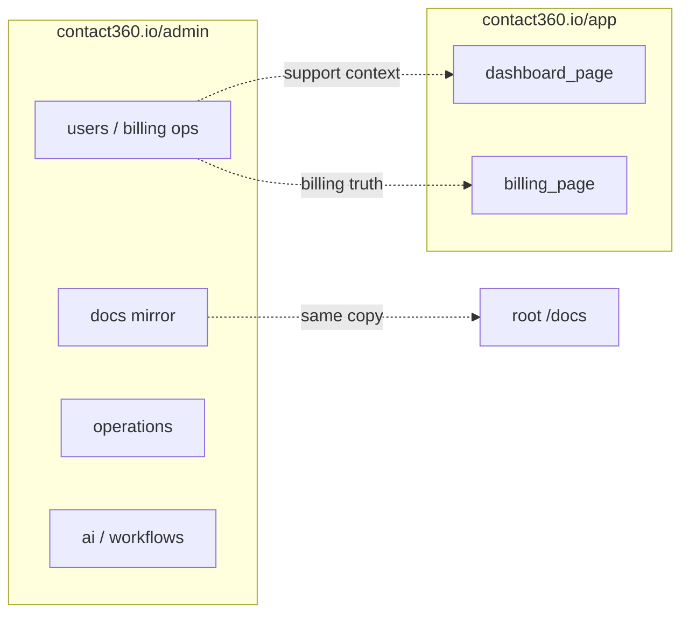

# Admin surface (`contact360.io/admin`)

Django **DocsAI** + operational super-admin — **not** Next.js `page.tsx`. Specs for individual Django URLs can be split into `admin_*_page.md` later; this file is the hub for **design symbols**, **era coverage**, and **connections** to the Next apps.

### UI components (metadata)

- **base.html** — `admin/templates/base.html`
- **_page_header.html** — `admin/templates/admin/_page_header.html`
- **sidebar.html** — `admin/templates/layouts/sidebar.html`
- **header.html** — `admin/templates/layouts/header.html`
- **footer.html** — `admin/templates/layouts/footer.html`
- **command_palette.html** — `admin/templates/components/command_palette.html`
- **app-fab-chat** — (Floating AI chat button in base.html)
- **main.css** — `admin/static/css/main.css`

## Era coverage (0.x–10.x)

| Era | Admin relevance | Typical UI symbols |
| --- | --- | --- |
| **0.x** | Foundation — app bootstrap, static/media, template shell | `[Ad]`, `[H]`, `[Q]` |
| **1.x** | Users, billing ops, payment approval | `[Ad]`, `[F]`, `(btn)`, `(tbl)` |
| **5.x** | AI assistant / agent tooling | `[Ad]`, `[F]`, `{REST}` / forms to AI |
| **6.x** | Operations, analytics, logs views | `[Ad]`, `[K]`, `[Q]` |
| **7.x** | RBAC, governance, audit-sensitive actions | `[Ad]`, `[F]`, role gates |
| **8.x** | API testing / developer tooling in admin | `[Ad]`, `[F]` |
| **9.x** | Workflows (e.g. LiteGraph), page builder shell, integrations | `[Ad]`, `[G]`, `[W]` |
| **10.x** | Campaign management (when wired) | `[Ad]`, `[Q]`, `(pb)` |

Full policy: [../../version-policy.md](../../version-policy.md).

## Page design (symbols)

Notation: [DESIGN_SYMBOLS.md](DESIGN_SYMBOLS.md).

**Composite layout:** [L:AdminShell] > [S:Menu] + [Q:AdminContent]

## Navigation (connections)

- **Master graphs & handoffs:** [index.md#how-pages-connect-cross-host-navigation](index.md#how-pages-connect-cross-host-navigation)
- **Registry row:** [index.md#all-pages](index.md#all-pages)
- **Django admin / DocsAI:** This file (hub for `contact360.io/admin`)

**Route (registry):** `/admin` (Django prefix)

**Codebase:** `contact360.io/admin` (Django, Postgres).

**Typical inbound:** Auth gateway; direct access (Superadmin).

**Typical outbound:** [dashboard_page.md](dashboard_page.md) (Support/Mirror); [index.md](index.md) (Full registry audit).

**Cross-host:** Admin surface manages secrets and configurations consumed by **app** (Next.js) and **email** (Mailhub) via Environment Variable sync.
**Backend:** Django ORM; direct Postgres access; DocsAI knowledge extraction service.

### hooks

| file_path | name | purpose | era |
| --- | --- | --- | --- |
| static/js/theme.js | ThemeMgr | Dark/Light mode persistent preference | 0.x |
| static/js/base.js | BaseController | Shell initialization and event registration | 0.x |
| static/js/components/unified-dashboard-controller.js | DashCtrl | Master state management for data grids | 0.x |
| static/js/components/sidebar-keyboard.js | SidebarKbd | Keyboard shortcuts for navigation | 7.x |

### URL prefixes (examples)

Align with [index.md — Admin](index.md#admin-contact360ioadmin--template-surface):

- `/docs/` — documentation CRUD mirror
- `/ai/` — AI tooling
- `/operations/` — status / ops
- `/admin/users/` — user admin
- `/analytics/` — analytics panels
- `/durgasflow/` — workflow graph
- `/durgasman/` — API testing
- `/page-builder/` — builder shell

### Peer documentation

- [index.md](index.md) — full page registry (Next + Mailhub)
- [../../docsai-sync.md](../../docsai-sync.md) — roadmap/architecture mirrors
- [../../governance.md](../../governance.md) — release rules for admin

---

*Hub spec only — add `admin_users_page.md` etc. when a route needs the same depth as dashboard `*_page.md`.*
