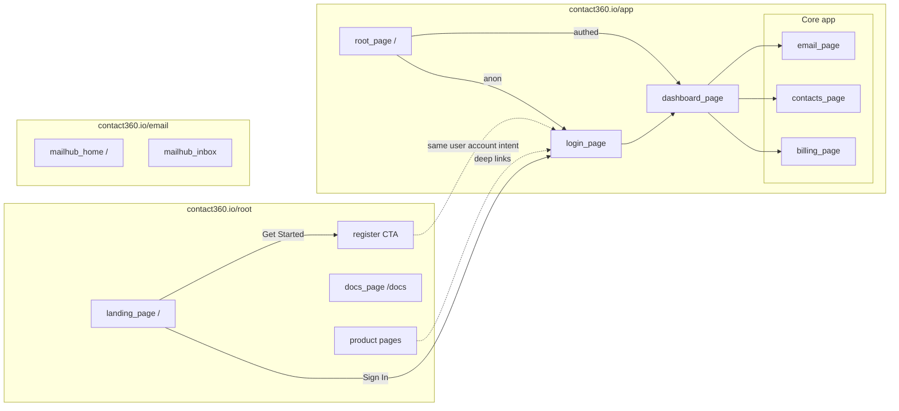
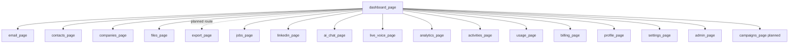
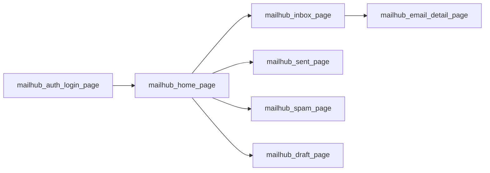

# Page registry

- **Version:** 2.4
- **Last updated:** 2026-03-29
- **Total pages:** 56 (`*_page.md` + [admin_surface.md](admin_surface.md))
- **Symbol glossary:** [DESIGN_SYMBOLS.md](DESIGN_SYMBOLS.md)

## Description

Canonical page registry for the Contact360 ecosystem. All routes are host-specific; resolve URLs via the **Registry Table** below. Standardized notation [DESIGN_SYMBOLS.md](DESIGN_SYMBOLS.md) maps UI logic to the 11-era roadmap.

| Host / product | Codebase | Repo | Purpose |
| --- | --- | --- | --- |
| Dashboard SPA | `app` | `contact360.io/app` | Core prospect data & AI productivity hub. |
| Marketing / Docs | `root` | `contact360.io/root` | Public-facing acquisition and DocsAI content. |
| Mailhub Client | `email` | `contact360.io/email` | Multimodal IMAP interface for lead sentiment. |
| Operational Admin | `admin` | `contact360.io/admin` | Django-based super-admin and backend governance. |

Spec files in this folder describe **app**, **root**, and **email** as `*_page.md`. **Admin** routes are summarized below and in ops docs; add dedicated `admin_*_page.md` files later if you want parity.

## Design symbols (quick link)

All pages use a shared notation for layout and controls (tabs, buttons, inputs, graphs, progress bars, checkboxes, etc.). **Full table:** [DESIGN_SYMBOLS.md](DESIGN_SYMBOLS.md).

## How pages connect (cross-host navigation)

### User journeys (high level)

### App sidebar cluster (typical authenticated hub)

### Mailhub (email codebase)

### Cross-host handoffs (documentation)

| From (spec) | To (spec) | Intent |
| --- | --- | --- |
| [landing_page.md](landing_page.md) | [register_page.md](register_page.md) / [login_page.md](login_page.md) | Marketing signup / sign-in |
| [landing_page.md](landing_page.md) | [docs_page.md](docs_page.md) | Docs from marketing nav |
| Product pages (e.g. [email_finder_page.md](email_finder_page.md)) | [login_page.md](login_page.md) | Try product → authenticate |
| [dashboard_page.md](dashboard_page.md) | [email_page.md](email_page.md) | Quick actions / email tools |
| [dashboard_page.md](dashboard_page.md) | [jobs_page.md](jobs_page.md) | Exports / async jobs (dedicated [export_page.md](export_page.md) is planned) |
| App (any `[L]`) | Mailhub (separate deploy) | Optional: “Open mail” product link (integration TBD) |

## Admin (`contact360.io/admin`) — template surface

Django **DocsAI** app: not listed row-for-row above; operators use URL prefixes like:

| Prefix (examples) | Era focus | Typical UI symbols |
| --- | --- | --- |
| `/docs/` | 0.x, 8.x, 9.x | `[Ad] [Q] [F]` documentation CRUD |
| `/ai/` | 5.x | `[Ad] [F] [Q]` agent / chat tooling |
| `/durgasflow/` | 9.x | `[Ad] [G]` workflow graph (LiteGraph) |
| `/operations/` | 6.x, 7.x | `[Ad] [K]` status panels |
| `/admin/users/` | 1.x, 7.x | `[Ad] [Q]` user admin |
| `/analytics/` | 6.x | `[Ad] [K] [G]` |
| `/durgasman/` | 8.x | `[Ad] [F]` API testing |
| `/page-builder/` | 9.x | `[Ad] [W]` shell |

Add per-route `admin_*_page.md` files when you need the same depth as app pages.

**Django hub spec (symbols + era + graphs):** [admin_surface.md](admin_surface.md)

## Codebases

### `app`

- **repository:** contact360.io/app
- **stack:** Next.js 16 App Router, React 19, GraphQL client
- **primary_eras:** 1.x, 3.x, 5.x, 6.x, 10.x

### `root`

- **repository:** contact360.io/root
- **stack:** Next.js marketing + DocsAI content shell
- **primary_eras:** 0.x, 8.x, 9.x

### `email`

- **repository:** contact360.io/email
- **stack:** Next.js Mailhub IMAP client
- **primary_eras:** 2.x, 1.x

### `admin`

- **repository:** contact360.io/admin
- **stack:** Django 4, Tailwind, DocsAI super-admin
- **primary_eras:** 0.x, 5.x, 6.x, 7.x, 9.x, 10.x

## Era map (0.x – 10.x)

- **0.x** — Foundation: shells, auth entry, marketing baseline, Mailhub bootstrap
- **1.x** — User, billing, credits, profile, admin app page
- **2.x** — Email finder/verifier (app), Mailhub folders, marketing email products
- **3.x** — Contacts, companies, export, files, prospect finder
- **4.x** — LinkedIn, Chrome extension, Sales Navigator client surfaces
- **5.x** — AI chat, live voice, AI writer marketing
- **6.x** — Analytics, activities, jobs, reliability UX, status
- **7.x** — Deployment docs, billing ops, governance
- **8.x** — API/docs surfaces, integrations, data export contracts
- **9.x** — Ecosystem, integrations page, platform marketing
- **10.x** — Email campaigns (planned app routes), sequences, templates, builder

## All pages

| page_id | codebase | route | type | surface | eras | status | spec |
| --- | --- | --- | --- | --- | --- | --- | --- |
| about_page | root | /about | marketing | marketing | 0.x, 9.x | published | [about_page.md](about_page.md) |
| activities_page | app | /activities | dashboard | dashboard | 1.x, 6.x | published | [activities_page.md](activities_page.md) |
| admin_page | app | /admin | dashboard | dashboard | 1.x, 7.x, 9.x | published | [admin_page.md](admin_page.md) |
| ai_chat_page | app | /ai-chat | dashboard | dashboard | 5.x, 9.x | published | [ai_chat_page.md](ai_chat_page.md) |
| ai_email_writer_page | root | /products/ai-email-writer | product | product | 5.x, 9.x | published | [ai_email_writer_page.md](ai_email_writer_page.md) |
| analytics_page | app | /analytics | dashboard | dashboard | 1.x, 6.x | published | [analytics_page.md](analytics_page.md) |
| api_docs_page | root | /api-docs | marketing | marketing | 8.x, 9.x | published | [api_docs_page.md](api_docs_page.md) |
| billing_page | app | /billing | dashboard | dashboard | 1.x | published | [billing_page.md](billing_page.md) |
| campaign_builder_page | app | /campaigns/new | dashboard | dashboard | 10.x | planned | [campaign_builder_page.md](campaign_builder_page.md) |
| campaign_templates_page | app | /campaigns/templates | dashboard | dashboard | 10.x | planned | [campaign_templates_page.md](campaign_templates_page.md) |
| campaigns_page | app | /campaigns | dashboard | dashboard | 10.x | planned | [campaigns_page.md](campaigns_page.md) |
| careers_page | root | /careers | marketing | marketing | 0.x, 9.x | published | [careers_page.md](careers_page.md) |
| cfo_email_list_page | root | /products/cfo-email-list | title | title | 2.x, 9.x | published | [cfo_email_list_page.md](cfo_email_list_page.md) |
| chrome_extension_page | root | /products/chrome-extension | product | marketing | 4.x, 9.x | published | [chrome_extension_page.md](chrome_extension_page.md) |
| companies_page | app | /companies | dashboard | dashboard | 3.x, 8.x | published | [companies_page.md](companies_page.md) |
| contacts_page | app | /contacts | dashboard | dashboard | 3.x, 8.x | published | [contacts_page.md](contacts_page.md) |
| dashboard_page | app | /dashboard | dashboard | dashboard | 1.x, 6.x | published | [dashboard_page.md](dashboard_page.md) |
| dashboard_pageid_page | app | /dashboard/[pageId] | dashboard | dashboard | 0.x, 9.x | published | [dashboard_pageid_page.md](dashboard_pageid_page.md) |
| deployment_page | app | /admin/deployments | dashboard | dashboard | 7.x | planned | [deployment_page.md](deployment_page.md) |
| docs_page | root | /docs | docs | docs | 0.x, 8.x, 9.x | published | [docs_page.md](docs_page.md) |
| docs_pageid_page | root | /docs/[pageId] | docs | docs | 0.x, 8.x, 9.x | published | [docs_pageid_page.md](docs_pageid_page.md) |
| email_finder_page | root | /products/email-finder | product | product | 2.x, 9.x | published | [email_finder_page.md](email_finder_page.md) |
| email_page | app | /email | dashboard | dashboard | 2.x, 8.x | published | [email_page.md](email_page.md) |
| email_verifier_page | root | /products/email-verifier | product | product | 2.x, 9.x | published | [email_verifier_page.md](email_verifier_page.md) |
| export_page | app | /export *(planned)* | dashboard | dashboard | 3.x, 6.x | planned | [export_page.md](export_page.md) |
| files_page | app | /files | dashboard | dashboard | 3.x, 6.x | published | [files_page.md](files_page.md) |
| finder_page | app | /email | dashboard | dashboard | 2.x | archived | [finder_page.md](finder_page.md) |
| integrations_page | root | /integrations | marketing | marketing | 9.x | published | [integrations_page.md](integrations_page.md) |
| jobs_page | app | /jobs | dashboard | dashboard | 6.x, 8.x, 10.x | published | [jobs_page.md](jobs_page.md) |
| landing_page | root | / | marketing | marketing | 0.x, 9.x | published | [landing_page.md](landing_page.md) |
| linkedin_page | app | /linkedin | dashboard | dashboard | 4.x, 8.x | published | [linkedin_page.md](linkedin_page.md) |
| live_voice_page | app | /live-voice | dashboard | dashboard | 5.x | published | [live_voice_page.md](live_voice_page.md) |
| login_page | app | /login | dashboard | dashboard | 0.x, 1.x | published | [login_page.md](login_page.md) |
| mailhub_account_page | email | /account/[userId] | dashboard | mailhub | 1.x | published | [mailhub_account_page.md](mailhub_account_page.md) |
| mailhub_auth_login_page | email | /auth/login | dashboard | mailhub | 0.x, 1.x | published | [mailhub_auth_login_page.md](mailhub_auth_login_page.md) |
| mailhub_auth_signup_page | email | /auth/signup | dashboard | mailhub | 0.x, 1.x | published | [mailhub_auth_signup_page.md](mailhub_auth_signup_page.md) |
| mailhub_draft_page | email | /draft | dashboard | mailhub | 2.x | published | [mailhub_draft_page.md](mailhub_draft_page.md) |
| mailhub_email_detail_page | email | /email/[mailId] | dashboard | mailhub | 2.x | published | [mailhub_email_detail_page.md](mailhub_email_detail_page.md) |
| mailhub_home_page | email | / | dashboard | mailhub | 0.x, 2.x | published | [mailhub_home_page.md](mailhub_home_page.md) |
| mailhub_inbox_page | email | /inbox | dashboard | mailhub | 2.x | published | [mailhub_inbox_page.md](mailhub_inbox_page.md) |
| mailhub_sent_page | email | /sent | dashboard | mailhub | 2.x | published | [mailhub_sent_page.md](mailhub_sent_page.md) |
| mailhub_spam_page | email | /spam | dashboard | mailhub | 2.x | published | [mailhub_spam_page.md](mailhub_spam_page.md) |
| privacy_page | root | /privacy | marketing | marketing | 0.x | published | [privacy_page.md](privacy_page.md) |
| profile_page | app | /profile | dashboard | dashboard | 1.x | published | [profile_page.md](profile_page.md) |
| prospect_finder_page | root | /products/prospect-finder | product | product | 3.x, 4.x, 9.x | published | [prospect_finder_page.md](prospect_finder_page.md) |
| refund_page | root | /refund | marketing | marketing | 1.x | published | [refund_page.md](refund_page.md) |
| register_page | app | /register | dashboard | dashboard | 0.x, 1.x | published | [register_page.md](register_page.md) |
| root_page | app | / | shell | shell | 0.x, 1.x | published | [root_page.md](root_page.md) |
| sequences_page | app | /campaigns/sequences | dashboard | dashboard | 10.x | planned | [sequences_page.md](sequences_page.md) |
| settings_page | app | /settings | dashboard | dashboard | 1.x | published | [settings_page.md](settings_page.md) |
| status_page | app | /status | marketing | dashboard | 6.x, 7.x | planned | [status_page.md](status_page.md) |
| terms_page | root | /terms | marketing | marketing | 0.x | published | [terms_page.md](terms_page.md) |
| ui_page | root | /ui | marketing | marketing | 0.x, 9.x | published | [ui_page.md](ui_page.md) |
| usage_page | app | /usage | dashboard | dashboard | 1.x | published | [usage_page.md](usage_page.md) |
| verifier_page | app | /email | dashboard | dashboard | 2.x | archived | [verifier_page.md](verifier_page.md) |

## Index: by page type

### dashboard

`activities_page`, `admin_page`, `ai_chat_page`, `analytics_page`, `billing_page`, `campaign_builder_page`, `campaign_templates_page`, `campaigns_page`, `companies_page`, `contacts_page`, `dashboard_page`, `dashboard_pageid_page`, `deployment_page`, `email_page`, `export_page`, `files_page`, `finder_page`, `jobs_page`, `linkedin_page`, `live_voice_page`, `login_page`, `mailhub_*`, `profile_page`, `register_page`, `sequences_page`, `settings_page`, `usage_page`, `verifier_page`

### docs

`docs_page`, `docs_pageid_page`

### marketing

`about_page`, `api_docs_page`, `careers_page`, `integrations_page`, `landing_page`, `privacy_page`, `refund_page`, `status_page`, `terms_page`, `ui_page`

### product

`ai_email_writer_page`, `chrome_extension_page`, `email_finder_page`, `email_verifier_page`, `prospect_finder_page`

### shell

`root_page`

### title

`cfo_email_list_page`

## Index: by codebase

### `admin`

*(Template routes — see [Admin surface](#admin-contact360ioadmin--template-surface) above.)*

### `app`

`activities_page`, `admin_page`, `ai_chat_page`, `analytics_page`, `billing_page`, `campaign_builder_page`, `campaign_templates_page`, `campaigns_page`, `companies_page`, `contacts_page`, `dashboard_page`, `dashboard_pageid_page`, `deployment_page`, `email_page`, `export_page`, `files_page`, `finder_page`, `jobs_page`, `linkedin_page`, `live_voice_page`, `login_page`, `profile_page`, `register_page`, `root_page`, `sequences_page`, `settings_page`, `status_page`, `usage_page`, `verifier_page`

### `email`

`mailhub_account_page`, `mailhub_auth_login_page`, `mailhub_auth_signup_page`, `mailhub_draft_page`, `mailhub_email_detail_page`, `mailhub_home_page`, `mailhub_inbox_page`, `mailhub_sent_page`, `mailhub_spam_page`

### `root`

`about_page`, `ai_email_writer_page`, `api_docs_page`, `careers_page`, `cfo_email_list_page`, `chrome_extension_page`, `docs_page`, `docs_pageid_page`, `email_finder_page`, `email_verifier_page`, `integrations_page`, `landing_page`, `privacy_page`, `prospect_finder_page`, `refund_page`, `terms_page`, `ui_page`

---

*Maintenance: from `docs/frontend/pages/`, run `python augment_page_specs.py` after bulk edits to refresh the auto **Page design (symbols)** + **Navigation** blocks on every `*_page.md`.*
